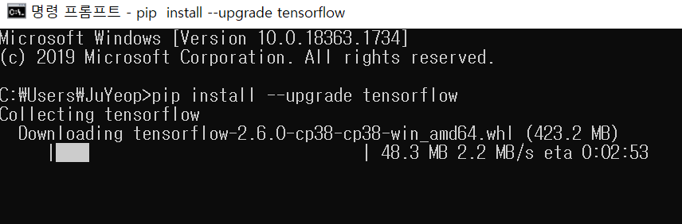

https://www.youtube.com/watch?v=-57Ne86Ia8w&list=PLlMkM4tgfjnLSOjrEJN31gZATbcj_MpUm&index=3


Tensorflow의 기본에 대해 얘기해 보자.


### Tensorflow

구글에서 만든 오픈 소스 라이브러리

Machine Intelligence를 위한 오픈 소스 라이브러리다.


### Tensorflow 말고 ML, MI 위한 오픈 소스 라이브러리 많다. 

왜 Tensorflow 다룰까?

점수 여러 방식으로 매겨보니 Tensorflow 압도적 1등(2016년 기준)

많은 사람 사용 -> 공부할 게 많고, 소스 코드 보고 공부할 때 참고할 것이 많다.


### Tensorflow

- Tensorflow is an open source software library for numerical computation using data flow graphs.

Tensorflow는 데이터 플로우 그래프를 사용해서 뉴메리컬한 계산을 한다! (numerical: 수치의, 수의, 수와 관련된)

- Python


### What is a Data Flow Graph?

그래프: 노드와 노드간을 연결하는 엣지로 구성됨.

Data Flow Graph: 노드들이 하나의 operation.

이런 값 받아서 더하기 / 곱하기를 하는 operation

edge: data, 어려운 말로 tensor

tensor들이 들어와서 더하기, 곱하기, ...

이런 형태로 연산이 일어나서 내가 원하는 결과물을 얻거나, 어떤 작업을 할 수 있는 것이 Data Flow Graph

그것을 할 수 있는 것이 Tensorflow

- Nodes in the graph represent mathematical operations
- Edges represent the multidimensional data arrays (tensors) communicated between them.

Tensor(data)가 돌아다닌다 -> Tensorflow


### Installing Tensor Flow

- Linux, Max OSX, Windows
  - (sudo -H) pip install --upgrade tensorflow
  - (sudo -H) pip install --upgrade tensorflow-gpu (GPU를 사용하는 경우)

pip - package installer for Python




- From source
  - bazel
- Google search/Community help


### check installation and version

```
$ python 3

>>> import tensorflow as tf
>>> tf.__version__
'1.0.0'
>>>
```

[나는 '2.6.0']

[앞으로 대괄호는 내가 단 각주]


### https://github.com/hunkim/DeepLearningZeroToAll/

소스코드 주소


### TensorFlow Hello World!

https://github.com/hunkim/DeepLearningZeroToAll/blob/master/lab-01-basics.ipynb

[주피터 노트북 혹은 Colab 필요한 듯. 일단 주피터 노트북으로 시도해보겠음]

Hello TensorFlow!

tensorflow import 했쥬?

import tensorflow as tf

`tf.xxx` 형식으로 뭔가를 할꺼여

```python
# Create a constant op
# This op is added as a node to the default graph
hello = tf.constant("Hello, TensorFlow!")

# seart a TF session
# sess = tf.Session() [-> 1.0에선 이리 하지만 2.0 이상 버전부터는 이렇게 하지 않는다고 합니다.]

# run the op and get result
# print(sess.run(hello)) [-> 1.0에선 이리 하지만 2.0 이상 버전부터는 이렇게 하지 않는다고 합니다.]
tf.print(hello)
```

```
Hello, TensorFlow!
```


간단해 보이지만.. 그래프 속에 노드 하나가 있고, 여기에 Hello, Tensorflow란 문자열 담고 있다.

그래프 실행하기 위해선 Session이란걸 만들고, 세션을 실행(Hello란 노드 실행) -> 원하는 결과 출력


가끔 파이썬에서 b 출력하지 않았는데 b가 같이 출력되는 문제 발생

b 'Hello, TensorFlow!'

Bytes literals란 뜻. 바이트 스트링이란 뜻. 나와도 불평하지 말고 잘 구현했다 생각하면 된다.


### Computational Graph

A, B 노드가 +와 연결되었다.

A가 3, B가 4고 실행 -> 7

```python
node1 = tf.constant(3.0, tf.float32)
node2 = tf.constant(4.0) # also tf.float32 implicitly
node3 = tf.add(node1, node2) # node3 = node1 + node2로도 표현 가능
```


```python
print("node1:", node1, "node2:", node2)
print("node3: ", node3)
```

```
node1: tf.Tensor(3.0, shape=(), dtype=float32) node2: tf.Tensor(4.0, shape=(), dtype=float32)
node3:  tf.Tensor(7.0, shape=(), dtype=float32)
```


[1.0 방식]

```python
# sess = tf.Session()
# print("sess.run(node1, node2): ", sess.run([node1, node2]))
# print("sess.run(node3): ", sess.run(node3))
```


[2.0 방식]

```python
tf.print("(node1, node2): ", ([node1, node2]))
tf.print("(node3): ", (node3))
```

```
(node1, node2):  [3, 4]
(node3):  7
```


### TensorFlow Mechanics

1. Bulid graph using TensorFlow operations
2. feed data and run graph(operation)
   1. [1.0]  sess.run (op) [op: 원하는 노드]
3. update variables in the graph (and return values)


### Placeholder [2.0에서는 못쓴다 ㅠㅠ]

```python
a = tf.placeholder(tf.float32)
b = tf.placeholder(tf.float32)
adder_node = a + b  # + provides a shortcut for tf.add(a, b)

tf.print(adder_node, feed_dict={a: 3, b: 4.5})
tf.print(adder_node, feed_dict={a: [1,3], b: [2, 4]})
```

```
7.5
[3. 7.]
```

placeholder라는 특별한 노드를 만들어준다.

adder_node 만들어 줌.


똑같은 정보로 세션 만들고 실행시켜준다.

feed_dict -> a, b 값 넘겨준다.

값 넘겨주면서 그래프 실행

N개의 값 넘겨주기도 가능


### Everything is Tensor

Tensor 잘 이해하고 사용시 굉장히 쉽다.


### Tensor Ranks, Shapes, and Types

Ranks: 몇 차원 array이냐

Rank: Math entity  	/  	Python example

0: Scalar (magnitude only) s = 483

1: Vector (magnitude and direction) v = [1.1, 2.2, 3.3]

2: Matrix (table of numbers) m = [[1, 2, 3], [4, 5, 6], [7, 8, 9]]

3: 3-Tensor (cube of numbers) t = [[[2], [4], [6]], [[8], [10], [12]], [[14], [16], [18]]]

n: n-Tensor (you get the idea)


Shape: t = [[1, 2, 3], [4, 5, 6], [7, 8, 9]] -> (3, 3) 혹은 [3, 3]과 같은 형태로 나타낸다.

Rank / Shape / Dimension number / Example

0 / [] / 0-D / A 0-D tensor. A scalar

1 / [D0] / 1-D / A 1-D tensor with shape [5].

2 / [D0, D1] / 2-D / A 2-D tensor with shape [3, 4].

3 / [D0, D1, D2] / 3-D / A 3-D tensor with shape [1, 4, 3].

n / [D0, D1, ..., Dn-1] / n-D / A n-D tensor with shape [D0, D1, ..., Dn-1].

shape 굉장히 중요하다.

tensor 볼 때 어떤 shape 갖고있는지 보자..


Type

대부분 tf.float32, tf.int32


tf 일반 프로그램과 달리 그래프 먼저 설계

그래프 실행시킨다. 


다음시간 -> TF 이용해서 실제 Linear Regression Program을 만들어 보겠다.

