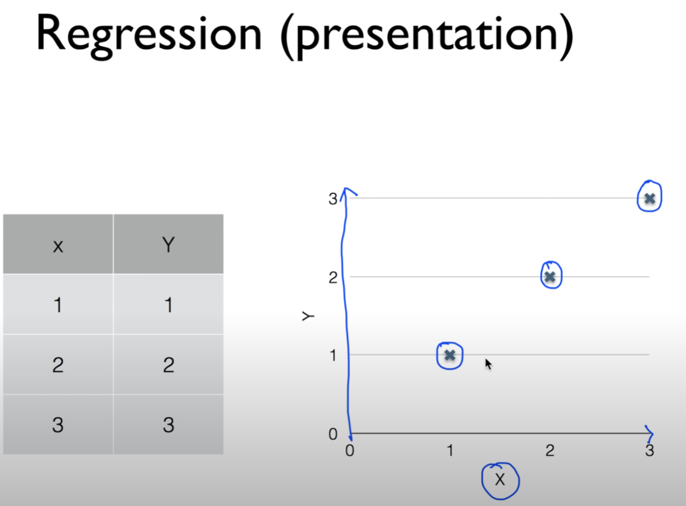
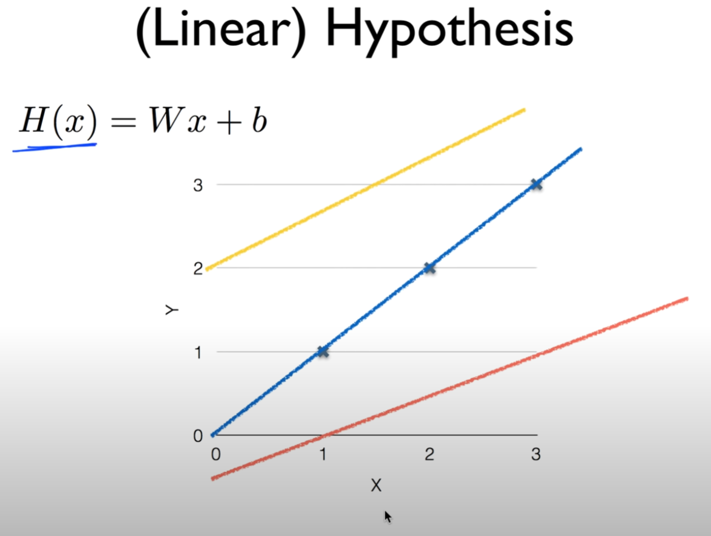
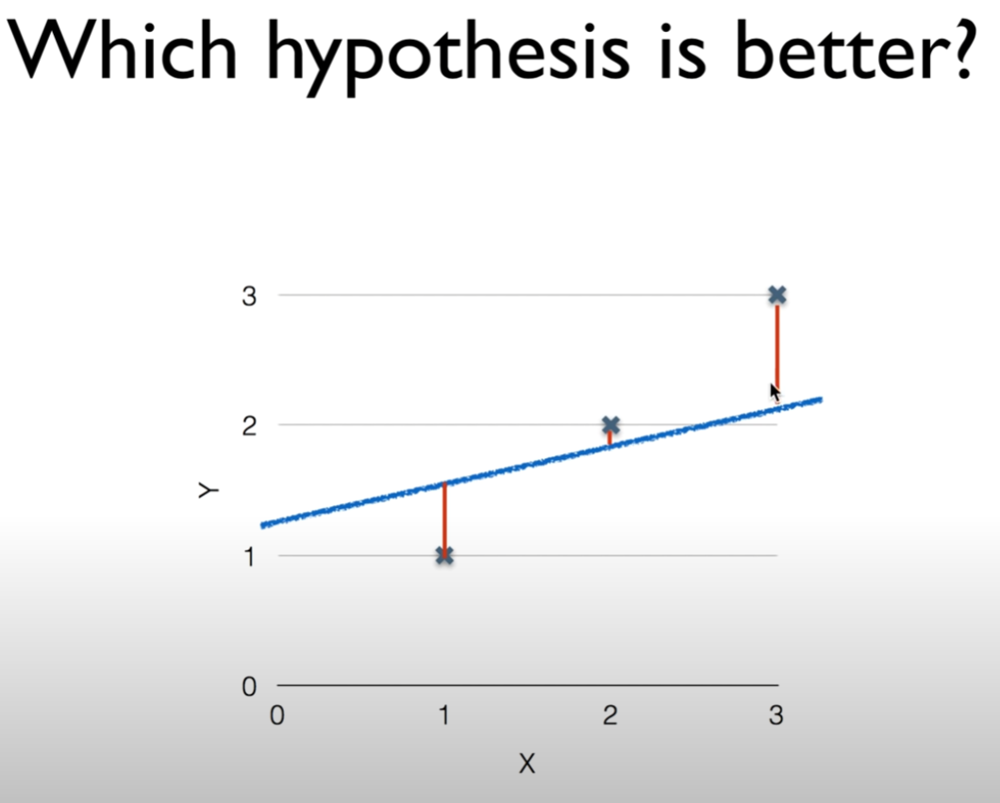
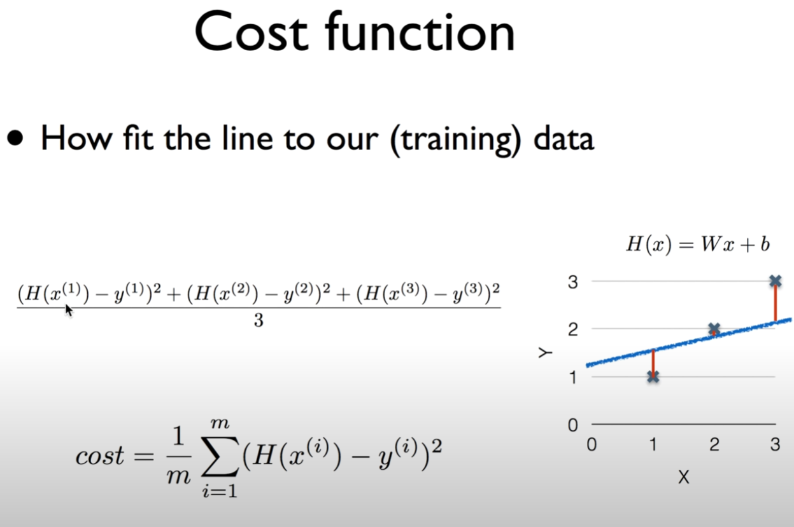
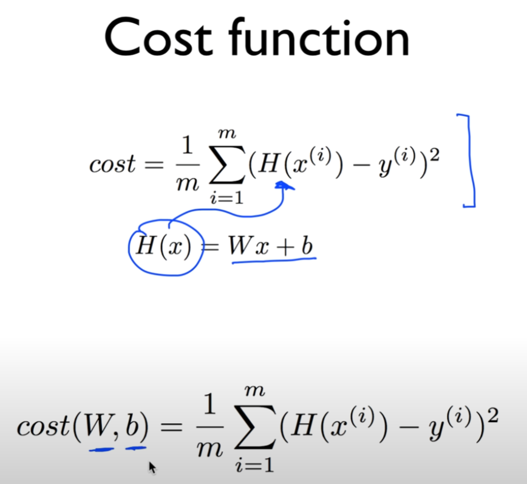

https://www.youtube.com/watch?v=Hax03rCn3UI&list=PLlMkM4tgfjnLSOjrEJN31gZATbcj_MpUm&index=4&t=1s

 머신러닝의 컨셉과 기본적인 용어에 대해 학습

실제 많이 사용되고 있는 Linear Regression에 대해 알아보자.

### Lecture 2 Linear Regression

##### [regression: 회귀 분석]

[회귀분석이란 변수들 간의 함수관계를 분석하는 방법 중의 하나로 독립변수가 종속변수에 미치는 영향력의 크기를 파악하고, 이를 통해 독립변수의 일정한 값에 대응하는 종속변수값을 예측하는 모형을 산출하는 방법이다.]

https://m.blog.naver.com/wjn21/220993310138

[선형 회귀(Linear Regression)]

https://wikidocs.net/21670

### Predicting exam score: regression

| x (hours) | y (score) |
| :-------: | :-------: |
|    10     |    90     |
|     9     |    80     |
|     3     |    50     |
|     2     |    30     |

supervised learning 가정해보자.

위 형태의 data를 가지고 학습시킨다.

score 0 ~ 100점

이런 형태의 learning -> regression

위 형태의 data를 가지고 학습 -> train

위 data -> training data.

regression model이 data를 가지고 학습하여 학습 모델을 만듦.

학습이 끝난 후 regression 사용

어떤 학생이 7시간 공부. 시험치기 전에 인공지능에게 물어봄.

몇 점 받을 수 있을까?

x = 7. y = ?

학습된 데이터 바탕으로 65점 정도 예측해줌

어떻게 동작하고 어떻게 구현하는지 얘기해보자.

### Regression (data)

|  x   |  y   |
| :--: | :--: |
|  1   |  1   |
|  2   |  2   |
|  3   |  3   |

간단한 dataset 준비

x: 예측을 하기 위한 기본적인 자료(feature)

y: 예측해야 할 대상

위와 같은 학습 데이터(training data)가 있다.

이걸 가지고 regression model을 만들자.

### Regression (presentation)

간단하게 그래프에 그리면

### (Linear) Hypothesis

regression model을 학습 -> 하나의 가설을 세울 필요가 있다.

이런 형태로 갈꺼여

Linear한 모델이 우리 데이터에 맞을꺼다 가설 세우면서 함 -> Linear Regression

굉장히 효과 많다.

세상에 있는 많은 데이터, 현상 Linear한 것으로 드러나는 것이 많다.

학생 공부 많이 할수록 성적 높아짐.

훈련 많이 할수록 달리기 실력 높아짐.

집 크기 클수록 가격 올라간다.

linear로 예를 세울 수 있는 경우 많다.

어떤 data가 있다 -> 데이터에 맞는 linear한 선을 찾는다.

선을 찾는 것이 학습을 하는 것.

H(x) = Wx + b

선의 모양은 W, b에 따라 달라짐.

1차 방정식이 될 것이라고 가설을 세우는 것이 linear regression의 첫 번째 단계.

이렇게 나타난 선 들 중에서 어떤 선이 데이터에 잘 맞는 선일까? 알아낼 수 있어야.

그래야 가장 좋은 W, b 값을 찾아낼 수 있다.

파란 선 대략 H(x) = 1*x + 0

노란 선 대략 H(x) = 0.5*x + 2

두 개 중에 어떤 것이 좋은 가설일까요? 알아낼 수 있어야

### Which hypothesis is better?

어떤 선이 / 모델이 / hypothesis가 좋은가?

실제 data와 가설이 나타내는 점들과의 거리

거리가 멀면 안좋고, 거리가 가까우면 좋다. 그것을 계산

### Cost function

linear regression에서는 거리 재는 것을 cost function이라고 부른다.

다른 이름: Loss function

우리가 세운 가설과 실제 데이터가 얼마나 다른가

- How fit the line to our (training) data

가장 기본적인 방법 -> 차를 계산

H(x) - y

많이 좋은 모델은 아니여

+, - 될 수도 있기 때문에 보통 (H(x) - y)^2. 제곱을 한다.

좋은 점: +- 상관없이 일정하게 차이를 양수로 표현해줌

차이가 작을 때보다 차이가 클 때 페널티를 많이 준다.

차이를 작게 만들 수 있는 중요한 값 -> cost function

좀 더 formal하게 정리

가설 데이터 값, 실제 데이터 값 차이 제곱

각각 다 더해서 3으로 나눔

이것을 일반화. 많은 데이터에 쓸 경우

m: 학습 데이터 개수 라고 놨을 때

1부터 m개까지 더한다. 각각의 예측 값과 실제 값 차이의 제곱.

m개니까 m으로 나눔 -> 이게 cost fucntion

### Cost function

위와 같은 식의 cost function 주어진다.

hypothesis H(x) = Wx + b (linear regression)

H(x) 기계적으로 대입하면 된다.

cost는 실제적으로 W와 b의 function이 된다.

linear regression의 숙제) 값을 작게 하는 게 좋다. 가장 작은 값을 가지는 W와 b를 구하는 것이 linear regression의 학습

### Goal: Minimize cost

minimize cost(W, b)

W, b

cost 값을 최소화하는 W, b를 구하는 것이 학습의 목표

W, b 최소화하는 많은 알고리즘이 있다.

Lab2 시간을 통해서 만들어져 있는 알고리즘을 직접 사용해보자.

다음 시간 - How to minimize cost

알고리즘을 직접 구할 필요는 없지만, 어떻게 구하는지 수식을 통해, 직관적인 느낌을 갖기 위해 설명하겠다.

