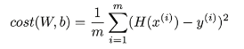

https://www.youtube.com/watch?v=mQGwjrStQgg&list=PLlMkM4tgfjnLSOjrEJN31gZATbcj_MpUm&index=5


Linear Regression model을 test를 이용해 실질적으로 구현해보겠다.


### Hypothesis and cost function

H(x) = Wx + b



주어진 x값에 대해 예측을 어떻게 할 것인가

W라는 weight, bias의 합으로 나타낸다고 얘기했다.

예측한 값 H, 실제 주어진 y (true value)

얼마나 잘 예측했는가를 나타내는 것이 cost function

차이의 제곱을 평균낸 것이다.


cost function: W, b의 function

W, b가 달라질수록 cost function은 클 수도 있고, 작아질 수도 있다.

학습한다: W, b를 조정해서 cost function을 minimize한다. 이것이 학습.


### TensorFlow Mechanics

1. Build graph using TensorFlow operations
2. feed data and run graph (operation)
3. update variables in the graph (and return values)


https://github.com/hunkim/DeepLearningZeroToAll/blob/master/lab-02-1-linear_regression.py

[tensorflow 2.x 버전에서 앞에서 다룰 random_normal, GradientDescentOptimizer 등을 다루지 못하는 문제가 있다.. ㅠㅠ]

[함수를 익히기 보다는, 개념을 이해하는 시간으로 생각하자!]

### 1. Build graph using TensorFlow operations

H(x) = Wx + b


X and Y data 주어짐

```python
# X and Y data
x_train = [1, 2, 3]
y_train = [1, 2, 3]
```

x가 1일 때 y가 1이 되고, 2일 때 2, 3일 때 3이 되는 모델

값을 예측해보라

W, b. weight, bias에 대한 값 정의해야

tensorflow -> variable이란 node로 정의 가능.

variable -> 기존에 프로그램에서 사용하는 변수와는 다른 개념

우리가 사용하는게 아니고, tensorflow가 사용하는 variable. tensorflow 실행시키면 자체적으로 변경시키는 값이다.

그냥 trainable한 variable이라고 봐도 좋다.

tensorflow가 학습하는 과정에서 자기가 영향을 끼친다.

tensorflow variable을 만들 때는 tensorflow의 shape이 어떻게 되는가 먼저 정의하고 값을 준다.

보통 W, b 값을 모르니까 random하게 주게 된다.

```python
# Try to find values for W and b to compute y_data = x_data * W + b
# We know that W should be 1 and b should be 0
# But let TensorFlow figure it out
W = tf.Variable(tf.random_normal([1]), name="weight")
b = tf.Variable(tf.random_normal([1]), name="bias")
```

tf.random_normal([1])

random, shape


Hypothesis W, b로 구성 가능

```python
# Our hypothesis XW+b
hypothesis = x_train * W + b
```

이게 우리의 hypothesis node가 되었다.


cost는 어떻게 할 것인가?

.assets/5-1.png)

그대로 tensorflow에 있는 함수를 사용해서 써준다.

```
# cost/loss function
cost = tf.reduce_mean(tf.square(hypothesis - y_train))
```

tf.square, tf.reduce_mean 이런 식으로 나타내면 된다.

reduce_mean 좀 이따 볼꺼여

그림의 식 그대로 tensorflow 코드로 옮겼다.

cost로 줬다.


reduce_mean: 어떤 값을 줬을 때 평균내주는 것.

(1/m) Σ 요 부분에서 사용

```python
t = [1., 2., 3., 4.]
tf.reduce_mean(t) ==> 2.5
```


cost가 주어졌다 -> 그 다음 작업은 cost를 minimize하는 것.

GradientDescent

```python
# Minimize
optimizer = tf.train.GradientDescentOptimizer(learning_rate=0.01)
train = optimizer.minimize(cost)
```

tensorflow의 여러 방법 중 GradientDescentOptimizer 사용

지금은 magic으로 생각하면 됨..

optimizer 정의하고 이걸 minimize함수 호출하면서 cost를 minimize하라 -> W, b 조절해서 스스로 minimize 한다.

그래프 구현했다.


### Run/update graph and get results

그래프 구현 후 실행하려면 session 만들어야

W, b variable 사용하기 전에 global_variables_initializer 반드시 써줘야

```python
# Launch the graph in a session
sess = tf.Session
# Initializes global variables in the graph.
sess.run(tf.global_variables_initializer())

# Fit the line
for step in range(2001):
    sess.run(train)
    if step % 20 == 0:
        print(step, sess.run(cost), sess.run(W) sess.run(b))
```

sess.run(train) 노드 실행시킨다.

20번마다 스텝 출력

step, cost, W, b 값을 본다. 잘 나오는지.


전체 소스 코드

data 주어지고

trainable한 tensorflow의 variable W, b 선언

hypothesis 정의

cost 정의

train할 때 cost minimize


train node에 cost 연결되어있다.

cost는 hypothesis와 연결

hypothesis는 W, b와 연결

train 실행 -> 그래프를 따라들어가서.. W, b의 값을 수정할 수 있게 연결되어 있다.

학습이 일어난 뒤 cost, W, b 값이 얻어진다.


정답 W=1, b=0

실제로 학습 잘 되는지 볼 수 있다.


첨에 실행시키면 cost 크고 W, b random 한 값

학습 진행될수록 cost 값이 굉장히 작은 값으로 수렴

W는 예상대로 1로 수렴, b는 0에 가까운 작은 값으로 수렴

자동적으로 optimize 실행 -> train 일어나서 tensorflow가 W, b 값을 조정한다.

tf.Variable


### Placeholders [2.0에서는 못쓴다 ㅠㅠ]

(지난 시간)

```python
a = tf.placeholder(tf.float32)
b = tf.placeholder(tf.float32)
adder_node = a + b  # + provides a shortcut for tf.add(a, b)

tf.print(adder_node, feed_dict={a: 3, b: 4.5})
tf.print(adder_node, feed_dict={a: [1,3], b: [2, 4]})
```


직접 값을 주지 않고 placeholder라고 해놨다가, 필요할 때 값을 던져준다.

Placeholders 사용해서 Linear Regression 사용할 수 있다.


```python
# X and Y data
# x_train = [1, 2, 3]
# y_train = [1, 2, 3]

# Now we can use X and Y in place of x_data and y_data
# # placeholders for a tensor that will be always fed using feed_dict
# See http://stackoverflow.com/questions/36693740/
X = tf.placeholder(tf.float32)
Y = tf.placeholder(tf.float32)

# ...

#Fit the line
for step in range(2001):
    _, cost_val, W_val, b_val = 
    sess.run([train, cost, W, b],
        feed_dict={X: [1, 2, 3, 4, 5], Y: [2.1, 3.1, 4.1, 5.1, 6.1]},
    )
    if step % 20 == 0:
        print(step, cost_val, W_val, b_val)
```


미리 선언하지 않고, train시킬 때 X, Y 값을 feed_dict로 넘겨줄 수 있다.

세션 실행시킬 때 각각 실행시킬 수도 있지만, 리스트에 넣어서 실행시킬 수도 있다.


Placeholders 사용하는 가장 큰 이유 중 하나

만들어진 모델에 대해서 값을 따로 넘겨줄 수 있다.


Linear regression 모델을 멋지게 만든 뒤..

```python
# Lab 2 Linear Regression
import tensorflow as tf

W = tf.Variable(tf.random_normal([1]), name="weight")
b = tf.Variable(tf.random_normal([1]), name="bias")
X = tf.placeholder(tf.float32, shape=[None])
Y = tf.placeholder(tf.float32, shape=[None])

# Our hypothesis is X * W + b
hypothesis = X * W + b

# cost/loss function
cost = tf.reduce_mean(tf.square(hypothesis - Y))

# Minimize
optimizer = tf.train.GradientDescentOptimizer(learning_rate=0.01)
train = optimizer.minimize(cost)

# Launch the graph in a session
sess = tf.Session()
# Initializes global variables in the graph.
sess.run(tf.global_variables_initializer())

# Fit the line
for step in range(2001):
    _, cost_val, W_val, b_val = sess.run(
        [train, cost, W, b], feed_dict={X: [1, 2, 3], Y: [1, 2, 3]}
    )
    if step % 20 == 0:
        print(step, cost_val, W_val, b_val)
```

shape=[None]

아무 값이나 들어올 수 있다. 1개, 10개, 20개, 100개


실제로 학습을 시킬 때, train이란 노드를 실행시킬 때.. feed_dict로 값 넘겨줌 (placeholder)

대충 예상하건데 W=1, b=1.1


tensorflow 잘 학습하는지 실행시켜보면..

cost 값은 시간이 지날수록 작은 값으로 수렴

W는 1에 가깝게, b는 1.1에 가깝게 수렴

진짜 잘 하는지 테스트


```python
# Testing our model
print(sess.run(hypothesis, feed_dict={X: [5]}))
print(sess.run(hypothesis, feed_dict={X: [2.5]}))
print(sess.run(hypothesis, feed_dict={X: [1.5, 3.5]}))
```

5를 넘겨주면? 6.1정도

2.5는? 3.6 가깝게

두 개 넘겨주기도 가능. 1.5, 3.5 => 2.6, 4.6

굉장히 유사한 값으로 예측.

우리가 구현한 tensorflow linear regression 아주 잘 동작한다.


정리

1. Hypothesis, cost에 해당되는 그래프를 만들었다.

2. 만들어진 멋진 모델을 사용하기 위해 feed_dict로 원하는 x, y 데이터를 던져주면서 그래프 실행

3. 내부적으로 W, b 업데이트됐겠쥬?

필요할 때 return value도 출력.


다음 시간 - Lab 3 Minimizing Cost

다음 시간에는 Minimizing cost하는 법에 대해 좀 더 얘기.

