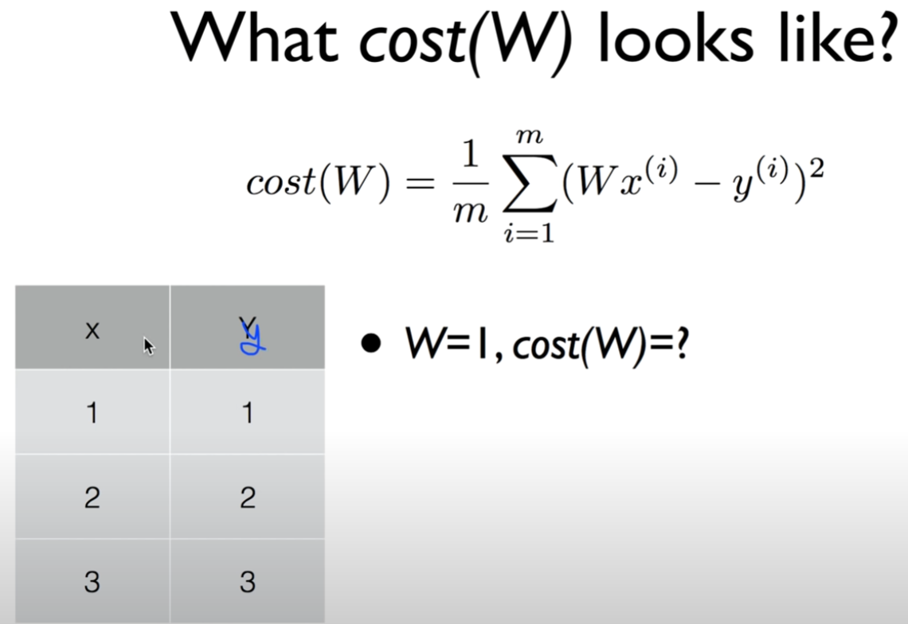
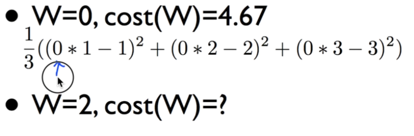
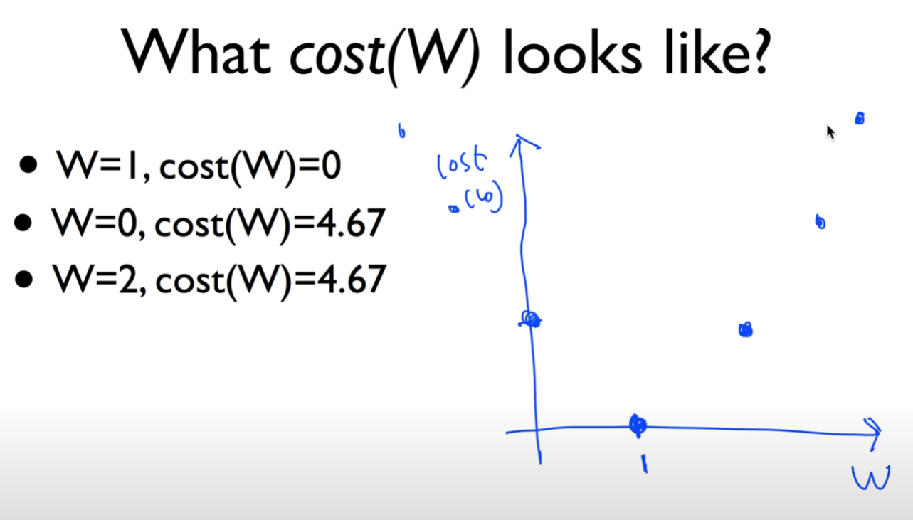
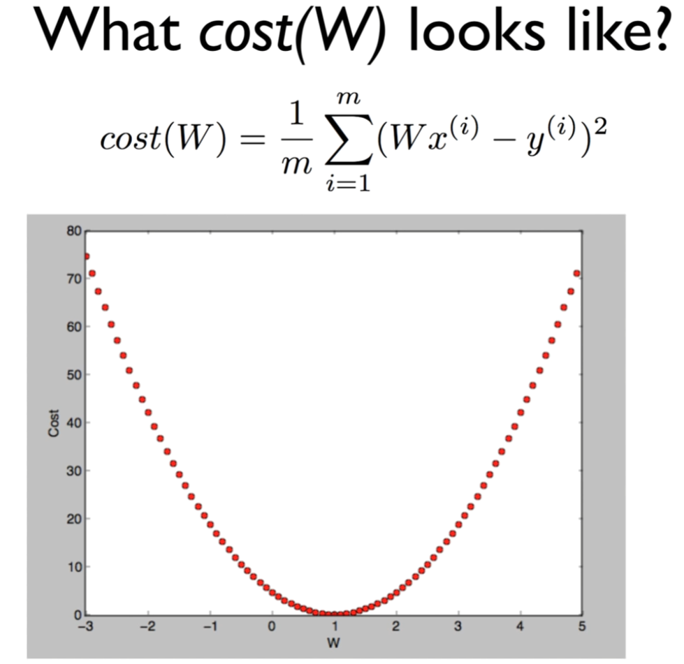
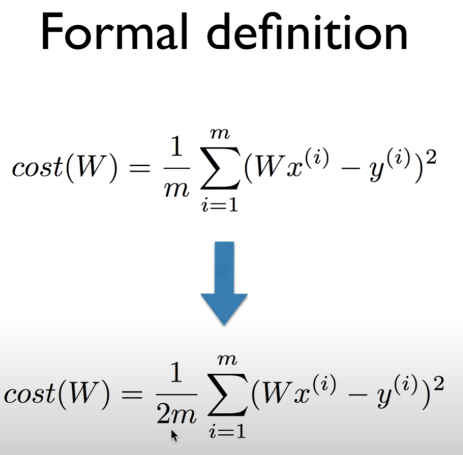
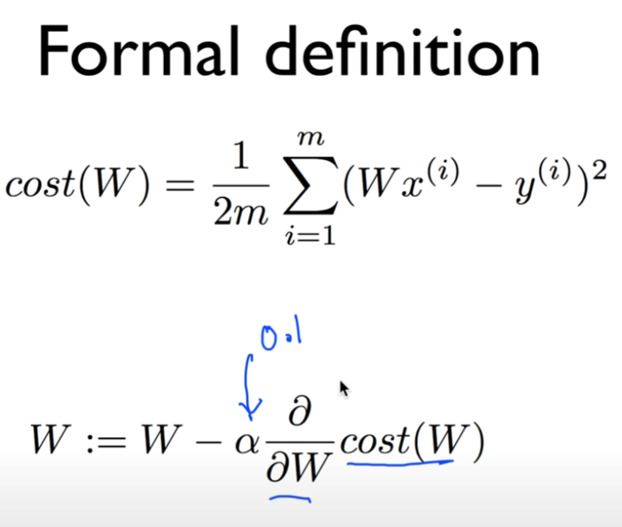
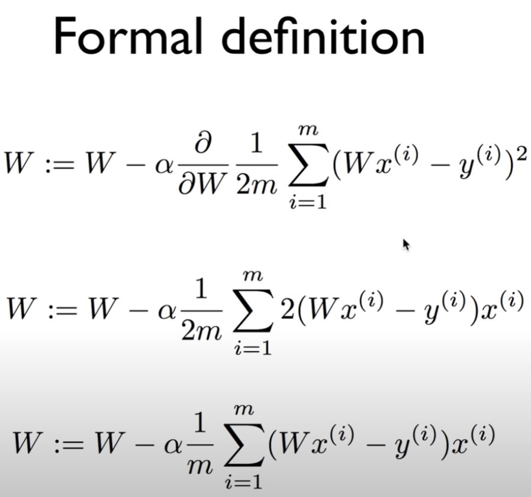
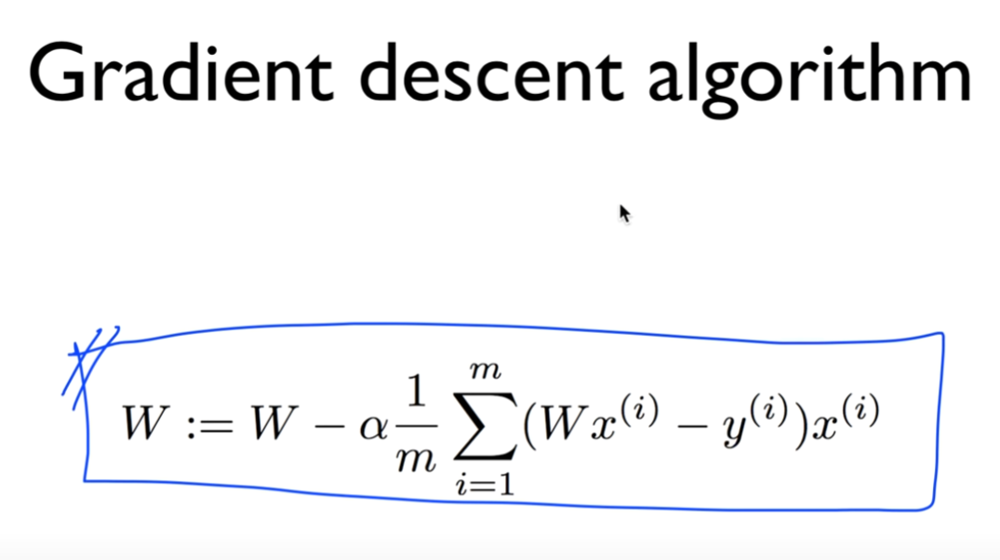
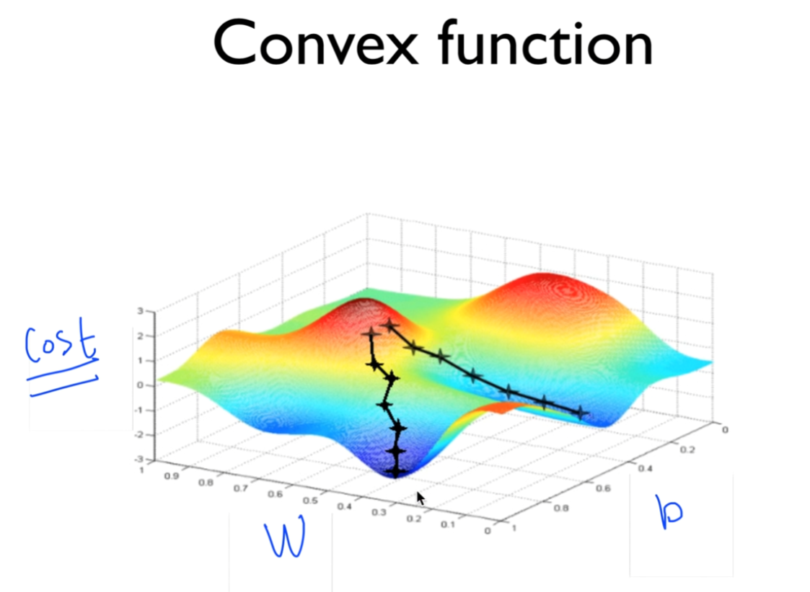
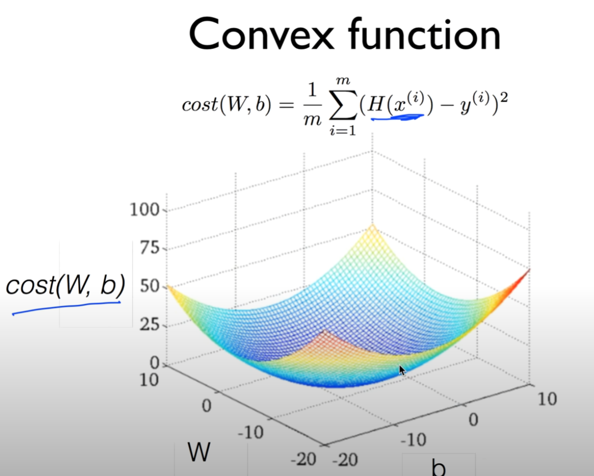

https://www.youtube.com/watch?v=TxIVr-nk1so&list=PLlMkM4tgfjnLSOjrEJN31gZATbcj_MpUm&index=6

### Lecture 3 How to minimize cost

cost function 어떻게 최소화해서 최종적으로 Linear Regression 학습 완료하는지 알아보자.

### Hypothesis and Cost

H(x) = Wx + b

Hypothesis, 우리의 모델이 Wx + b의 형태로 주어지고

여기에 기반하여 우리가 가지고 있는 모델이 얼마나 같은가/다른가 나타내는 cost function 위와 같이 정의.

가설 값과 실제 값의 차를 제곱해서 총 더하고 평균을 나눠줌..

cost minimize하는 W, b 값을 우리가 가지고 있는 data를 통해서 구해보자 -> Linear Regression의 목표

### Simplified hypothesis

설명을 위해 간단하게 만듦

H(x) = Wx

b 없앰

cost(W) = (1/m) Σ (Wx - y)^2

W의 function.. 나머지는 위와 같다.

간단한 hypothesis, function 만들었다.

### What cost(W) looks like?

W = 1일 때, cost는 얼마?

식에 넣으면 되쥬?

(1 * 1 - 1)^2 + (1 * 2 - 2)^2 + (1 * 3 - 3)^2

0 + 0 + 0 = 0

W = 1일 때 이 값은 0이 되는구나.

같은 방법으로 계산

W = 0

14/3 = 4.67

W = 2일 때는?

비디오를 멈추고 계산해보십쇼

W = 0일 때와 같은 값이 나올 것이다. cost(W) = 4.67

### What cost(W) looks like?

- W = 1, cost(W) = 0

- W = 0, cost(W) = 4.67

- W = 2, cost(W) = 4.67

우리의 목표: cost가 최소화된 점을 찾는다.

우리가 가진 데이터를 가지고 cost function만 찾아낼 수 있다면, 이 값을 기계적으로 어떻게 찾아낼 수 있을까?

### Gradient descent algorithm

이럴 때 많이 사용되는 알고리즘

- Minimize cost function
- Gradient descent is used many minimization problems
- For a given cost function, cost (W, b), it will find W, b to minimize cost
- It can be applied to more general function: cost(w1, w2, ...)

이름 멋있쥬?

따지고보면 gradient: 경사

descent: 내려가는 것

경사를 따라 내려가는 알고리즘

주어진 cost function을 minimize하는 데 많이 사용

굉장히 많은 ML의 minimization problem에 사용됨. ML 아니어도..

cost (W, b)의 function -> 알고리즘 적용시키면 (cost가) 가장 minimize한 W, b가 나온다.

여러 개의 값들이 있는 cost function도 minimize 가능

cost(w1, w2, ...)

### How it works? How would you find the lowest point?

한라산 올라갔는데.. 길을 잃어서 해가 지려함

빨리 내려와야 하는데 여러분 같으면 어떻게 내려오나요?

360도 삭 돌아보고 가장 경사가 있는 곳으로 한 발짝

계속 경사가 있는 쪽으로 내려옴 -> 어느 순간 내려옴

아주 간단한 알고리즘..

W=5에서 출발.. 경사도를 따라서 한 발자국씩 내려온다.

경사도 따라서.. 

W=1 근처는 경사도 0

여기서 머무른다.

W = -3에서 시작해도 마찬가지.

#### How it works?

- Start with initial guesses
  - Start at 0, 0 (or any other value)
  - Keeping changing W and b a little bit to try and reduce cost(W, b)
- Each time you change the parameters, you select the gradient which reduces cost(W, b) the most possible
- Repeat
- Do so until you converge to a local minimum
- Has an interesting property
  - Where you start can determine which minimun you end up

아무 점에서나 시작 가능.

W를 조금만 움직임. -> cost를 줄이는 방향으로.

계속 계산해서 반복

어떤 점에서 시작하든 항상 최저점에 도달할 수 있다.[2차원 그래프]

경사도 어떻게 구해? 미분

### Formal definition

미분 쉽게 하기 위해서 숫자 2를 넣는다.

1/m minimize하는 것이나 1/2m 하는 것이나 비슷

α: Learning Late. 일단 상수 0.1이라고 가정하자.

여기에 cost 함수를 미분한 것. 하나의 지점에서 그 점의 기울기를 구한다.

최솟값 오른 쪽에 있다 -> (-) -> W 작은 쪽으로 움직이겠다.

최솟값 왼 쪽에 있다 -> -(-) -> W 큰 쪽으로 움직이겠다.

미분 절차

간단하게 맨 아래 형태의 우리가 원하는 descent algorithm 완성

여러 번 실행시킬 때 W값이 변화된다.

-> cost를 minimize하는 값이 자동으로 주어진다.

미분 웹사이트드가서 계산하면 됨. 걱정할 필요가 없다.

### Gradient descent algorithm

이 수식을 기계적으로 적용시키면 cost function을 최소화하는 W를 구해내고, Linear Regression의 핵심인 학습 과정을 통해 모델을 만든다고 할 수 있다.

### Convex function

생각해볼 만한 문제

왼쪽 점선 -> 왼쪽에 도착. W = 0.4, b = 0.8

오른쪽 점선(시작점을 조금 다르게) -> 다른 곳에 동작

우리 알고리즘이 제대로 동작하지 않쥬

다행히 우리의 Hypothesis를 갖고 cost function으로 그림을 그리게 되면..

밥그릇 엎어놓은 형태의 그래프

이걸 Convex function이라고 부른다.

어느 점에서 시작하든 도착하는 지점이 우리가 원하는 지점

우리 Gradient descent algorithm이 항상 답을 찾는다는 것을 보장해준다.

cost function 설계할 때 반드시 cost function의 모양이 Convex function이 되는지 확인해야 한다.

이거만 확인되면 linear regression 적용 가능.

편안한 마음으로 Gradient descent algorithm 사용 가능.

