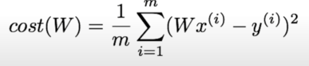
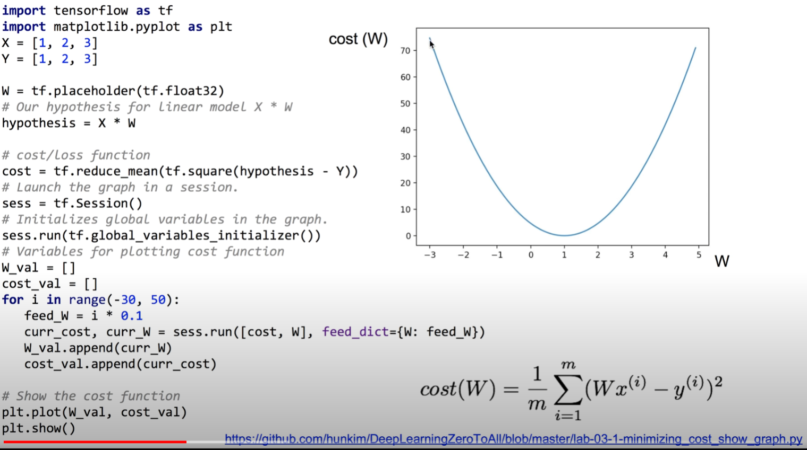
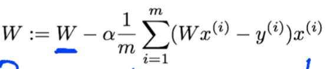
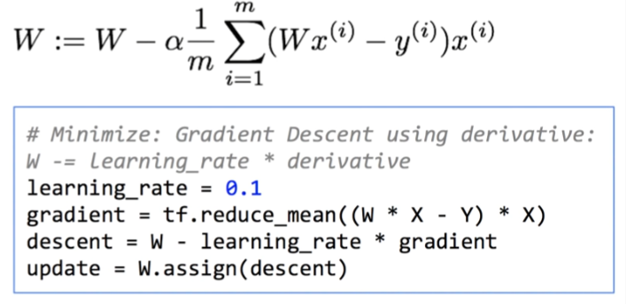
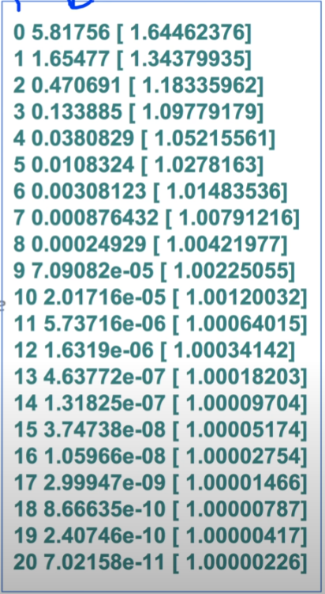

https://www.youtube.com/watch?v=Y0EF9VqRuEA&list=PLlMkM4tgfjnLSOjrEJN31gZATbcj_MpUm&index=7


### Lab 3 Minimizing Cost


cost Minimize하는 것 tensorflow로 직접 구현


### Simplified hypothesis

H(x) = Wx




간략한 hypothesis 사용

cost는 W의 함수 -> W 값이 바뀔수록 cost가 바뀐다.

cost Minimize -> cost가 최저가 되는 W값을 찾자.


https://github.com/hunkim/DeepLearningZeroToAll/blob/master/lab-03-1-minimizing_cost_show_graph.py

```python
# Lab 3 Minimizing Cost
import tensorflow as tf
import matplotlib.pyplot as plt

X = [1, 2, 3]
Y = [1, 2, 3]

W = tf.placeholder(tf.float32)

# Our hypothesis for linear model X * W
hypothesis = X * W

# cost/loss function
cost = tf.reduce_mean(tf.square(hypothesis - Y))

# Launch the graph in a session
sess = tf.Session()
# Initializes global variables in the graph.
sess.run(tf.global_variables_initializer())

# Variables for plotting cost function
W_val = []
cost_val = []

# Launch the graph in a session.
with tf.Session() as sess:
    for i in range(-30, 50):
        feed_W = i * 0.1
        curr_cost, curr_W = sess.run([cost, W], feed_dict={W: feed_W})
        W_val.append(curr_W)
        cost_val.append(curr_cost)

# Show the cost function
plt.plot(W_val, cost_val)
plt.show()
```




cost 함수는 위와 같은 형태

x축 W, y축 cost(W)

경사면 따라 내려가기 알고리즘을 적용하는 데 굉장히 좋은 형태, 모양.

W=1일 때 최소화. 자동으로 이 값을 찾는다.


### Gradient descent

미분 값을 사용할꺼여

미분: 한 점에서의 접선의 기울기를 나타낸다.

그래프 오른쪽 기울기: +가 된다.

W는 안쪽으로 가야쥬? - 방향으로 움직여야 한다.

그래프 왼쪽 기울기: -가 된다.

W값은 최적화된 값이 오른쪽에 있으니 오른쪽으로 움직여야

W는 + 방향으로 움직여야 한다.




cost 함수를 미분한 값, cost 함수의 기울기를 빼주면 된다.

기울기 + -> W 작아짐

기울기 - -> W 커짐

이런 식으로 Gradient descent 적용, W 값을 조절한다.


##### tensorflow 적용하기



α: Learning rate, 0.1로 둔다.

α 뒤의 부분 잘라서 gradient로 표현한다.

수식적으로 쭉 써주면 된다. 수식 삭 써주고 평균 내준다.

descent -> := 오른쪽 전체 부분. 현재 W 값에 gradient 값을 빼주게 된다.

새로운 W 값을 얻었으니 assign 해줘야쥬?

tensorflow = 연산 불가, W.assign() 함수를 통해 assign

값이 바뀌게 된다. 이 operation을 update로 가져옴.

앞으로 update를 그래프에서 바로 실행 -> 일련의 동작들이 일어나게 된다.


https://github.com/hunkim/DeepLearningZeroToAll/blob/master/lab-03-2-minimizing_cost_gradient_update.py

```python
# Lab 3 Minimizing Cost
import tensorflow as tf
# tf.set_random_seed(777)  # for reproducibility

x_data = [1, 2, 3]
y_data = [1, 2, 3]

# Try to find values for W and b to compute y_data = W * x_data
# We know that W should be 1
# But let's use TensorFlow to figure it out
W = tf.Variable(tf.random_normal([1]), name="weight")

X = tf.placeholder(tf.float32)
Y = tf.placeholder(tf.float32)

# Our hypothesis for linear model X * W
hypothesis = X * W

# cost/loss function
cost = tf.reduce_mean(tf.square(hypothesis - Y))

# Minimize: Gradient Descent using derivative: W -= learning_rate * derivative
learning_rate = 0.1
gradient = tf.reduce_mean((W * X - Y) * X)
descent = W - learning_rate * gradient
update = W.assign(descent)

# Launch the graph in a session
sess = tf.Session()
# Initializes global variables in the graph.
# with tf.Session() as sess:
sess.run(tf.global_variables_initializer())
for step in range(21):
    sess.run(update, feed_dict={X: x_data, Y: y_data})
    print(step, sess.run(cost, feed_dict={X: x_data, Y: y_data}), sess.run(W))
```


#Minimize 아래 네 문장 -> 지난 시간에 말한 수식 그대로 tensorflow에 적용


step, cost, W 순



step 지날수록 cost 작아지고 W는 1에 수렴


tensorflow 사용하면.. 미분 값 쉽게 주어졌지만.. 굉장히 복잡하쥬?

일일이 미분할 필요 없이 바로 Optimizer 선언하고 cost를 굳이 미분하지 않고 사용해도 되겠쥬?

https://github.com/hunkim/DeepLearningZeroToAll/blob/master/lab-03-3-minimizing_cost_tf_optimizer.py

```python
# Minimize: Gradient Descent Magic
optimizer = tf.train.GradientDescentOptimizer(learning_rate=0.1)
train = optimizer.minimize(cost)
```

머리아프게 미분하지 않고도 똑같은 일을 할 수 있게 된다.


### Output when W=5

````python
W = tf.Variable(5.0)
````


처음에 W=5.0

학습할수록 빠르게 내려가서 1.0으로 수렴한다.

한 줄밖에 안되는 GradientDescentOptimizer가 잘 동작하는구나!

W=-3.0일 때도 잘 동작!

tensorflow의 GradientDescentOptimizer가 잘 동작하는구나!


### Optional: compute_gradient and apply_gradient

gradient 임의로 수정하고 싶을 때

https://github.com/hunkim/DeepLearningZeroToAll/blob/master/lab-03-X-minimizing_cost_tf_gradient.py

```python
import tensorflow as tf

# tf Graph Input
X = [1, 2, 3]
Y = [1, 2, 3]

# Set wrong model weights
W = tf.Variable(5.)

# Linear model
hypothesis = X * W

# Manual gradient
gradient = tf.reduce_mean((W * X - Y) * X) * 2

# cost/loss function
cost = tf.reduce_mean(tf.square(hypothesis - Y))

# Minimize: Gradient Descent Optimizer
optimizer = tf.train.GradientDescentOptimizer(learning_rate=0.01)

# Get gradients
gvs = optimizer.compute_gradients(cost)

# Optional: modify gradient if necessary
# gvs = [(tf.clip_by_value(grad, -1., 1.), var) for grad, var in gvs]

# Apply gradients
apply_gradients = optimizer.apply_gradients(gvs)

# Launch the graph in a session
sess = tf.Session()
sess.run(tf.global_variables_initializer())

for step in range(101):
    print(step, sess.run([gradient, W, gvs]))
    sess.run(apply_gradients)
```


자동으로 계산된 GradientDescentOptimizer와

미분 시 식을 넣은 거랑 같은지 계산..


step, gradient: 손으로 계산한 거, W, gvs: gradient와 gradient에 해당되는 weight

수식적으로 계산한 값(gradient)과 tensorflow가 자동으로 계산한 값(gvs의 gradient)가 같다.

손으로 계산한 값(gradient)이 optimizer가 만들어내는 compute_gradients이다. (같다.)

apply_gradients 할 수 있고, 필요하면 작업이나 수정을 할 수 있다.


