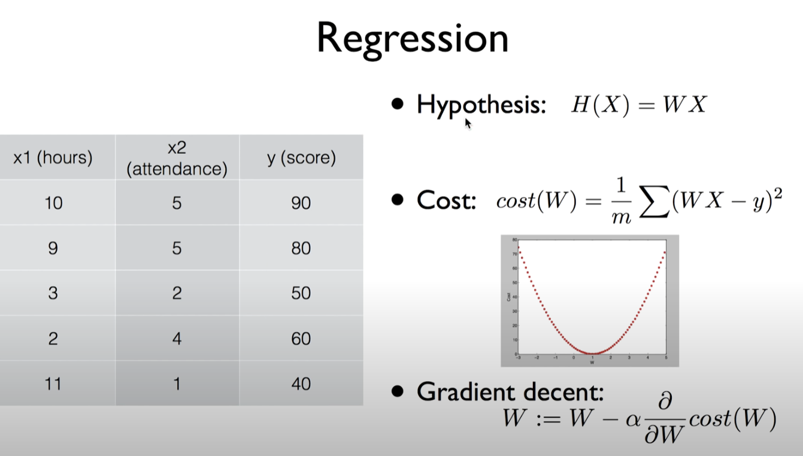
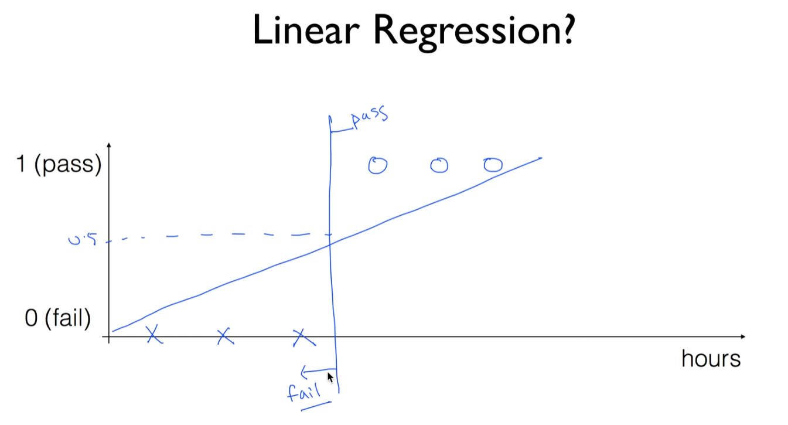
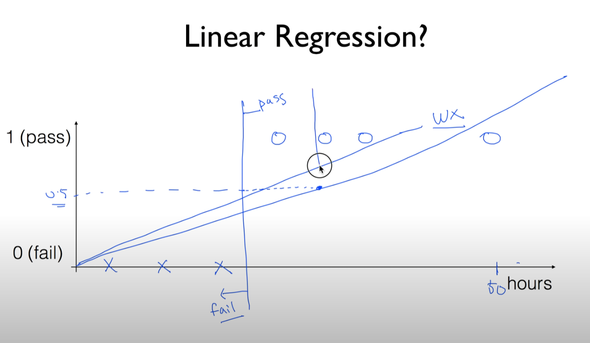
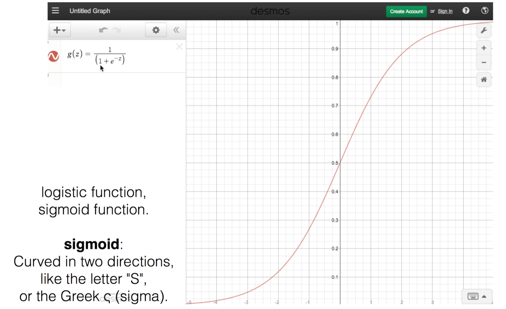
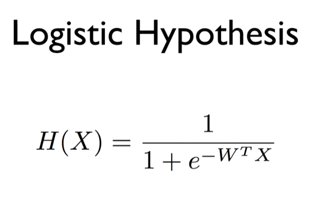

https://www.youtube.com/watch?v=PIjno6paszY&list=PLlMkM4tgfjnLSOjrEJN31gZATbcj_MpUm&index=11

### Lecture 5-1 Logistic (regression) classification

classification 알고리즘 중 정확도가 굉장히 높은 알고리즘으로 알려져 있다.

실제 문제에도 바로 적용해볼 수 있다.

수업의 궁극적인 목표: NN, Deep Learning 잘 이해하는 것

이거에 굉장히 중요한 component이기에 굉장히 중요한 알고리즘이라고 할 수 있다.

Andrew Ng 교수님 수업자료 많이 이용했다.

### Regression (HCG)

값을 예측. linear로 가설을 세우고(H), cost 함수(C), cost 함수를 Minize하는 알고리즘(G)

Hypothesis

Cost: 학습 데이터와 실제로 가설의 선이 얼마나 각각 먼가를 측정

가설과 실제 값의 차이의 (제곱의) 합을 전체 합쳐서 평균을 낸다.

학습을 한다 -> 우리가 갖고 있는 data를 이용해서 바로 cost를 최소화하는 weight를 찾아내는 것.

이걸 잘 하기 위해 cost가 어떤 친구인지, 어떻게 생겼는지를 먼저 알아야 한다.

그려보니.. 밥그릇을 엎어놓은 듯한 모양이 나옴.

경사 타고 내려가기 알고리즘(Gradient decent)을 사용해도 되겠다고 사람들이 생각했다.

아이디어: 어떤 점에서 시작하더라도 마치 산을 타고 내려가는 것처럼 그 지점에서 경사가 어디로 향해있는지 본다. 기울기..

기울기를 본 다음 한 발자국을 움직인다. 끝까지 알고리즘을 쓰게 되면.. 어느 시점에서 최저점을 찾게 되고, 이 W가 우리가 찾고자 하는 점

기울기: 위의 cost 함수를 미분한 값으로 나타난다.

한 발자국에 얼마나 움직일까? -> α로 주어진 step의 size, 이걸 learning rate라고도 부른다.

Hypothesis, Cost, Gradient decent 세 가지만 있으면 linear regression은 구현도 할 수 있고, 실제로 잘 이해도 할 수 있다. Classification도 굉장히 유사

### Classification

Classification의 다른 점

이전의 regression: 어떤 숫자를 그냥 예측하는 것

오늘 다룰 Classification: Binary Classification. 두 개 중 한 개를 정해진 카테고리로 부르는 것.

- Spam Detection: Spam or Ham
- Facebook feed: show or hide
  - 수 백개의 time line중에서 어떤 것은 보여주고, 어떤 것은 보여주지 말자
  - 눈에 보기 엄청 좋은 것만 보여준다.
- Credit Card Fraudulent Transaction detection: legitimate/fraud
  - 도난시..
  - 기존에 사용하던 패턴 학습
  - 뭔가 다르게 사용 -> 이것은 가짜다 예측 가능

굉장히 중요한 문제, ML에서 많이 사용되는 분야

### 0, 1 encoding

기계적으로 학습. spam, ham이라고 하기보다 0, 1로 인코딩 많이 한다.

- Spam Detection: Spam(1) or Ham(0)
- Facebook feed: show(1) or hide(0)
- Credit Card Fraudulent Transaction detection: legitimate(0) or fraud(1)

### Radiology

최근 많은 곳에서 사용된다.

이미지를 보고 나쁜 tumor(Malignant tumor)인지 좋은 tumor(Benign tumor)인지 진단 정확하게 할 수 있다.

### Finance

주식 시장에서 이 주식을 살까? 팔까? 를 이전의 시장 동향에서 기록을 학습해서 할 수 있다.

요새 사람보다 더 잘하는 분야.

이것이 Classification

### Pass(1)/Fail(0) based on study hours

좀 쉽게) 몇 시간정도 공부했더니 학생이 시험에 통과하더라 / 떨어지더라

2, 3, 4시간 탈락

6, 7, 8시간 합격

이런 형태의 데이터가 있다고 가정

Classification 알고리즘을 적용하고 싶은데..

### Linear Regression?

Linear Regression을 갖고도 할 수 있을 것 같은 느낌이 든다.

선 하나 쫙 그리면 되겠쥬

0.5 되는 점을 잘라서 얘보다 큰 값 -> 통과

작게 나옴 -> 탈락

실제로 비슷한 모델을 쓸꺼다.

Linear한 Hypothesis (WX)

문제가 조금 있다.

어떤 학습 데이터에서 어떤 친구가 열심히 공부(50시간) -> 통과.

Linear Algorithm에서 50시간 공부 -> 이만큼 올라가있다.

0, 1로 정하기 때문에 1에 머문다.

이 상태에서 Linear한 모델을 학습시키면, 선과 데이터의 차이를 줄이기 위해서.. 선이 기울어진다.

[기울기가 작아진다.]

문제) 이전에 우리가 세워놓았던 0.5 이상, 이하의 값이 변한다.

교수님이 선 긋고계신 곳이 이 합격, 불합격을 구분하는 선이 된다.

어떤 데이터들은 합격인데도 불구하고 0.5보다 값이 작아서 불합격으로 표시될 수 있다.

또 다른 문제

이 Classification에서는 반드시 값이 0, 1 사이의 값이 나와야 한다.

- We know Y is 0 or 1
  - H(x) = Wx + b
- Hypothesis can give values large than 1 or less than 0

H(x) = Wx + b -> 0보다 훨씬 크거나, 훨씬 작거나, 1보다 훨씬 큰 값이 나올 수 있다.

ex) 학습 결과 W=0.5, b=0

x data들이 1, 2, 5, 10, 11시간.. 이런 식으로..

여기서 나오는 값들은 0에서 1사이 값이겠죠?

모델 학습시킨 뒤 모델을 갖고 예측을 하려 했다.

어떤 친구가 100시간을 공부함.. 이걸 그대로 모델에 적용

100 * 0.5 -> 50

50 >> 1

모양이 좋지가 않다.

사람들: Linear Regression 쓰면 

H(x) = Wx + b

좋고 간단하긴 한데, 이것을 0과 1 사이로 압축을 시켜주는 어떤 형태의 함수가 있으면 좋겠다.

Z = Wx + b라 두고

g(z)는 Z값에 상관 없이 대략 0~1 사이의 값을 만들어주더라

많은 함수를 찾다가 재밌게 생긴 함수를 찾음.

크기 1보다 작을듯(값의 역이 되기 때문)

z가 작아짐 -> 값이 0으로 감

z가 0으로 감 -> 값이 1로 감

값이 1로 감 -> 좀 커짐. 1보다 크진 않을 듯.

이 함수를 sigmoid라고 부른다

s자 곡선, s같이 생긴 게 이쁘게 펼쳐져 있다.

혹은 Logistic function이라고 부른다.

특징: z축, y축: g(z)

z축 무한히 커질수도 있겠쥬?

-> g 함수는 1에 가까워짐

z가 매우 작아짐

-> g 함수의 값은 0에 가까이 가기만 할 뿐.

우리가 원하는 0, 1 사이의 값을 가진다.

Z = Wx

H(x) = g(z)라고 두면..

### Logistic Hypothesis

이것이 바로 sigmoid 함수

W^T X는 W 벡터 형태에 따라 WX표시로 봐도 무방

이게 가장 중요한 Logistic Classification의 함수가 되겠다.

그 다음 단계 -> cost를 구하고, cost를 minimize하는 것.

다음 시간에..

