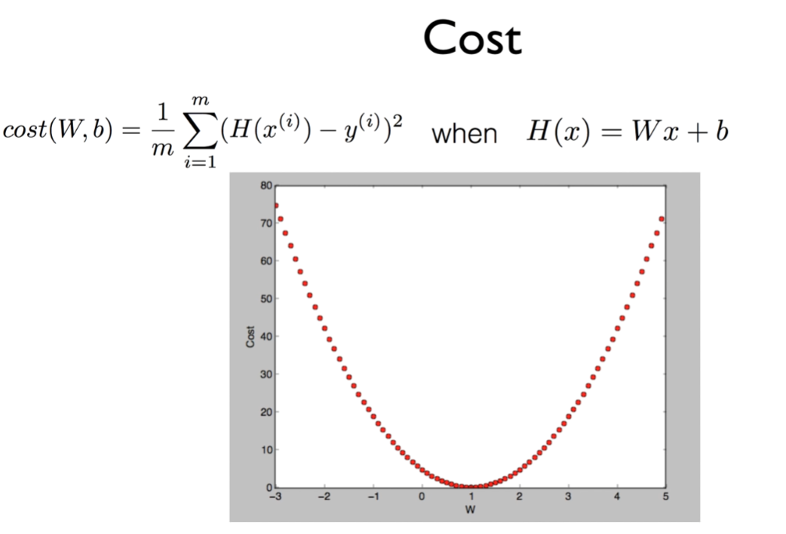
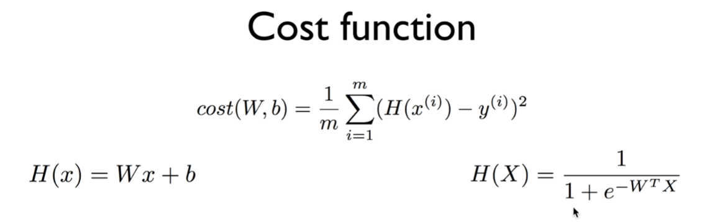
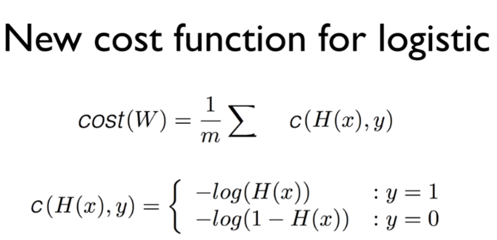
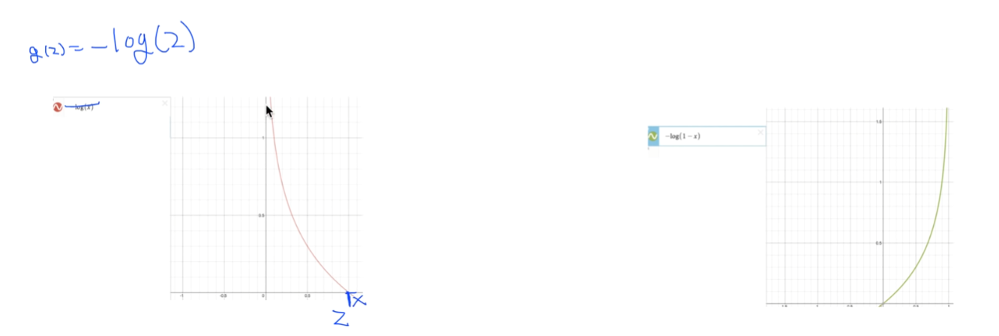
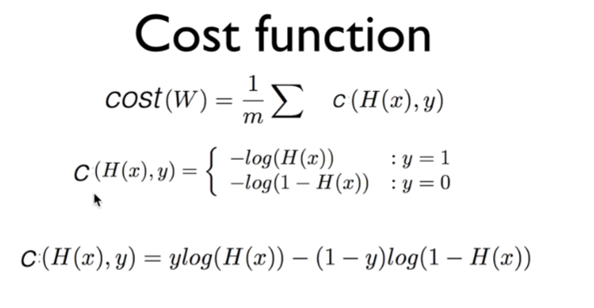
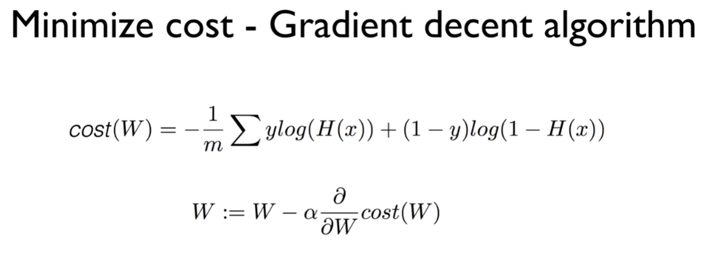
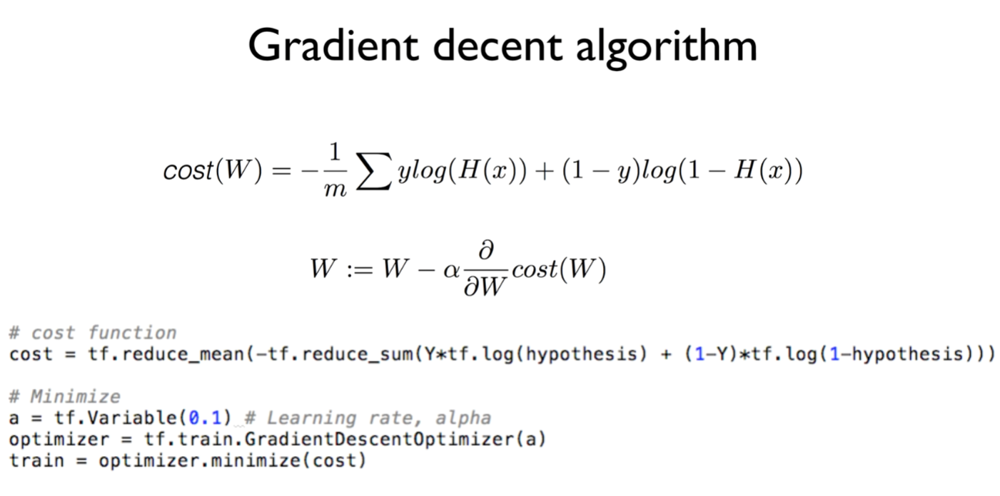

https://www.youtube.com/watch?v=6vzchGYEJBc&list=PLlMkM4tgfjnLSOjrEJN31gZATbcj_MpUm&index=12

### Lecture 5-2

Logistic (regression) classificaion: cost function & gradient decent

cost function과, cost function을 최소화하는 알고리즘에 대해 얘기해보자.

### Cost

Hypothesis를 linear로 주었을 때 이런 형태가 나온다.

어디서 시작하든 최저 값을 찾을 수 있따.

### Cost function

우리의 가설이 조금 바뀌었다.

Sigmoid function을 사용해서 출력 값이 항상 0에서 1 사이에서 나오도록 만들었다. (오른쪽 식)

H를 사용해서 cost function을 만든 뒤에 그려보면..

구불구불한 밥그릇 모양

- 저번의 Linear regression -> 매끈한 모양

선을 제곱 -> 매끄러운 모양

어느 점에서 출발해도 최소점에 도달 가능.

- Sigmoid -> Linear한 모양이 아니다. 

구부란 Shape이 제곱이 되었다.

문제) 경사 타고 내려가기 알고리즘 바로 적용 -> 시작 점이 어디인가에 따라서 끝나는 점이 다르다.

(Local minimum 말씀하시는 듯)

여기가 최저점인가보다... 다른 곳) 여기가 최저점인가보다..

시작 점에 따라 최저점 달라질 수 있다.

Local minimum

우리가 찾고자 하는 것은 전체적인 minimum

global minimum을 찾고자 하는 것이 목표.

cost가 학습을 위에서 멈춤 -> 우리의 모델이 나쁘게 conviction(확신)하게 된다.

이런 형태에선 아쉽게도 gradient descent algorithm 사용 불가

Hypothesis를 바꾸었기 때문에, cost 함수를 조금 바꿔야 한다.

### New cost function for logistic

cost함수 -> 함을 낸 다음 평균.

c(H(x), y)

하나의 복잡한 함수를 c라 하자.

c는 값 H(x), y를 가지고 두 가지 케이스로 나누어서 함수를 정의한다.

y=1일 때는 -log(H(x)), y=0 일 때는 -log(1-H(x))

왜 이렇게 할까?

### understanding cost function

H(x)는 이런 꼴의 함수죠?

H(x) = 1 / (1 + e^(-2))

exponential term이 들어가있기 때문에, exponential term이 (미분 시에)구부러진 것을 만듦.

구부러진 것을 잡는 것..

exponential과 상극 -> log

log 함수를 사용한다는 것이 기본적인 아이디어

log 함수의 고향을 보면 우리와 상당히 잘 맞다.

g(z) = -log(z)라 하면.. (왼쪽 그림)

z=1일 때 0이다

z=0에 가까워지면 함수의 값은 굉장히 커진다.

y=1이면 왼쪽 그림을 cost 함수로 사용한다.

cost 함수의 의미가 뭔가요?

실제의 값과 우리가 예측한 값이 같다면, 비슷하면 cost 값은 작아진다.

예측한 값이 크게 틀리면 cost 값을 크게 해서 우리 모델에게 벌을 준다.

cost를 최소화하기 위해서 weight를 병행시킨다.

case를 나눠보자.

- y=1인 경우.

우리의 예측 H(x) = 1 (맞았다)

이 때 cost는 무엇일까요?

H(x) = 1 -> cost(1) = ?

0에 가깝다. (왼쪽 그림)

cost(1) = 0

이번엔 실수를 했다고 치자.

H(x) = 0 -> cost는 굉장히 커진다. -> cost = ∞

예측에 틀리면 cost 굉장히 높아져서 우리 시스템에 벌을 준다.

- y=0인 경우 (오른쪽 그림)

H(x) = 0 (성공적으로 예측했다고 치자)

-log(1 - z)

z가 0이면 0에 가깝고, 1이면 ∞에 가깝다.

예측이 0으로 맞았어 -> 이 때의 cost는..

H(x) = 0, cost = 0

실제의 label과 예측 값이 맞았을 때, cost는 0으로 간다.

실수함.

H(x) = 1, cost = ∞. 굉장히 커진다.

우리 시스템이 잘못했을 경우 cost를 크게 한다.

원래 목적.. cost의 목표와 잘 맞는 함수가 만들어졌다.

왼쪽 그림, 오른쪽 그림 두 개를 합치면

대략 이전에 우리가 좋아했던 밥그릇같은 모양이 된다.

경사 타고 내려가기를 여기에도 적용 가능.

### Cost function

정리

cost를 전체의 평균으로 본다.

하나의 y에 대해 1일 때, 0일 때 두 개의 case에 대해 각각 정의하면 잘 된다.

좋고 잘 맞는데, tensorflow같은 데서 프로그래밍하면 복잡하다.

if condition이 있으니까.. 계속 달고다녀야 됨.

if 없애보자. 두 개 없애보면 어떻게 될까? -> 아래 수식

복잡해 보이지만 간단하다.

- y=1일 경우

앞의 y 그대로 있고, 뒤의 1-y=0이 된다. -> 없어짐

=> 이 cost

y = 1, c = -log(H(x))가 된다.

이전의 식과 똑같아진다.

- y=0일 경우

앞의 y가 없어진다. 1-y=1, 뒤의 값이 있다.

y = 0, c = -1 * log(1 - H(x))

이전에 정의했던 case와 똑같다.

하나의 줄로.. 프로그래밍 하실 때 편하게 할 수 있도록 수식을 정리했다.

### Minimize cost - Gradient decent algorithm

그 다음 단계 -> cost가 주어졌으면 cost를 minimize하는 것.

우리가 좋아하는 경사 타고 내려가기를 할 것이다.

함수의 기울기를 구하기 위해 미분을 하게 된다.

복잡하니 굳이 하거나 수식을 계산할 필요는 없다. 컴퓨터가 미분 가능

이런 알고리즘을 쓴다는 것을 이해하면 된다.

똑같이 미분한 값에.. 어느정도 차이로 내려가겠다는 값을 α로 둔다.

그 값을 가지고 현재 갖고 있는 weight를 조금씩 업데이트시키면 된다.

### Gradient decent algorithm

실습을 통해 보셨겠지만, tensorflow같은 것 사용하게 되면..

그대로 cost를 써주면 된다.

실제 아래 W 부분: 프로그램 library가 있다.

GradientDescentOptimizer를 사용해서 이용하면 된다.

다음시간) Multinomial classification (Softmax)

여러 가지 class가 있을 때 어떻게 하는지, Softmax classification에 대해 얘기해보겠다.