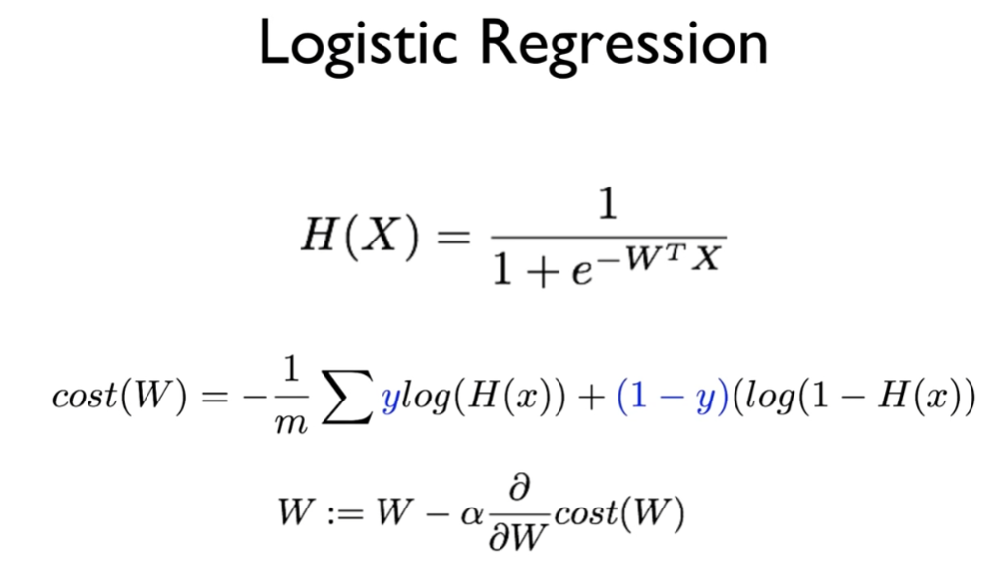
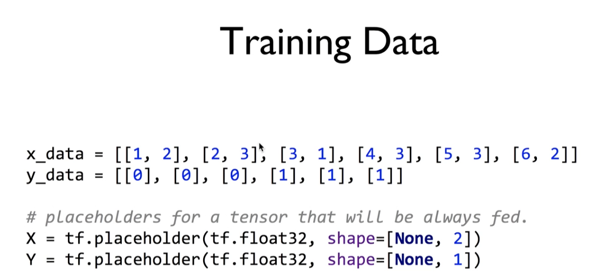
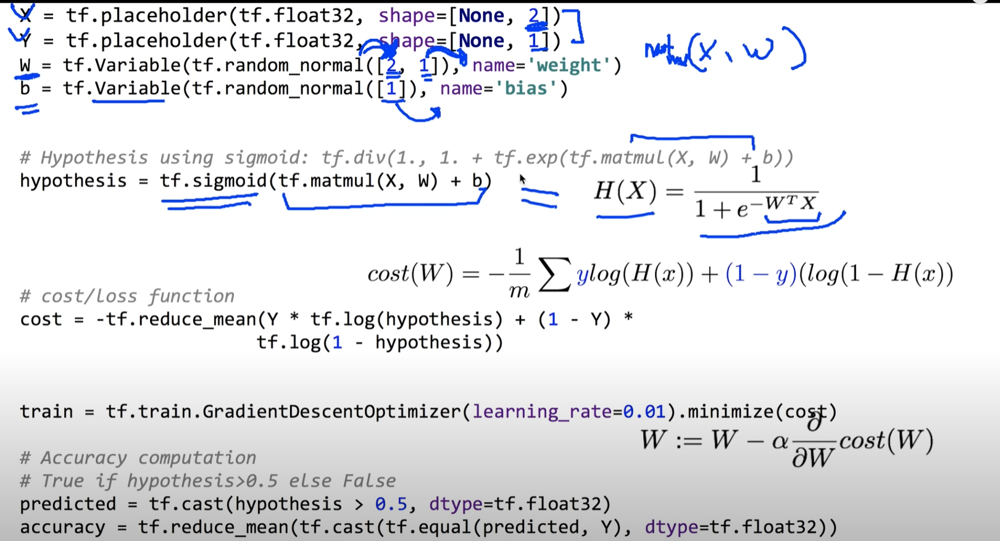

https://www.youtube.com/watch?v=2FeWGgnyLSw&list=PLlMkM4tgfjnLSOjrEJN31gZATbcj_MpUm&index=13


### Lab 5 Logistic (regression) classifier

실생활에서도 많이 사용될 수 있는 Logistic classifier를 tensorflow를 이용해서 구현해보자.

여러분이 갖고 있는 data들을 Logistic regression을 이용하면 상당히 만족할만한 결과를 얻을 수 있다.


### Logistic Regression




실습 전에 이론적인 부분 짧게 짚고 넘어가자.

Hypothesis: 조금 복잡하지만 멋있게 생긴 sigmoid

W, X의 곱으로 예쁜 모양으로 만들었다.


cost를 H(X) 바뀌었기 때문에 다른 모양으로 정의.

예측한 H(x)와 실제 y 값이 가까울수록 작은 값이 되고, 클수록 큰 값이 되어 우리가 얼마나 잘 했는지 나타낼 수 있는 지표이다.

기본적으로 cost를 작게 하는 W를 구하는 것이 학습 과정이 되겠다.

cost 대충 밥그릇 모양이겠죠?

x축 W, y축 cost

W는 보통 모르니까 Random한 시점에 시작.

최적화, cost를 가장 작게 하는 w 찾는다는 건 주어진 점에서 기울기를 구해서 기울기의 반대 방향으로 움직이면 된다.


(W) 이전과 똑같은 알고리즘, 주어진 학습 rate(α), Learning Rate 따라 그 만큼의 step씩 움직여서 w를 조정한다.


### Training Data



x_data는 multi-variable data, array로 주어진 data

y_data는 binary로 주어짐. 0 or  1

공부한 시간에 따른 fail, pass

y값은 0이나 1값을 가진다.

1시간동안 2개를 봤더니 fail, 6시간동안 2개 보니 pass 이런 식으로 활용 가능.




placeholder를 만들 때는 shape에 주의

shape=[None, 2]

x_data는 2개, 전체의 갯수 n개 -> None


1.x 버전

https://github.com/hunkim/DeepLearningZeroToAll/blob/master/lab-05-1-logistic_regression.py

```python
# Lab 5 Logistic Regression Classifier
import tensorflow as tf
tf.set_random_seed(777)  # for reproducibility

x_data = [[1, 2],
          [2, 3],
          [3, 1],
          [4, 3],
          [5, 3],
          [6, 2]]
y_data = [[0],
          [0],
          [0],
          [1],
          [1],
          [1]]

# placeholders for a tensor that will be always fed.
X = tf.placeholder(tf.float32, shape=[None, 2])
Y = tf.placeholder(tf.float32, shape=[None, 1])

W = tf.Variable(tf.random_normal([2, 1]), name='weight')
b = tf.Variable(tf.random_normal([1]), name='bias')

# Hypothesis using sigmoid: tf.div(1., 1. + tf.exp(tf.matmul(X, W)))
hypothesis = tf.sigmoid(tf.matmul(X, W) + b)

# cost/loss function
cost = -tf.reduce_mean(Y * tf.log(hypothesis) + (1 - Y) *
                       tf.log(1 - hypothesis))

train = tf.train.GradientDescentOptimizer(learning_rate=0.01).minimize(cost)

# Accuracy computation
# True if hypothesis>0.5 else False
predicted = tf.cast(hypothesis > 0.5, dtype=tf.float32)
accuracy = tf.reduce_mean(tf.cast(tf.equal(predicted, Y), dtype=tf.float32))
```

W shape 신경써야

matrix XW에서

- W를 얻는 방법 복잡해보이나 상당히 간단

X 2개 들어오쥬? -> W 처음에 2개

Y 1개 -> 1

[2, 1] 들어오는 값, 나가는 값의 개수

- b는 항상 나가는 값의 개수와 같다.

y가 하나 -> [1]


Hypothesis -> sigmoid

```python
hypothesis = tf.sigmoid(tf.matmul(X, W) + b)
```

sigmoid 쓰면 상당히 깔끔하고 읽기 좋다.


Hypothesis로 Cost를 정의한다.

```python
cost = -tf.reduce_mean(Y * tf.log(hypothesis) + (1 - Y) *
                       tf.log(1 - hypothesis))
```

`-` 곱해주고, 평균, Y 곱하기 로그(H(x)) + (1 - Y)로그(H(x))


직접 미분하지 않고 GradientDescentOptimizer 사용.

```python
train = tf.train.GradientDescentOptimizer(learning_rate=0.01).minimize(cost)
```

정해준 cost를 minimize해달라고 부탁하면 train이 알아서 우리의 weight를 조절해준다.


예측한 값을 가지고 성공 / 실패 binary로 예측해야

hypothesis 0.8 이런 식으로 나올 것이다. -> pass, 1

hypothesis 0.1 -> fail, 0 이런 식으로 표현

보통 기준이 되는 값이 0.5

0.5보다 크거나 같으면 pass, 작으면 fail


```python
predicted = tf.cast(hypothesis > 0.5, dtype=tf.float32)
accuracy = tf.reduce_mean(tf.cast(tf.equal(predicted, Y), dtype=tf.float32))
```

True나 False를 tf.float32로 casting하게 되면 True=1, False=0이 된다.

예측한 값 얼마나 정확한지 대략 알아보면..

`tf.equal(predicted, Y)` 우리가 예측한 값과 Y값이 똑같은지 본다. True(1)나 False(0)으로 캐스팅되어 나온다.

0이나 1값을 평균을 내게 되면.. 50%, 70% 이런 식으로 간단하게 accuracy 계산할 수 있다.


2.x 버전

https://github.com/hunkim/DeepLearningZeroToAll/blob/master/tf2/tf2-05-1-logistic_regression.py

```python
import tensorflow as tf

x_data = [[1, 2],
          [2, 3],
          [3, 1],
          [4, 3],
          [5, 3],
          [6, 2]]
y_data = [[0],
          [0],
          [0],
          [1],
          [1],
          [1]]

tf.model = tf.keras.Sequential()
tf.model.add(tf.keras.layers.Dense(units=1, input_dim=2))
# use sigmoid activation for 0~1 problem
tf.model.add(tf.keras.layers.Activation('sigmoid'))

''' 
better result with loss function == 'binary_crossentropy', try 'mse' for yourself
adding accuracy metric to get accuracy report during training
'''
tf.model.compile(loss='binary_crossentropy', optimizer=tf.keras.optimizers.SGD(lr=0.01), metrics=['accuracy'])
tf.model.summary()

history = tf.model.fit(x_data, y_data, epochs=5000)

# Accuracy report
print("Accuracy: ", history.history['accuracy'][-1])
```


### Train the model

```python
# Launch graph
with tf.Session() as sess:
    # Initialize TensorFlow variables
    sess.run(tf.global_variables_initializer())

    for step in range(10001):
        cost_val, _ = sess.run([cost, train], feed_dict={X: x_data, Y: y_data})
        if step % 200 == 0:
            print(step, cost_val)

    # Accuracy report
    h, c, a = sess.run([hypothesis, predicted, accuracy],
                       feed_dict={X: x_data, Y: y_data})
    print("\nHypothesis: ", h, "\nCorrect (Y): ", c, "\nAccuracy: ", a)
```


Session 만듦.

초기화 시키고

loop를 돌면서 학습

train이란 노드를, 그래프를 실행시킨다.

x_data, y_data 던져주고.

cost가 어떻게 될까? 실행시켜서 variable cost_val로 저장.

200번마다 한 번씩 cost_val 출력.


학습된 모델을 갖고 hypothesis(0.8, 0.1 이런 식으로), predicted(예측 값, 1, 0)과 y_data를 비교해서 accuracy가 얼마나 나오는지 계산한다.


전체 소스코드를 보면..설명 부분과 동일

출력 부분: 맨 처음 부분이 step

cost 함수가 1.7에서 시작해서 점점 떨어진다.

Hypothesis

0.03 -> 0

0.15 -> 0

0.30 -> 0

0.78 -> 1

0.93 -> 1

0.98 -> 1

실제 y값과 비교하면 동일

Accuracy: 1.0 (모두 동일하다.)


### Classifying diabetes

ML로 질병 예측 많이 한다.

당뇨병을 예측.


1.x 버전

https://github.com/hunkim/DeepLearningZeroToAll/blob/master/lab-05-2-logistic_regression_diabetes.py

```python
# Lab 5 Logistic Regression Classifier
import tensorflow as tf
import numpy as np
tf.set_random_seed(777)  # for reproducibility

xy = np.loadtxt('data-03-diabetes.csv', delimiter=',', dtype=np.float32)
x_data = xy[:, 0:-1]
y_data = xy[:, [-1]]

print(x_data.shape, y_data.shape)

# placeholders for a tensor that will be always fed.
X = tf.placeholder(tf.float32, shape=[None, 8])
Y = tf.placeholder(tf.float32, shape=[None, 1])

W = tf.Variable(tf.random_normal([8, 1]), name='weight')
b = tf.Variable(tf.random_normal([1]), name='bias')

# Hypothesis using sigmoid: tf.div(1., 1. + tf.exp(-tf.matmul(X, W)))
hypothesis = tf.sigmoid(tf.matmul(X, W) + b)

# cost/loss function
cost = -tf.reduce_mean(Y * tf.log(hypothesis) + (1 - Y) *
                       tf.log(1 - hypothesis))

train = tf.train.GradientDescentOptimizer(learning_rate=0.01).minimize(cost)

# Accuracy computation
# True if hypothesis>0.5 else False
predicted = tf.cast(hypothesis > 0.5, dtype=tf.float32)
accuracy = tf.reduce_mean(tf.cast(tf.equal(predicted, Y), dtype=tf.float32))

# Launch graph
with tf.Session() as sess:
    # Initialize TensorFlow variables
    sess.run(tf.global_variables_initializer())

    for step in range(10001):
        cost_val, _ = sess.run([cost, train], feed_dict={X: x_data, Y: y_data})
        if step % 200 == 0:
            print(step, cost_val)

    # Accuracy report
    h, c, a = sess.run([hypothesis, predicted, accuracy],
                       feed_dict={X: x_data, Y: y_data})
    print("\nHypothesis: ", h, "\nCorrect (Y): ", c, "\nAccuracy: ", a)
```


```python
xy = np.loadtxt('data-03-diabetes.csv', delimiter=',', dtype=np.float32)
x_data = xy[:, 0:-1]
y_data = xy[:, [-1]]
```

파일에 저장된 데이터를 읽어온다.

x, y 데이터를 구분한다.

여러분의 데이터를 넣으면 된다.


뒷 부분은 공통적으로 사용될 수 있다.


주의할 점) 입력 데이터 8개의 x data

shape만 주의하면 된다.

```python
X = tf.placeholder(tf.float32, shape=[None, 8])
Y = tf.placeholder(tf.float32, shape=[None, 1])

W = tf.Variable(tf.random_normal([8, 1]), name='weight')
b = tf.Variable(tf.random_normal([1]), name='bias')
```

`shape=[None, 8]`

이거에 따라 W의 값도 달라지죠?

`tf.random_normal([8, 1])`


나머진 다 그래도 사용하면 된다.


step이 진행될수록 cost가 조금씩 내려간다.

값을 예측..

전체 accuracy를 봤더니 대략 76%

100%는 아니지만, 8개의 data로 76%의 정확도를 달성할 수 있다.


### Exercise

- CSV reading using tf.decode_csv
  - 저번에 배운 tf.decode_csv 사용해보기.
- Try other classification data from Kaggle
  - https://www.kaggle.com
  - 엄청나게 많은 데이터가 있다.
  - 사용해보길..

