https://www.youtube.com/watch?v=MFAnsx1y9ZI&list=PLlMkM4tgfjnLSOjrEJN31gZATbcj_MpUm&index=14

### Lecture 6-1 Softmax classification: Multinomial classification

여러 개의 class가 있을 때, 그것을 예측하는 Multinomial classification, 그 중에서도 제일 많이 사용되는 Softmax classification에 대해 알아보자.

### Logistic regression

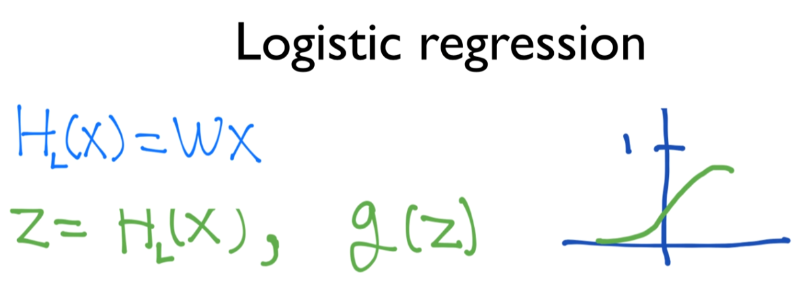

지난 시간까지 Logistic regression, stick regression classification이라고 하는 것을 공부.

기본적으로 출발은 HL(X) = WX 형태의 Linear한 Hypothesis를 갖고 출발.

WX 형태의 단점: return 값이 실수의 값. 100, 200, -10...

우리가 하려고 하는Binomial(Binary?) classification, Logistic classification의 binary(두 개 중의 하나를 고르는 것, 0이냐 1이냐)를 고르는 것에 적합하지 않다.

Z=HL(X), g(z) 함수가 있다면..

g 함수가 큰 값을 압축해서 0과 1 사이의 값으로 나와주면 좋겠다는 생각을 했다.

g(z)를 z축의 값이 커지더라도 1보다 작은 값에 머물고, 아주 작아져도 0보다 큰 값에 머무는 함수가 있으면 좋겠다.

많은 사람들이 연구해서 아름다운 함수를 만들어냈다.

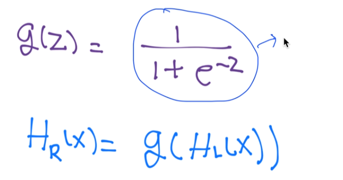

sigmoid라고 부르기도 하고, Logistic이라고 부르기도 했다.

그래서 우리 classification 이름이 Logistic classification이 되었다.

sigmoid함수를 이용해서 1과 0 사이로 압축하고,

우리의 마지막 Hypothesis는 아래와 같이 나타났다.

수식이 많고 복잡해지니, 오늘은 여러 수식을 다뤄야 하니 간단히 그림으로 표현하면 다음과 같다.

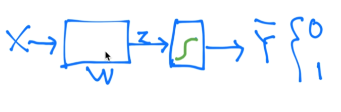

X란 유닛이 있고, WX로 계산.. 나오는 값 z가 된다. 

z값을 sigmoid란 함수에 넣는다. 네모 + 초록색 선 모양 -> sigmoid 함수를 통과시킨다.는 뜻.

통과 뒤에 어떤 값이 나오는데, 0과 1 사이의 값이 될 것이다.

통상적으로 나오는 값을 Y햇이라고 많이 쓴다.

Y: real data. 학습 데이터가 갖고 있는 실제 데이터

Y햇: prediction 우리 시스템을 통해 예측한 값.

차이를 두기 위해 Y햇으로 많이 사용한다.

H(X) = Y햇

### Logistic regression

얘가 하는 일을 잘 생각해보면..

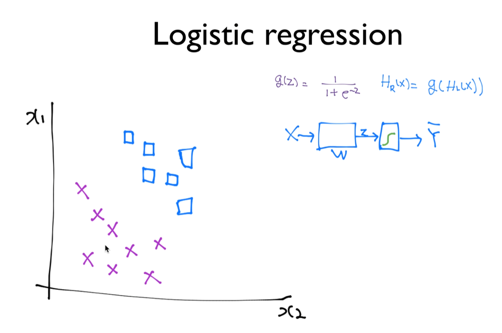

x는 x1, x2 두 개의 값을 갖고 있다.

분류해야 할 데이터 ㅁ, x

W를 학습한다, Logistic classification을 학습한다 -> 두 가지를 구분하는 선을 찾아낸다.

위에선 2차원에서 그렸지만, 여러 차원에서 있기 때문에  Hyperplain이라고도 한다.

우리가 가진 데이터 ㅁ, x를 구분하는 것을 학습

### Multinomial classification

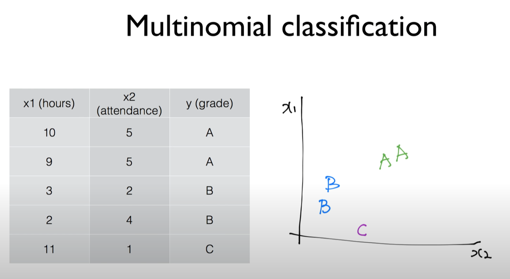

이 아이디어를 그대로 Multinomial classification에 적용할 수 있다.

Multinomial -> 여러 개의 class가 있다는 뜻.

데이터가 위와 같이 주어졌다고 하자.

이 친구에게 학점을 주자.

우리는 좋은 사람이기 때문에 A, B만 주고 C 가끔 준다.

A, B, C를 그래프에 표시하면 위와 같다.

Binary classification만 가지고도 Multinomial classification 구현이 가능하다.

ex) 우리가 하나의 classification을 찾음.

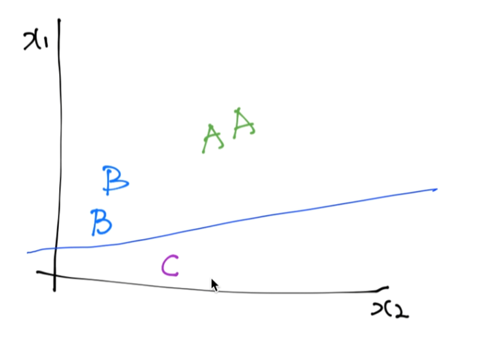

C이거나, C가 아니거나

이것도 Binary classification이 되겠다.

또다른 하나를 찾음 (B or not)

또다른 하나를 찾음 (A or not)

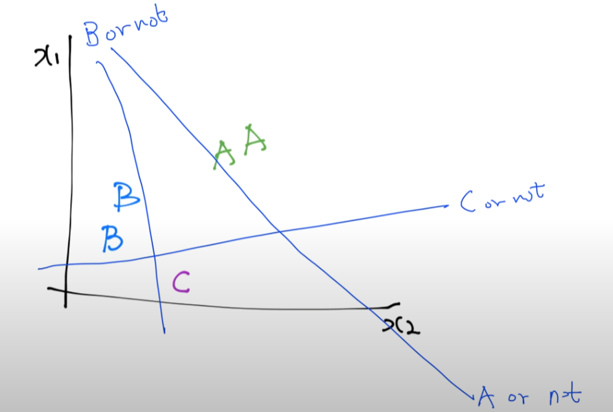

세 개의 각각 다른 binray classification을 갖고도 충분히 구현 가능.

이전 슬라이드에 소개한 형태로 나타내면..

X -> ㅁ -> Y햇

ㅁ는 classifier

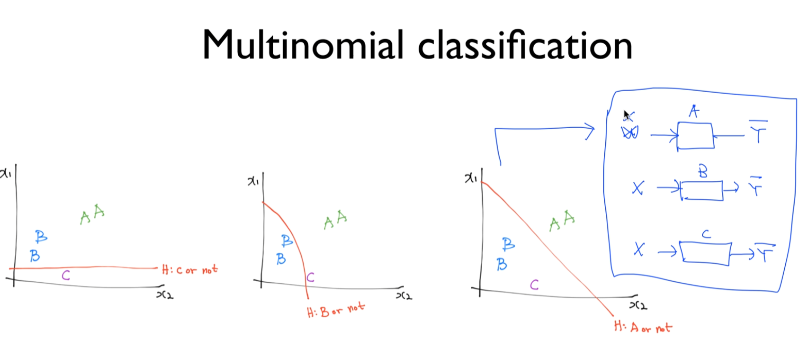

세 개의 독립된 classifier를 가지고 구분이 가능하다.

지난 번 각각 하나의 classifier에 대해서 보자.

classifier 실제 구현시 행렬로 구현.

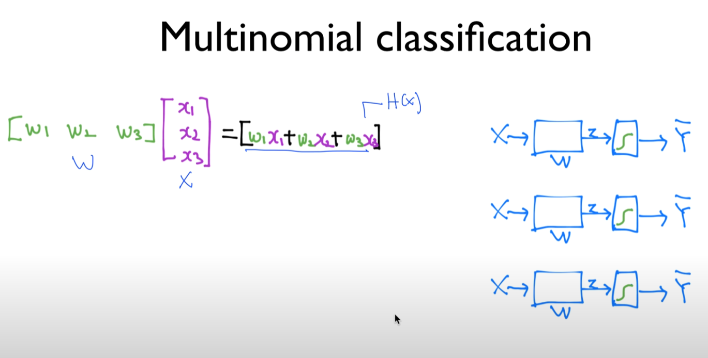

WX = H(X)

세 개가 있기 때문에 세 번 독립된 벡터의 형태를 가지고 계산한다.

독립적으로 계산시 복잡하다. 구현도 복잡.

-> 하나로 합친다. (W를 쭉 늘린다)

이걸 곱하면 어떻게 될까?

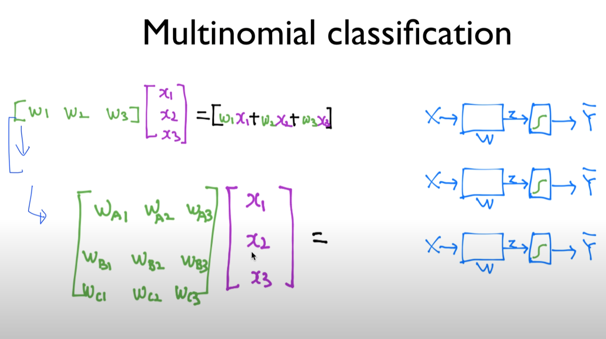

### Matrix multiplication

행렬곱

이해 못해도 되고 이런 식으로 된다고 알면 된다.

계산하면 이런 식으로 나온다.

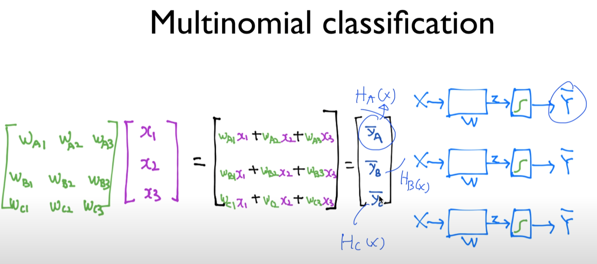

이 값들이 바로 우리가 원했던 가설, Hypothesis (Y햇)

HA(x), HB(x), HC(x)

세 개의 독립된 classification 알고리즘을 구현해도 되지만,

하나의 벡터로 처리하면 한 번에 계산 가능.

세 개의 독립된 classification처럼 동작한다. 굉장히 간단하게 되었다.

### Where is sigmoid?

값이 실수가 나오기 때문에 시그모이드 처리해줘야 함.

각각의 시그모이드 모듈을 적용하면 되겠쥬?

다음 비디오: 이것을 굉장히 효율적으로, 간단하게 하는 방법에 대해 설명하겠다.

