https://www.youtube.com/watch?v=jMU9G5WEtBc&list=PLlMkM4tgfjnLSOjrEJN31gZATbcj_MpUm&index=15

### ML lec 6-2: Softmax classifier 의 cost함수

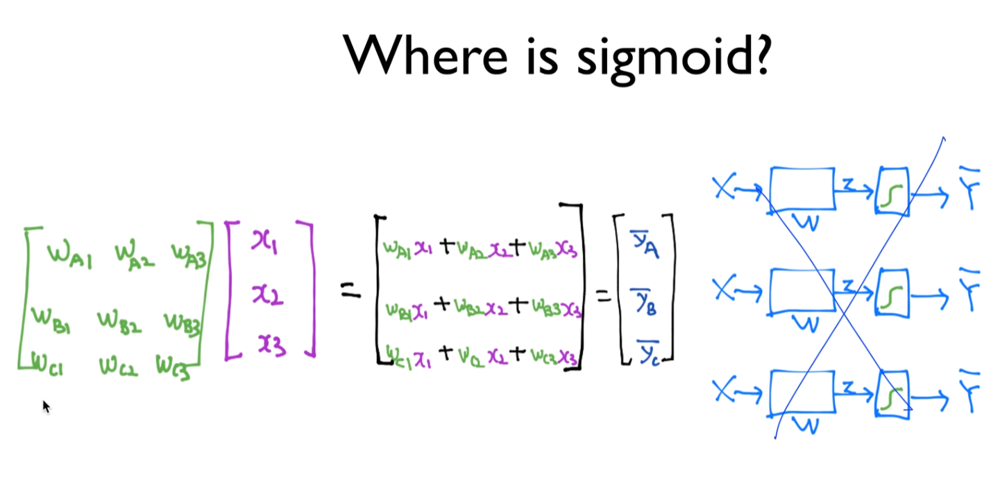

각각의 classifier를 갖는 것 -> 복잡

긴 Matrix, Weight Matrix를 길게 늘임으로써 마치 오른쪽 그림처럼 구현할 수 있다.

X를 주게 되면 이전처럼 0, 1이 나오는 게 아니라 벡터로 나오게 될 것이다.

A에 해당하는 값, B에 해당하는 값, C에 해당하는 값이 나온다.

2.0, 1.0, 0.1

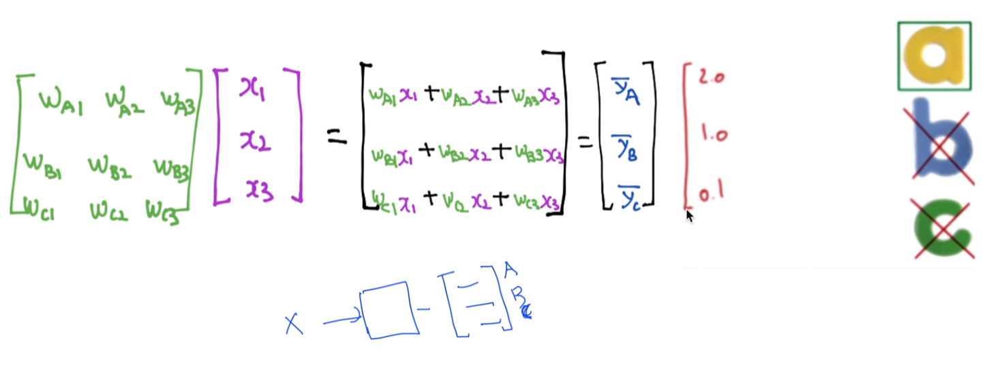

2.0이 젤 크니까 a겠쥬

우리가 원하는 결과가 아니다.

우리가 원하는 것) sigmoid같은걸 써서 2.0, 1.0, 0.1 값들이 0~1사이의 값이 나오면 좋겠다.

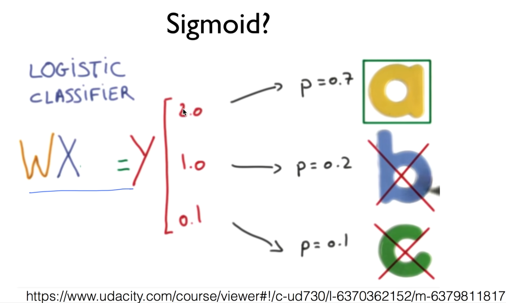

다시 정리

Logistic classifier

WX = y 형태로 줘서 계산

입력값에 대해 세 개의 벡터가 나온다.

A, B, C에 해당하는 값

우리가 원하는 바 p: 0~1사이의 값, 값을 모두 더하면 1이 되는 형태면 어떨까?

이것을 하기 위한 것이 softmax.

이하 udacity에서 나온 내용들.

### SOFTMAX

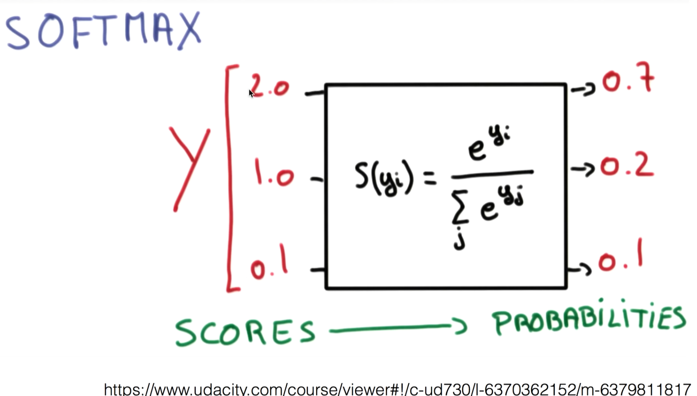

나와있는 3개, 혹은 n개의 값을 softmax에 넣게 되면, 오른쪽 형태의 값으로 만들어준다.

우리가 원하는 특징 다 드가있다.

1. 0~1 사이의 값
2. 전체 sum이 1이 된다. (각각을 확률로 볼 수 있다.)

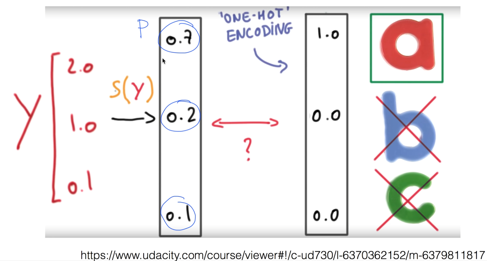

0.7, 0.2, 0.1을 확률로 볼 수 있다!

a가 나올 확률이 0.7이라고 볼 수 있다.

그 중에 하나만 골라서 말해줘 -> ONE-HOT ENCODING 기법 사용해서 

제일 큰 값 1로 하고 나머지 0으로 만듦(구하기 쉽겠죠?)

tensorflow -> argmax란 게 있다.

이걸 참조해서 하나를 고르게 된다.

### Cost function

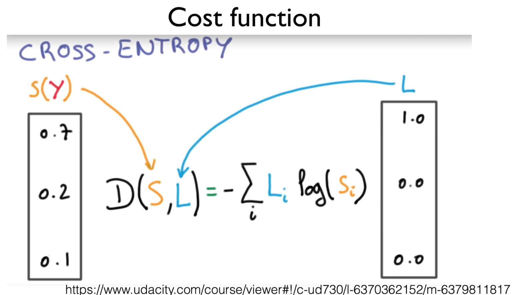

Hypothesis, 예측하는 모델은 완성이 되었다.

그 다음 단계 -> 예측한 값과 실제 값이 얼마나 차이나는지 나타내는 cost function을 설계해야 한다.

cost function을 최소화함으로써 학습을 완성하게 된다.

CROSS-ENTROPY 어떤 식으로 쓰는지 보여드리고, 이 식이 왜 잘 되는지 설명하겠다.

CROSS-ENTROPY 사용. L: label, 정답, 이전 슬라이드 Y, 실제 값

S(y): 예측한 값, Y햇

두 개 사이의 차이가 얼마나 되는지를 요렇게 생긴 CROSS-ENTROPY라는 함수를 통해 구하게 된다.

로그한 값을 element-wise 곱(원소끼리 곱)을 한다.

왜 이 함수가 동작될까? 왜 적합한 cost 함수일까?

### Cross-entropy cost function

고쳐서 써보자.

마이너스를 뒤의 안쪽에 놓고 떼어냄.

각각의 element를 곱하니 matrix의 곱이 아닌 element 곱이 된다.

-로그는 지난 번에 logistic regression에서 본 적 있쥬?

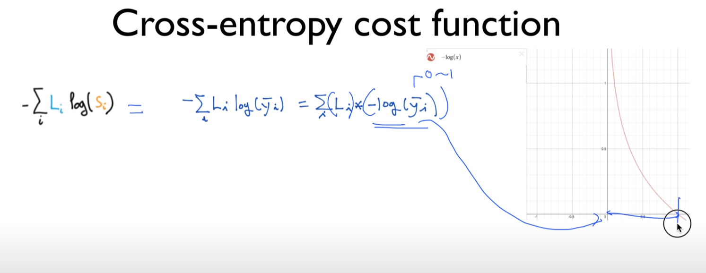

yi햇 -> softmax를 통과한 값이기 때문에 항상 0에서 1 사이의 값을 가진다.

값이 0일 때는 굉장히 커서 무한대에 가깝게 가고,

y값이 1일 때는 0이 된다.

간단하게 하기 위해 두 가지 label이 있다고 하자.

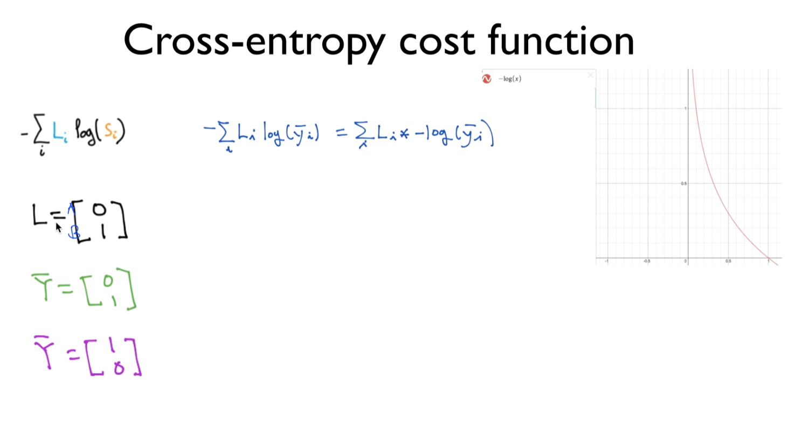

A, B

위가 A, 아래가 B

시스템을 통해 예측하면 벡터를 돌려주겠죠?

첫 번째 값이 A, 두 번째가 B

Y = L, 실제의 Y값, 정답이라고 합시다.

위 그림 -> B가 실제 값.

예측하는 경우의 수 두 가지가 있겠죠?

초록색, 보라색

초록: B를 예측하는 것 -> OK, 맞은 예측, 좋은 것

보라: A를 예측하는 것 -> X, 틀린 것.

cost function: 예측이 맞은 경우엔 작은 값이 되고, 예측이 틀린 경우 엄청 크게 해서 시스템에 벌을 줘서 작게 하라고 함.

실제 되나 봅시다.

식 L * -로그(y햇)

엘리먼트곱 ⊙, element-wize 곱

초록: [0 1] ⊙ -log[0 1] = [0 1]⊙[∞ 0] = [0 0] -> 두 개의 합 -> cost 값은 0이 된다. (좋다, 예측이 맞았을 때 cost가 0이 된다.)

보라: [0 1] ⊙ -log[1 0] = [0 1]⊙[0 ∞] = [0 ∞] -> 두 개의 합 -> cost 값은 ∞가 된다.

예측이 틀렸을 때 큰 값을 주는 것이 우리가 원했던 cost 함수

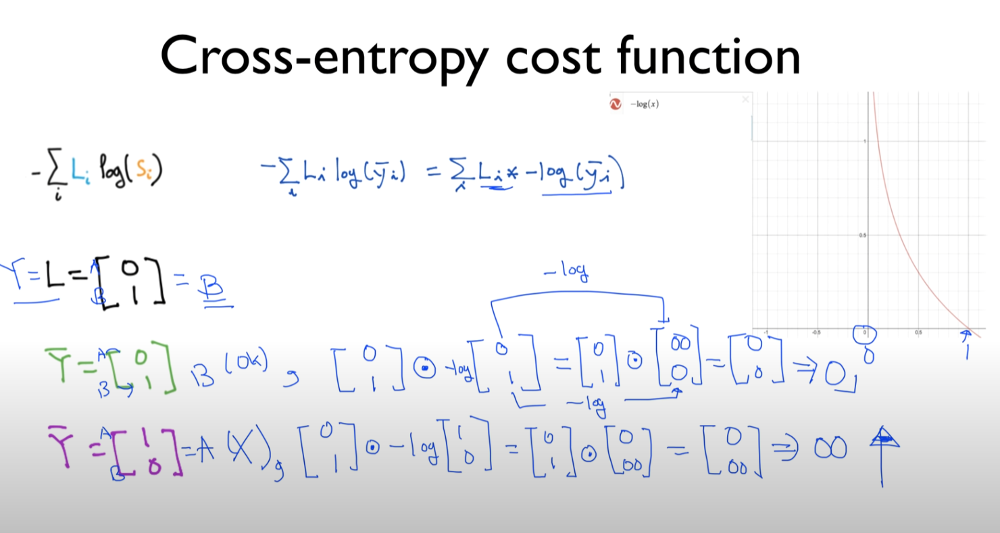

반대의 경우도 마찬가지.

L이 A의 값을 갖고 있다.

예측한 값이 초록: A(맞는 애), 보라(틀린 애)

마찬가지로 예측, 계산 가능.

예상) 맞은 경우 cost 굉장히 작은 값, 틀렸을 경우 굉장히 큰 값

초록: [1 0] ⊙ -log[1 0] = [1 0]⊙[0 ∞] = [0 0] => 0

우리가 원하는 바, A일 때 A를 예측하면 cost가 작은 값이 된다.

보라: [1 0] ⊙ -log[0 1] = [1 0]⊙[∞ 0] = [∞ 0] => ∞

굉장히 큰 값이 된다. 우리가 원하는 형태

cost function을 cross-entropy로 나타내보았다.

### Logistic cost VS cross entropy

많은 형태의 training data가 있을 경우 생각해봐야겠죠?

들어가기 전에 Logistic cost 복잡한 형태로 다루었던거 기억나나요?

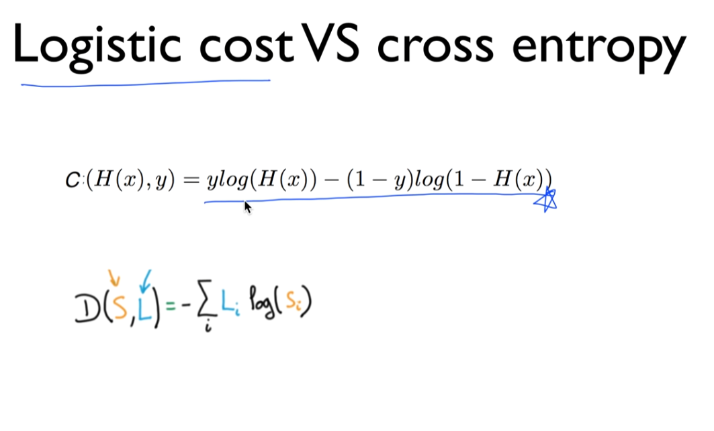

사실상 이것이 cross entropy였다.

오늘은 아래처럼 표현. 지난 번에 위쪽으로 말함.

y값이 오늘 L, (Label)

H(x)가 예측값 S

상당히 다르게 보이지만 같은 것이다.

왜 같은 것인지는 숙제

생각해보시고 유튜브 밑에 답이나 discussion해주시면 좋을 듯.

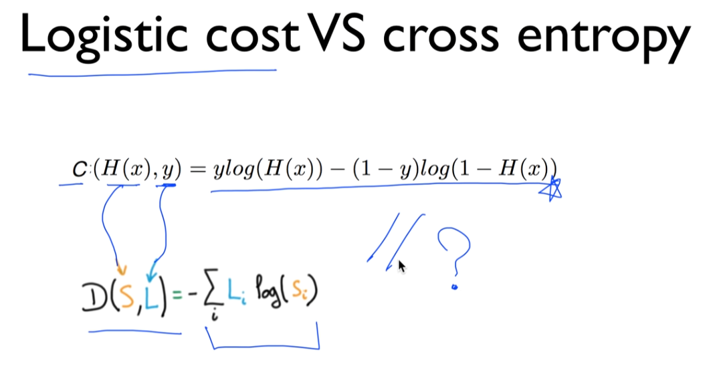

유튜브 댓글 펌

J Seok님

두 함수가 같은 이유는 두개의 예측 및 결과만 있기에  -시그마(Li * log(Si) = -(L1*log(S1))-(L2*log(S2)) 입니다.  실제 값 L1,L2은 1과 0, 그리고 서로 반대의 값을 지닐수밖에 없기 때문에 L2 = 1-L1 일 수밖에 없습니다. (0 또는 1, 1또는 0)  S1, S2은 예측값이기 때문에 1,0 만 나오는 것은 아니지만 둘의 합은 1이 될 수밖에 없습니다. (0.3, 0.7 등 그러나 어쨌든 1-L0 = L1) 따라서 -L1*log(S1)-(1-L1)*log(1-S1) 가 됩니다.  L1 = y, S1 = H(x) 로 바꾸면 -y*log(H(x))-(1-y)*log(1-H(x))가 되는 것입니다.

### Cost function

(지금까지) 하나에 대해서 그랬고,

여러 개의 training set이 있을 경우

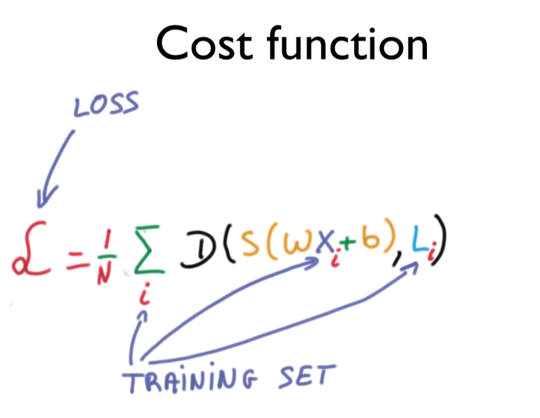

전체의 거리를, distance를, 차이를 구한 다음에 그것을 합해서 개수로 나누어 평균을 내준다.

전체 loss, 또는 전체 cost function을 정의할 수 있다.

### Gradient descent

마지막 단계가 뭐죠?

cost function이 주어짐 -> cost를 최소화하는 값, W벡터를 찾아내는 것.

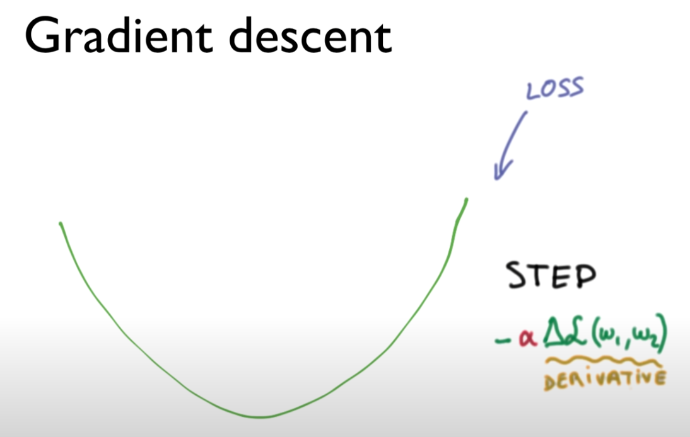

이 알고리즘 - 이전과 마찬가지로 Gradient descent 알고리즘 사용

Loss function 혹은 cost function이 밥그릇 형태의 모양으로 생겼다고 가정. (실제로 이렇게 생김)

어떤 점에서 시작하더라도 상관 없이 경사면을 타고 따라 내려가면 최솟값에 도달할 수 있다.

경사면 - 함수를 미분하는 것.

오늘 - Loss 함수가 복잡해졌으므로 다루지 않는다.

다만 여러분이 직관적으로 미분이 기울기를 나타내는 것이고, 미분 값은 계산기/컴퓨터를 통해서 구할 수 있다.

기울기를 구해서, 기울기를 타고 내려감(내려가는 값 α)

내려가면서 내려간 만큼 업데이트를 시키는 방법으로 최종 값을 찾을 수 있다.

여기까지 했으면 Regression, classification 거의 모든 것을 이해한 것이다.

축하드립니다.

{다음시간) Applications & Tips}

