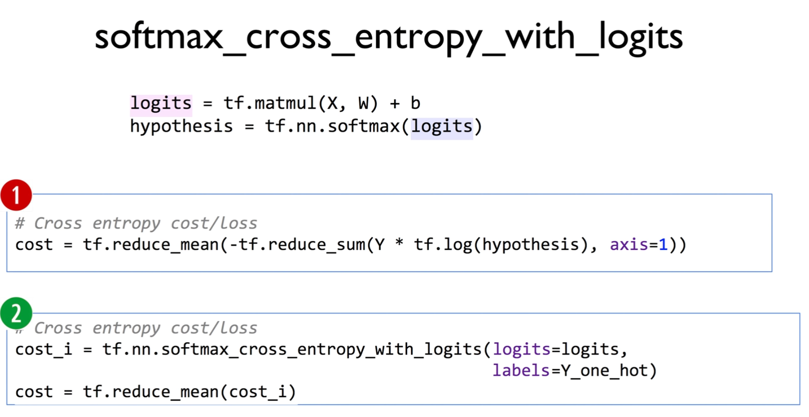
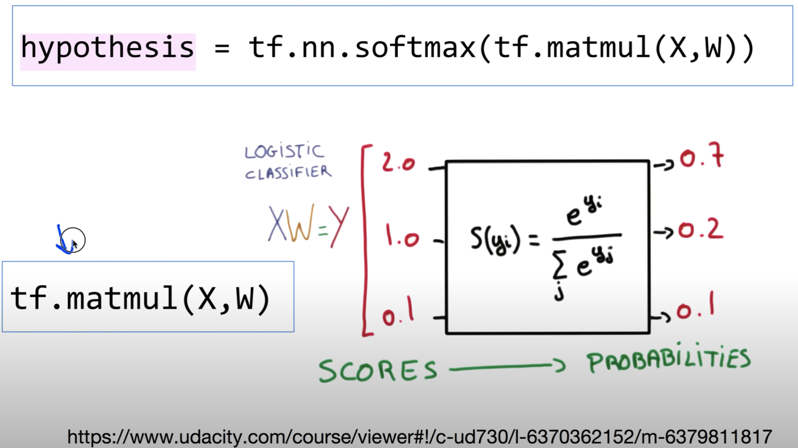
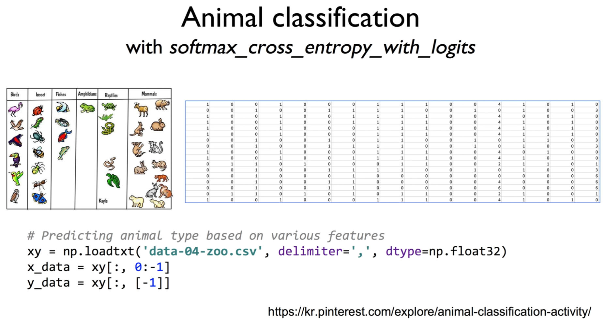
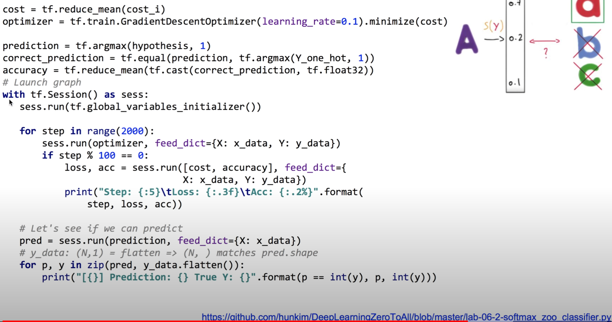

https://www.youtube.com/watch?v=E-io76NlsqA&list=PLlMkM4tgfjnLSOjrEJN31gZATbcj_MpUm&index=17


### Lab 6-2 Fancy Softmax Classifier cross_entropy, one_hot, reshape


지난 번에 이어 Softmax Classifier

이번에는 Fancy하게, 예쁘게 만들어보자.

기본적으로 제공되는 함수 cross_entropy와 one_hot을 사용.

앞으로 많이 사용하게 될 reshape에 대해서 들여다 보자.


### softmax_cross_entropy_with_logits




softmax_cross_entropy_with_logits 함수 소개하기 전에 

잠깐 hypothesis 어떻게 계산했는지 보고 들어가자.


```python
logits = tf.matmul(X, W) + b
hypothesis = tf.nn.softmax(logits)
```

주어진 X에 대해 우리가 학습한 Weight를 Matrix로 곱하고, 그 다음에 bias를 더하는 기본적인 form에서 시작된다.

logits이라고 부르기도 한다.

logits을 softmax로 통과시키면 우리가 최종적으로 원하는 hypothesis,

즉 확률, 어떤 레이블이 될 확률로 계산되어 돌아온다.

중간에 넘어오는 값은 score(지난시간)

이렇게 한 다음에 우리가 loss를 계산했다.





logits = tf.matmul(X, W)

어떤 값(scores)들을 가지고 softmax를 통과시키면, 이것이 확률(Probabilities)로 계산되어 나온다.

이 logits을 넣어서 통과를 시킴..

2.0, 1.0, 0.1 우리가 이걸 logits라고 부른다.

softmax로 확률을 구한다.


[다시 첫 캡처본으로]

이것을 가지고 우리가 cross entropy, 즉 Loss를 계산했다.

```python
# Cross entropy cost/loss
cost = tf.reduce_mean(-tf.reduce_sum(Y * tf.log(hypothesis), axis=1))
```

주어진 Y: one hot으로 주어졌다.

그것에 우리가 계산한 hypothesis의 log값 곱하기만 하면 되죠? `Y * tf.log(hypothesis)`

거기서 나온 matrix를 합한다.

이렇게 나온 값들을 전체 평균을 내게 되면, cost가 된다.


잘 계산된 식이지만 중간에 -도 나오고 복잡하다.

이걸 좀 간소화하기 위해 tensorflow에서 제공하는 함수 -> softmax_cross_entropy_with_logits

(위에 cost가 softmax_cross_entropy이다.)

with_logits란 이름에 주목할 필요가 있다.

logits이라는거 아까 이야기했쥬?


이 아래 함수를 사용하는 방법

```python
# Cross entropy cost/Loss
cost_i = tf.nn.softmax_cross_entropy_with_logits(logits=logits, labels=Y_one_hot)

cost = tf.reduce_mean(cost_i)
```


마찬가지로 Y란 것이 필요하겠죠?

Y랑 비교를 하는 것이기 때문.

hypothesis 부분에 logits를 달라는 거다.

tf.nn.softmax_cross_entropy_with_logits 다소 긴 이름의 함수

두 개의 입력값을 받아들임.

​	하나는 labels, 즉 Y죠? Y label

​	Y_one_hot이라고 이름을 붙여줬다.

​	다른 입력은 logits. hypothesis가 아니라.

​	softmax 들어가기 전에, 들어간 후가 아니라 들어가기 전 값을 넣어달라.

​	`logits = tf.matmul(X, W) + b`

왜 이렇게 했을까?

함수를 만든 분의 설계.

logits을 넣어준다는 것을 반드시 기억하면 좋겠다.

`cost = tf.reduce_mean(cost_i)`

최종적으로 하고싶었던 것 - cost가 만들어졌다.


1번과 2번에서 보여주는 cost는 동일한 것이다.


softmax_cross_entropy_with_logits 함수 사용하면 굉장히 깔끔하게 만들 수 있다.

**with_logits** 항상 logits을 넘겨주신다.


### Animal classification

#### with softmax_cross_entropy_with_logits 

이걸 가지고 우리가 정말 멋진 어플리케이션 생각할 수 있다.



```python
# Predicting animal type based on various features
xy = np.loadtxt('data-04-zoo.csv', delimiter=',', dtype=np.float32)
x_data = xy[:, 0:-1]
y_data = xy[:, [-1]]
```

데이터 찾다보니 이런 게 있었다.

동물 특징에 따라 어떤 종인지 예측 가능.

다리 몇 개, 뿔 유무, 꼬리 있는지 등의 특징

거기에 따른 분류. 숫자 0~6까지, 7개의 종으로 분류 가능.

이걸로 학습한 이후에 새로운 동물이 왔다. -> 다리 몇 개, 꼬리 유무에 따라 어떤 종인지 예측해보는 프로그램. 만들어보자.

지난 번에 한 것처럼 np.loadtxt를 통해 data-04-zoo.csv에 있는 파일을 읽어온다.

맨 마지막 열 제외하고 x_data

맨 마지막 열 y_data


y의 모양에 대해 조금 관심을 가져보자.


### tf.one_hot and reshape

y 몇 개? 하나. 1 데이터 개수: n개 -> none

[None, 1]

```python
Y = tf.placeholder(tf.int32, [None, 1])  # 0 ~ 6

Y_one_hot = tf.one_hot(Y, nb_classes)  # one hot
Y_one_hot = tf.reshape(Y_one_hot, [-1, nb_classes])
```

가지는 값 0 ~ 6

우리가 필요한 값, 함수로 넘겨줄 때 필요한 값이 one hot

여기는 one hot이 아니라 0~6 사이의 숫자이다.

이것을 one hot으로 바꿔줘야 한다.

그 부분의 작업을 해야..

Y의 shape [None, 1]

None -> n개 들어올 수 있다. 1 -> 한 자리.

이것을 one hot으로 바꾸기 위해 사용하는 함수 -> tf.one_hot

tensorflow의 one_hot이라는 함수.

`Y_one_hot = tf.one_hot(Y, nb_classes)`

one_hot의 Y값에는 0~6을 준다. 1이 아니라 0에서(부터) 움직이는 숫자.

몇 개의 class가 있는 지 알려줘야 한다. (nb_classes)

그래야 one_hot을 만들 수 있다.

일곱 개의 class가 있다고 준다.

일곱 개의 class가 있는데, 0~6의 숫자를 줄테니까 필요한 크기에 맞는 one_hot을 만들어 줘.


상당히 주목하셔야 할 부분) 위에 코드만 실행하면 에러가 난다.

이유: one_hot이라는 것은 만약에 rank가 N이면, output이 N+1이 된다.

좀 복잡해보이지만.. 무슨 말이냐 하면

내가 1차원을 주면 2차원을 줌.. 차원을 크게 만들어준다.


데이터 [[0], [3]] 이렇게 되어있다.

shape은 [?, 1]이 된다. (예시는 [2, 1])

one_hot을 하면 한 차원을 더 더해버린다.

[[[1000000]], [[0001000]]] 이런 식으로..

2차원 랭크를 3차원으로 만들어준다.

r=2 -> r=3

결과 shape

(?, 1) => (?, 1, 7)

이것은 우리가 원하는게 아니다.

우리가 원하는 것 -> one_hot, (?, 7) 이런 꼴을 원한다.


one_hot이란 함수를 돌리면 rank를 추가한다.

그래서 아.. 좀 복잡해짐

우리가 간단하게 해결할 수 있는 방법 -> reshape이란걸 사용

`Y_one_hot = tf.reshape(Y_one_hot, [-1, nb_classes])`

입력을 Y_one_hot 넣고, 우리가 원하는 shape은 (?, 7)

? = -1 = everything. 나머지

[-1, nb_classes] 이런 모양으로 reshape해주세요

뒤에는 7, 앞에는 알아서..

이렇게 reshape를 시키면 이 데이터가 reshape된다.

[[[1000000]], [[0001000]]] -> [[1000000], [0001000]]

이렇게 우리가 이전 비디오에서 manual하게 줬던 one_hot 모양 그대로 나온다.

reshape을 한 결과가 우리가 원하는 형태로 주어졌다.

shape (?, 7)

n개, 7

최종적으로 원하는 모양의 데이터를 얻게 되었다.


실행하는 방법 간단하다.

1.x

```python
# Predicting animal type based on various features
xy = np.loadtxt('data-04-zoo.csv', delimiter=',', dtype=np.float32)
x_data = xy[:, 0:-1]
y_data = xy[:, [-1]]

nb_classes = 7  # 0 ~ 6

X = tf.placeholder(tf.float32, [None, 16])
Y = tf.placeholder(tf.int32, [None, 1])  # 0 ~ 6

Y_one_hot = tf.one_hot(Y, nb_classes)  # one hot
Y_one_hot = tf.reshape(Y_one_hot, [-1, nb_classes])

'''
one_hot: Tensor("one_hot:0", shape=(?, 1, 7), dtype=float32)
reshape one_hot: Tensor("Reshape:0", shape=(?, 7), dtype=float32)
'''

W = tf.Variable(tf.random_normal([16, nb_classes]), name='weight')
b = tf.Variable(tf.random_normal([nb_classes]), name='bias')

# tf.nn.softmax computes softmax activations
# softmax = exp(logits) / reduce_sum(exp(logits), dim)
logits = tf.matmul(X, W) + b
hypothesis = tf.nn.softmax(logits)

# Cross entropy cost/loss
cost_i = tf.nn.softmax_cross_entropy_with_logits_v2(logits=logits,
         											labels=Y_one_hot)
cost = tf.reduce_mean(cost_i)
optimizer = tf.train.GradientDescentOptimizer(learning_rate=0.1).minimize(cost)
```

데이터 읽어오고 x_data, y_data

class 7개

X, Y placeholder 줌

X 16인 이유 - 테이블에서 봤듯이 X의 특징을 나타내는 X1, X2가 굉장히 많았다.

Y는 0~6 숫자를 가진 하나밖에 없다.


Y one_hot이 아닌 data이기 때문에 손봐줄 필요가 있다.

tf.one_hot을 통해 one_hot으로 바꿔준다.

rank가 더해졌기 때문에 reshape으로 rank를 원하는대로 바꾸어준다.


0~6까지 있는 것을 one_hot으로 만들어주었다.

이제 W, b 결정해야 한다.

W: 마찬가지로 X 입력 16개이므로 16개 맞춰서 줌. 출력 Y가 7개 one_hot으로 출력 -> 7

b는 output, 출력의갯수와 똑같다 -> 7


이렇게 W와 b의 shape를 구성해준다.


이전 그대로 logits.. `tf.matmul(X, W) + b`

logits를 tf.nn.softmax(logits)에 넣게 되면, softmax 통과시키면 우리가 원하는 hypothesis가 나온다.


 cost 계산 이렇게 한다고 했죠?

`# Cross entropy cost/loss
cost_i = tf.nn.softmax_cross_entropy_with_logits_v2(logits=logits,labels=Y_one_hot)`

Y_one_hot을 넣어주고, logits를 넣어준다.

이렇게 cost_i를 계산하고 이것을 평균낸 것이 cost

`cost = tf.reduce_mean(cost_i)`


optimizer에게 cost를 최소화하라고 얘기해주면 끝난다.

`optimizer = tf.train.GradientDescentOptimizer(learning_rate=0.1).minimize(cost)`


다소 복잡하지만 기본적으로 0~6까지 되는 하나의 값을 받아서 one_hot 처리하고 

one_hot으로 나온 결과가 우리가 원하는 shape와 조금 다르기 때문에 reshape를 한 번 해준다.




그 다음에 이제 학습을 한다.

```python
cost = tf.reduce_mean(cost_i)
optimizer = tf.train.GradientDescentOptimizer(learning_rate=0.1).minimize(cost)

prediction = tf.argmax(hypothesis, 1)
correct_prediction = tf.equal(prediction, tf.argmax(Y_one_hot, 1))
accuracy = tf.reduce_mean(tf.cast(correct_prediction, tf.float32))

# Launch graph
with tf.Session() as sess:
    sess.run(tf.global_variables_initializer())

    for step in range(2001):
        _, cost_val, acc_val = sess.run([optimizer, cost, accuracy], feed_dict={X: x_data, Y: y_data})
                                        
        if step % 100 == 0:
            print("Step: {:5}\tCost: {:.3f}\tAcc: {:.2%}".format(step, cost_val, acc_val))

    # Let's see if we can predict
    pred = sess.run(prediction, feed_dict={X: x_data})
    # y_data: (N,1) = flatten => (N, ) matches pred.shape
    for p, y in zip(pred, y_data.flatten()):
        print("[{}] Prediction: {} True Y: {}".format(p == int(y), p, int(y)))
```

학습 하는 과정 굉장히 유사한 과정

기본적으로 optimizer 실행할 때 x_data, y_data 던져주고 실행시킨다.

한 가지 더 볼 것 -> 예측한 값이 맞는지 틀린지 본다.

`prediction = tf.argmax(hypothesis, 1)`

예측한 값. hypothesis, 확률이 나오면 거기에 argmax를 취해서 hypothesis level로 바꾸게 된다.

probability를 0~6사이의 값으로, 값 중 하나로 만들어낸다.


`correct_prediction = tf.equal(prediction, tf.argmax(Y_one_hot, 1))`

역시 마찬가지로 prediction과 Y_one_hot(label)중의 하나를 택한 값을 비교한다.

tf.argmax(Y_one_hot, 1)는 어떻게 보면 Y 그 자체가 된다.

one_hot을 만들기 전의 값과 동일하기 때문.

둘이 같다면 맞는 거다. 

`accuracy = tf.reduce_mean(tf.cast(correct_prediction, tf.float32))`

맞게 예측한 것들을 모아서 평균을 내면 정확도가 된다.

이런 형태로 우리가 정확도가 얼마나 되는지를 과정과정에서 출력할 수 있다.

cost와 함께 accuracy도 출력을 해볼 수 있다.


학습이 다 끝났으면 정말 잘 predict하는지 살펴본다.

`pred = sess.run(prediction, feed_dict={X: x_data})`

x_data 던져보고 결과 값을 잘 predict했는지 출력해본다.

`for p, y in zip(pred, y_data.flatten()):
        print("[{}] Prediction: {} True Y: {}".format(p == int(y), p, int(y)))`

pred: 잘 predict됐는지

갖고 있는 y_data를 flatten()을 통해..

flatten()

[[1], [0]] -> [1, 0]

이렇게 만들어주는 것이 flatten

우리 이런 tensor를 변화시키는 것들을 많이 사용했다. 이 예제에서

zip으로 묶어서. pred, y_data.flatten() 각각 리스트니까

리스트 각각의 하나의 element들을 p, y로 편하게 넘기기 위해서 zip으로 묶는다.

우리가 예측한 값이 맞는지 확인. True, False

`print("[{}] Prediction: {} True Y: {}".format(p == int(y), p, int(y)))`

좀 복잡했지만 우리가 복잡한 표현 많이 살펴보았다.


결과를 보면.

Step이 막 돌면서 Loss가 줄어든다. Acc가 굉장히 높아진다.

주어진 데이터 가지고 어떤 종인지 맞출 확률 100% 된다.

예측이 맞았는지 [True or False], Prediction과 실제 값을 출력해준다.

굉장히 잘 예측한다는 것을 볼 수 있다.