https://www.youtube.com/watch?v=1jPjVoDV_uo&list=PLlMkM4tgfjnLSOjrEJN31gZATbcj_MpUm&index=18


### Lecture 7-1 Application & Tips: Learning rate, data preprecessing, overfitting

ML 알고리즘을 실제로 사용하는 데에서 몇 가지 Tip들을 알려주겠다.


Learning rate 조절하는 방법, 가지고 있는 데이터 선처리하는 방법, ML 가장 큰 문제중 하나인 Overfitting을 방지하는 방법에 대해 얘기하겠다.


### Gradient descent

cost function을 정의하고 최소화하는 값을 찾기 위해 사용했던 Gradient descent 알고리즘(경사를 타고 내려가는 알고리즘)

이 알고리즘을 정할 때 앞을 보면 Learning rate라는 α값을 임의로 정하였다.

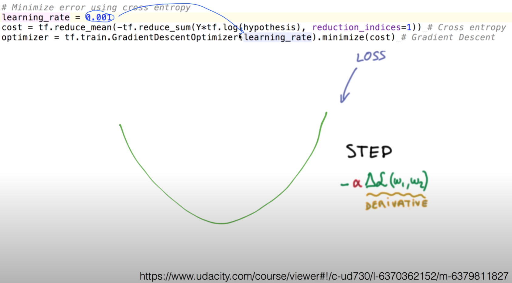

learning rate 임의의 값으로 실제로 프로그래밍 후 실습하였다.


### Large learning rate: overshooting

Learning rate을 잘 정하는 것이 중요하다.

만약 이 값을 굉장히 큰 값을 정한다고 생각해보자.

큰 값을 정한다: 어떤 점에서 시작하게 되면 이 경사면을 따라서 내려가는 한 발자국의 step

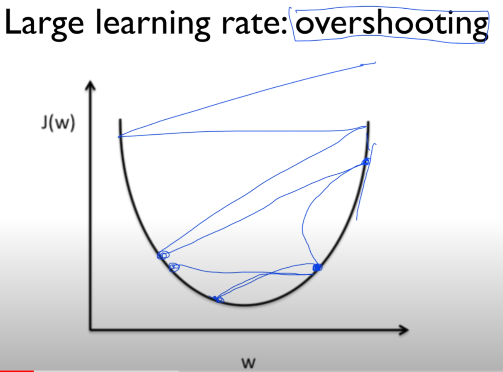

이 step이 상당히 크다고 하면, 어떤 일이 발생할까요?


처음에 이동할 때 훅 내려감

이후에도 훅훅 내려감.

왔다갔다하겠죠?


step 너무 크다면.. 멀리 멀리 가버린다.

바깥으로 튕겨나갈수도 있다.

학습 이루어지지 않을 뿐만 아니라, cost 함수를 출력해보면 숫자가 아닌 값들이 찍혀 나오기 시작할 것이다.

이것을 overshooting이라고 부른다.

값이, running rate을 정했는데 이상하게 cost가 줄어들지 않고 굉장히 큰 값으로 가다가 바깥으로 튕겨나가더라, 발산하더라 -> running rate 의심해봐야.


### Small learning rate: takes too long, stops at local minimum

굉장히 작은 learning rate을 사용하면 어떨까요?

조금조금씩 내려간다..

산을 내려가는데 조그만 step으로 내려감 -> 해가 져도 하산 못하는 경우 생긴다.

어느 순간 시간이 지나서 stop하면, 최저점이 아님에도 stop되는 경향이 있다.

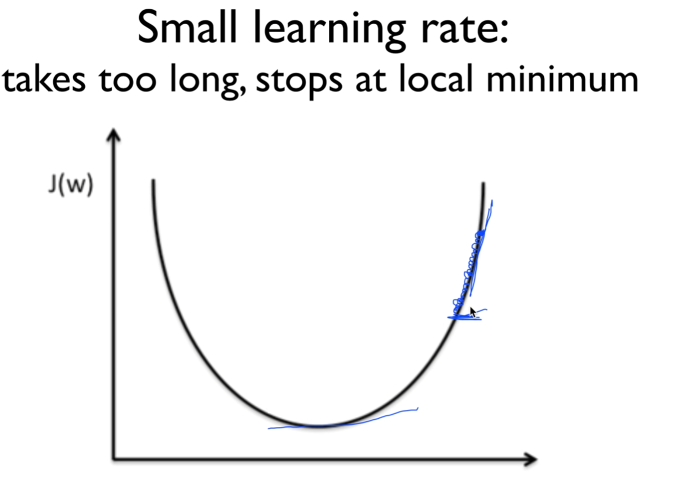

이것을 피하기 위해 cost함수를 한 번 출력해봐야 한다.

굉장히 작은 값으로 변화한다 -> learning rate를 조금 올려서 해보는 것이 좋다.


### Try several learning rates

- Observe the cost function
- Check it goes down in a reasonable rate


전반적으로 Learning rate을 정하는 데에는 특별한 답은 없다.

데이터, 가지고 있는 환경에 따라 조금씩 다르기 때문.

우선 0.01정도로 많이 시작.

발산 -> 좀 더 작게

너무 좁게 움직이면 좀 더 크게.. cost function의 값을 관찰하는 것이 좋은 방법이 된다.


### Data (X) preprocessing for gradient descent

두 번째

우리가 가지고 있는 feature data X를 선처리해야 될 이유가 가끔 있다.

우리가 가장 많이 사용하는 알고리즘 - gradient descent algorithm

x축 weight, y축 cost 함수

weight이 여러 개(2개) 있다고 생각하고 2차원 상에 표시해보겠다.

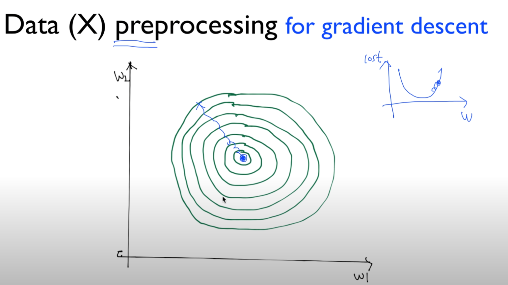

중앙이 바닥, 주변이 위쪽이라고 생각하면 된다.

우리가 원하는 것 - 어떤 점에서 시작하면 우리가 한 스텝씩 경사면을 따라 내려가서 최고로 낮은 지점에 도착하는 것이 목표.


예를 들어 우리가 가지고 있는 data 값 중(x1, x2의 값) 어떤 값간의 차이가 굉장히 크게 나게 된다면, 이전과 같은 등고선을 그려보면 어떤 모양이 나타날까요?

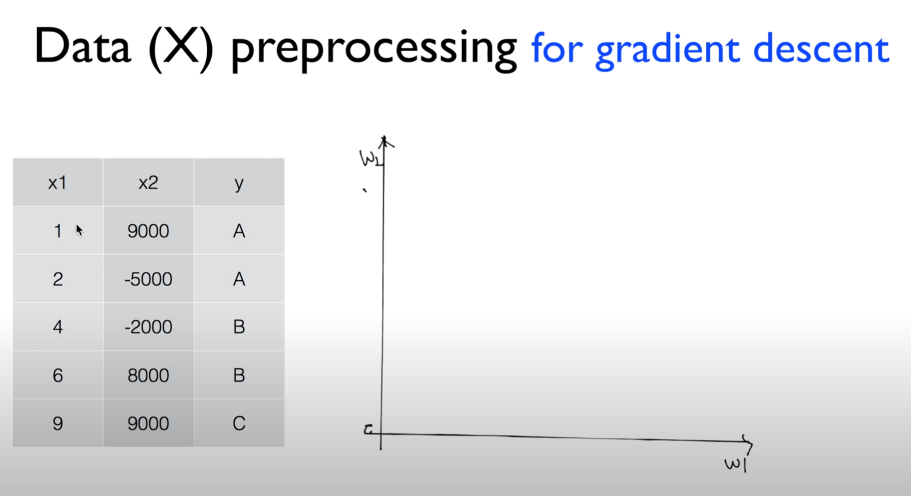

x가 w1, x2가 w2와 곱해져서 합해진 값을 최소화시키려고 노력함.

그만큼 아마 x1의 값은 조금 더 큰 값이 되고, x2의 값은 좀 더 작은 값이 될 것이다.

-> 등고선이 동그란 모양이 아니라, 굉장히 길쭉한 형태의 모양으로 나타날 것이다.

2차원 뿐만 아니라 다차원에서도 마찬가지. 한 쪽으로 굉장히 왜곡된 형태의 등고선이 나타날 것.

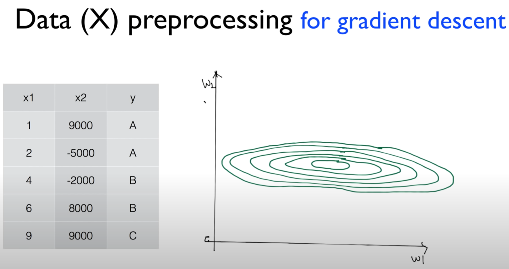

우리가 어떤 α값을 잡았을 때, 위아래가 너무 좁기 때문에 α값이 굉장히 좋은 값임에도 불구하고, 조금이라도 밖으로 나가게 되면 튀어나가게 된다. 이것을 굉장히 주의하셔야 합니다.

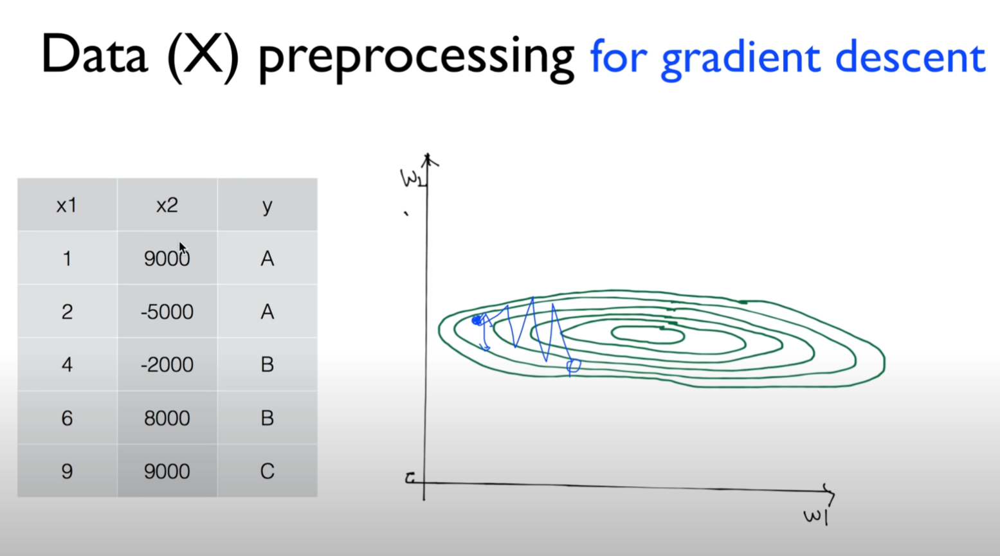

이렇게 데이터 값에 굉장히 큰 차이가 있을 경우에, 이것을 우리가 보통 Normalize라고 하는데, Normalize할 필요가 있다.

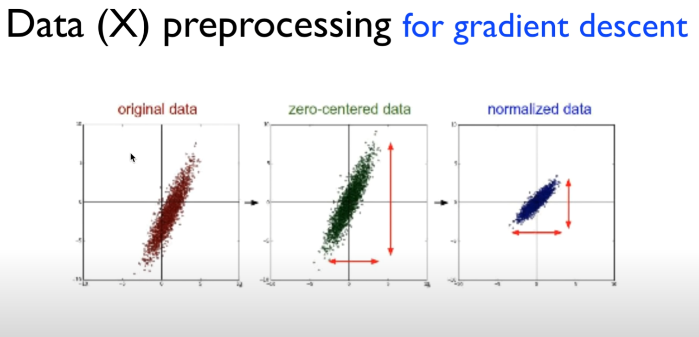

여러 가지 방법이 있다.

빨간색 original data

(초록색) 보통 많이 쓰는 방법이 zero-centered data

데이터의 중심이 0으로 갈 수 있도록 바꿔주는 방법

(파란색) 가장 많이 사용하는 방법: 어떤 값 전체의 범위가 어떤 형태 범위 안에 항상 들어가도록 Normalize하는 것.

내가 Learning rate도 굉장히 잘 잡은 것 같은데, 이상하게 학습이 일어나지 않고 cost함수가 발산한다거나 이상한 동작을 보일 때는, 데이터중에 차이가 크게 나는 것이 있는지, preprocessing을 했는지 점검해보는것이 좋겠다.


### Standardization

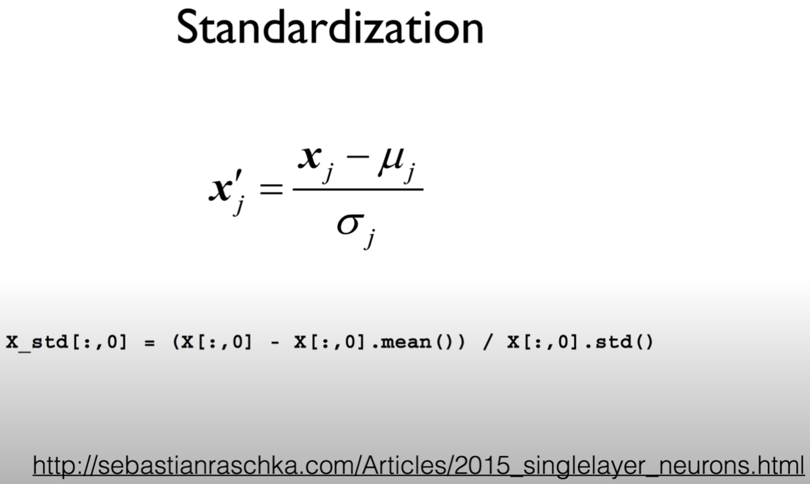

하는 방법 매우 간단하다.

x 값들이 있으면, x 값을 여러분들이 계산한 평균 μ와 분산 σ의 값을 가지고 나누어주면 된다.

Python을 가지고 한 줄로 Normalization할 수 있다.

```python
x_std[:, 0] = (x[:, 0] - x[:, 0].mean()) / x[:, 0].std()
```


이런 형태의 Normalization을 특별히 Standardization이라고 한다.

여러 가지 다른 형태의 Normalization이 있지만, 그 중에 여러분들이 한 가지정도를 선택하셔서 x data를 처리해보시는 것도 실제로 ML의 좋은 성능을 발휘할 방법일 수 있다.


### Overfitting

ML의 가장 큰 문제인 Overfitting

- Our model is very good with training data set (with memorization)
- Not good at test dataset or in real use


한 마디로, 우리가 ML이 학습을 통해서 모델을 만든다.

그러다보니, 학습 data에 너무 딱 잘 맞는 모델을 만들어낼 수 있다.

학습 데이터를 다시 가지고 물어보면 잘 답을 한다.

test data나, 실제로 사용해보면 잘 안맞는 경우가 생긴다.

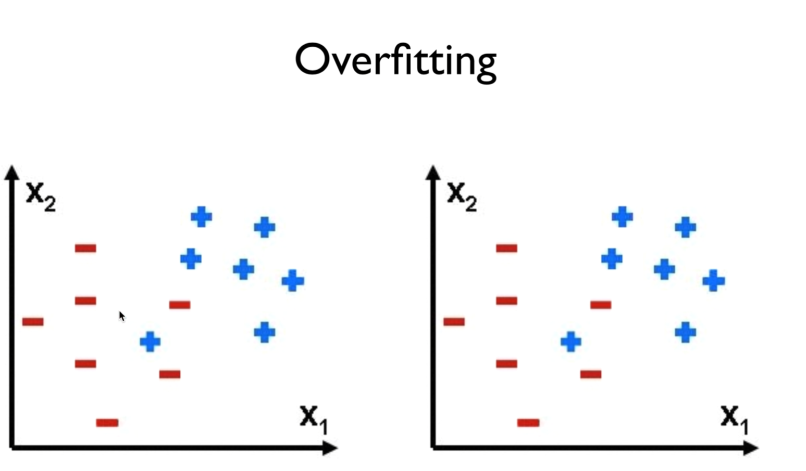

ex) 우리가 가진 실제 데이터가 왼쪽처럼 +, -를 나누는, 구분하는, 예측하는 형태의 문제가 주어졌다.

이런 경우 일반적으로 대략 오른쪽이 +, 왼쪽이 -

\ 모양으로 대략 선을 나누어 구분을 지으면 좋은 모델이라고 말할 수 있다.

우리에게 모델이, training set을 잘 맞추기 위해 문제를 꼬아서 만들 수가 있다. Ω 모양으로..

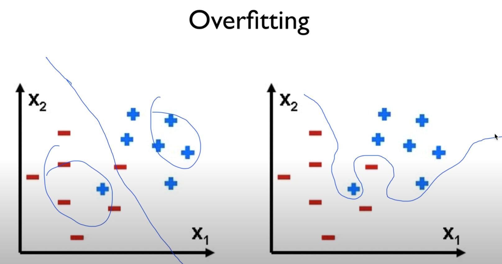

이런 식으로 두 개를 구분하는 경계선을 만드는 우리의 모델이 있다면..

오른쪽 - model2라고 하자. 왼쪽 - model

어떤 것이 좀 더 일반적이고 좋은 모델일까요?

당연히 model이 좀 더 일반적인 모델.

다른 data들이 들어와도 잘 맞는 모델이 될 수 있다.

model2 너무 갖고 있는 데이터에만 맞춰진 모델

여기엔 좋겠지만 실제로 사용할 때는 정확도가 굉장히 떨어질 수 있다.

이렇게 되어있는 모델을 overfitting이라고 한다.

이 overfitting은 어떻게 줄일 수 있을까?


### Solutions for overfitting

- More training data!
- Reduce the number of features
- Regularization

overfitting줄이는 가장 좋은 방법 - training set data를 많이 갖고 있는 것.

많으면 많을수록 overfitting을 줄일 수 있다.

여러분들이 가지고 있는 features 갯수를 중복된 것이 있으면 줄인다.

위의 두 가지 방법 외에도 기술적인 방법이 존재한다 - Regularization(일반화)


### Regularization

- Let's not have too big numbers in the weight

일반화시킨다는 얘기 - 우리가 갖고 있는 weight을 너무나 큰 값을 가지지 말자.

overfitting 주로 설명할 때, decision boundary를 특정한 data에 맞게 구부리는 것을 overfitting이라고 한다.

구부리지 말고 펴자

편다는 얘기 - weight이 적은 값을 갖는다.

구부린다 - weight이, 어떤 특정한 weight은 굉장히 큰 값을 가질 경우

구부리지 말고 펴. 이런 얘기를 하는 것이다.

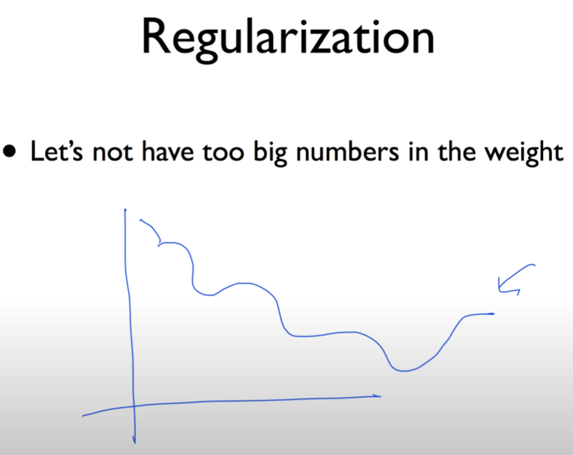


이것을 하기 위해서는, 여러분들이 cost 함수를 설명할 때, 이 cost를 최적화, 최소화시키는 것이 우리의 목표였는데,

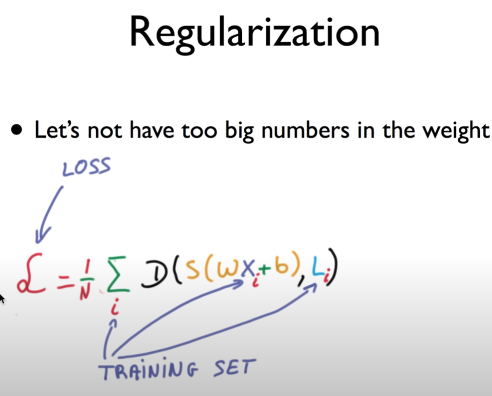


cost 함수 뒤에 이 term을 추가시켜준다.

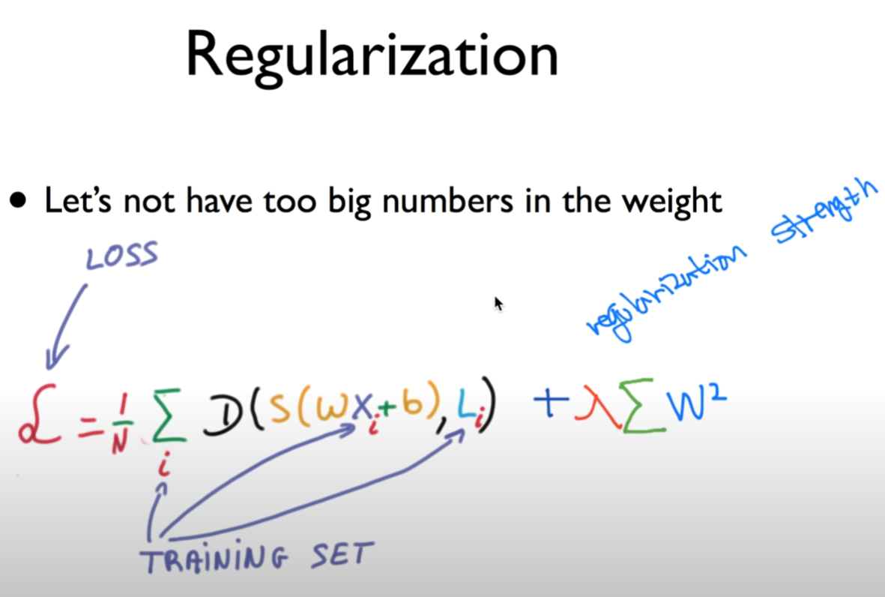


term이라는 것은, 여러 가지 형태로 Regularization할 수 있다.

가장 일반적인 것이 이 W의 값(벡터 값) 각각의 element의 제곱을 한 값이 작아질 수 있도록,

값이 크면 클수록 구부러진다고 했으니까, 구부리지 말고 쫙 펴게 할 수 있는 것이 바로 이렇게 간단.

λΣW^2

각각의 엘리먼트를 제곱하고, 그것을 합하고. 이것을 최소화 시키는데

그 앞에 하나의 상수 λ를 둘 수 있다.

이것을 regularization strength라 한다.

이 값이 0이 되면, 난 Regularization을 쓰지 않겠다는 얘기

이 값이 큰 값(1)이 되면, 난 Regularization을 굉장히 중요하게 생각한다.

0.001이 되면, 좀 하긴 하는데 크게 중요하진 않아

이 값(Regularization)을 여러분들이 정할 수 있게 된다.


이것을 tensorflow같은 거로 구현시 굉장히 간단하게 구현 가능.

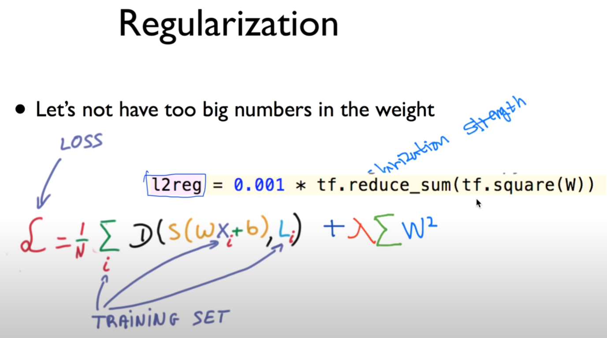


l2reg란 변수를 하나 만든 다음에, 이런 방식으로..

`tf.square(W)` 이게 square죠? W 벡터의 square를 합한 다음에(tf.reduce_sum),

이것을 특정한 상수인 regularization strength로 값을 넣는다.

이 term을 cost와 더한 다음에 최소화시켜라. 이렇게 하시면 된다.


### Summary

- Learning rate
- Data preprocessing
- Overfitting
  - More training data
  - Regularization

간단하게 우리가.. Learning rate이 왜 중요한가, 어떻게 세팅하는가 설명드림

Data preprocessing 필요한 경우,

Overfitting이 굉장히 중요한데, 이 때 여러분들이 이것을 방지하는 방법에 대해 설명드렸다.

