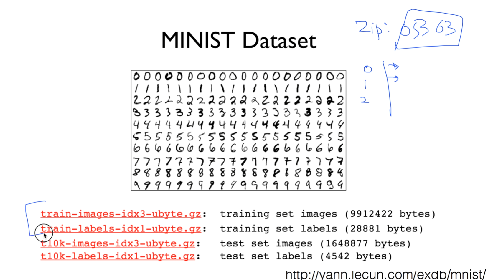

https://www.youtube.com/watch?v=KVv1nMSlPzY&list=PLlMkM4tgfjnLSOjrEJN31gZATbcj_MpUm&index=19

### Lecture 7-2 Application & Tips: Learning and test data sets

Machine Learning 모델이 얼마나 잘 동작하는지를 확인하는 방법에 대해서 이야기하겠다.

### Performance evaluation: is this good?

우리가 이전 시간에 배운 것들을 통해서, 우리의 Machine Learning 모델을 data를 통해서 학습시켰다.

이 모델이 얼마나 훌륭한가? 얼마나 성공적으로 어떤 일을 예측할 수 있을까? 어떻게 평가할까요?

### Evaluation using training set?

예를 들어, 이런 데이터가 있다고 하자.

보통 이런 데이터 training set이라 불렀죠?

training set가지고 모델을 학습시킨다.

학습을 다 시킨 다음에, 다시 이 training set을 가지고 물어보게 되면..

- 100% correct (accuracy)
- Can memorize

(Size가) 1600일 때 가격이 얼마인지 물어보게 되면, model이 답을 하거나 예측을 할 수 있다.

이것이 공정한 것일까?

아마도 ML 알고리즘들은 100% 완벽한 답을 할 수도 있다.

왜냐하면 기본적으로 이런 데이터를 통째로 구해오면 되니까.

이렇게 하는 것은 아주 나쁜 방법.

마치 여러분들이 시험을 보는데, 시험을 한 번 보고 똑같은 문제로 중간고사를 보는 것.

웬만하면 다 100점 맞겠죠? 이것은 좋은 방법이 아님.

### Training and test sets

좋은 방법: 우리가 마치 시험을 보는 것과 똑같다.

30% 보통 데이터를 잘라서, 앞부분의 데이터를 training data set이라고 부르고,

뒷 부분에 있는 자료를 test set 자료라고 부른다.

이 test data set은 숨겨져있다고 가정. 절대로 사용하시면 안 된다. 답 숨겨져있다. 볼 수가 없다.

이 training set을 가지고 열심히 여러분들의 모델을 만든다. 학습시킨다.

완벽하게 끝났다 -> 단 한 번의 기회가 있다. 이 test set 값을 줘서(답이 뭔지 알고 있죠?) model에서 나오는 답, 보통 Y햇이라고 하죠? 예측 값과 실제 값 Y 두 개를 비교하게 되면, 내가 어느정도 잘한다는 것을 알 수 있다.

마치 우리가 시험을 볼 때 교과서 위주로 공부하지 않습니까?

training: 교과서

test set: 실전

이런 식으로 해서 여러분들이 얼마나 공부했는지 평가하듯이, ML도 똑같은 방법으로 training set과 test set을 나누어서 반드시 평가를 하셔야 합니다.

### Training, validation and test sets

우리가 지난 번 시간에 이야기할 때, 보통 통상적으로 training set과 test set을 나누는 것이 일반적이다.

지난 번에 이야기할 때 α라는, Learning rate이라는 것을 우리가 얘기했었고, 또 하나의 상수가, 학습할 때 들어가는 것이 λ라고 했던 어떤 Regularization을 하는데 얼마나 강하게 할 것인가 하는 값.

이런 값을 조금 튜닝할 필요가 있을 때, 보통 사람들은 어떻게 하냐면, 우리가 가지고 있는 Training set에서 또 두 개를 나눕니다.

완벽한 training set(Training), 그리고 Validation set.

일반적으로 우리가 가지고 있는 Training set을 가지고 모델을 학습시킨 다음에, Validation set을 가지고 α, λ 값들이 어떤 것이 좋을까 하는 것들을 튜닝하게 된다.

이것을 Validation, 실제로 모의 실험을 해보는 것이죠?

완벽하게 되면, 내가 Testing data set을 가지고 실제로 모델이 잘 동작하는지를 보는 것이다.

Testing data set 숨겨져 있고, 한 번만 볼 수 있다고 보시면 된다.

마치 여러분이 학교에서 시험을 볼 때, 교과서를 가지고 공부하시다가, 시험보기 전에 실전 모의고사 보쥬? 완전히 시험은 아니지만 굉장히 유사한 형태의 시험이 나온다. 이걸 본 다음에 실전 시험을 보게 된다.

Validation -> 모의고사의 형태를 지닌 data set. Validation set

많은 경우에 testing set, training set 이렇게 두 개로 나누기도 하고,

여러분이 보신 것처럼 세 개로 나누는데, Validation data set은 이런거다.

### Online learning

data set 굉장히 많은 경우에, 이것을 한 번에 다 넣어서 학습시키기가 조금 힘들 때가 있다. 메모리에 올리기도 힘들고..

Online learning이라는 형태의 학습 방법도 있다.

별 건 아니다.

예를 들어 training set이 백만 개가 있다고 하자.

이것을 한 번에 촥 넣어서 학습시키려면 공간도 많이 필요하고 하니까,

그렇게 하지 않고 잘라서 10만 개씩 학습시킨다.

이 때 우리 모델이 해야 할 일 - 첫 번째 학습된 결과가 모델에 남아있어야 한다.

두 번째 데이터를 학습시키면 모델에 추가가 되어서 새로운 학습이 되어야 한다.

이런 형태의 learning -> online learning

굉장히 좋은 모델. 왜냐?

우리가 백만 개의 data를 가지고 학습시켰다.

세월이 조금 지나서 10만 개의 새로운 데이터가 들어왔다.

이전의 데이터를 다 새로 학습하지 않고, 있는 데이터에 추가로 학습시킬 수 있다.

이런 것들을 online이라고 부른다. 이런 학습 방법도 있다.

### MINIST Dataset

실제 dataset을 볼까요?

유명한 MINIST Dataset이라고 한다.

숫자, 사람들이 손으로 적어낸 숫자를 정확하게 컴퓨터가 숫자로 인식할 수 있는지를 test하는 dataset

이것이 필요한 이유

미국 우체국에서 사람들 우편번호 막 갈겨쓴다.

자동으로, 편지를 받게 되면 우편 번호로 분류하면 좋겠다.

컴퓨터에게 시키기 위해 이런 것들이 필요.

여기도 보시면 dataset이 나눠져 있다.

training set, test set

이미지와, 각각의 레이블(실제 답)

이미지, 레이블

여러분들이 데이터 보시면, 보통 이렇게 training과 test set으로 나눠져 있다.

이제 여러분들께서 그 의미를 잘 아셨을 것이다.

### Accuracy

- How many of your predictions are correct?
- 95% ~ 99%?
- Check out the lab video

task set을 가지고 있으면, 정확도, 우리가 가지고 있는 모델이 얼마나 정확한가를 맞추는, 예측하는, 특정하는 것은 굉장히 단순한 일

우리가 가지고 있는 실제 데이터의 Y값(label)과, 우리 모델이 가지고 있는, 모델이 예측한 값 Y햇을 비교

백 개 중에 열 개 맞았다 -> 10% 정확

백 개 중에 구십 개 맞았다 -> 90% 정확

이렇게 얘기할 수 있다.

분야에 따라 다르겠지만, 최근 들어 보통 이미지 관련 인식하는 곳의 정확도는 95% 정도를 넘고 있다.

굉장히 잘 되고 있다.

실제로 이것을 어떻게 측정하는지는 그 다음 lab에서 보여드리도록 하겠습니다.

다음 시간) 정말 우리가 기대했던 Neural Network를 굉장히 깊게 들어가보도록 하겠다.

