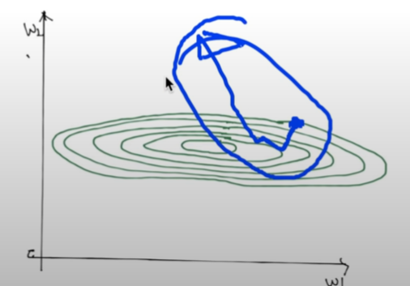

https://www.youtube.com/watch?v=oSJfejG2C3w&list=PLlMkM4tgfjnLSOjrEJN31gZATbcj_MpUm&index=20


### Lab 7-1 Learning rate, Evaluation

이번 실습 시간에는 별도의 task data set을 가지고 모델을 평가하는 방법과, 학습 rate에 대해 얘기해보도록 하겠다.


https://github.com/hunkim/DeepLearningZeroToAll/blob/master/lab-07-1-learning_rate_and_evaluation.py

### Training and Test datasets

이번 실습에서 가장 중요한 포인트 - 우리가 갖고 있는 dataset을 training과 test로 나눈다.

이전까지의 실습에서는 이런 구분 없이 우리가 가지고 있는 데이터를 가지고 다 모델을 학습하고, 그걸 갖고 test

엄밀하게 말하면 그 방법은 틀렸다.

이전엔 간단하게 보기 위해 그렇게 했고,

이제부터는 반드시 dataset을 나눈다.

나눠서 어떻게 하느냐?

training set: 이름에서 보듯 이 데이터는 학습에만 사용한다.

model이 있으면, 이 training set을 가지고 우리의 모델을 학습시킨다.

학습 완료 시점에서 test set..

test set 모델 입장에서 한 번도 본 적이 없는 것.

본 적이 없는 data set을 가지고 모델을 평가

이것이 가장 공정한 것이다. 이미 보여준 걸 가지고 또 테스트 -> 반칙

반드시 나누셔야 한다.


어떻게 나누냐?

한 예시


```python
import tensorflow as tf
x_data = [[1, 2, 1], [1, 3, 2], [1, 3, 4], [1, 5, 5], [1, 7, 5], [1, 2, 5], [1, 6, 6], [1, 7, 7]]
y_data = [[0, 0, 1], [0, 0, 1], [0, 0, 1], [0, 1, 0], [0, 1, 0], [0, 1, 0], [1, 0, 0], [1, 0, 0]]

# Evaluation our model using this test dataset
x_test = [[2, 1, 1], [3, 1, 2], [3, 3, 4]]
y_test = [[0, 0, 1], [0, 0, 1], [0, 0, 1]]
```


가지고 있는 data, x_data x1, x2, x3 이렇게 주어진다.

아래는 one-hot으로 주어진다.

x_data, y_data -> training이라고 볼 수 있다.

이 데이터만 우리가 training에 사용한다.


아래 test data -> 학습할 때는 전혀 사용하지 않다가, 마치 비밀 데이터처럼 숨겨놨다가 학습이 끝난 다음에 그 때 우리 모델을 테스트할 때 사용한다.


이걸 어떻게 나눌까?

생각보다 굉장히 간단하다.


```python
X = tf.placeholder("float", [None, 3])
Y = tf.placeholder("float", [None, 3])

W = tf.Variable(tf.random_normal([3, 3]))
b = tf.Variable(tf.random_normal([3]))

# tf.nn.softmax computes softmax activations
# softmax = exp(logits) / reduce_sum(exp(logits), dim)
hypothesis = tf.nn.softmax(tf.matmul(X, W) + b)

# Cross entropy cost/loss
cost = tf.reduce_mean(-tf.reduce_sum(Y * tf.log(hypothesis), axis=1))
# Try to change learning_rate to small numbers
optimizer = tf.train.GradientDescentOptimizer(learning_rate=0.1).minimize(cost)

# Correct prediction Test model
prediction = tf.argmax(hypothesis, 1)
is_correct = tf.equal(prediction, tf.argmax(Y, 1))
accuracy = tf.reduce_mean(tf.cast(is_correct, tf.float32))

# Launch graph
with tf.Session() as sess:
    # Initialize TensorFlow variables
    sess.run(tf.global_variables_initializer())

    for step in range(201):
        cost_val, W_val, _ = sess.run([cost, W, optimizer], feed_dict={X: x_data, Y: y_data})
        print(step, cost_val, W_val)

    # predict
    print("Prediction:", sess.run(prediction, feed_dict={X: x_test}))
    # Calculate the accuracy
    print("Accuracy: ", sess.run(accuracy, feed_dict={X: x_test, Y: y_test}))
```


필요한 X, Y placeholder만 있으면 된다.

필요한 weight, bias 선언. data 형태에 따라.

hypothesis, cost, optimizer 똑같다.


마찬가지로, 예측한 값이 있다면 hypothesis라는 것을 예측하겠죠?

예측한다면, 이것이 맞는지 아닌지 측정하는 방법이 is_correct

이것을 평균내서 accuracy

이런 방법은 이전과 동일하게 항상 만들어놓는다.


placeholder가 이렇게 유용.. 어떤 값을 던져주느냐에 따라서 학습 데이터를 던져서 학습할 수도 있고, test data를 던져서 test해볼 수도 있다.


학습할 때 보시면 session 열고 variables 한다..

학습 들어가는 과정, 즉 우리가 이 optimizer를 실행시킬 때 던져주는 데이터에만 주목하면 된다.

X: x_data, Y: y_data, 즉 우리가 training이라고 했던 그 데이터를 사용하는 것이다.

training data만 사용해서 학습한다.

그런 다음에 여기서 끝이 난다. 학습이 완전히 끝난 다음에..


prediction을 해본다거나, accuracy를 측정할 때에는 test data set(x_test, y_test)를 던져주게 된다.

여기에서 나오는 Accuracy, Prediction이란 것은, 우리가 가지고 있는 test data를 던져줬을 때의 prediction이다. 굉장히 의미가 있다.

이 모델 입장에서는 한 번도 보지 않은 data를 굉장히 훌륭하게 잘 했다 라고 할 수 있다.


### Learning rate: NAN!

이렇게 우리가 학습 데이터 나눈다는 것 얘기 했다.


두 번째 - 우리가 이걸 가지고 학습을 시킬 때

이전에 Learning rate 0.1 / 0.01 이렇게 준다라고 그냥 했는데,

이번 실습에서는 이 부분을 자세히 보도록 하겠다.


Learning rate 정확하게 좋은 값으로 측정되지 않으면 두 가지 문제가 생길 수 있다.

[왼쪽 그림]첫 번째, 값이 너무 크다면.. Learning rate이라는 것이 어떤 점에서 기울기를 구해서 얼마만큼 step을 움직일 것인가?

이런 경우 - w 작게 가길 원함[기울기가 음수 -> 왼쪽으로 이동해야 한다.]

Learning rate 너무 크다면, 조금만 내려가야 하는데 이만큼 점프해버림. 반대로 가야 해.

step이 너무 크면 이까지 가버리고, 또 가버리다가 밖으로 튕겨나가버림.

이렇게 되면 학습이 되지 않고 발산이 된다. 수렴이 되지 않는다.


[오른쪽 그림]반대로, 왼쪽 위험하니까 굉장히 조심스럽게, 너무 작은 값으로 줬다.. 0.00000001 일케 줬다.

어떤 점에서 학습 굉장히 더디게 일어난다. 학습이 굉장히 안 될수도 있다.

또는 중간에 조그마한 local minimum, 조그마한 굴곡만 있어도 갇혀버린다. 점프 못함

local minimum에 빠질 수 있고 학습이 안될 수 있다.

그래서 두 가지 문제가 있다.


### Big learning rate

이전과 똑같은 소스코드에 Learning rate만 1.5로 준다. [0.1 -> 1.5]

```python
optimizer = tf.train.GradientDescentOptimizer(learning_rate=1.5).minimize(cost)
```


좀 더 과감하신 분 10.0 정도로 줘도 된다.

학습을 시켜본다.. 이전엔 accuracy 1이 나왔는데..


-> 심상치 않다. step 할 때마다 커짐, cost가 27, 8, 5...

step 5에서 cost 무한대로 가버렸다. 밖으로 확 튕겨버린듯.

그 이후로 아 잘 모르겠다 (nan, 숫자가 아니다)

학습이고 뭐고 포기해버리는 상태.

만약 학습하다가 숫자가 아닌 nan이 나온다 -> 여러분들이 learning_rate이 너무 큰 거 아닌가? 의심해보셔야 한다.


### Small learning rate

반대로 learning_rate을 크게 하면 발산한다니까 조심해야지.. 하면서 엄청나게 작은 learning_rate을 준다.

```python
optimizer = tf.train.GradientDescentOptimizer(learning_rate=1e-10).minimize(cost)
```

이전에 이야기한 것처럼, 너무 작게 내려오고, cost 함수에 조금의 굴곡이 있다면 local minimum에 빠져서 나오지 못하게 되겠죠?

마찬가지로 step 0,1, ..., 198

cost를 보면 수백 번을 했는데도 cost가 같다.

local minimum에 빠졌거나, 거의 이동하지 않거나..

이렇게 학습이 일어나지 않고 있다 -> learning_rate 값이 너무 작은 것이 아닌가 보고 조정하면 좋겠다.


### Non-normalized inputs

학습 rate 굉장히 잘 했는데도, 가끔 보면 nan이라는 아주 무서운 것을 만날 수 있다.

다른 이유 중에 하나 - data가 normalize되지 않을 때.

가상의 데이터 하나 만듦.

https://github.com/hunkim/DeepLearningZeroToAll/blob/master/lab-07-2-linear_regression_without_min_max.py

```python
import tensorflow as tf
import numpy as np
tf.set_random_seed(777)  # for reproducibility


xy = np.array([[828.659973, 833.450012, 908100, 828.349976, 831.659973],
               [823.02002, 828.070007, 1828100, 821.655029, 828.070007],
               [819.929993, 824.400024, 1438100, 818.97998, 824.159973],
               [816, 820.958984, 1008100, 815.48999, 819.23999],
               [819.359985, 823, 1188100, 818.469971, 818.97998],
               [819, 823, 1198100, 816, 820.450012],
               [811.700012, 815.25, 1098100, 809.780029, 813.669983],
               [809.51001, 816.659973, 1398100, 804.539978, 809.559998]])
```

숫자 908100같은 큰 값도 있다..

이런 값들을 그대로 사용하게 되면.. cost function 대략 2차원으로 펴 보면 이런 형태가 된다.


한 쪽 방향으로 치우침..


어떤 점에서 minimize하기 위해서 경사면을 따라 내려올텐데..

중앙으로 가면 괜찮은데, 다른 방향으로 점이 나가버리면 바깥으로 튕겨 나가버리죠?

이런 문제가 있다.




실제로 그렇게 되는지 본다.


이전과 똑같은 형태..로 코드 짠다.

xy에서 맨 마지막 열이 Y, 나머지 열이 X

간단하게 linear regression으로 Y를 예측.

X, Y 필요한 shape에 따라 쓴다.. placeholder로 만들고 크기에 맞게 weight, bias 정리.


hypothesis로 친숙한 linear regression model

cost도 그에 맞게.. 아주 훌륭하게 작성되어 있다.

밑에서 학습한다.


소스 코드 보면 너무나 아름다울 정도로 심플하고 멋진 모델

돌려보면 이상한, 해괴망측한 값이 나온다.

왜 그럴까? -> 여러분들의 input data가 normalized 되지 않았기 때문


### Normalized inputs (min-max scale)

해결하는 방법은 매우 간단하다.


https://github.com/hunkim/DeepLearningZeroToAll/blob/master/lab-07-3-linear_regression_min_max.py

```python
xy = MinMaxScaler(xy)
print(xy)
```

수업 시간에 얘기했듯이 Normalize 한다거나, 최근에 많이 쓰는 게 MinMaxScaler라고 하는 함수를 많이 사용한다.

xy 값을 넣어주게 되면, 파란색 글씨가 원래 데이터라고 하면, MinMaxScaler에 넣으면 초록색 글씨 값으로 돌아온다.

잘 보면.. 제일 작은 값을 대략 0, 제일 큰 값을 1, 이렇게 해서 MinMax로 0과 1 사이를 준 다음에, 그 사이를 값을 따라서 Normalize한다 라고 보시면 됩니다.

X1, X2, X3, ..., Y 별로 묶어서 MinMaxScaler를 하게 된다.


이렇게 하게 되면, 우리가 cost를 대략 보게 되면 이전과 같이 한 쪽으로 치우치지 않고, 굉장히 동그란 모양이 된다. 내가 어느 방향으로 가더라도, 한 번만에 밖으로 확 튕겨나가지가 않게 된다.

웬만하면 수렴하게 된다.


### Normalized inputs

똑같은 소스 코드 적용시..

변경한 것 전혀 없고, 굉장히 작은 learning_rate=1e-5 사용.

이전과 똑같은 소스 코드(에서), 이전에는 굉장히 이상한 숫자가 나왔지만, 이번에는 한 번 해보시면 아주 잘 학습이 된다는 것을 알 수 있다.


데이터들이 굉장히 크거나, 데이터의 상태가 들쭉날쭉할 때는 반드시 Normalized를 하는 것이 좋다.

