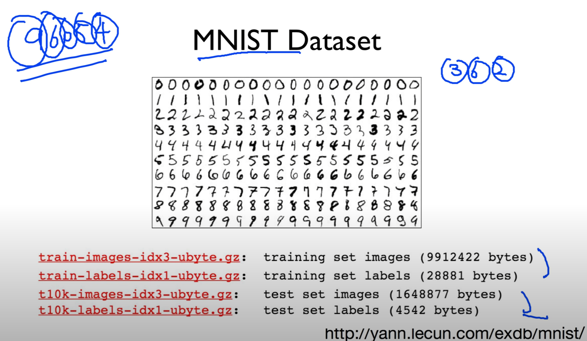
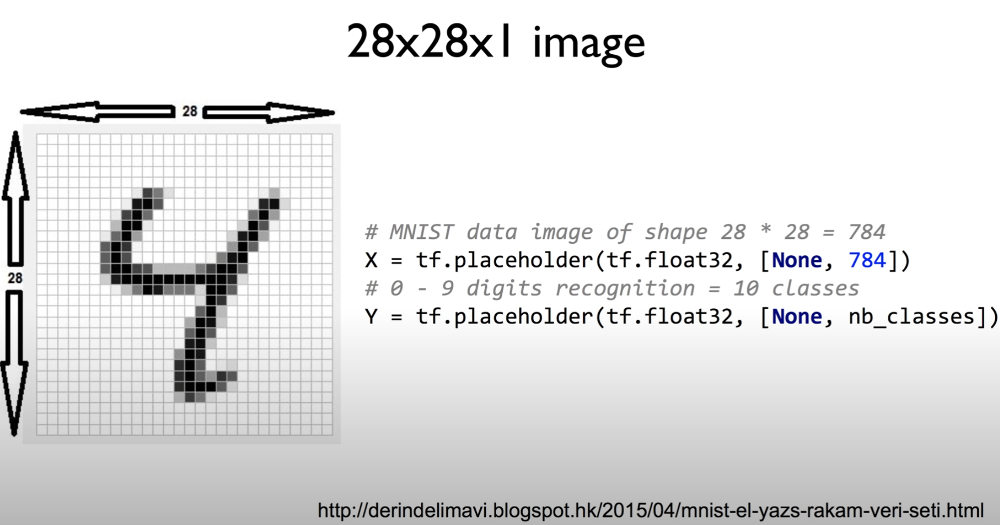
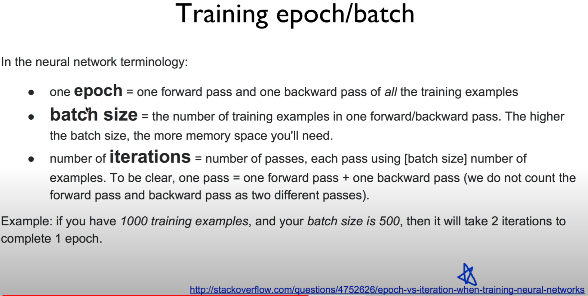
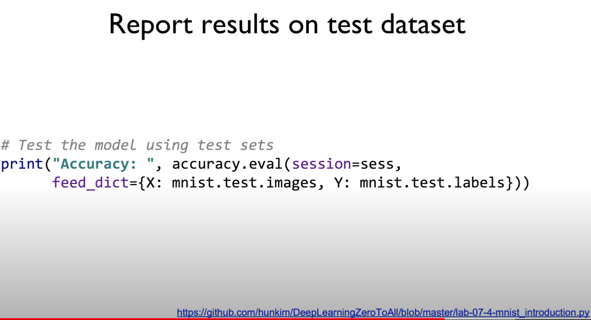
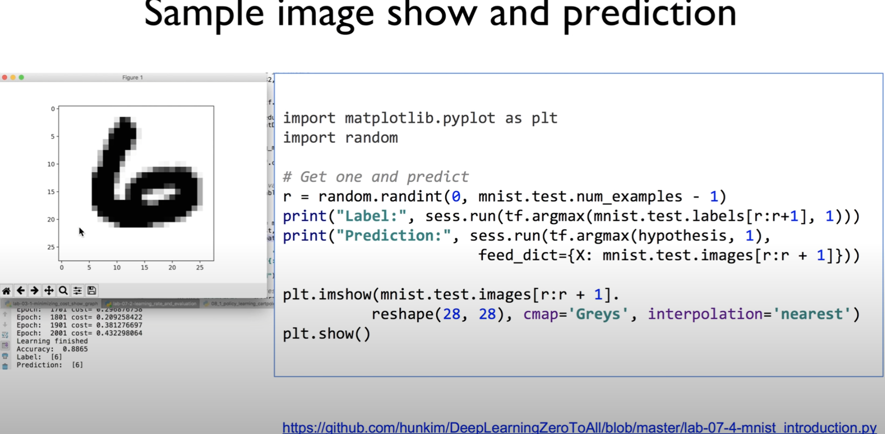

https://www.youtube.com/watch?v=ktd5yrki_KA&list=PLlMkM4tgfjnLSOjrEJN31gZATbcj_MpUm&index=21


### Lab 7-2 MNIST data

실존 데이터를 사용해서 모델을 만들어보자.


### MNIST Dataset

오늘 우리가 사용할 데이터: 그 유명한 MNIST라는 dataset



손으로 써있는 숫자

이게 왜 필요한가?

옛날 미국에서 우편번호 쓴다.

손으로 쓴 글씨를 자동으로 컴퓨터가 읽게 만들기 위해 만든 dataset

많은 양.. 이런 dataset으로 충분히 분류를 할 수 있는지 보겠다.


### 28x28x1 image



dataset 조금만 더 자세히 보자..

28x28 pixel의 dataset

각각 한 자리씩 따지면.. 784개

저번에 x 3개, 5개.. 이런건 정말 toy

784개 x 가지고 작업을 할 것이다.

x shape 784. None: 원하는 n개 줄 수 있다.

y 예측 -> 0~9

10개의 가지를 요청한다. 보통 softmax 해서 one-hot encoding 사용.

10개의 출력.


https://github.com/hunkim/DeepLearningZeroToAll/blob/master/lab-07-4-mnist_introduction.py

```python
from tensorflow.examples.tutorials.mnist import input_data

mnist = input_data.read_data_sets("MNIST_data/", one_hot=True)
...
batch_xs, batch_ys = mnist.train.next_batch(100)
...
 print("Accuracy: ",accuracy.eval(session=sess, 
       feed_dict={X: mnist.test.images, Y: mnist.test.labels}),)
```

이런 형태의 그림 읽어와서, pixel 읽어서 처리해야

복잡 + 많이 사용하니까 아주 간단하게 library를 만들어놓은 게 있다.

tensorflow에서 input_data 불러온 다음에,

데이터를 읽어와라, 디렉토리를 지정해준다.

처음에 실행될 때 이 디렉토리["MNIST_data/"] 다운받아옴, 그 다음부터 실행될 때는 다운받은 디렉토리를 읽어온다.

데이터 읽었으면 이걸 가지고 train, next_batch(100)

100개의 x, y train data가 읽어온다.

한꺼번에 굳이 올릴 필요가 없다.

메모리 너무 많이 차지하니까..

100개씩 올릴 수가 있다.

이걸 가지고 학습을 한 뒤,

test set을 가지고 평가

minst.test.images...


데이터 읽어올 때 옵션 하나 있었쥬?

one_hot=True

Y 값을 우리가 원하는대로 one_hot으로 읽어온다..

우리가 특별히 별도로 one_hot으로 만들지 않아도, 읽어올 때 one_hot으로 처리한다.


### Reading data and set variables

전체적으로 읽는 것을 보자..

```python
from tensorflow.examples.tutorials.mnist import input_data

mnist = input_data.read_data_sets("MNIST_data/", one_hot=True)

nb_classes = 10

# MNIST data image of shape 28 * 28 = 784
X = tf.placeholder(tf.float32, [None, 784])
# 0 - 9 digits recognition = 10 classes
Y = tf.placeholder(tf.float32, [None, nb_classes])

W = tf.Variable(tf.random_normal([784, nb_classes]))
b = tf.Variable(tf.random_normal([nb_classes]))
```

nb_classes = 10

class 10개 나온다.


X, Y placeholder, shape에 주의

몇 개 출력인가(nb_classes), class가 몇 개인가


X, Y가 정해졌으면, 간단한 softmax classifier를 사용한다.

X, W를 곱하게 된다.

W shape 신경써야. 입력 784개, 나가는 거 10개

bias 나가는 거 10개. Y의 size.


### Softmax!

이렇게 정해졌으면, 이전에 우리가 한 것처럼 softmax

```python
# Hypothesis (using softmax)
hypothesis = tf.nn.softmax(tf.matmul(X, W) + b)

cost = tf.reduce_mean(-tf.reduce_sum(Y * tf.log(hypothesis), axis=1))
train = tf.train.GradientDescentOptimizer(learning_rate=0.1).minimize(cost)

# Test model
is_correct = tf.equal(tf.argmax(hypothesis, 1), tf.argmax(Y, 1))
# Calculate accuracy
accuracy = tf.reduce_mean(tf.cast(is_correct, tf.float32))
```

hypothesis는 matrix X, W의 곱과 b

이전에 정의했던 것이죠? W, b..

X는 placeholder

matrix 곱한 뒤 b 더한 것을 softmax로 넘겨준다.


그 다음에 cost는 어떻게 계산하느냐?

지난 번에 얘기했던 cross entropy를 사용한다.

one hot으로 적용한 Y와 hypothesis의 로그를 취한 것을 곱하면 된다.

그 다음에 axis=1로 해서, 합을 구하고[reduce_sum]

그것을 평균을 내버린다. [reduce_mean]

이것을 cost로 사용할 수 있다.

cost를 minimize하면 optimizer

이제 우리가 softmax 사용할 때 했던 것과 똑같다.


정확한지 아닌지 어떻게 평가?

Y값 label인데 one hot으로 주어졌죠?

one hot에 있는 값과, hypothesis로 주어진 arg_max 값이 같은지

같으면 True, 다르면 False

이것으로 accuracy 계산


### Training epoch/batch

```python
# parameters
num_epochs = 15
batch_size = 100
num_iterations = int(mnist.train.num_examples / batch_size)

with tf.Session() as sess:
    # Initialize TensorFlow variables
    sess.run(tf.global_variables_initializer())
    # Training cycle
    for epoch in range(num_epochs):
        avg_cost = 0
        total_batch = int(mnist.train.num_examples / batch_size)

        for i in range(num_iterations):
            batch_xs, batch_ys = mnist.train.next_batch(batch_size)
            c, _ = sess.run([cost, optimizer], feed_dict={X: batch_xs, Y: batch_ys})
            avg_cost += c / total_batch

        print("Epoch: {:04d}, Cost: {:.9f}".format(epoch + 1, avg_cost))
```

여기서 굉장히 우리가 배울 게 있다

학습시킬 때 데이터가 굉장히 크다.

한 꺼번에 다 읽어서 학습시킬 순 없다.

조금씩 batch로 잘라서 학습시킨다.

한 번에 몇 개씩 학습시킬까 -> batch_size로 주어진다.


새로운 개념이 나왔다. epoch

우리가 몇 개인지는 모르지만, 전체 dataset이 있다.

전체 dataset을 한 번 다 학습시키는 것을 1 epoch라고 한다.


정의를 볼까요?



epoch: 전체 데이터 셋을 학습한다. 전체 데이터 셋을 한 번 돈 것. -> 1 epoch

이 데이터가 굉장히 많을 경우, 한 번에 다 메모리에 넣어서 돌릴 수 없다.

1 epoch에서 잘라서 100개 씩 학습시킨다.

요걸 batch_size라고 한다.


예를 들어 전체 데이터 1000개, batch_size 500개

1 epoch를 위해서 몇 번 batch를 돌면 좋을까요? [iteration 몇 번 도냐]

두 번을 돌면 된다.


다시 위의 코드

기본적으로 batch_size 몇 개인지, epoch 몇 번 도는지(많을수록 좋겠죠)

그 다음에 기본적으로 session 열고, initializer 한다.


loop 두 번 돌텐데 한 번 보자.

epoch 15번 돌겠죠?

아까 iteration 몇 번 돌까 얘기했죠?

i 가 iteration..

어떻게 정해지냐? 

`total_batch = int(mnist.train.num_examples / batch_size)`

전체 데이터의 갯수(mnist.train.num_examples)를 batch_size로 나누면 된다.

전체 data size가 10000개라고 하고, batch_size가 100개면 몇 번 loop를 iteration하면 1 epoch이 되나요?

100번을 돌면 한 번 epoch를 돈다.

[이 total_batch를 이용해서 for 문 크기 정한다.]


mnist.train.next_batch(batch_size)를 이용해서 100개 씩 읽어와서 학습을 시킨다.

loop가 끝나면 1 epoch가 끝난다.

그 다음 epoch..

`batch_xs, batch_ys = mnist.train.next_batch(batch_size)`

요 부분 다시 한 번 보면, 요 함수에 몇 개..(100개), 전체 데이터 셋 중

1 ~ 100, 그 다음 번엔 101 ~ 200번 이런 식으로 100개씩 잘라서 보내준다.


이렇게 하는 것이 여러분이 학습을 할 때 굉장히 일반적인, norm이라고 할 수 있는 학습 방법.

epoch, batch_size 얼마나 할 것이냐 이런 얘기를 많이 할 것인데, 이건 바로 이런 의미가 있다..


### Report results on test dataset

학습이 끝난 다음에는 어떻게 평가를 할 수 있을까요?



training data는 학습할 때만 사용

학습할 때 사용하지 않았던 test data를 이용해서 accuracy를 평가할 수 있다.

sess.run()으로 돌릴수도 있고,

accuracy.eval() 이란 함수도 호출 가능.

똑같은 의미. 가끔 편하게 하기 위해.. 하나만 값을 실행시킬 때 eval 사용하기도 한다.


전체 소스코드

```python
# Hypothesis (using softmax)
hypothesis = tf.nn.softmax(tf.matmul(X, W) + b)
cost = tf.reduce_mean(-tf.reduce_sum(Y * tf.log(hypothesis), axis=1))
train = tf.train.GradientDescentOptimizer(learning_rate=0.1).minimize(cost)

# Test model
is_correct = tf.equal(tf.argmax(hypothesis, 1), tf.argmax(Y, 1))
# Calculate accuracy
accuracy = tf.reduce_mean(tf.cast(is_correct, tf.float32))

# parameters
num_epochs = 15
batch_size = 100
num_iterations = int(mnist.train.num_examples / batch_size)

with tf.Session() as sess:
    # Initialize TensorFlow variables
    sess.run(tf.global_variables_initializer())
    # Training cycle
    for epoch in range(num_epochs):
        avg_cost = 0
        total_batch = int(mnist.train.num_examples / batch_size)

        for i in range(num_iterations):
            batch_xs, batch_ys = mnist.train.next_batch(batch_size)
            c, _ = sess.run([cost, optimizer], feed_dict={X: batch_xs, Y: batch_ys})
            avg_cost += c / total_batch

        print("Epoch: {:04d}, Cost: {:.9f}".format(epoch + 1, avg_cost))
```

앞에 데이터 읽어오는 부분 외에는, 코드가 한 페이지에 들어가게 된다.

놀랍죠? tensorflow를 사용하기 때문에, 간단하게 쓸 수 있다.

출력 - 각 epoch, cost가 나온다.

예상처럼 epoch 지날수록 cost가 줄어든다.

accuracy 값이 상당히 높게 나왔다.

아주 간단한 모델인데, 숫자를 88%나 맞춘다.

동작이 잘 된다는 것을 볼 수 있다.


### Sample image show and prediction



약간 재미를 더하기 위해.. 실제 숫자 어떻게 보이는지 출력해보기 위해,

그 유명한 matplotlib.pyplot을 이용해 출력한다.


기본적으로 random하게 숫자를 하나를 읽어와서, test할 label의 data를 하나 읽어온다.

`mnist.test.labels`가 one hot으로 되어있으니 argmax 해서 label이 무엇인가 찾아내게 된다.

예측하는 것은 hypothesis를 실행시키고, 거기에 맞는 image를 던져주게 된다.

그 다음에 마찬가지로 argmax를 한다.

-> Prediction 값이 나온다.


화면에 그 값이 맞는지 출력 -> 방금 test image를 imshow 이용해서 값 출력 가능

visiable하게 보면서 그 이미지가 맞는지 확인

실존 data에 tensorflow model 사용해보았다.

88% 굉장히 훌륭하진 않지만, 간단한 model 치고 잘 했다.

