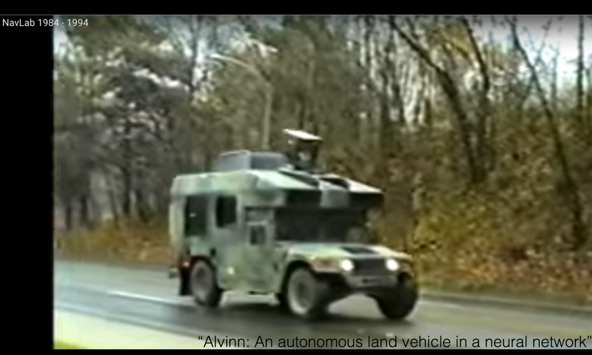

https://www.youtube.com/watch?v=n7DNueHGkqE&list=PLlMkM4tgfjnLSOjrEJN31gZATbcj_MpUm&index=22

### Lecture 8-1 Deep Neural Nets for Everyone

본격적으로 Deep Neural Networks에 들어가기 전에, 이 아이디어가 어떻게 시작되었는지, 어떤 문제들이 있었고 우리들이 어떻게 해결했는지 수학적인 개념과 컴퓨터적인 개념 없이 얘기해보겠다.

### Ultimate dream: thinking machine

우리 인류의 궁극적인 꿈

우리 대신 골치아픈 문제를 생각할 수 있는 기계를 만들자.

시작 어디서 할 수 있었을까?

우리가 생각하니까, 우리의 뇌를 처음에 공부하기 시작했다.

여러 가지를 갖고 깜짝 놀랐다.

그 중 하나 - 뇌가 굉장히 복잡하게 연결되어 있다.

연결된 부분 부분들을 자세하게 봤더니, 굉장히 더 깜짝 놀란 것

뉴런이라고 불리는 기본 유닛이, 너무나도 단순하게 동작한다.

이렇게 단순하게 동작하는데 어떻게 우리가 생각할 수 있을 것인가?

고민에 빠질 정도로 단순하게 동작.

어떤 input이 있고, 이것을 더해주는 길이에 따라 신호 양이 달라진다.

x ⋅ w + b

어떤 input에 어떤 weight의 곱이 되는 정도의 양으로 신호가 들어온다고 할 수 있다.

다 합쳐지고(sum이 일어난다.) 그런 다음에 통과되면서 어떤 bias라는 항목이 더해져서 그 다음으로 전달되더라.

그 다음으로 전달할 때 잘 봤더니, 다 모여져있는 값이 우리가 정한 어떤 값 이상이 되면 이것이 활성화(activation)되고, 값 이상이 되지 않으면 활성화가 되지 않는다. 매우 간단.

### Activation Functions

이걸 본 사람들 - 이런 형태의 뉴런은 우리도 기계적으로, 수학적으로 만들 수 있겠다.

해서 만들어 낸 모델이 Activation Functions

기본적으로 이런 형태의, 값을 모으는, 합을 구하는 것이 있다고 가정하자.

어떤 신호가 들어오는데, 그것을 x로 보면

어떤 형태로, 어떤 값으로 곱이 됩니다. (weight)

이 곱이 된 값들을 다 더한 다음에, bias로 합한다.

그 다음에 activation function이란 게 있어서, 이 합한 값이 일정 값을 넘어가면 그 다음으로 값을 보내주고(1이란 신호를 주고), 어떤 값보다 작으면 0이란 신호를 준다.

이런 단순한 형태로 우리가 만들 수 있겠다라는 생각이 들었다.

### Logistic regresiion units

이전 수업에서 여러분들이 보셨을만한 형태로 나타낼 수 있다.

모은다면 여러 개의 출력을 동시에 낼 수 있는 기계의 형태가 될 수 있겠죠?

### Hardware implementations

이 기계를 하드웨어를 가지고도 만들 수 있다.

왼쪽의 선들은 x가 실제로 연결되는 형태의 선이 아니었나 예상해봄..

조금 더 지나선, weight을 학습해야 하니까, 학습을 위한 dial을 돌려서 weight 조정.

기계가 어떤 특정한 input값들에 대해 어떤 형태의 출력을 낸다.

그 당시에 이것을 가지고 인공지능이라고 생각했다.

많은 사람들의 관심을 끌자..

### False Promises

공부하시는 분들이 굉장한, 허황된 약속을 하기 시작하다.

예를 들어, 58년도에 뉴욕 타임스에 나온 기사를 보면, 아까 기계를 만든 프랭크 박사님이 하신 말씀.

우리가 이런 걸 만들어냈는데, 이것이 곧 스스로 학습해서 걷기, 말, 보기, 글 쓰기, 자기생산 스스로 만들어낼 수 있다. 더 가관인 것은 자기 존재를 인식하게 된다라는 말까지 한다. (아직까지 안되고 있음)

많은 사람들의 큰 관심을 끌게 된다. 어느 정도의 성공했다고 볼 수도 있다.

### (Simple) AND/OR problem: linearly separable?

그 당시 AND, OR logic을 쓸 수 있으면, 생각하는 기계를 만들 수 있다고 생각했다.

이것을 푸는 것이, 이것을 기계가 예측할 수 있도록 만드는 것이 굉장히 중요한 문제 중 하나였다.

OR: x1, x2가 이렇게 주어졌을 때 왼쪽 그림과 같다.

이런 형태의 값이 주어진다.

내가 어떤 기계에 x1, x2를 줬을 때 OR에 맞는 y를 내가 예측할 수 있을까? 만들어낼 수 있을까? 하는 것이 중요한 일이었다.

보니까 할 수 있다. linear한 모델.. 삭 짜르면 구분 가능.

AND도 마찬가지. 값은 좀 다르다. 11일때만 1

사람들이 막 박수치면서 와 우리도 할 수 있겠다. 굉장한 희망에 부풀었다. 찬물을 확 끼얹은 것이..

### (Simple) XOR problem: linearly separable?

바로 굉장히 단순하지만 웃기게 생긴 XOR

여러분 XOR 들어보셨겠지만, 간단하게 보면 x1, x2 연결되어 있을 때

00 -> 0, 01 -> 1, 10 -> 1, 11 -> 0이 된다.

exclusive -> 값이 다를 때 1이 되고, 값이 같으면 0이 된다.

00일 때 와 11일 때 1이 되고, 나머지 0이 된다.

매우 단순한 로직. 우리가 가지고 있는 기계를 가지고 해볼까?

x1, x2에서 y 출력

이게 안된다.

linear하게 어떻게 선을 그어도..

100% 맞게 나올 수가 없다. 50%밖에 안 돼.

구분할 수 없게 된다.

x1, x2 나누는 게 정확도 굉장히 떨어지는 결과를 낸다.

많은 사람들이 우리가 가지고 있는 simple한 model을 가지고, 정말 단순한 XOR을 풀어보자. 많은 사람들이 도전을 했다.

### Perceptrons(1969) by Marvin Minsky, founder of the MIT AI Lab

이러고 있는 걸 보니, 좀 딱한 생각이 들겠죠?

민스키란 교수님: AI계를 열었다고 해도 과장이 아니다.

그 당시 MIT AI Lab에 Foundary도 하고, 대장이었음.

민스키 교수님 보니까 좀 안 될 것 같은거야

69년도에 책을 냈다.

이 책에 XOR은 X다, 지금 가지고 있는 것으로 풀 수 없다. 수학적으로 증명을 해버렸다.

그러면서 한 얘기가 하나로는 할 수 없고, 여러 개를 합치면(MLP, Multi Layer Perceptrons)

이렇게 여러 개 합치면 이거[XOR] 할 수 있어.

더 큰 문제가 이거 각각에 들어가야 될 weight, bias를 학습시킬 수가 없어..

아무도 학습시킬 수 있다. 이게 이 책의 주제

많은 사람들이 실망하게 된다.

### "No one on earth had found a viable way to train*"

그리고 이런 layer에서 다시 강조한 것이, 아무도, 린스키 자신도 나도 못하는데, 이거 안되는거야. 이런 얘기를 해버린다.

아마 이 Neural Net이, Deep Learning이 Skynet이라면, [Skynet: 터미네이터 시리즈에서 주요 악역으로 등장하는 가상의 인공 의식, 게슈탈트, 인공 일반 지능(슈퍼지능) 시스템이다.] 민스키 교수님은 미래에서 인류의 저항군을 대신해서 온, 과거로 오신 분이 아닌가 싶다.

이 분이 책을 발표함으로써, Neural Network쪽으로의 발전은 길게 잡으면 20년, 짧게 잡으면 10년 정도 후퇴를 하게 된다. 글을 잘 쓰신 듯. 책을 읽고 감동을 받고 책에 굉장히 설득이 되어서 많은 분들이 이 책을 믿게 된다. 아.. 이것은 아무도 할 수 없구나.. 그러면서 시간은 계속 흐른다.

### Backpropagation (1974, 1982 by Paul Werbos, 1986 by Hinton)

86년도까지 가서 이 문제가 해결됨.

사실 그 전에도 해결되었다. 74년도에 Paul이란 사람이 박사 논문에 이걸 하는 방법을 알아냈다.

기본적으로는 이렇다. network이 연결되어 있고, 각각의 w와 b가 있으면, w와 b를 이용해서 내가 주어진 입력을 가지고 출력을 만들어낼 수 있다.

이 출력이 실제로 우리가 가지고 있는 값과 틀린 출력일 경우 w, b를 조절해야 된다. 이것이 어려움이었는데.. 앞에서 조절하기 어렵

Backpropagation 이란 알고리즘이 개발되었다.

이 알고리즘 -> 요기서 에러를 구해서, 뒤로 전달을 해나가면서 각각을 training시키면 어떨까?

어떻게 보면 단순한 알고리즘. 1974년도에 폴이 박사 논문을 썼다.

그 당시 분위기 워낙 밍밍해서, 이걸 내도 아무도 관심을 가지지 않았다.

70년대 후반에 민스키 교수 만나서 '내가 이런 문제를 풀었다.'

재밌게도 이 교수님이 아무런 관심을 가지지 않았다. -> 그래서 그냥 묻힐 뻔 했다.

그래도 버리기 아까우니, 80년대에 논문 발표, 아무도 안 읽음.

그와는 독립적으로 86년도에 Hinton이란, 기억해야할 만한 분이, 똑같은 방법을 독자적으로 만들어냈다.

많은 분들은 재발견이다, rediscovery다 라고 얘기한다.

그 이유 - 이전에 발견되었으나 알려지지 않은 것을 다시 재발견하였다.

이 분이 86년도에 함으로써 주목을 받기 시작했다.

조금 더 복잡한 형태의 model도 학습을 시키고, XOR도 하고, 더 복잡한 형태의 예측이 가능해졌다.

### Convolutional Neural Networks

또 한편으로는, 라쿤이라는 교수님은 다른 방법으로 이 문제에 접근. 그 방법이 아주 재밌다.

고양이를 가지고 그림을 보게 한다.

시신경이 어떻게 동작하는지를 본다.

그림의 형태에 따라 일부의 뉴런들만 활성화되고, 다른 그림을 주면 다른 형태로 활성화되는 것을 발견.

우리가 그림을 볼 때, 우리의 신경망 세포가 동시에 그림 전체를 보는 것이 아니라, 일부의 부분 부분들을 담당하는 신경망들이 있고, 나중에 조합되는 것이 아닐까? - 라쿤 교수님의 생각.

이 분이 Convolutional Neural Network라는 것을 개발했다

한 번에 다 NN으로 입력시키는 것이 아니라(복잡해지고 학습 굉장히 많이 일어나야 한다.), 이것을 잘라서 다음 레이어를 보내고, 잘라서 보내고.. 부분부분을 잘라서 보낸 다음에 나중에 합치는 방법으로 하는 network 개발.

알파고도 Convolutional Network 사용.

이 방법이 굉장히 잘 동작한다. 약 90%정도의 문자를 인식하고 숫자를 인식하는 성능을 보여주었다.

미국) 책을 자동으로 읽어들이는 기계를 만들어 사용했다.

90년대 후반에는, 전체 10~20%의 책들이 이 기계를 통해 읽어졌다.

굉장한 성공

###  NavLab 1984 ~ 1994

구글 차가 처음 나온 것이 아니라, 이 당시에 NN을 이용해서 84~94년도 사이에 플젝이 일어났다.

CNU에 있는 Lab에서, 자동으로 주행하는 차를 만들어서 어느 정도의 성공을 거두었다.

### Terminator 2(1991)

여러분들이 다 보셨을 만한 터미네이터 영화

너 뭐냐?

내 CPU는 neural-net이다.

이렇게 말할 정도로 neural-net이 사람들의 관심을 받고, 희망을 주었다.

### A BIG problem

그러다가 안타깝게도 또다른 큰 문제에 봉착하게 된다.

이전에 학습을 가능하게 해줬던 Backpropagation 알고리즘

몇 개 정도의 layer에서는 잘 동작한다.

실제로 필요한 것 - 복잡한 문제를 풀기 위해, 최소 10여 개 이상 되는 layer를 학습시킬 수 있어야 한다.

Backpropagation 알고리즘 -> 뒤에서 가는 구조

간단하게만 말씀드리면, 에러를 앞으로 보낼 때, 그 의미가 갈수록 약해져서 앞에서는 에러가 거의 전달되지 않고 학습을 시킬 수가 없다.

그런데 입력을 보면 굉장히 중요한 부분이죠?

=> 많이 할수록 오히려 성능이 더 떨어진다.

한편으로는 더 많은 형태의 알고리즘들이 많이 나오기 시작했고, 어떻게 보면 Neural Network보다 훨씬 간단한 알고리즘들이 더 잘 동작

95년도 급기야 라쿤 교수님께서, 자기가 NN 전문가이지만, 실제로 해보니 훨씬 더 단순한, 간단한 알고리즘인 SVM이나, RandomForest같은 것이 더 잘 되더라..

너무 복잡하기 때문에 하기 어렵다.. 이렇게 되었다. 그러면서 다시 한 번 NN은 침체기에 들어간다. (두 번째 침체기)

두 번째 침체기이기 때문에 사람들은 이럴 것이다.. 그럼 그렇지.. 역시 이건 안 돼.

다음 시간 to be continued..

