https://www.youtube.com/watch?v=AByVbUX1PUI&list=PLlMkM4tgfjnLSOjrEJN31gZATbcj_MpUm&index=23

### A BIG problem

지난 번 비디오에서 이런 문제가 있었죠?

적은, 몇 개가 안되는 layer들은 잘 학습시키는데, 큰 경우에는 학습이 되지 않더라..

### CIFAR

이야기하기 전에, 굉장히 칭찬하고 싶은 단체가 있다.

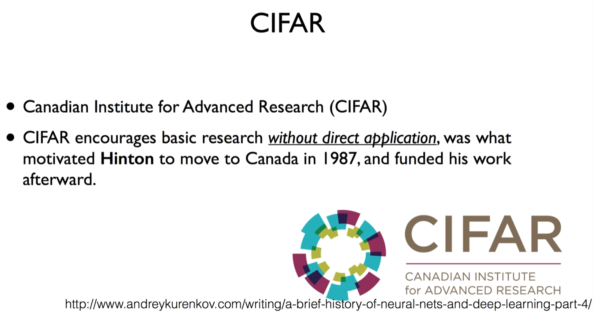

C라고 읽도록 하겠습니다. [ㅋㅋㅋㅋㅋ]

- 캐나다에서 세운 연구소

이 단체가 정말 훌륭한 것 - 연구 센터를 세우면서 당장 돈이 되고 당장 활용도가 있지 않아도, 연구를 하라 라고 굉장히 encourage했다. 연구하라고 굉장히 밀어줌.

굉장히 찬 바람이 불었던 Neural Network의 전문가였던 Hinton은, 더 이상 돈도 주지 않고, 그 당시에 Neural Network라는 제목만 들어가도, 연구는 reject 되었다고 한다.

그런 때에 캐나다로 이주하게 된다.

이 단체가 있음으로써, 지금 어떻게보면 deep learning을 주도하고 있는 많은 학교들은, 많은 연구자들은 캐나다 출신. 몬트리올, 토론토 대학교 출신. 이 단체 때문이라고 생각하고, 굉장히 자랑하고 칭찬해주고 싶은 단체.

### "Everyone else was doing something different"

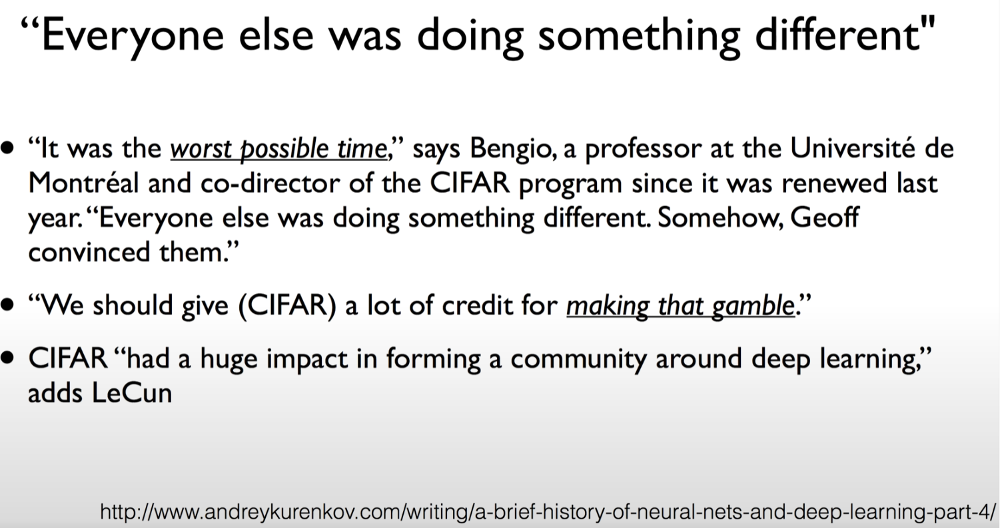

그 당시를 회고하면, 이런 얘기가 나온다.

아무도 이 일을 하지 않고 있을 때, worst possible time이다 이런 정도로 굉장히 힘든 시간이었는데, Geoff 교수님께서 CIFAR 단체를 설득해서 계속 연구를 할 수 있게 되었다.

어떻게 보면 지금 이런 훌륭한 Deep learning의 발견은 CIFAR가 도박을 한 것처럼 내린 결정을 칭찬해줘야 한다, 훌륭하다. 거듭 얘기하고 계신다.

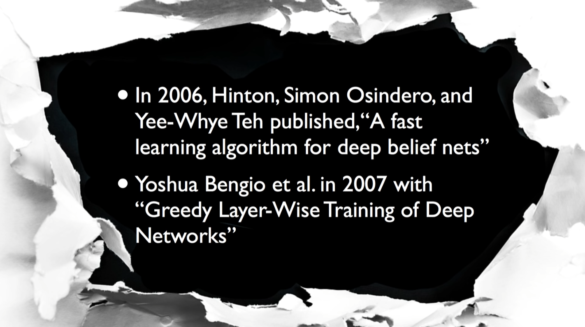

찬 바람이 불었던 10년이 지난 다음, 2006, 2007년도에 Hinton 교수님과 Bengio 교수님이 큰 breakthrough[돌파구]가 되는 두 논문을 발표한다.

### Breakthrough in 2006 and 2007 by Hinton and Bengio

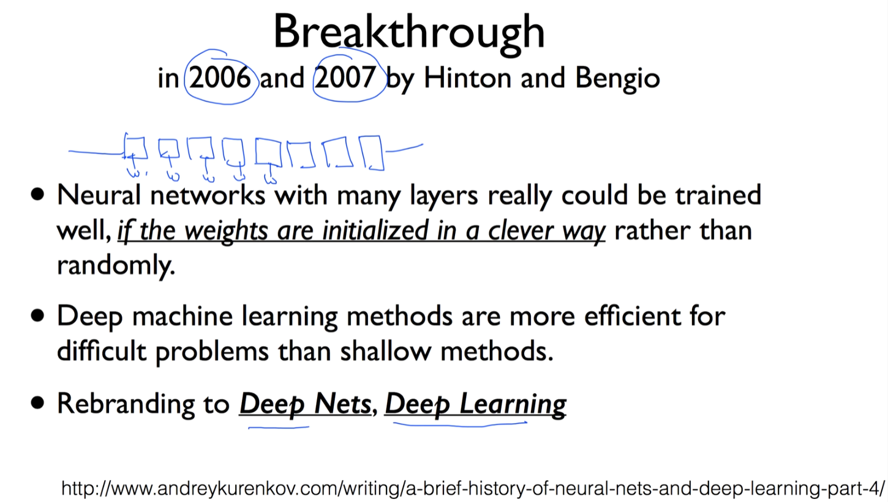

이 두 논문의 내용 - 우리가 이때까지 굉장히 deep한 신경망은 학습할 수 없다고 했다.

알고보니 각각의 w값이 있는데, 처음에 초기 값을 주고 학습시킨다.

초기 값을 우리가 잘 넣어준다면, 잘 선택한다면 학습할 수 있다는 것을 보여준 것이 2006년 논문.

2007년 논문 - 맞아. 초기 값을 잘 주는 게 중요해(확인). 한 걸음 더 나아가서, 깊게, 신경망을 구축하는 굉장히 복잡한 문제를 풀 수 있다. 라는 것을 논문을 통해서 보여주었다.

사람들이 다시 주목을 하기 시작했다.

이 때 우리가 Neural Network이라고 하면 사람들이 쳐다보지도 않으니, 이름을 Deep Nets나, Deep Learning으로 바꾸자 해서 이름을 좀 바꿈.

Deep Learning -> 사람들이 뭔가 다른 것처럼 접근을 해서 관심을 갖고 사용하게 된 계기

이 때부터 다시 신경망에 관심을 가지면서 사람들이 연구를 하기 시작했다.

### IMAGENET Large Scale Visual Recognition Challenge

정말 주목을 받게 된 계기는 바로 여기에 있다.

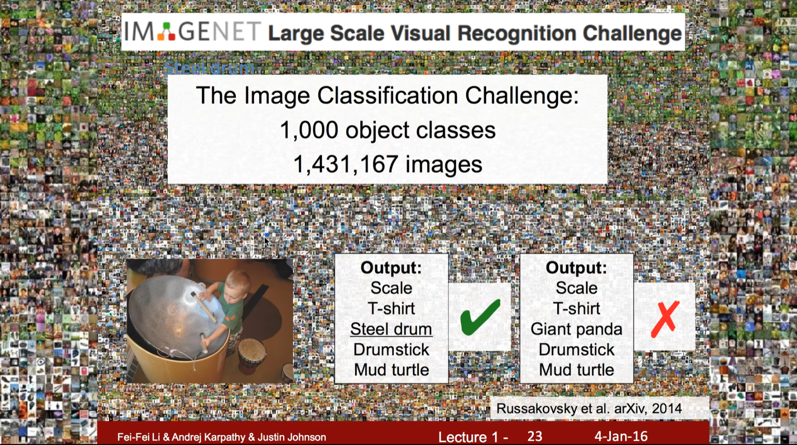

IMAGENET이란 챌린지가 있다.

어떤 그림을 주고, 그림이 무엇인지 맞춰봐. 컴퓨터에게 맞추게 한다.

이것이 쉽지가 않다. 실제 그림을 보면 굉장히 복잡하다. 이걸 컴퓨터가 읽어야 하기 때문에..

### ImageNet Classification (2010 - )

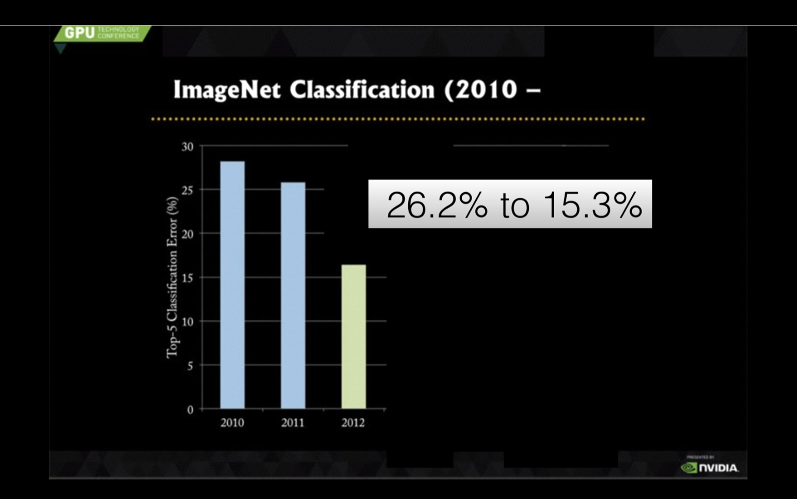

computer vision계에서는 굉장히 중요한 문제로 다루고 있었고, 2010년도에는 약 30%에 가까운 에러율 (70% 맞고 30% 틀림). 매년 1~3%씩 발전하고 있었다. 90% 이상 되어야 사용 가능한 기술.

단순한 계산으로 최소 10년은 있어야 사용되겠다..

2012년, 모두를 깜짝 놀라게 할 만한 결과가 나타난다.

Hinton 교수님 연구실에 있던 Alex라는 박사 과정 학생이, 논문을 쓰는데, 이 시스템을 만드는데(AlexNet), 오류가 26.2% -> 15.3%로 뚝 떨어진다.

그런 후로부터 사람들이 헉 이게 뭐지? 하면서 관심을 가졌고,

### ImageNet Classification (2010 - 2015)

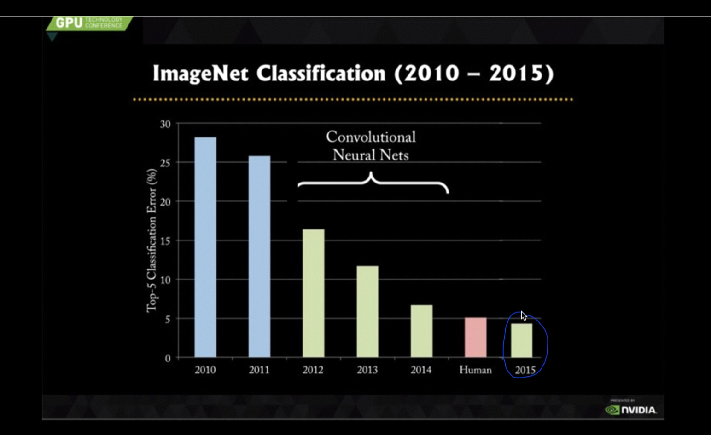

계속 발전해서 작년의 경우, MSRA에 있던 연구자가 만들었던 Neural Network 기반의, Deep Learning 기반의 시스템은 이제 3%대의 에러.

스탠포드 학생이 열심히 그림을 갖고 공부를 해봤는데, 5% 가량의 에러가 났다.

스탠포드 학생이 5%의 에러를 낼 정도로 어려운 문제.

컴퓨터가 더 잘할 수 있게 된 순간!

### Neural networks that can explain photos

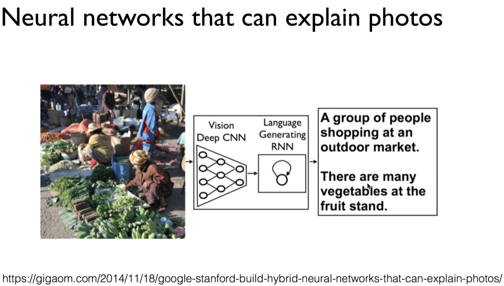

뿐만 아니라, 한 걸음 더 나아가서, 그림의 내부를 맞추는 것이 아니라, 그림을 설명해 봐! 해도 그림을 설명할 수 있게 되었다.

### Deep API Learning*

저희 연구실에서 하는 연구중에 하나가 Deep API Learning

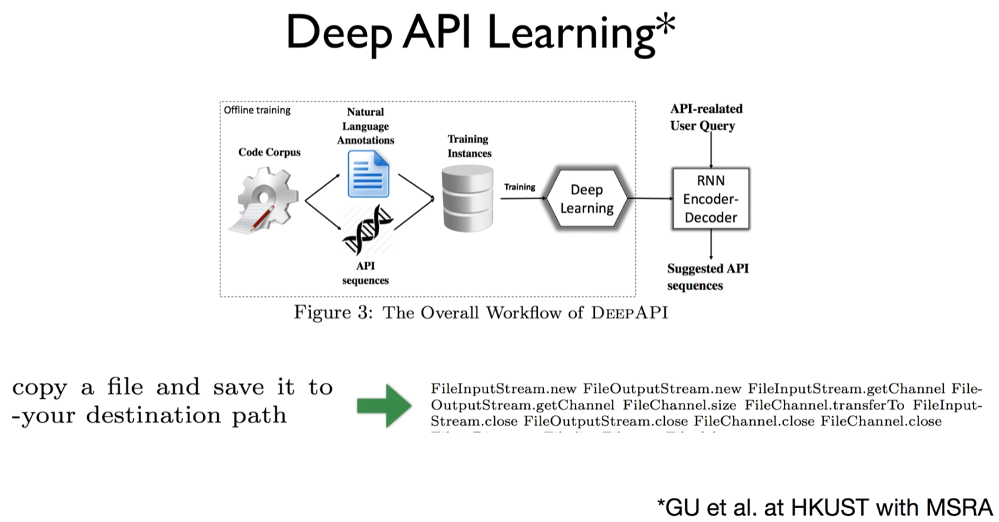.

프로그램 개발하시는 분들은 많이 사용한다. [API]

API라는 것을 자동으로 예측해주자.

여러분들이 사용하시는 자연어로 시스템에게 입력을 준다.

파일을 copy하고 내가 원하는 directory에 저장하고 싶다.

-> 말만 하면 우리 시스템이 자동으로 어떤 API를 써야 하는지, 어떤 순서대로 이 API를 써야 하는지 쭉 나열해준다.

이걸 가져다가 그대로 넣고 변수들만 채우면 프로그램이 완성되겠죠?

아직까지는 바로 프로그램이 생성되지는 않지만, 굉장히 좋은 기술.

무엇보다 이전에 Deep Learning을 사용하지 않았을 때 20~25%의 정확도. 거의 사용할 수 없는 시스템.

Deep Learning을 이용해서 만듦 -> 정확도 65%까지 올라갔다. 굉장히 비약적인 발전.

이것이 바로 Deep Learning을 이용한 결과.

### Speech recognition errors

최근에 바이두에서는 noise가 굉장히 많은, 주변에 소음이 많은 곳에서 사람이 하는 말을 90%정도까지 알아들을 수 있는 굉장히 훌륭한 시스템 개발

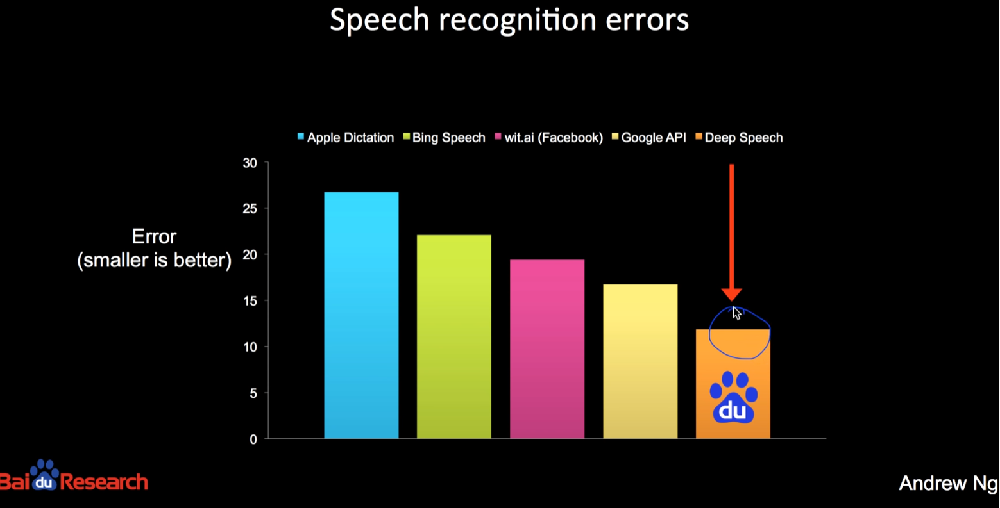

또, Deep Learning을 이용해서 게임 자동으로 하는데, 사람보다 잘 함.

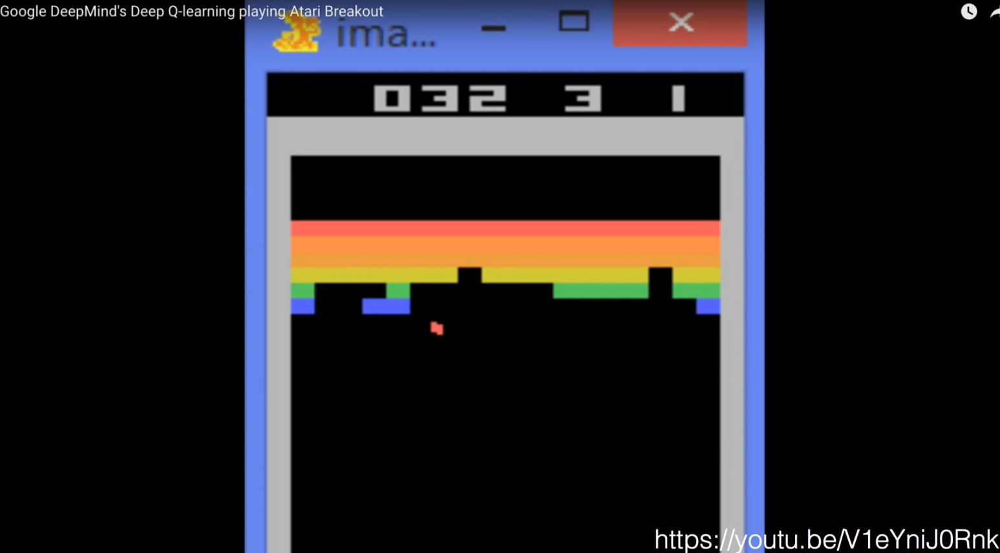

여러분이 보셨던 알파고도 Deep Learning 일부 사용해서 사람의 대표를 이기게 되었다.

### Geoffrey Hinton's summary of findings up to today

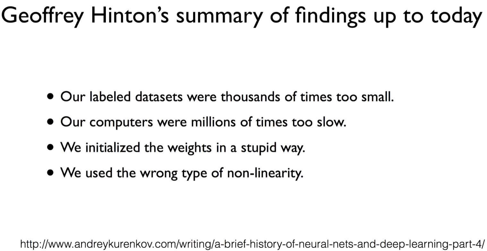

힌튼이 뒤를 돌아보며 왜 이전엔 안되었을까?

네 가지 정도 밝힘.

네 가지 상황 그 다음에 자세히 얘기해보도록 하겠다.

### Why should I care?

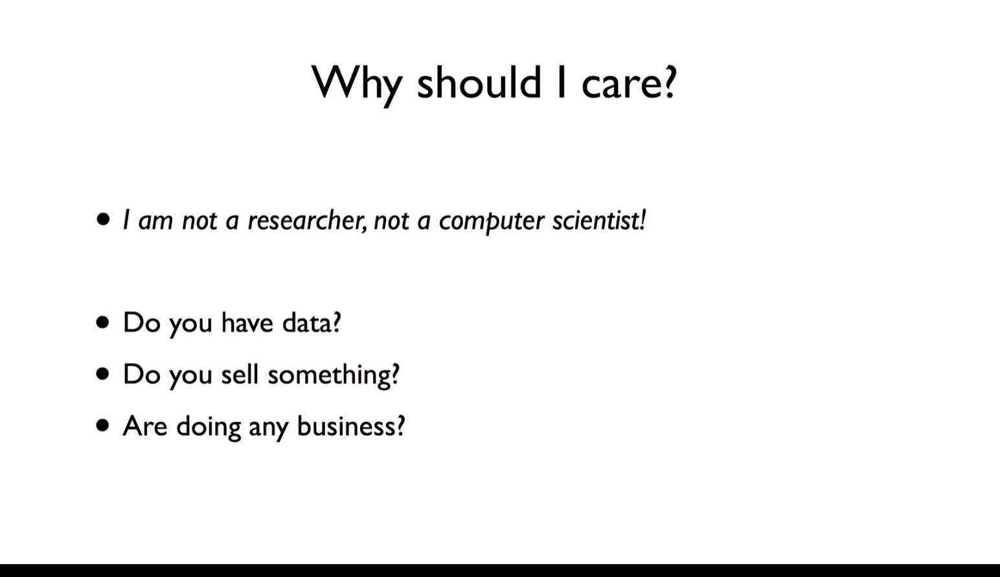

나는 연구자도 아니고, 컴퓨터 공학도 하지 않는데 뭔 상관이야?

여러분이 어떤 데이터를 가지고 있거나, 어떤 것을 팔고 있거나, 어떠한 형태의 비즈니스를 한다 -> 반드시 여러분과 상관이 있고, 알아두시면 굉장히 좋다.

실제로 이런 기술들 실제로 우리 주변에 사용되고 있다.

유튜브 켜시면 자막 나오죠?

사람이 입력해서 나오는게 아니다.

자동적으로 소리를 듣고 만들어낸다.

굉장히 정확하다.(영어)

페이스북

쓸 때마다 좋아진다.

여러분들에게 관심이 갈 만한 피드들만 학습을 통해 보여준다.

구글 검색엔진

단순하게 내가 키워드, 문장에 있는 문서만 보여주는 것이 아니라, 제가 좋아하는/클릭할 만한 어떤 문서를 학습을 통해 예측한 뒤 그것을 보여준다.

이런 형태로 서비스하면, 따라잡기 어려워진다.

넷플릭스

굉장히 유명하다.

추천 시스템을 통해 굉장히 성장했던 회사

아마존

역시 이 추천 인공지능, 머신러닝을 잘 구현해서 성공한 사례

홍콩 하면 물건을 굉장히 잘 파는 곳으로 알려져 있다.

가게를 하더라도 딥 러닝을 이용해서 데이터를 학습시키면, 손님들이 어떤 물건을 잘 사는지, 앞에 어떤 물건을 내야 할지, 어떤 것을 진열해야 할 지를 예측해서 매출을 굉장히 올릴 수가 있다.

### Why Now?

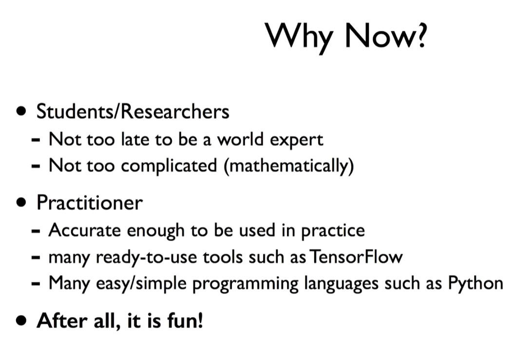

여러분이 연구자나 학생이라면, 이 분야에 과감하게 뛰어들기를 권장합니다.

왜냐하면, 지금 시작해도 세계적인 전문가가 되기에 늦지 않았다.

또, 이것이 설명드렸던 것처럼 복잡하지도 않고, 수학적으로 복잡하지도 않다. -> 누구나 시작해볼 수 있다.

실용적으로 쓰고 싶다 -> 이전과 달리 현재의 딥러닝은 90% 이상의 정확도를 가짐.

실제로 여러분의 매출을 올려주고, 여러분들의 삶을 도와줄 수 있는 수준이 되었다.

TensorFlow같은 tool이 많이 공개되어 있다.

쉬운 프로그래밍 언어 Python같은거로 프로그래밍 학습하시면서 인공지능, Deep Learning을 충분히 배워서 활용하실 수 있다.

무엇보다도 이 분야가 굉장히 재밌는 분야이기 때문에, 한 번 해 보시면 그 재미를 보실 수가 있을 것입니다.

### Next: Neural Nets Basic with XOR!

다음 시간

우리가 가장 첫 번째 난관이었던 XOR 문제를 어떻게 푸는지 이야기해보자.