https://www.youtube.com/watch?v=ZYX0FaqUeN4&list=PLlMkM4tgfjnLSOjrEJN31gZATbcj_MpUm&index=24


### Lab 8 Tensor Manipulation

이번 실습 시간에는 tensor를 다루는 방법에 대해 얘기해보겠다.

뒤로 갈수록 tensor 좀 복잡해지기도 한다.

이거만 잘 사용하시면 tensorflow 굉장히 쉽게, 원하는 모델을 만들 수 있다.

https://github.com/hunkim/DeepLearningZeroToAll/blob/master/lab-08-tensor_manipulation.ipynb


### Simple ID array and slicing

1차원 array

`t = np.array([0., 1., 2., 3., 4., 5., 6.])`

김밥을 보면 1차원 array를 생각하면서 먹기도 하는데요..

0번째, 1번째, 2번째 element 요렇게 element의 이름을, 번호를 매길 수 있다.

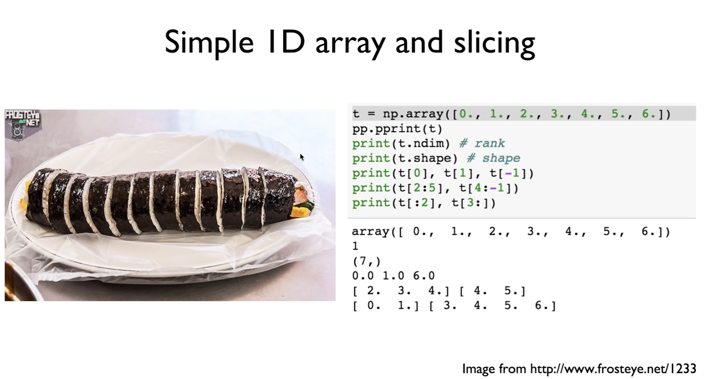

1차원 array를 만든 다음에..

array를 나타내는 게 몇 개?

rank, shape

몇 차원 array? rank

array 어떻게 생겼냐? rank

1차원이니까 숫자 하나만 나온다


1차원 array 굉장히 간단.

특정한 자리에 있는 김밥 고르기.

t에 인덱스 주면 된다.

-1 특별한 의미. 맨 뒤에 꺼.

김밥 하나씩이 아니라 여러 개를 먹기도 가능.

slice

column을 두고..

slicing -1 끝 바로 앞까지

slicing할 때 앞에 번호 적어도 되지만, 비워놔도 됨.


이렇게 1차원에서는 array를 쉽게 볼 수도 있고, 쉽게 뽑아먹을 수도 있고, slicing도 가능.

차원 늘어날수록 복잡한 느낌 든다.


### 2D Array

사실 2차원 array 하나만 보면 1차원 array죠? 1차원 array 여러 개 섞어놓은 것밖에 없다.

같은 원리로 접근하면 된다.

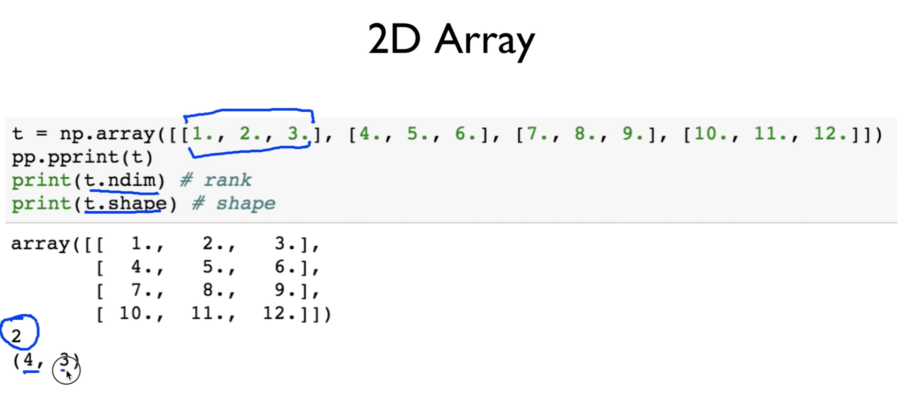

rank 2.

shape (4, 3)

요렇게 우리가 array를 줄 수 있다.

3 요게 보통 가장 안쪽에 있는거죠?

1, 2, 3 세 개니까, 3이 된다.

요런 것이 네 개 있으니까 4.


### Shape, Rank, Axis

다시 한 번만 정리하고 가자.

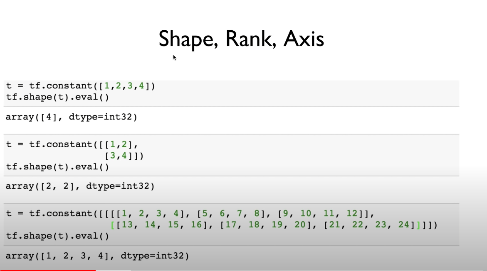

Shape, Rank, Axis(축)

세 개를 주어진 tensor에 대해서, matrix에 대해서 이해하시면 훨씬 편해집니다.


1차원 array 쉽죠?

rank=1 (1차원)

shape은 어떻게 될까요? [4]

tensorflow에서 shape 볼 수 있다.


2차원으로 움직이자.

element 2개 -> 요런게 두 개 있으니까 shape이 [2, 2]

rank는 몇이 될까요?

맨 앞에 있는 [ (angle bracket, 각괄호) 개수 2개

rank 2가 된다.

shape은 rank가 2라는 것은, s(?, ?)

rank가 1이면 (?)가 되겠죠?

s(?, ?) 이 ? 어떻게 아느냐?

가장 안쪽에 있는(젤 뒤에 있는) 것부터 알 수가 있다.

가장 안쪽에 있는 각괄호를 타고 끝까지 가서 있는 element를 보면 된다.

s(?, 2)

이제 [1, 2]를 x라 보고, [3, 4]를 y라 본 뒤, 요게 몇 개 있는지 본다.

2개가 있죠?

s(2, 2)

이렇게 우리가 주어진 shape, rank 구할 수 있다.


좀 복잡한 걸 해보자.

일단 rank 얼마? 각괄호의 개수라했죠?

rank = 4

그 얘기는 아래와 같다.

shape = (?, ?, ?, ?)

4개.. 어떻게 찾느냐? 일단 끝까지 들어간다.

[1, 2, 3, 4]

shape = (?, ?, ?, 4)

그 다음에.. [1, 2, 3, 4] 요런 것을 x, y, z로 두자.

요게 세 개다. 

shape = (?, ?, 3, 4)

그 다음에 요 전체를 x라 두자.

똑같은거 밑에도 있죠? y라 두면..2개

shape = (?, 2, 3, 4)

끝에 하나 더 남아있다. 전체를 묶으면 한 개..

shape = (1, 2, 3, 4)

이게 shape이 된다.

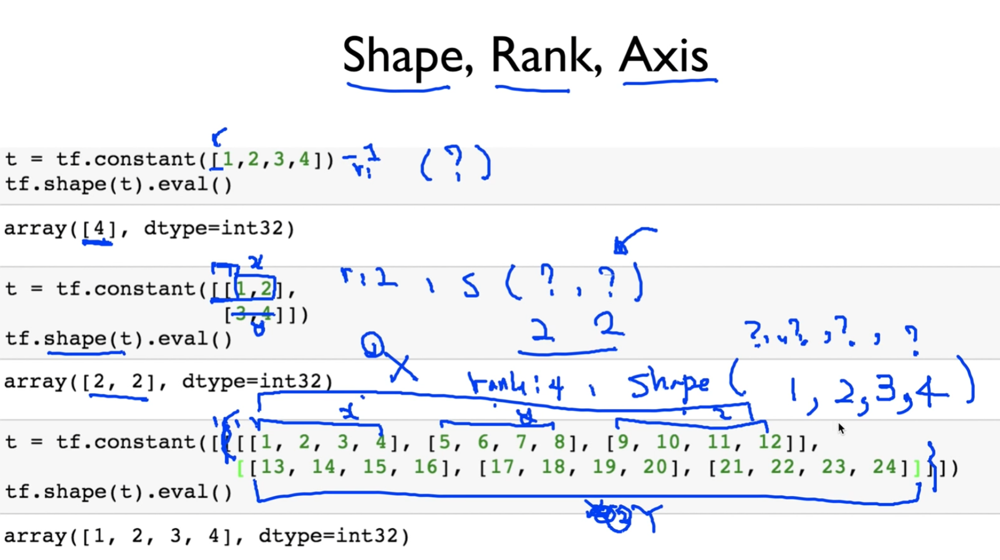


좀 복잡했지만, 요렇게 풀어보면.. shape이란 걸 조금 이해할 수 있다.

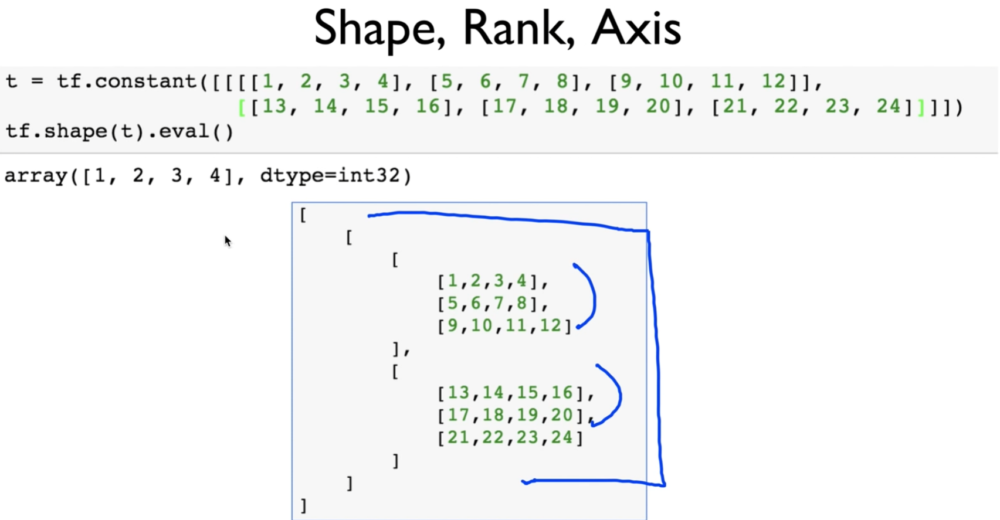


여기서 축(Axis)이라는 개념을 볼 수 있다.

랭크 얘기했죠? 4

4개의 축이 있다고 보시면 된다.

축에 각각의 번호를 매긴다.

젤 안쪽부터..

1, 2, 3, 4 각각의 axis = 3 (0부터 시작하니까 0, 1, 2, 3)

제일 바깥의 축은 axis=0이 되겠죠?

마지막에 있는 축은 axis = -1이라고도 본다.

가장 안쪽에 있는 값들을 나타내는 축이다.

Axis 이렇게 하는구나. 가장 안쪽에 있는 값이 가장 큰 값.

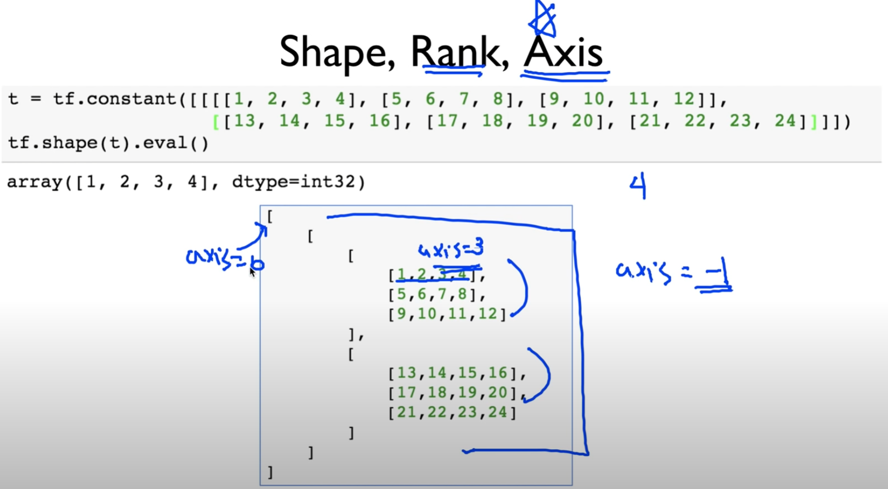

바깥으로 나갈수록 0

0부터 시작해서 쭉 안쪽으로 들어오는구나 생각하면 된다.


### Matmul VS multiply

우리 이제 기본적으로 shape 이해

shape 이해 중요 - matrix같은 거를 곱하기를 할 때 shape이 맞아야 한다.

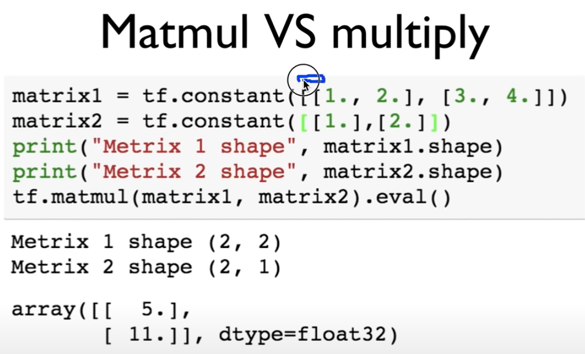

matrix1 shape이 어떻게 되나요?

각괄호 2개죠? (?, ?)

안에가 2개죠? (?, 2)

이런게 2개죠? (2, 2)


matrix2의 shape은 뭘까요?

각괄호 2개죠? (?, ?)

안에 몇 개 들어있습니까? (?, 1)

요런 게 몇개인가요? (2, 1)

matrix 곱을 할 때에는 앞의 뒤에꺼랑 뒤의 앞에꺼가 맞아야 하죠?

(2, 2)와 (2, 1)의 matrix 곱을 하게 되면, (2, 1)의 matrix가 나온다.


실제로 곱해보자.

```python
tf.matmul(matrix1, matrix2).eval()
```

```python
array([[ 5.],
       [ 11.]], dtype=float32)
```

tensorflow의 matmul 이용해서 곱.

요렇게 곱해서 예상했던 것처럼.. 나오게 된다.

우리가 많이 사용했던 form.

항상 shape을 잘 생각하셔야 이 연산이 바르게 이루어진다.


그런데 가끔 헷갈려서 matrix를 생각하지 않고 이런 일반 곱하기를 하는 경우가 있다. (실수로)

`(matrix1*matrix2).eval()`

```python
array([[ 1.,  2.],
       [ 6.,  8.]], dtype=float32)
```

또는 의도할 수가 있겠죠?

그렇게 했을 때 결과 값은 이전의 matmul과 상당히 다르다, 같지 않다는 것을 유념해야 한다.

의도적으로 했다면 상관 없지만, 실수로 이런 곱하기를 하게 되면 결과가 사라져버린다.

반드시 내가 matrix 곱을 하고 있는 것인지, 그냥 일반 곱을 하고 있는 것인지 잘 보셔야 한다.


### Broadcasting

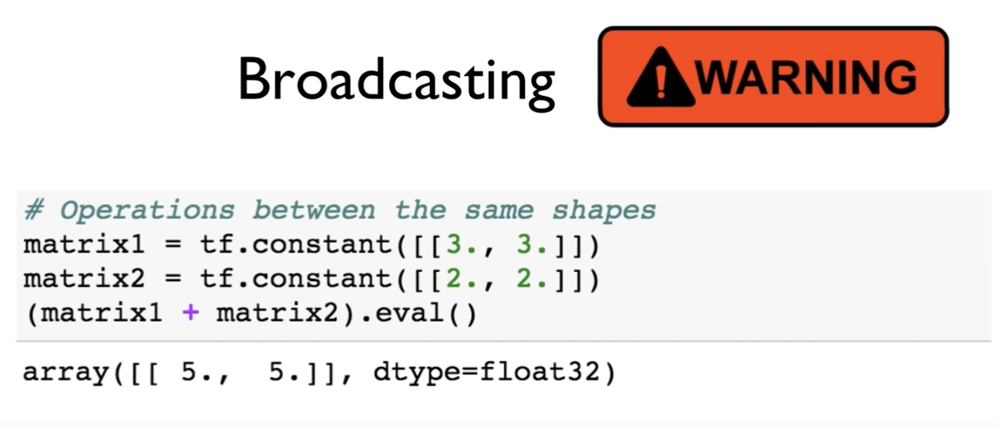

여기서(직전 * 연산에서) *가 일어난 이유는, Broadcasting이란 개념 때문.

Broadcasting - 굉장히 유용하지만 잘못 사용하면 굉장히 독이 될 수 있기 때문에, 굉장히 주의하셔야 한다.

위 matrix1의 경우, matrix가 2개 있죠?

이제 shape이 뭔지 아시겠죠? 다 아실텐데,

matrix1, matrix2 두 개를 더하면 어떻게 될까요?


예상했던 것처럼, 두 개의 shape은 같은 shape이기 때문에 일대일로 매핑되어서,

각 element-wise 더하기가 된다.

[5., 5.]가 되어서 우리가 원하는대로 나왔다.


그런데, shape이 다르더라도 연산을 해줄 수 있게 해주는 것이 Broadcasting

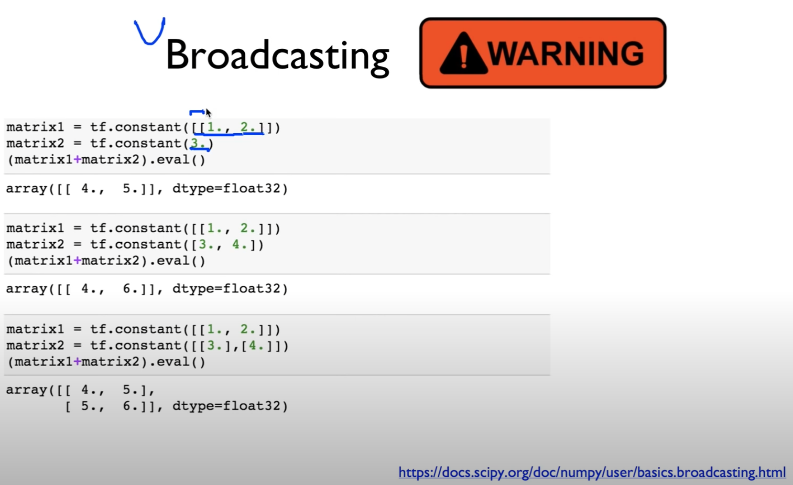

rank 2인 2차원 array에 3 -> 격이 맞지 않는다.

격을 맞춰주는 게 Broadcasting

[[3., 3.]]

-> [[4., 5.]] 요런 결과를 만들어낸다.


아예 rank가 다를 때에도 가능 [중간]


서로 다른 형태로 생긴 tensor일 경우에도 앞에도 extend, 뒤에도 extend해서 값을 만들어준다.


여러분들이 이 Broadcasting을 잘 아신다면 굉장히 powerful

잘 모르고 사용하면 우리가 생각하지 않은 값이 만들어진다.


가급적 여러분들이 Broadcasting을 사용하고 싶더라도, 앞뒤에 shape을 잘 고려하시고,

필요하다면 같은 shape을 만들어서 연산을 만드는 것이 좋다.


### Reduce mean

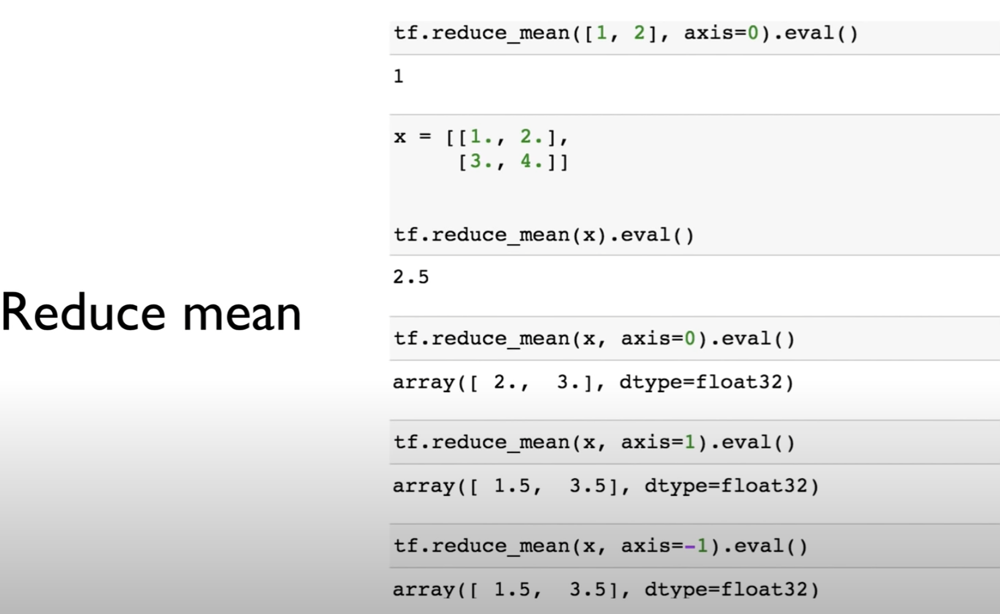

인제 우리가 많이 사용했던 Reduce mean의 정체를 보자.

Reduce mean이라는 것은 말 그대로 어떤 평균을 구하는데, 줄여서 구한다.

어떤 행렬에서 값이 여러 개 있는데, 그것을 하나로 줄여준다.


[1, 2]의 평균을 구해본다.

integer의 평균 1.5일 것 같은데 1이 나온다..

이런 mean을 구할 때에도 값이 integer인지 float인지 주의하셔야 하는 걸 여기서 보여드렸다.


대부분 평균을 계산할 때에는 여기가(안쪽이) floating point 값이라는 것을 여러분들이 기억해두시면 좋다.


이전에서 우리가 rank, axis 축을 다루었다.

축 한 번 보고 들어갈까요?

축 어떻게 시작한다고 했죠?

제일 안쪽에 있는 게 제일 큰 값이 되죠?

rank가 2개 있으니 축이 0축, 1축이 있다.

[1., 2.] 여기가 바로 axis=1이 될 꺼구요,

세로로 보는 것이 axis=0이 될 겁니다.

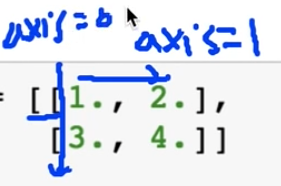

그리고, 제일 마지막에 있는 것은 우리가 -1이라고 할 수 있겠죠?


요런 경우를 보자. 우리가 평균을 구하는 데, axis=0으로 해서 평균을 구해라.

`tf.reduce_mean(x, axis=0).eval()`

1, 3의 평균은 2, 2와 4의 평균은 3

[2., 3.]


axis=1로 하면 어떨까요?

`tf.reduce_mean(x, axis=1).eval()`

1.5 -> 1, 2의 평균

3.5 -> 3, 4의 평균

[1.5, 3.5]


같은 reduce_mean을 쓰더라도 축(axis)에 따라 다른 값이 나온다.


축이 -1이라는 것 -> 가장 안쪽에 있는 것을 평균내어라. [여기서는 axis=1과 같다.]


축 없이 그냥 써버림 -> 모조리 다 평균내어라

`tf.reduce_mean(x).eval()`

2.5


### Reduce sum

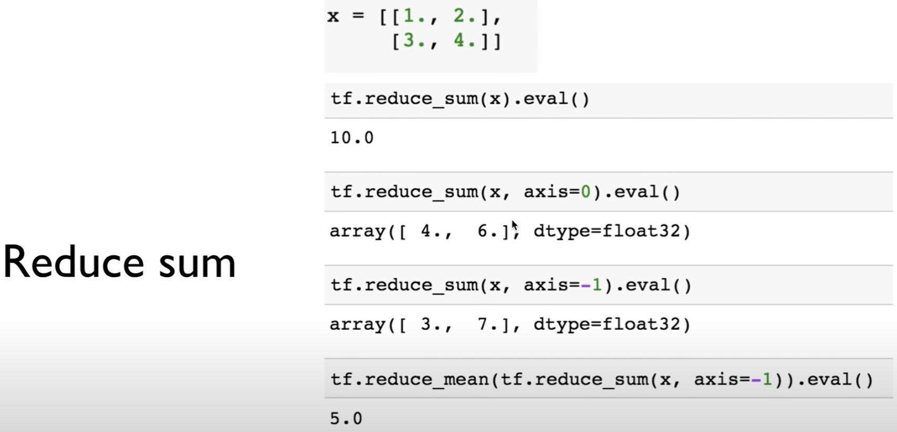

Reduce sum도 마찬가지로 생각 가능.


`tf.reduce_sum(x, axis=0).eval()`

1, 3해서 4가 되고, 2, 4해서 6이 되겠죠?

[4., 6.]


`tf.reduce_sum(x, axis=-1).eval()`

축을 바꾸면 -1로..

1, 2더해서 3이 되고, 3, 4해서 7이 된다.

[3., 7.]


`tf.reduce_mean(tf.reduce_sum(x, axis=-1)).eval()`

보통 우리가 많이 쓰는 것이, 제일 안쪽에 있는 수(axis=-1)를 가지고, 

합을 낸 다음에(reduce_sum),

그것을 평균내는(reduce_mean) 걸 많이 사용했었죠?

많은 질문이 들어왔는데, 왜 이렇게 쓰느냐?

-> 바로 이런 원리로 맨 안쪽에 있는 축을 계산해 먼저 합을 구하고, 

그것을 평균을 냈다. 그렇게 보시면 됩니다.

5.0


### Argmax

또 많이 사용하는 것이 argmax인데요,

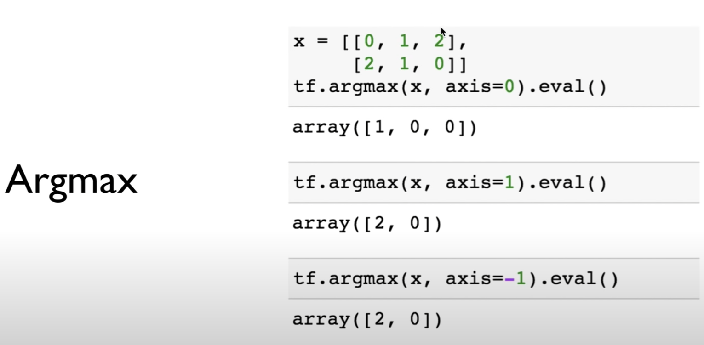

마찬가지로 축의 개념과 같이 해서 사용할 수 있다.

한 번 보시면..


축이 마찬가지로 이렇게 생겼다.

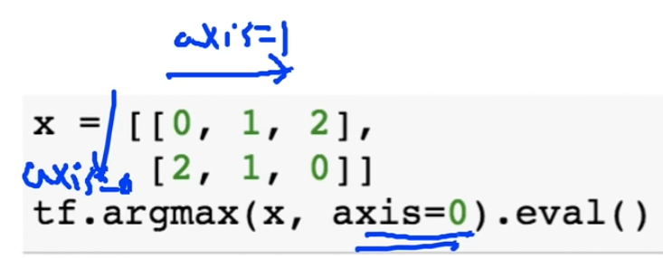

3, 4차원 가면 이만큼 더 많아진다고 보시면 된다.


`tf.argmax(x, axis=0).eval()`

위아래 축?으로 가장 큰 게 무엇인지 골라봐라. [큰 것의 위치]

[1, 0, 0]

[아래 것이 크고, 타이니까 위에꺼 선택, 위에 것이 크다.]


`tf.argmax(x, axis=1).eval()`

축 1로 해라.. 가장 큰 게 뭐냐? 위치가 어디냐?

[2, 0]


`tf.argmax(x, axis=-1).eval()`

argmax는 위치를 구하는 겁니다. 걔가 있는 위치.

[2, 0]

가장 maximum 값의 위치.

기억하시구요,


### Reshape**

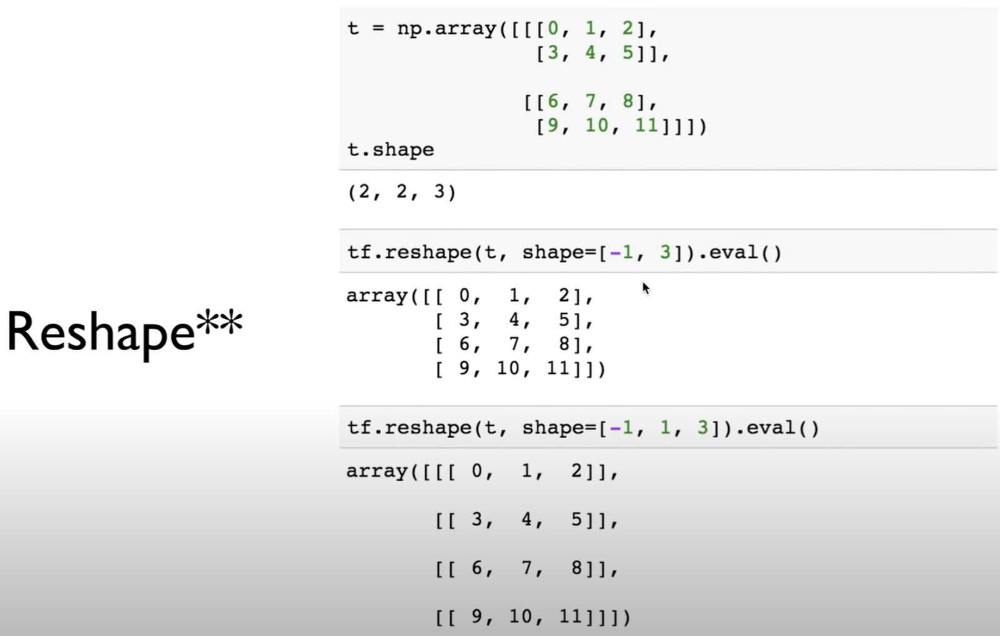

가장 많이 사용하는 것 - Reshape

별 두 개 쳤다.

```python
t = np.array([[[0, 1, 2], 
               [3, 4, 5]],
              
              [[6, 7, 8], 
               [9, 10, 11]]])
```

좀 복잡한 array..

rank 3개, (?, ?, ?)

shape 보면 (?, ?, 3) -> (?, 2, 3) -> (2, 2, 3)

근데 우리가 이것을 요런  형태로 만들고 싶다.

`array([[ 0,  1,  2],       `

​			`[ 3,  4,  5],       `

​			`[ 6,  7,  8],       `

​			`[ 9, 10, 11]])`


이렇게 reshape이라고 주고,

```python
tf.reshape(t, shape=[-1, 3]).eval()
```

안에 꺼는 3, 나머지는 너가 알아서 해[-1]

rank 처음엔 3이었는데 두 개로 주고 싶다. [?, ?]

이런 형태로 내가 원하는 형태의 shape을 줘버릴 수 있다.

-> 이렇게 reshape이 된다.


reshape을 할 때, 처음에는 우리가 가진 소중한 데이터를 reshape해버리면 이상하게 섞여버리지 않을까?

하는 고민도 많이 할 듯..

보통 맨 안쪽에 있는 데이터(여기선 3) 값은 잘 건드리지 않고 그대로 가져간다.

[0., 1., 2.]랑 [3., 4., 5.] 이런 조합은 그대로 가져가면서, 전체적인 shape만 조절한다.

막 섞이거나 하진 않는다. 안쪽의 값들은 거의 같은 값으로 가져가고 바깥의 값들을 조정하면서 전체의 shape를 조정한다.


rank 좀 늘리고싶다

`tf.reshape(t, shape=[-1, 1, 3]).eval()`

```python
array([[[ 0,  1,  2]],

       [[ 3,  4,  5]],

       [[ 6,  7,  8]],

       [[ 9, 10, 11]]])
```

맨 안 쪽의 값은 그대로 가져가고,

이렇게 reshape 가능

이제 여러분들 편하게 reshape 사용하면 좋다.


### Reshape(squeeze, expand)

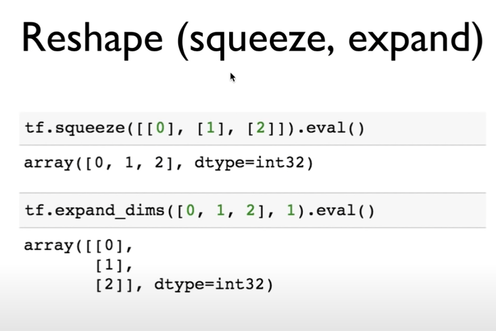

Reshape중에 조금 특별한 것.

그냥 Reshape을 써서 할 수도 있는데..

squeeze, expand 좀 많이 사용한다.


```python
tf.squeeze([[0], [1], [2]]).eval()
```

squeeze 이런 값들을 쫙 펴준다.

```python
array([0, 1, 2], dtype=int32)
```


```python
tf.expand_dims([0, 1, 2], 1).eval()
```

필요에 따라 이런 형태의 dimension 추가

expand_dims. 숫자 1 -> 얼마나 expand 할 것이냐

```python
array([[0],
       [1],
       [2]], dtype=int32)
```

위 형태의 array가 이렇게 바뀌게 된다.

하나의 tensor의 shape을 변경시키기 위한 방법이라고 보시면 된다.


### One hot

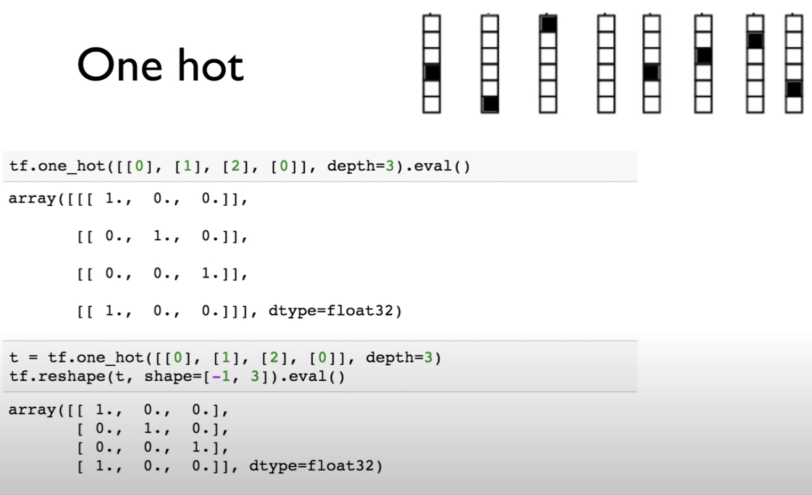

뒤로 갈수록 많이 사용하게 되는 것 중에 하나 -> One hot

어떤 숫자 정보를 가지고 1, 2, 3, 4, 5 이런 식으로 표현하지 않고, 

자리를 보고 3이면 3 자리 하나만 1로 바꿔준다.

0 0 0 1 0 0

요런 형태의 벡터로 3이라는 숫자를 주는 방법 - one hot

이런 경우를 주어진 숫자를 one hot 벡터로 바꾸어야 함.

일일이 할 수도 있지만, tensorflow에 one_hot이라는 게 있다.


```python
tf.one_hot([[0], [1], [2], [0]], depth=3).eval()
```

0이냐 1이냐 2냐, 세 개 값 중 하나를 주게 되면..

depth=3, 전체 값은 3. 이게 몇 개인지..

```python
array([[[ 1.,  0.,  0.]],

       [[ 0.,  1.,  0.]],

       [[ 0.,  0.,  1.]],

       [[ 1.,  0.,  0.]]], dtype=float32)
```

0은 1 0 0이 되겠죠?

1은 0 1 0

2는 0 0 1 마지막 자리가 1이 되고

0은 다시 1 0 0

이렇게 만들어주는, 벡터로 만들어주는 것이 tensorflow의 one hot


자세히 보시면..

맨 첨에 rank 2였잖아요..

밑에꺼 rank 3으로, rank 하나를 자동적으로 expand 하게 된다.

여러분들이 아 나 이거 싫어. 하면 아래처럼 one hot을 한 다음에 reshape를 해주면 된다.


```python
t = tf.one_hot([[0], [1], [2], [0]], depth=3)
tf.reshape(t, shape=[-1, 3]).eval()
```


```python
array([[ 1.,  0.,  0.],
       [ 0.,  1.,  0.],
       [ 0.,  0.,  1.],
       [ 1.,  0.,  0.]], dtype=float32)
```

안에 있는 3개는 그대로 keep하고,

그 대신 rank좀 없애줘 -> 이런 식의 rank가 생겨난다.

필요하면 여러분들이 원하는대로 reshape할 수 있다는 것 참고하시면 좋다.


### Casting

Casting이라는 것 많이 사용한다.

```python
tf.cast([1.8, 2.2, 3.3, 4.9], tf.int32).eval()
```

주어진 tensor가 있는데, 요거를 integer로 바꿀래

``` python
array([1, 2, 3, 4], dtype=int32)
```


재밌는 것 중에 하나

True, False 값을 가진 것을 0이나 1로..

```python
tf.cast([True, False, 1 == 1, 0 == 1], tf.int32).eval()
```

어떨 때 많이 사용할까요?

accuracy같은 것을 계산할 때, True가 많이 나온 것들의 갯수를 알고 싶다.

-> 다 1로 바꾼 다음에 합하면 되겠죠?

```python
array([1, 0, 1, 0], dtype=int32)
```


1과 0의 값으로 변경이 된다.


### Stack

Stack이란 것도 많이 사용한다.

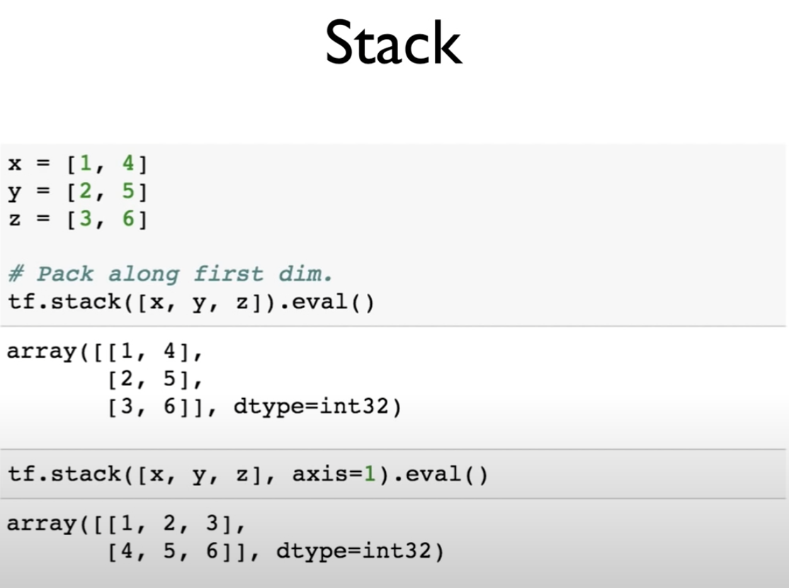

이런 형태의 array가 있으면..

stack -> 쌓는다는 뜻. 어떻게 쌓을래?

```python
x = [1, 4]
y = [2, 5]
z = [3, 6]

# Pack along first dim.
tf.stack([x, y, z]).eval()
```

이렇게 하면 x, y, z를 이렇게 쌓아준다.


```python
tf.stack([x, y, z], axis=1).eval()
```

축이라는 것, 개념 이전에 설명드렸죠?

축을 바꿈으로써 쌓는 것의 방법을 바꿀 수 있다.

```python
array([[1, 2, 3],
       [4, 5, 6]], dtype=int32)
```

여러분들이 축 개념을 아시니까, 축을 바꿔가면서 0, 1, -1 해보시면서 

축과 stack의 관계를 어떻게 되는지 보시면서 사용하면 될 듯.


### Ones and Zeros like

또 많이 사용하는 것이, 우리가 주어진 형태의 tensor가 있다.. [어떤 값이 들어있겠죠?]

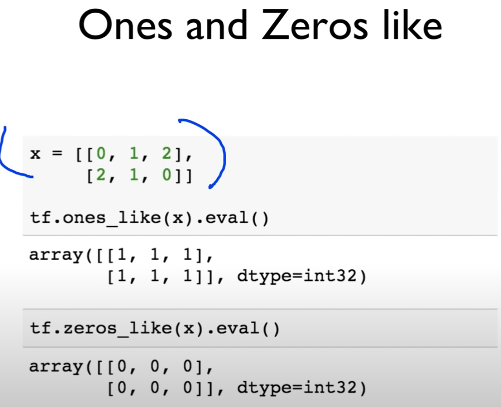

이거랑 비슷한, 모양이 똑같은 것으로 0으로 / 1로 들어있는 tensor를 만들고 싶어

-> Ones and Zeros like


```python
x = [[0, 1, 2],
     [2, 1, 0]]

tf.ones_like(x).eval()
```

x랑 똑같은 모양의 1로 채워진 tensor를 만들어준다.


```python
tf.zeros_like(x).eval()
```

0으로 채워진 tensor를 만들어준다.


내가 어떤 shape을 가지고 있다, 똑같은 shape의 0과 1 만들어주세요 할 수 있는 것이 바로 이 것.


### Zip

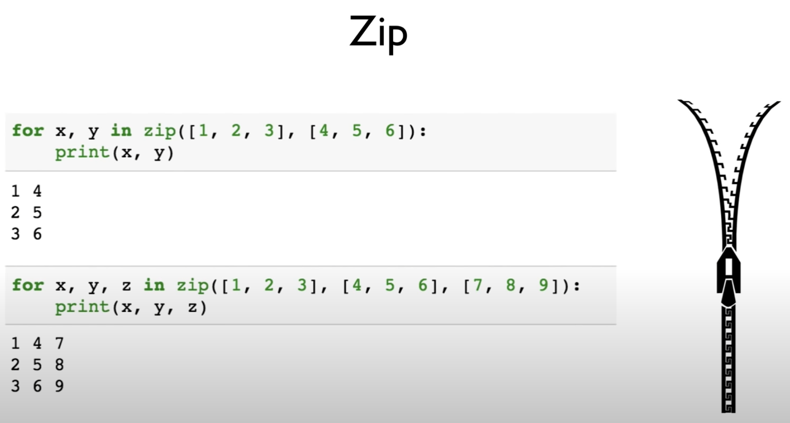

거의 마지막으로, 우리가 이제 여러 형태의, 한 개가 아니라 복수 개의 tensor를 가지고 있다.

for loop같은 것을 통해서 한 번에 쫙 실행시키고 싶다 -> python에서 많이 사용하는 zip

이거도 우리가 많이 사용하게 될 것.


```python
for x, y in zip([1, 2, 3], [4, 5, 6]):
    print(x, y)
```

```python
1 4
2 5
3 6
```


```python
for x, y, z in zip([1, 2, 3], [4, 5, 6], [7, 8, 9]):
    print(x, y, z)
```

```python
1 4 7
2 5 8
3 6 9
```


이번 시간에는 이런 걸 얘기하다보니,

사실 tensorflow라는 실습 굉장히 재미가 있는데

이번 실습 시간에는 숫자만 다루고 복잡해서 조금 지루하셨을 것..

여러분 다 하실 필요는 없고, 이런 게 있다 슥 훑고 지나간 다음에, 여러분들이 필요할 때마다 하나하나씩 그렇게 가시면 완벽하게 이 강에서 저 강까지 충분히 건너가실 수 있을 것


### Lab 9-1 NN for XOR

이 기본적인 지식을 가지고, 다음 시간부터 Neural Net으로 한 번 깊게 들어가보도록 하겠습니다.