https://www.youtube.com/watch?v=GYecDQQwTdI&list=PLlMkM4tgfjnLSOjrEJN31gZATbcj_MpUm&index=25


### Lecture 9-1 Neural Nets(NN) for XOR

Neural Network를 가지고, 골칫거리였던 XOR 문제를 어떻게 풀 수 있는지 살펴보자.


### One logistic regression unit cannot separate XOR

이 XOR이 굉장히 간단했지만, 초창기 많은 Neural Network 연구자들에게 큰 절망을 주었던 문제.

하나의 모델로는, 하나의 유닛으로는 이 문제를 절대로 풀 수 없다는 것이 수학적으로 증명되기까지 했고, 그렇기 때문에 많은 사람들이 Neural Network는 잘 안된다고 믿었던 계기가 되었다.

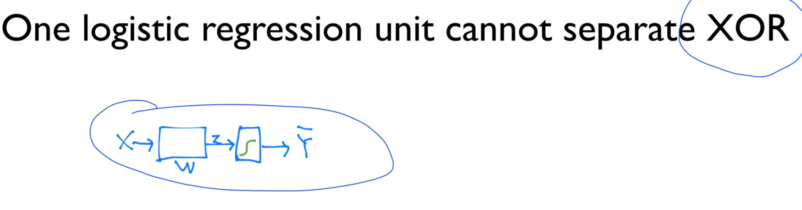


### Multiple logistic regression units

그런데, 이 하나가 아니라, 두 개, 혹은 세 개를 합치면 어떻게 될까?

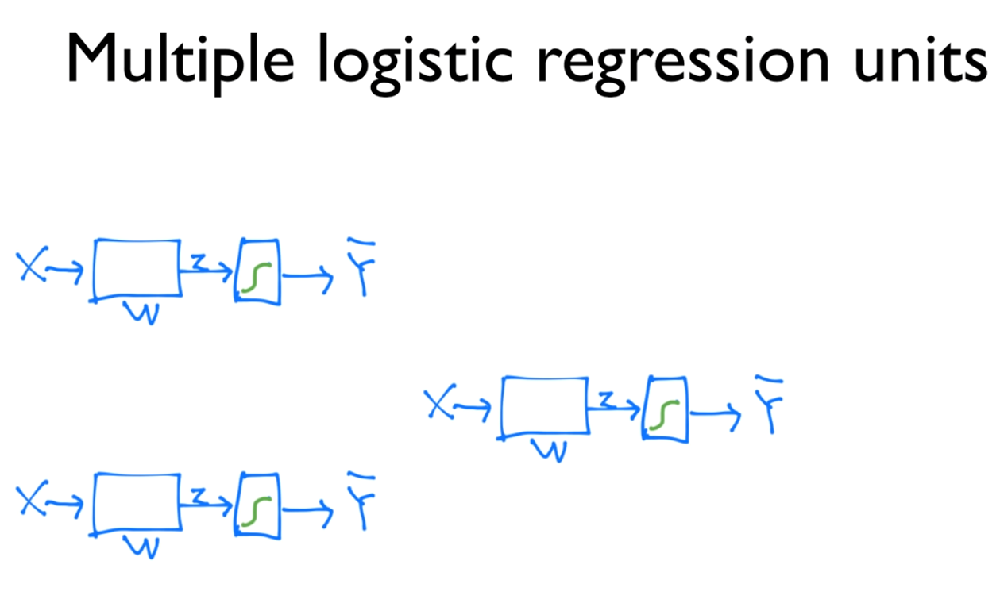


### Neural Network(NN) "No one on earth had found a viable way to train*"

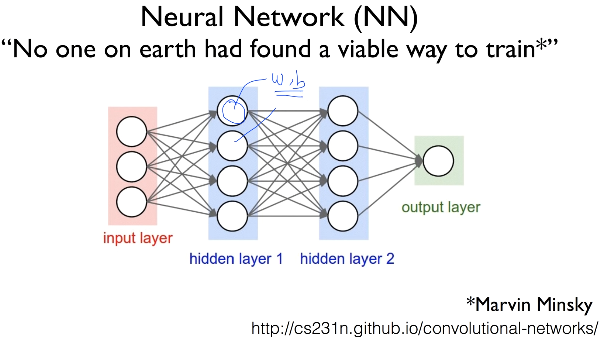

그렇게 하면 풀 수가 있다. 그런데, 그 당시에 또 나왔던 얘기가

풀 수는 있지만, 각각의 복잡한 Network에 들어가 있는 weight과 bias를 어떻게 학습할 수 있나? 불가능하다.

이런 얘기.. 한 번 해보자.


### XOR using NN

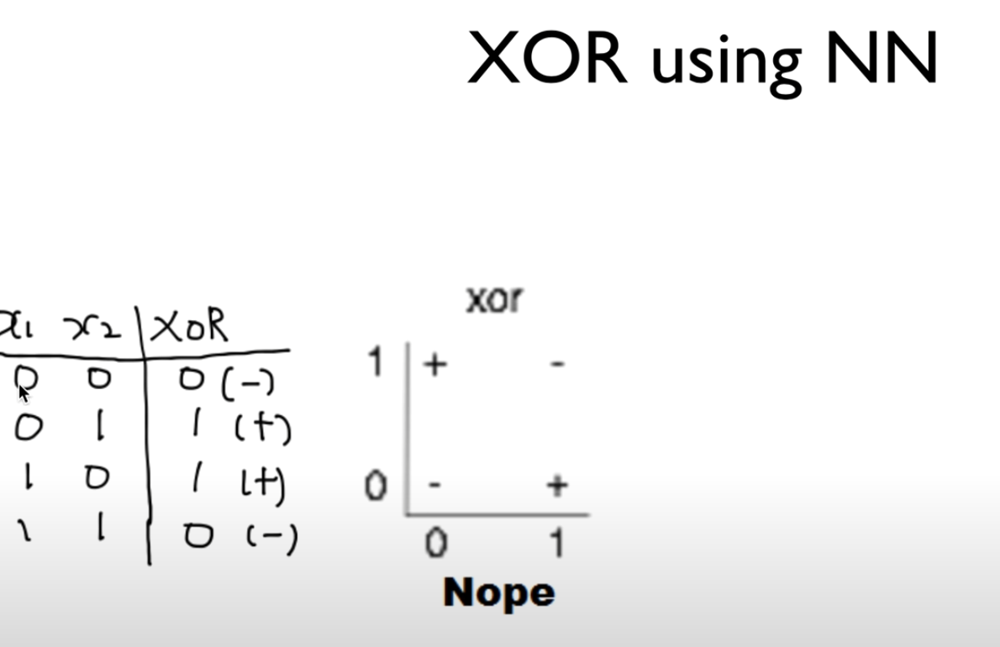

오늘 이 비디오에서는 NN으로 XOR이 가능한 것인가 살펴보도록 하겠습니다.

이것이 XOR의 속성. 다시 한 번 짚고 넘어가면

x1이 0일 때, x2가 0일 때, 0이 되고,

둘 중의 하나가 1이면 1이 되고,

둘 다 1이면 0이 된다.

그림으로 보여주면 위와 같은 형태.

linear하게는 +, -로 구분할 수 있는 선을 찾을 수가 없다.


### Neural Net

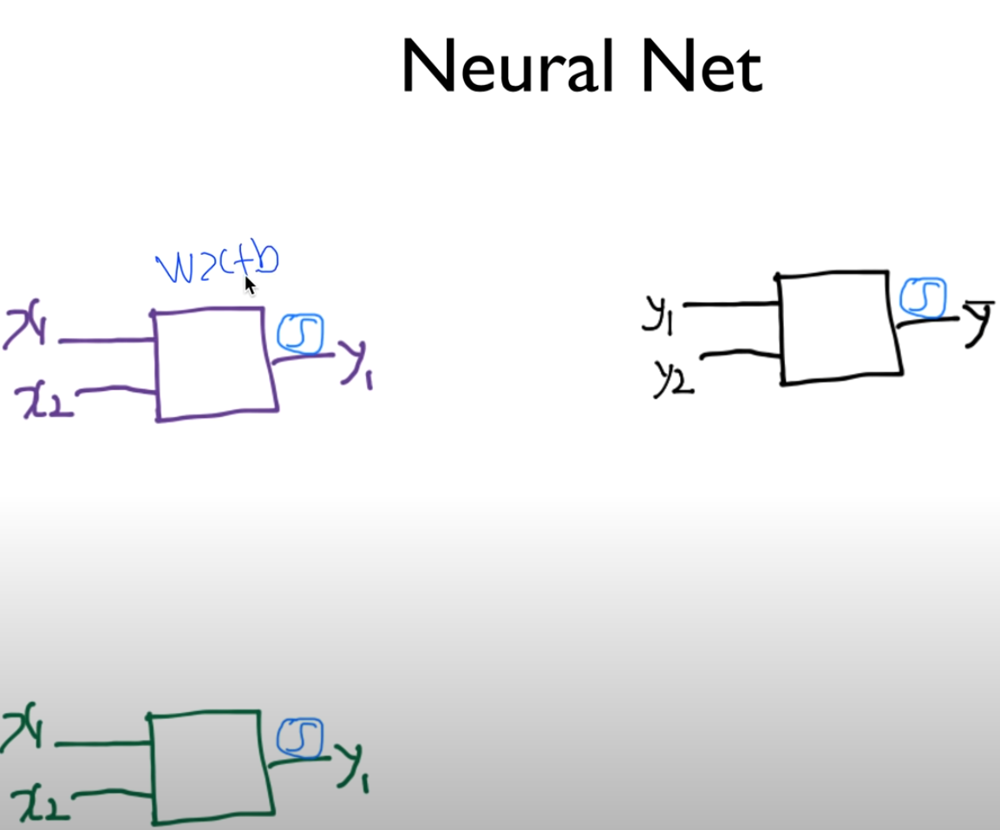

이 문제를 우리가 세 개의 Network을 가지고 풀어보겠다.

하나의 Network는, 하나의 unit이 logistic unit인 것 같다.

[Logistic unit is **an item of any composition established for transport and/or storage which needs to be managed through** the supply chain]

두 개의 입력을 받고, 앞에 sigmoid를.

안쪽의 연산은 단순하게 wx+b로 표현할 것입니다.


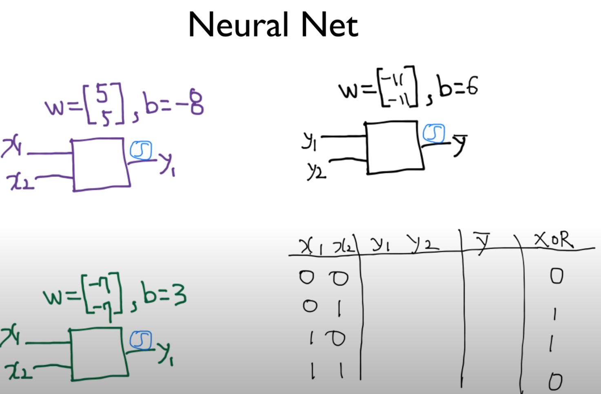

그러면, 이 값을 어떻게 구하는지는 다음 시간에 살펴볼 것.

일단 되는지, 이것을 Neural Network로 과연 가능한지를 살펴보기 위해서, 이런 weight들이 주어졌다고 생각해보자.

그런 다음에, 우리가 실제로, 예를 들어 첫 번째 유닛은 weight이 [5, 5]로 주어지고, bias는 -8로 주어지고

두 번째 유닛은 weight이 [-7, -7]로 주어지고, bias는 3으로 주어지고,

앞에 sigmoid 처리를 하고, 검은 색의 input이 이렇게 연결되면..

이것이 최종적으로 결과를 내고, 이거의 weight은 [-11, -11], bias=6 이런 식으로 주어진다고 가정.

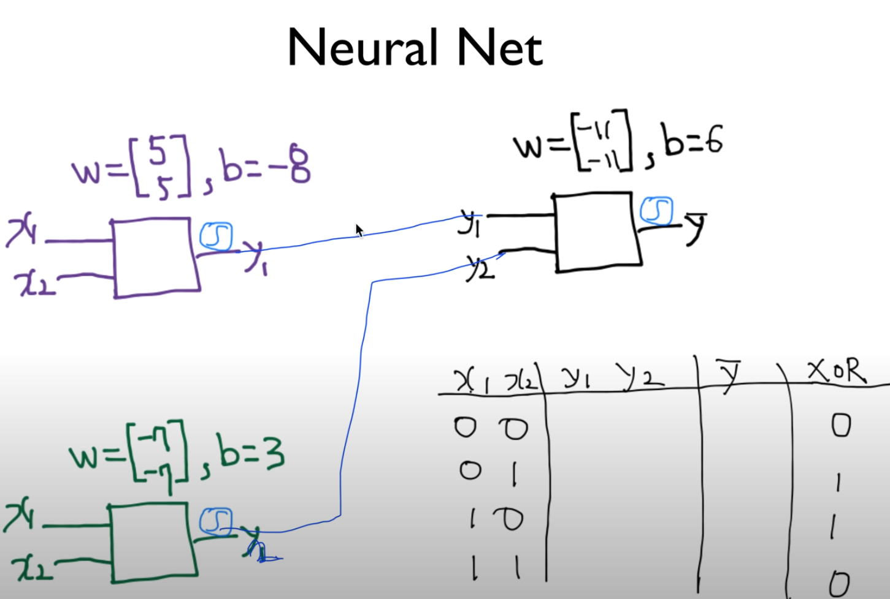

실제로 이 값을 넣어서 이렇게 되는지 확인한다.


##### 우선 네 가지 케이스가 있으니.. 첫 번째 케이스를 해보자.

x1=0, x2=0 초록, 보라에 입력

주어진 weight, bias로 계산

[0, 0] {5, 5} - 8 = -8, y1 = s(-8) = 0

sigmoid를 간단하게 s라 하자.

y1 = 0

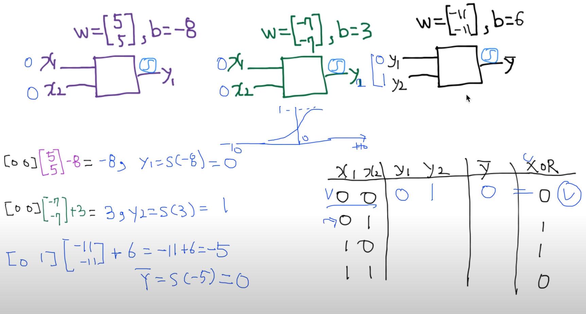

y2는 어떻게 될까요? x1=0, x2=0

[0, 0] {-7, -7} + 3 = 3, y2 = s(3)  = 1

y1=0, y2=1

최종적으로 마지막 출력 어떻게 되는지 보자.

[0, 1] {-11, -11} + 6 = -5

y햇 = s(-5) = 0

원래 원하던 XOR 값이 0이기 때문에 맞았다. 좋은 출발.


##### 이제 0과 1을 해보자.

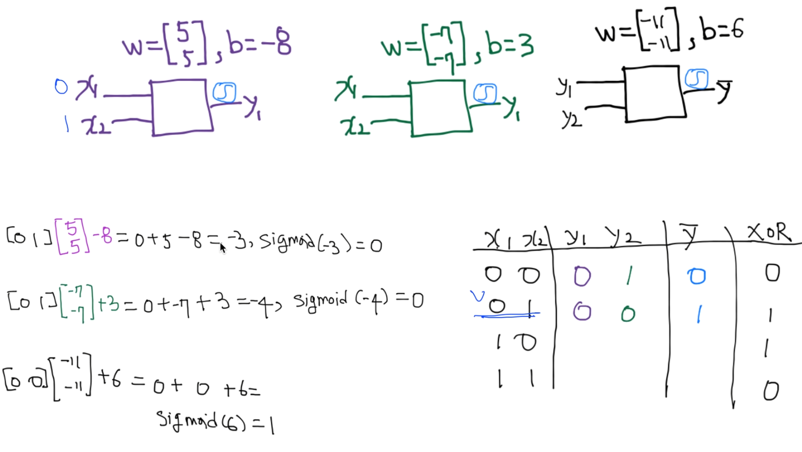

x1=0, x2=1 케이스를 본다.

아까와 똑같이 한다.


y1=0, y2=0이 되는 케이스.

y햇 = s(6) = 1 여기도 y햇 = XOR, 잘 된 케이스.


##### 그 다음 값도 보자.

x1=1, x2=0 케이스를 본다.

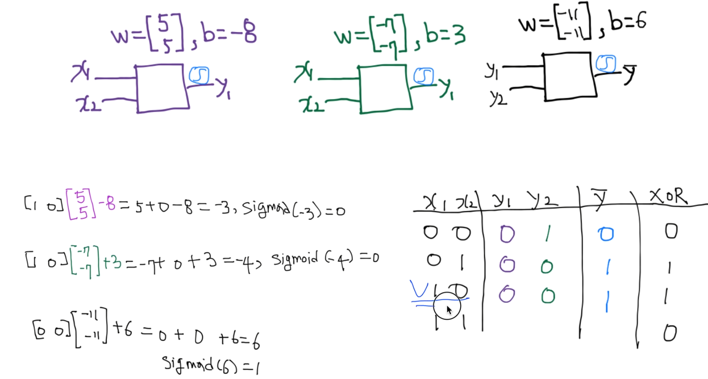

y1=0, y2=0

아까 0 0일 때 했었죠?

y햇 = s(6) = 1

다 맞았죠?

마지막 x1=1, x2=1이 맞는지만 확인해서, 이 케이스만 맞으면 우리가 만들어놓은 이 network이 우리가 원하는 XOR 문제를 해결할 수 있다.


##### x1=1, x2=1 케이스를 보자.

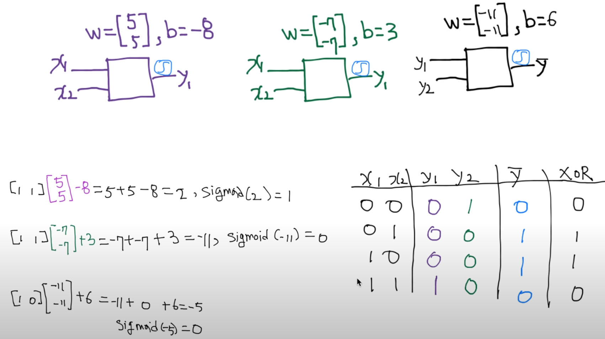


y1=1, y2=0

계산해보면.. -11 + 0 + 6 = -5

y햇 = s(-5) = 0

이 값도 (XOR 결과와) 맞았다.


따라서 이런 weight과 이런 bias를 가진 세 개의 network, 세 개를 연결하면 x1, x2  입력에 따라 원하는 output이 잘 나오게 된다.


### Forward propagation

이것을 하나로 뭉쳐서 그려보면, 이런 형태가 될 것이다.

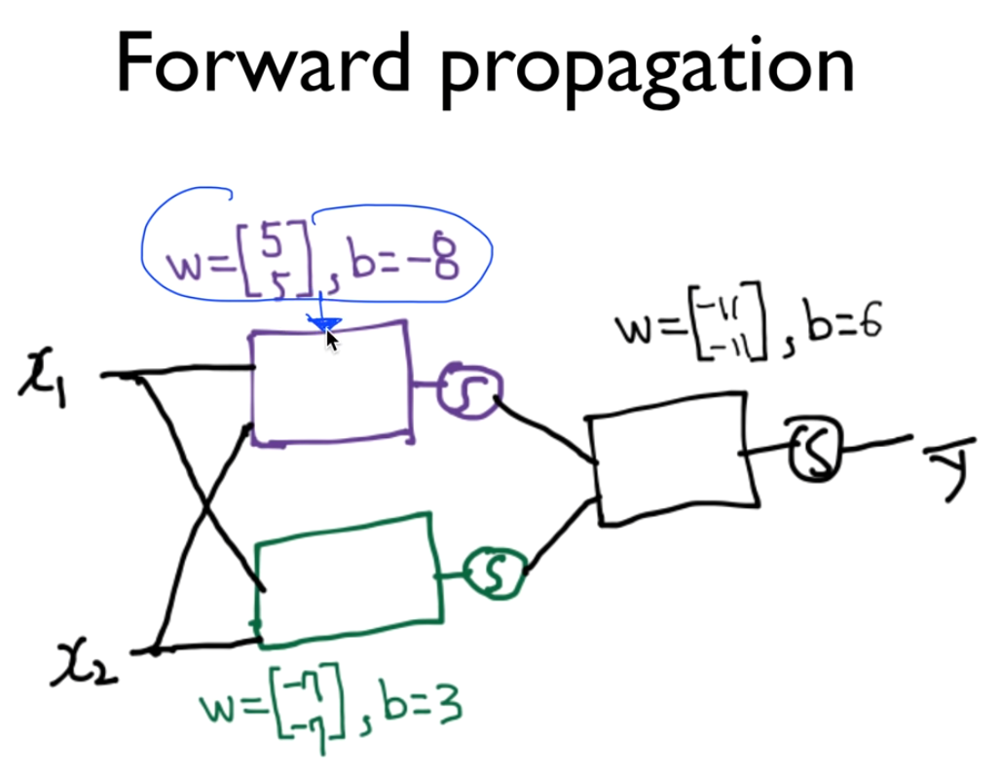

이런 weight, bias를 가진 gate, perceptron, unit [사각형]이 있다.

x1, x2가 이렇게 삭 들어감..

각각의 출력에 sigmoid가 붙어있다.

sigmoid가 다른 unit의 입력으로 들어가고, 

이 유닛은 이런 weight 값과 이런 bias 값들을 갖고 있다.

이것의 출력을 sigmoid하고.. 최종 output y햇을 낸다.


이것을 우리가 하나의 Network, Neural Network라고 볼 수 있다.


#### Can you find another W and b for the XOR?

여러분들이 한 번 생각해보실 문제..

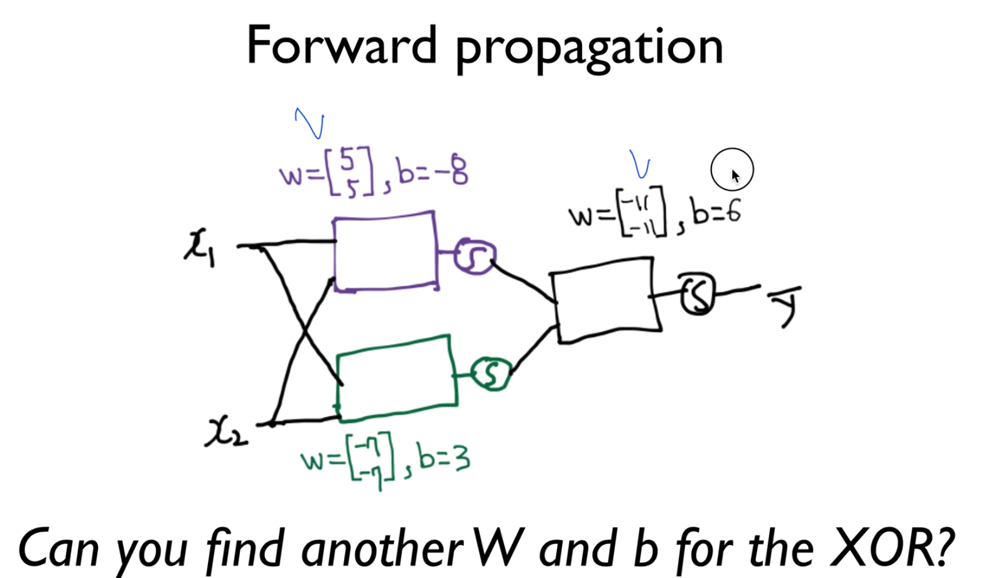

여기서 우리가 이런 weight과 이런 bias를 가지면, 골치아팠던 XOR 문제를 해결할 수 있다.

이 값들 말고, 다른 조합의 값들이 있을까? 만약 있다면, 찾아보시겠습니까? 숙제


### NN

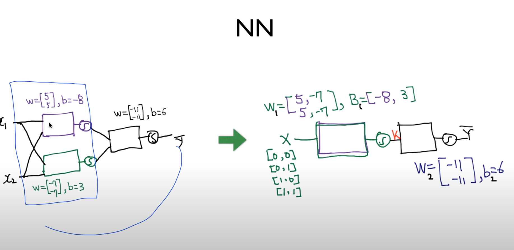

파란색 박스 이전의 Multinomial Classification과 상당히 유사하죠?

이걸 하나로 합치는 방법이 있었죠?


 

### Recap: Lec 6-1 Multinomial classification

기억나시나요? 세 개가 있는 것을 하나로 합치기 위해선 이런 벡터를 세 줄로 주면 되는 것이죠?

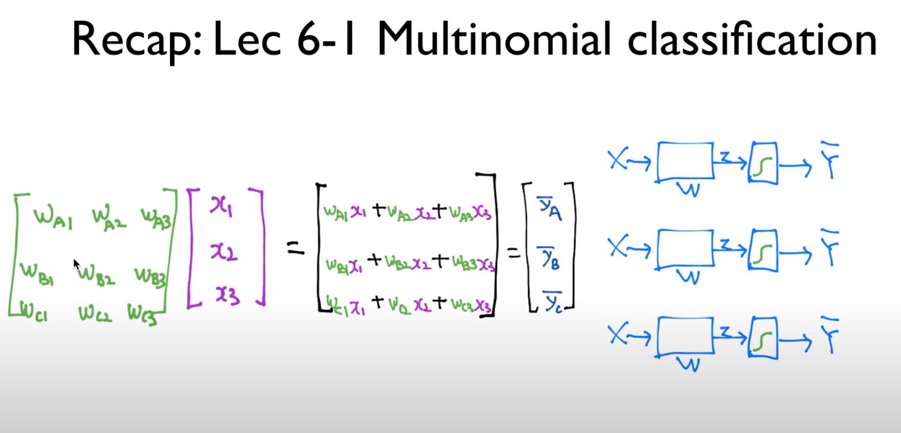


마찬가지 방법으로, 우리가 이렇게 생긴 Network를, 한 개지만 두 개가 들어있는 것처럼 하고, 


그 대신  weight이 이차원 벡터로 늘어났다.

bias도 마찬가지.

이런 입력이 있을 때, 각각 연산을 해서 처리가 되겠죠?


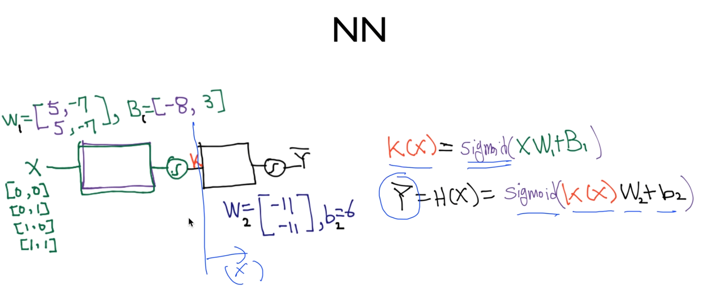

이것을 수식으로 써보면, 우리가 hypothesis를 정할 때, 뒷부분을 일단 없다고 생각하면, 앞부분만 보면 k라는 출력을 이렇게 표시할 수 있겠죠?

K(X) = sigmoid(XW1 + B1)


뒤에꺼만 보면 K의 입력인거죠?

K가 입력이고, 똑같은 방법으로..

Y햇 = H(X) = sigmoid(K(X)W2 + b2)


그래서 이렇게 최종적으로 Y가 나오는 것이죠?

이렇게 하면, 이제 네트워크로 구성이 된 것이다.


이해를 돕기 위해, 이런 식으로 tensorflow에서 가능하다.

```python
# NN
K = tf.sigmoid(tf.matmul(X, W1) + b1)
hypothesis = tf.sigmoid(tf.matmul(K, W2) + b2)
```

아래도 똑같은 입력인데 X 대신 K 입력

이런식으로 네트워크 프로그램을 사용해서도 쉽게 구현할 수 있다.


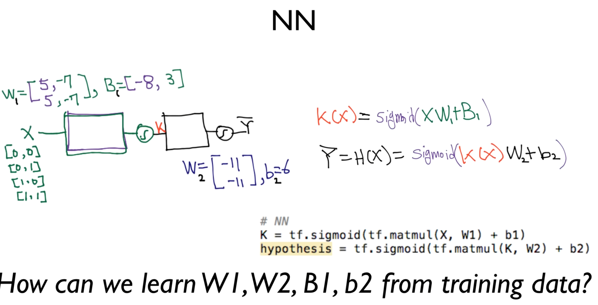

민스키 교수님이 우리들에게 최종적으로 문제로 던져준, 

과연 W1, B1, W2, b2.

이 비디오에서는 그냥 주어진 값.

어떻게 자동적으로 계산해 줄 수 있을까요?


### Next Backpropagation

다음 시간에 계속 진행하겠다.

