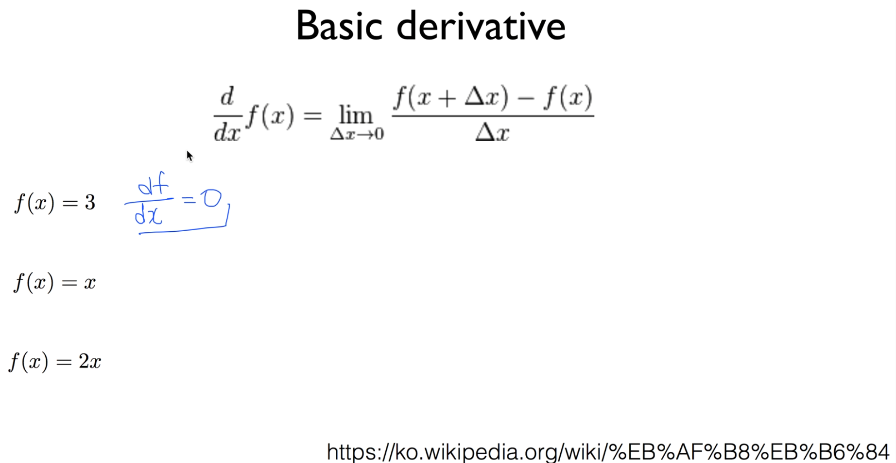
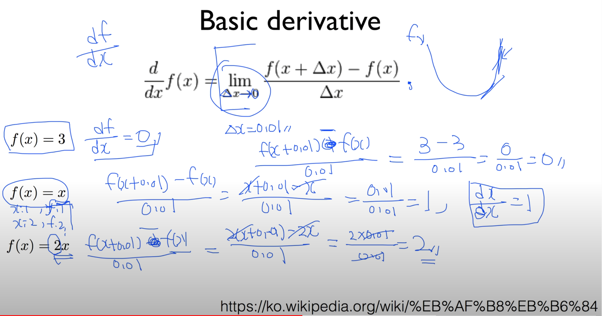
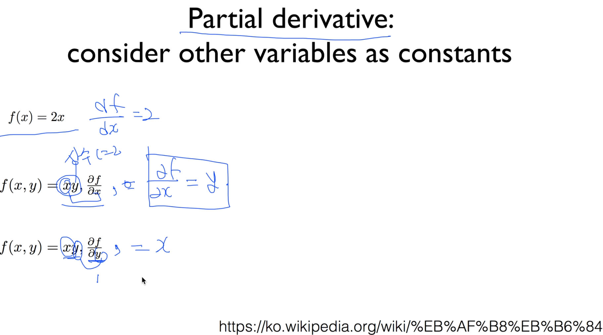
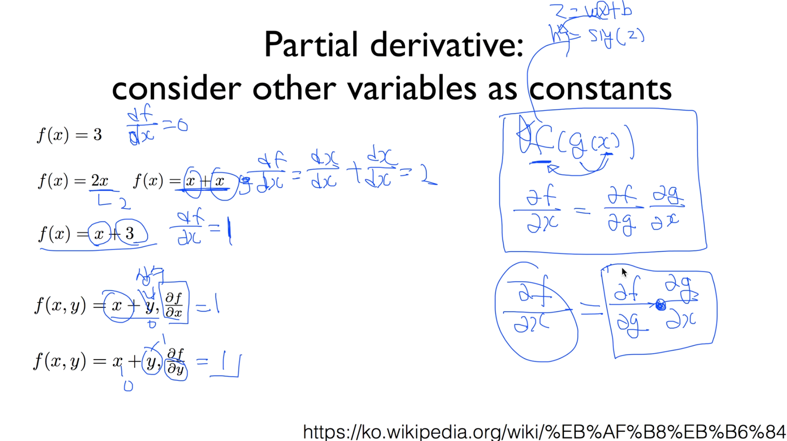

https://www.youtube.com/watch?v=oZyvmtqLmLo&list=PLlMkM4tgfjnLSOjrEJN31gZATbcj_MpUm&index=26

### Basic derivative

이번 비디오는 미분 특별 비디오.

우리가 Backpropagation을 이야기할 때, 굉장히 기본적인 미분 개념이 들어갔다.

미분을 처음 보시는 분들도 쉽게 이해할 수 있도록 제가 5분 안에 미분의 기본적인 것들을 얘기해보겠다.

(이것을 Backpropagation 안에서 사용한다.)

미분을 수학적으로 d/dx f(x) 이렇게 표현한다.

f를 x로 미분한다는 뜻.

간단하게는 df/dx라고 쓰기도 한다.

뒤에 재밌게 생긴 식들이 나오는데, 이것은 간단하게는 이 델타 x를 0에 아주 가까운 값으로 보낼 때, f의 x값 + 작은 값 과 더하지 않은 값의 차이를 요 작은 값으로 나눈다.

다른 말로 순간 변화율, 순간, 아주 작은 값에서 나는 이만큼 변하는데 f는 얼만큼 변하니? 라고 말하는 것.

순간 변화율이라는 것이, 그렇기 때문에 어떤 f가 이런 함수라고 가정했을 때,

이 함수의 순간 변화율이 기울기를 나타내는 것이고,

그래서 이 미분이라는 것이, 우리가 즐겨 사용하는 gradient descent 알고리즘에서 필수적인 것이었죠?

그 개념을 잡고 들어가는데..

lim Δx-> 이게 복잡하니, Δx = 0.01이라고 합시다.

f(x) = 3 이런 함수를 생각해볼까요?

x값에 상관 없이 얘는 항상 3을 출력해. 3을 보내준다.

이 미분 값이 얼마나 되는지 계산해볼까요?

{ f(x + 0.01) - f(x) } / 0.01 

x의 값에 상관없이 3을 출력하죠?

{ 3 - 3 } / 0.01 = 0 / 0.01 = 0

그래서, 상수 함수를 미분하면 0이 나온다 이런 얘기를 했구요,

f(x) = x

x=1, f=1이 되고,

x=2, f=2가 되고 이런 형태의 함수

이거 미분하면 얼마가 될까요? 똑같이 해봅시다.

{ f(x+0.01) - f(x) } / 0.01 = { x+0.01 - x } / 0.01 = 0.01/0.01 = 1

그래서 x를 미분하면 1이 된다.

이 함수를 쉽게 하면, dx/dx = 1 요렇게 된다. 요렇게 표현할 수 있다.

요건 얼마일까? f(x) = 2x

똑같이 2x 붙이면 된다.

{ f(x+0.01) - f(x)} / 0.01 = { 2(x + 0.01) - 2(x) } / 0.01

= 2 * 0.01 / 0.01 = 2가 된다.

2x를 미분하게 되면, x는 1이 되고, 앞의 상수는 그대로 따라붙는다.

이 정도의 미분만 있으면, 우리가 이 Neural Network에서 다루는 데에 어려움이 없습니다.

### Partial derivative: consider other variables as constatns

한 가지만 더 짚고 가자.

Partial derivative 라는 것을 사용한다.

아주 간단한 거, 똑같다.

똑같은 데, 내가 미분하는, 관심있는 값만 제외하고 나머지는 상수로 본다.

f(x) = 2x, df/dx = 2

내가 x에 관심이 있으니 x로 미분하고 다른건 그 형태로 가져옴.

f(x, y) = xy, ∂f/∂x

어떤 함수 f(x, y)가 xy라고 주어졌다고 생각해보자.

내가 요걸, ∂(**파샬**)f/∂x

이 이야기는, 나는 여기에서 x만 신경쓰지, y는 상수 취급한다.

위의 2와 같다.

이걸 미분하면 어떻게 될까?

∂f/∂x = y

x 미분하면 1이 되고, y는 상수니까 그대로

f(x, y) = xy, ∂f/∂y

요런 경우는 어떻게 될까요?

이번에는 y로 편미분

y는 내가 신경쓰는거야 -> 1

x는 상수니까 그냥 씀

∂f/∂y = x

마지막으로, 요런 경우를 봅시다.

f(x) = 3

상수 함수를 미분하면 0이 된다고 했죠?

df/dx = 0

f(x) = 2x, f(x) = x + x

2x를 x+x로 나타낼수도 있지 않겠습니가? 요걸 미분하면 어떻게 되냐?

df/dx는 각각을 미분한거의 합이 됩니다.

df/dx = dx/dx + dx/dx = 2

2x/dx = 2. 그러니까, 같은 겁니다.

f(x) = x + 3

앞에 꺼 미분하면 1, 뒤에꺼는 0

df/dx = 1

똑같은 방식으로 이제 편미분을 해보겠다.

f(x, y) = x + y, ∂f/∂x

이 이야기는 뭔가요? 난 x만 신경쓸꺼야. y는 상수

상수 미분하면 0, x 미분하면 1

∂f/∂x = 1

f(x, y) = x + y, ∂f/∂y

마찬가지로 여긴 y만 바뀌었죠?

y만 신경쓸꺼야,

∂f/∂y = 1

아주 간단하죠?

이제 마지막으로, chain rule인데, 조금 복잡하지만 요렇게 된다는 것만 이해하시면 됩니다.

f(g(x))

이런 함수가 있다. 이 f가 복합 함수.

g에 x를 취하는 함수

내가 궁극적으로 알고싶은 것 -> 이 x가 이 f에 영향을 미치는가?

이거 많이 봤죠? sigmoid

hypothesis = sig(z)

z = wx + b 이런 식으로..

이렇게 복합 함수가 주어졌을 때, 최종적으로 알고 싶은 것은 이 x가 hypothesis에 미치는 영향

마찬가지로 f(g(x)) 에서 x가 f에 미치는 영향이 뭔가?

하는 것을 우리가 바로 이렇게 표현할 수 있다.

∂f/∂x

이론적인 형식으로..

이걸 계산할 때 바로 계산하기는 복잡 -> 나눠서 하자

∂f/∂x = ∂f/∂g · ∂g/∂x

하는 것이 chain rule

복잡한 형태의 함수의 미분을 구할 때는, 각각의 미분을 이렇게 곱하면 된다. 하는 것을 여러분들은 기억하시면 되겠습니다.

