https://www.youtube.com/watch?v=573EZkzfnZ0&list=PLlMkM4tgfjnLSOjrEJN31gZATbcj_MpUm&index=27


### Lecture 9-2 Backpropagation


### Neural Network(NN)

지난 번 비디오에서, 우리를 상당히 골치아프게 했던 XOR 문제를 두 개의 unit으로 구분된 하나의 Neural Network로 풀 수 있다는 것을 같이 해보았다.

이 때 W값과 b값들은 주어졌는데, 기계적으로, 어떻게 자동적으로 (Weight과 bias를) 학습할 수 있을까가 이번 비디오의 이야기가 되겠다.


### How can we learn W1, W2, B1, b2 from training data?

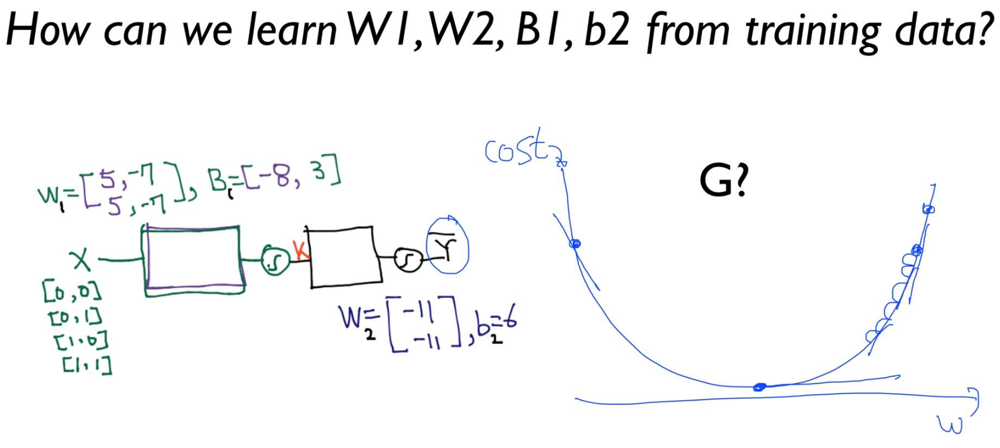

어떻게 할 수 있을까?

우리가 G로 시작하는 어떤 알고리즘을 사용하게 될 텐데, 바로 여러분이 잘 아시는 Gradient descent algorithm 입니다.

나오는 Y햇의 형태를 가지고 우리가 cost 함수를 정의했죠?

cost 함수가 이렇게 밥그릇 모양으로 생겼다면, 

w 값이 어떤 점에서 시작하든 상관 없이 그 점에서의 기울기를 구해서, learning rate만큼 따라서 계속 내려가면, 최종적으로 가장 낮은 global minimum에 도달할 수 있다. 이것이 cost를 최소화하는 것이다 라고 배웠죠?

이것을 구현하기 위해, 어떤 점에서의 미분, 기울기라고 말했던 미분 값이 필요하다.

이 알고리즘을 적용하기 위해서는 미분을 계산해야 한다.


### Derivation

Neural Network로 가면서 복잡해진다. 미분 값이..

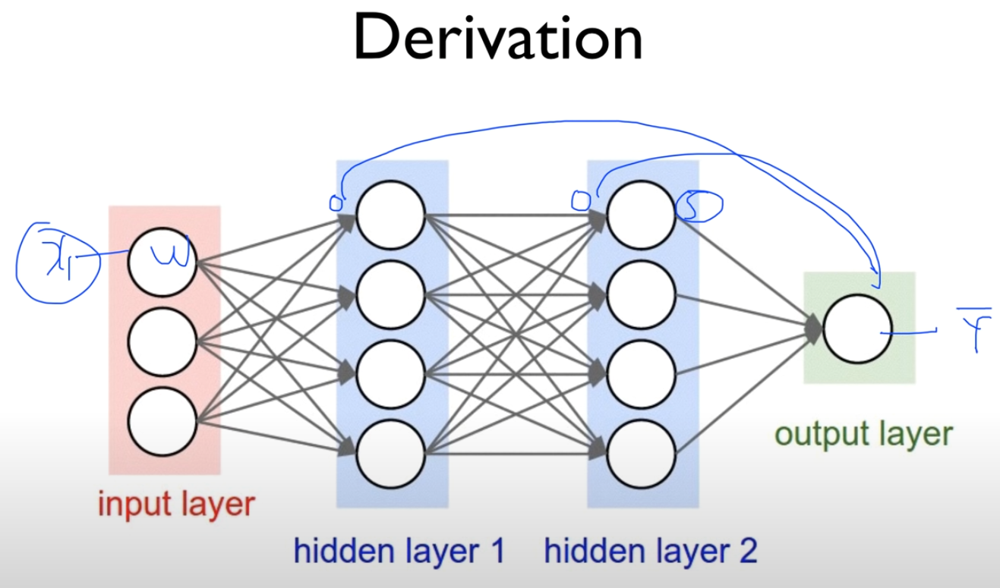

노드가 한 두개가 있는 것이 아니라, 이 연산들이, 중간에 sigmoid 같은 거도 끼고, 이런 것이 순차적으로 있다 보니, 미분 값을 구한다는 것은, 최종적인 결과가 Y햇이고, 입력 값이 x1이라면, x1이 Y햇에 미치는 영향을 알아야 hidden layer 1의 weight을 조절하겠죠?

hidden layer 1뿐만 아니라, 각각의 점에서 각각의 입력이 Y햇에 미치는 영향, 미분 값을 알아야 각각의 weight을 조절할 수 있다.

이게 계산량이 너무 많다. 계산하기 어렵다. 수학적으로.


### Perceptrons (1969) by Marvin Minsky, founder of the MIT AI Lab

민스키 교수님이 책도 쓰셨다. 아무도 할 수 없다. 이게 안 되니까..

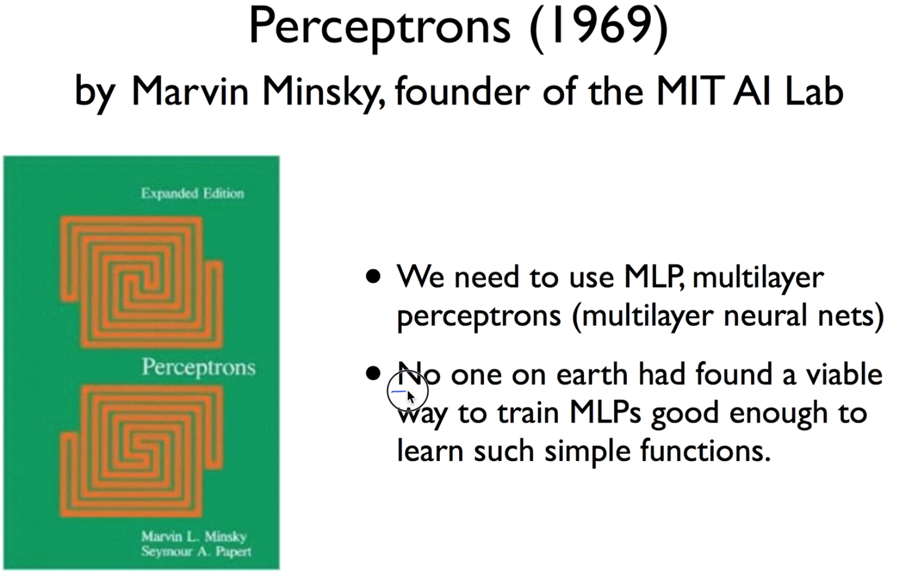


### Backpropagation (1974, 1982 by Paul Werbos, 1986 by Hinton)

이것이 1974년과 86년도에 각각 Paul과 Hinton 교수님에 의해 문제가 해결된다.

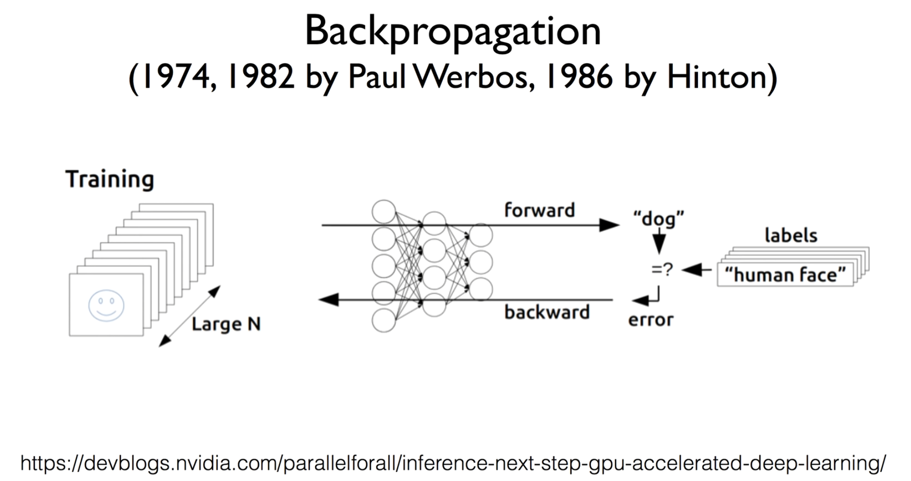

Backpropagation 이라는 알고리즘.

이름이 의미하듯이, 어떤 출력 값, 우리가 예측한 값과 실제 값을 비교해서 거기서 나온 오류, cost 형태로 되는 것을 뒤에서부터 앞으로 쭉 돌려서 이것을 미분 값과, 또는 실제로 뭘 어떻게 조정해야 되는지를 계산하겠다. 하는 것이 이 알고리즘.


### Back propagation (chain rule)

실제로 우리가 간단한 예제를 가지고, 한 번 어떻게 동작하는지 이해해보도록 하자.

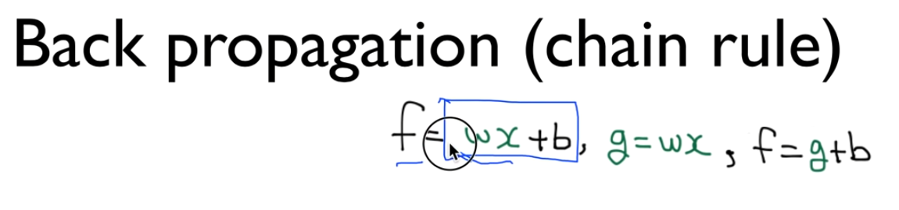

f = wx + b라는 형태로 둔다.

f를 간단한 형태로 두기 위해 wx = g로 놓아본다.

g = wx

f = g + b 요렇게 정의 가능.


이 수식을 그래프 형태로, Neural Network 형태로 표시해보겠다.

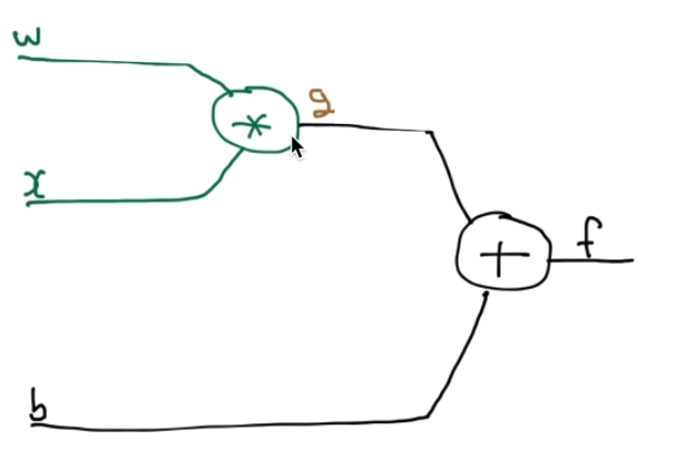

수식을 그래프로 옮기면 이런 형태가 되겠죠?


이런 그래프가 있다고 했을 때, 우리가 구하고 싶은 건

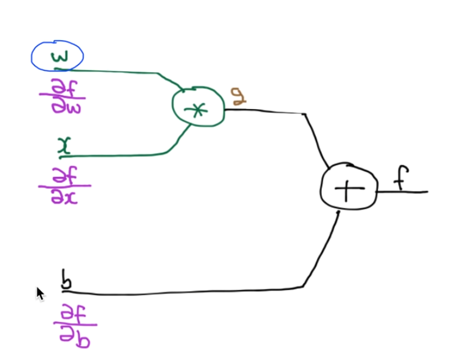

w가 f에 미치는 영향, x가 f에 미치는 영향, b가 f에 미치는 영향을 구하고 싶다.

고것이 바로 이런 형태의 미분 값이 될 것이다.

∂f/∂w


### Basic derivative

미분 이야기가 나왔는데, 혹시 미분을 처음 들어보는 분도 계실테고..

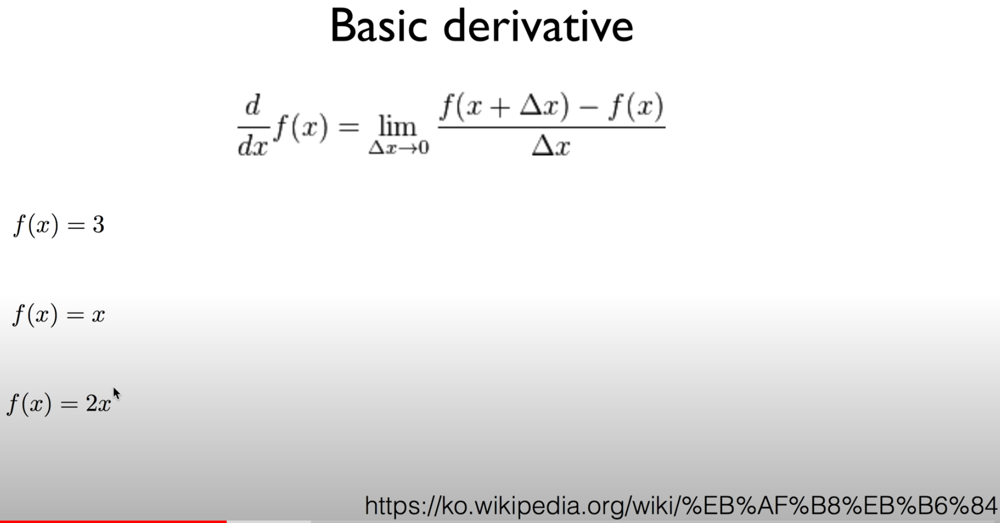

밑에꺼 미분하면 얼마일까요? 또 편미분..


### Partial derivative: consider other variables as constants

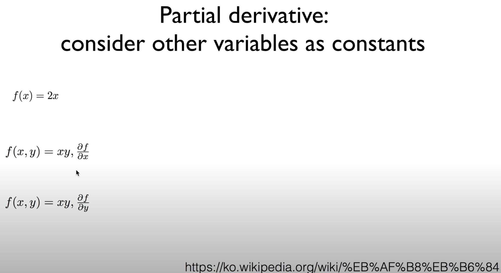

(Partial derivative)편미분을 하면 어떻게 되나요?


그리고, 가장 중요한 chain rule

복합 함수가 있을 때, 얘를 미분해보자.

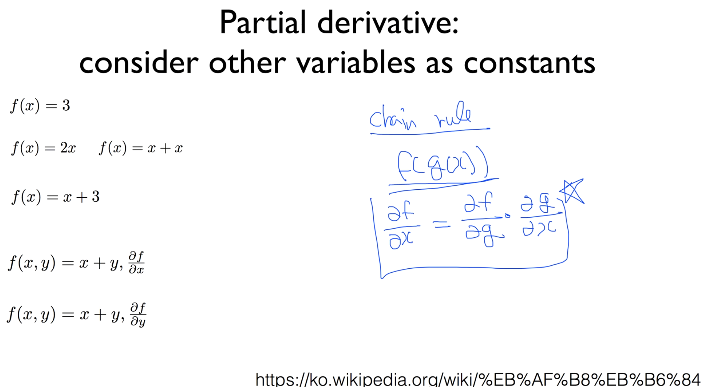

바깥에 있는거 먼저 미분하고, 안쪽에 있는 거 이렇게 미분하게 되는데, 체인 룰이라 한다. (굉장히 중요)

가물가물한 분은 특별 비디오 살짝 보고 오시면 충분히 이해가 됩니다.

미분 처음 들어보신 분들도 잠깐 보고 오시면 미분도 정복하고, backpropagation도 잘 이해하실 수 있을 것입니다.


### Back propagation (chain rule)

미분을 이해했다고 하고,

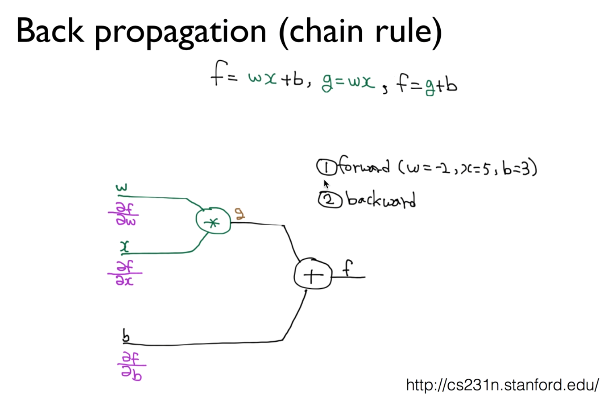

방법이 두 가지 방법으로 나누어서 진행.

1. forward propagation. 실제 어떤 값이 있을 것 아닙니까? 학습 데이터에서 값을 가져온다.

그 값을 가지고 그래프에 값을 입력시킵니다.

2. 그런 다음에 backward로 우리가 실제 미분의 값을 계산하게 될 텐데요,


한 번 봅시다.

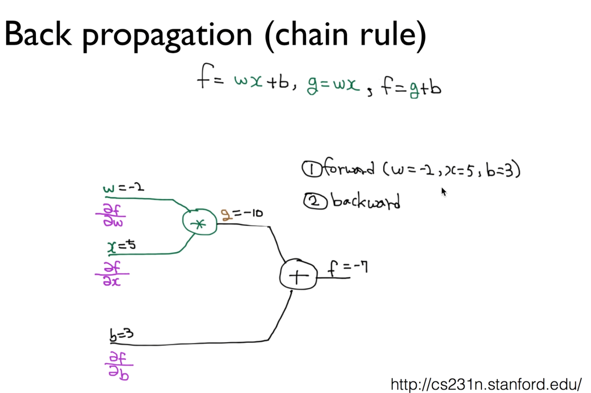

첫 번째. w = -2, x = 5 이렇게 주어지죠?

곱하기 하니까 쉽게 계산 가능 -10

b = 3으로 주어졌죠?

그러면 f = -7

g와 f의 값을 주어진 값을 통해서 계산한다.

상당히 쉽죠? forward하게..


그 다음에, 기본적으로 우리가 가지고 있는 식에서, 간단한 미분들을 미리 해놓읍시다. 이따가 이게 사용될꺼니까요.

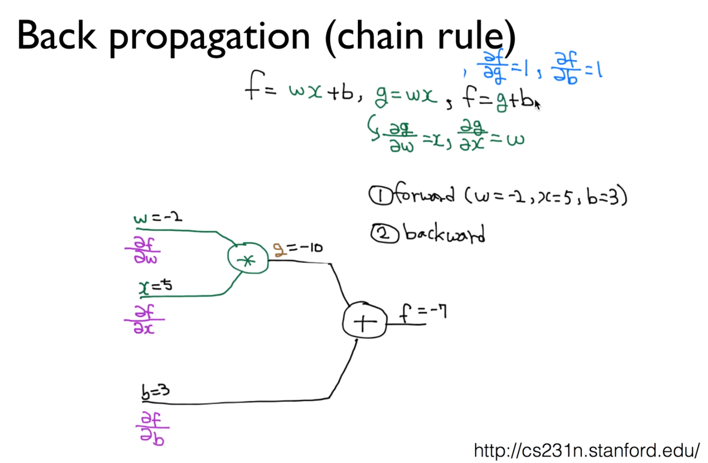

g = wx로 주어집니다.

이 때 w를 기준으로 g를 미분하면(편미분), w만 관심을 가지니까 

w 미분하면 1, x는 그냥 상수니까 x 통으로 붙는다.

∂g/∂w = x 가 되고,

반대로 x로 편미분하게 되면,

∂g/∂x = w 가 된다.


요게 합일 때,

f = g + b

g로 편미분하면

∂f/∂g

g만 관심을 가지니 b는 상수가 된다. 0 이 되고,

∂f/∂g = 1, ∂f/∂b = 1

요런 기본적인 term을 계산할 수 있다고 합시다.


우리가 여기서 왜 이걸 하냐?

아무리 복잡한 것들이 있더라도, 그것을 미분하는 데 필요한 것은 이 간단한 term들만 있으면 된다.

그것이 이 backpropagation rule의 핵심.

그래서 우리가 이 간단한 미분만 이해할 수 있으면, 어떤 복잡한 형태의 수식이라도 미분이 가능하다.


여기서 한 번 구해볼까요?

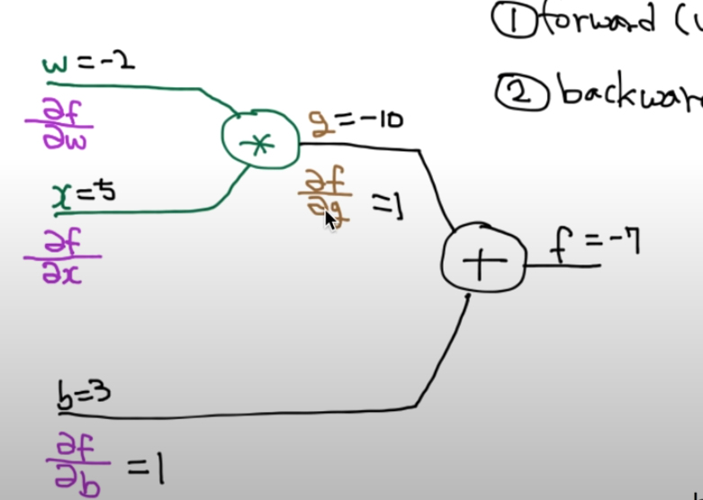

여기서의 **미분값**, 즉 **g가 f에 미치는 영향** 얼마일까요?

우리가 이미 계산해두었죠?

∂f/∂g = 1


b가 f에 미치는 영향?

마찬가지로 계산이 되었죠?

∂f/∂b = 1


그 다음 단계 - 얼추 다 미분값이 주어졌다. 남은 값은 2개.

∂f/∂w 이것을 미분하고 싶은데, f 함수를 자세히 보면, 

f = g + b

g를 사용한 일종의 복합 함수 개념.

-> 이럴 때 우리가 chain rule을 사용한다고 했죠?

chain rule -> 우리가 g를 먼저 미분하자.

f를 g로 미분하자.

그것이 끝났으면, w로 이 g를 미분하자.

∂f/∂w = ∂f/∂g · ∂g/∂w

이것이 chain rule

가물가물하면 앞의 비디오 보십셔. 간단한 rule


어떻게 계산하지? 계산하려고 봤더니 이미 다 계산이 되어 있다. ㅎㅎ

∂f/∂g = 1

∂g/∂w = x, 여기서 x=5

∂f/∂w = ∂f/∂g · ∂g/∂w = 1 * 5 = 5

그래서 이 미분의 값은 5.

뭐 하려고 했는데 다 계산이 되어 있네요 ㅎㅎ

∂f/∂w = 5


이거도 한 번 보죠.

∂f/∂x = ∂f/∂g · ∂g/∂x

계산하려고 봤더니 이미 다 계산이 되어 있다. ㅎㅎ

∂f/∂g = 1, ∂g/∂x = w = -2

∂f/∂x = ∂f/∂g · ∂g/∂x = 1 * -2 = -2

∂f/∂x = -2


이렇게 간단하게 미분을 했는데, 미분의 각 의미 잠깐 봅시다.

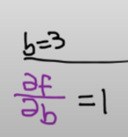

∂f/∂b = 1

이것은 b의 변화가 (f에)미치는 영향이 거의 1:1로 비례한다는 얘기.

요걸(b를) 4로 바꾸면 어떻게 되나요?


바꾼 델타(b 변경한 값)만큼 바로 올라가죠?

그래서 ∂f/∂b = 1이다.


요기서 (f를) w로 미분한 값이 5였다.

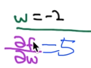

그러면, 그 이야기는 뭐냐

여기 값(w=-2)이 1만큼 바뀌면, 여기(f)가 5배 바뀐다는 이야기.

그런 의미를 가지기 때문에, 이 관계를 이용해서 f의 어떤 출력에 의해서 조율이 가능하다.


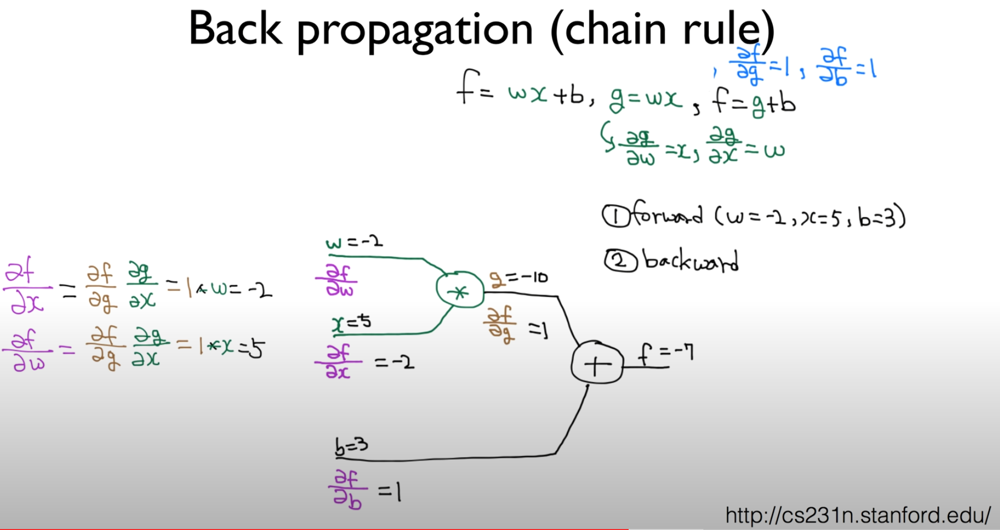

요렇게 답이 나오게 된다.

∂f/∂w = 5


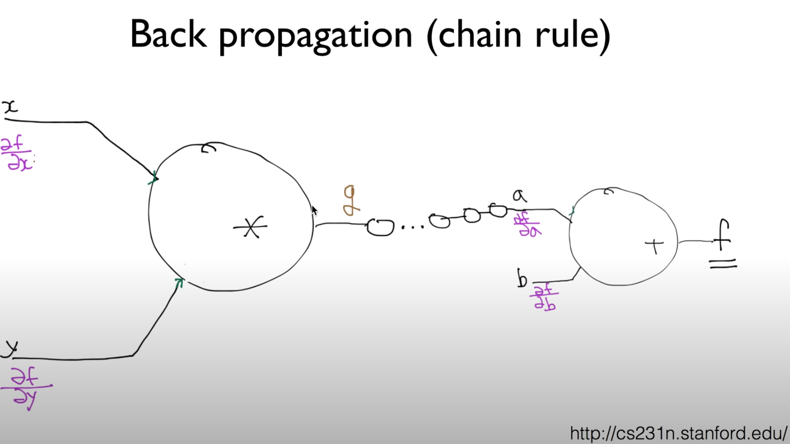

한 가지 간단한 경우를 봤는데, 좀 복잡한 경우가 있다고 생각합시다.

최종적인 결과값 f, 마지막 노드(맨 오른쪽 동그라미)가 있고, 사이 중간에 많은 노드가 있고, x가 최종적인 입력이라고 합시다.

그러면 어떻게 이걸 다 계산할 수 있을까요?


이럴 때 당황할 필요 없이, 하나씩 해나가면 됩니다.

back propagation이니까, 제일 먼저 가장 마지막에 있는 노드를 계산합니다.

요기서 우리가 알고 싶은 건, 다른 건 신경쓸 필요 없다.

a, 이 a가, 이 f에 미치는 영향. 알 수 있을까요?

그렇죠! 내가 여기(노드)에 있는 operation이 뭔지 아니까.

여기서는 f = a + b로 주어지죠?

그렇다면 여기의 ∂f/∂a가 뭘까요? 쉽게 바로 구할 수 있게 되죠?

그래서 ∂f/∂a 요 값을 구하게 됩니다.


그런 다음에, 그 다음 그 다음 단계로 가서 backpropagation을 계속해서 실행해나가면 된다.

한 번 더 예를 들어봅시다.

이런 식으로 계속 뒤로 가면서 계산했는데,

g 이 점에서 우리가 ∂f/∂g 이 값은 알고 있죠?

왜냐하면 앞에서 온 값이죠?

∂f/∂g 이 값은 알고 있다고 생각합시다. 알 수밖에 없다. 뒤에서 쭉 온거니까.

그럼 여기서, 우리가 궁극적으로 구하고 싶은 값이 이 값. 

∂f/∂x 

x가 최종적으로 f에 미치는 영향.

어떻게 계산할 수 있을까요?


일단, 우리가 뭘 알 수 있냐

이건 알 수 있다.

다른 건 모르겠지만, x의 입력이 g에 미치는 영향은 알아.

∂g/∂x

왜냐하면, 내가 이 operation이 뭔지 아니까 가능한 것.

`* 연산`

g = x · y

그럼, 여러분들 이제 이거 미분 가능하죠? x로 미분해요.

∂g/∂x

그럼 안단 말이예요..


그럼 ∂f/∂x 이거 어떻게 구하냐? -> 바로 chain rule을 적용한다.

∂g/∂x을 local 미분 값이라고 했을 때, 

밖에서 온 ∂f/∂g에다가,

나의 로컬 ∂g/∂x을 곱하면 된다.


∂f/∂x = ∂f/∂g · ∂g/∂x


이런 식으로 하게 되면, 최종 입력값에서 최종 출력값까지의 중간에 많은 데이터들이 있다고 해도, 최종 출력값간의 미분 값을 구할 수가 있게 됩니다.


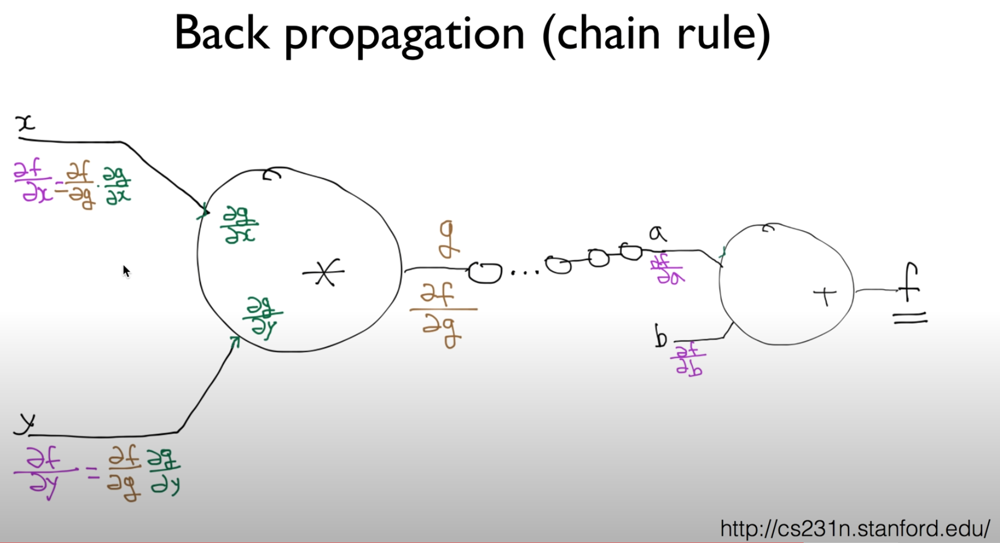

다른 부분도 마찬가지..


입력이 y가 있다면, 마찬가지로 같은 방법으로 구할 수 있다.


### Sigmoid

여러분들이 좋아하시는 sigmoid. 복잡하죠?

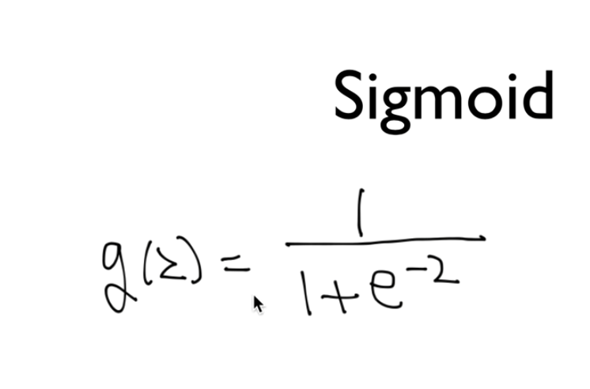

이거 어떻게 미분할까요?

∂g/∂z,  z가 g에 미치는 영향.

이건 애써서 미분하려고 할 필요 없다.


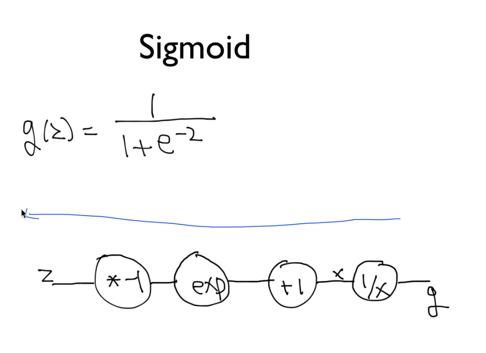

그냥 그래프를 한 번 그려봅시다. 이런 식으로.

뒤에서부터 시작해서 쭉 미분하면 된다.


1/x 시점에서 내가 알아야 할 건 뭔가요?

연산자가 1/x니까, 이 1/x에 해당하는 미분만 알면 된다.


+1에 대한 미분값, x시점의 미분값(L1)에 더하기 로컬 미분값(L2) 두 개.


exp, +1 사이의 미분값은 (L1 * L2) 가 되겠죠?

L1 * L2 값과 exponential이라는 형태의 간단한 함수의 미분값이 또 있겠죠?

미분하는 방법?

고것을 L3라 하면..

*-1과 exp 사이의 미분 값은 또

L1 * L2 * L3가 되겠죠?

같은 방법으로 계속 적용하면 됩니다.

이런 방법으로 아무리 복잡한 식도, 쉽게 기본적인 term의 미분값이 뭐지? 만 알고 있으면 구할 수 있게 됩니다.

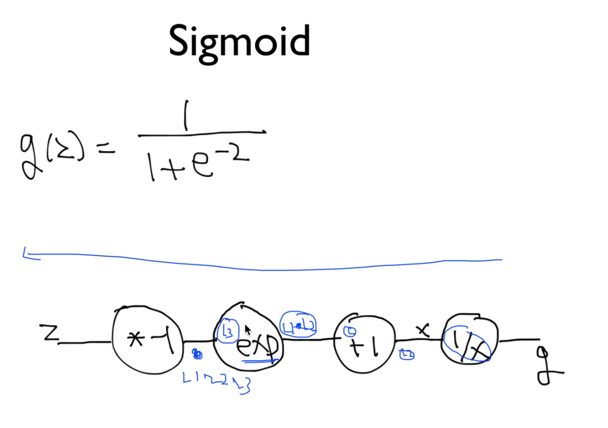


### Back propagation in TensorFlow 

TensorBoard

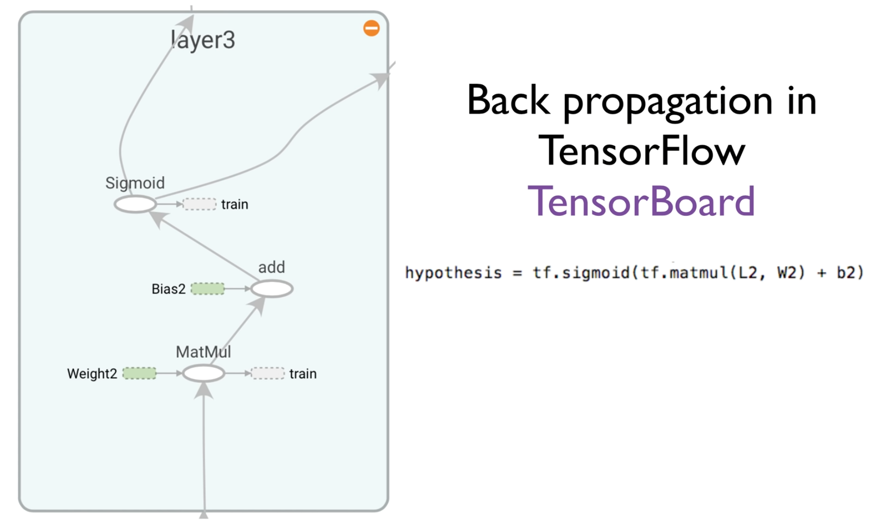

그래서 모든 것이 graph입니다.

tensorflow에서는 Back propagation 어떻게 하는지 한 번 볼까요?


`hypothesis = tf.sigmoid(tf.matmul(L2, W2) + b2)`

우리가 이런 형태로 hypothesis를 만들었죠?

그럼 tensorflow는 이것을 우리가 표현한 것처럼, 각각을 그래프로 다 갖고 있다.

(Matmul, add, Sigmoid)


사실은 cost 함수의 미분 값이 중요한 것이었죠?

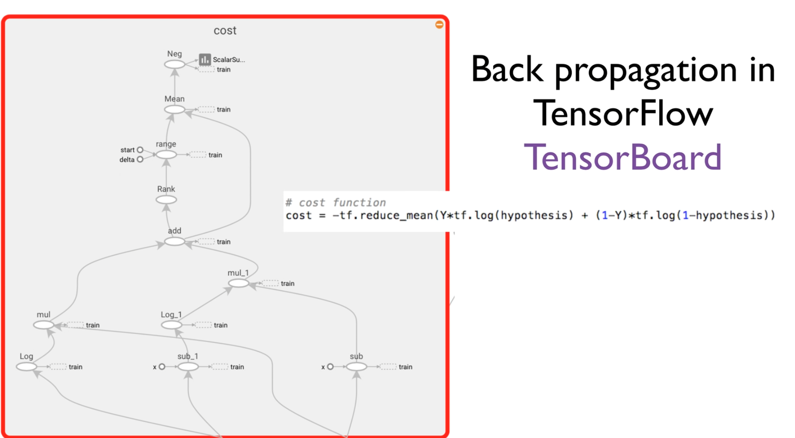


```python
# cost function
cost = -tf.reduce_mean(Y*tf.log(hypothesis) + (1-Y)*tf.log(1-hypothesis))
```

cost 함수 이렇게.. 우리가 여기 cross entropy 형태를 이렇게 주었죠? 복잡한 식으로..

이거 tensorflow는 어떻게 했을까요?

각각을 이렇게 graph로 만들었다. 빼고(sub), multiplication(mul) 하고, 평균(Mean)을 구하고..

다 그래프로 만들었죠?

왜 이렇게 했을까요?

tensorflow가 이것을 미분하기 위해서 그런 것.

back propagation을 구하기 위해서.


이렇게 back propagation이 동작된다는 것을 알았으면, 실제로 여러분이 tensorflow를 사용하신다면, 이것을 구현하실 필요가 없습니다.

쉽게 tensorflow에서는 그래프를 이용해서 이미 이것을 구현해두었다.

이런 그래프는 TensorBoard라는 곳에서 볼 수 있는데, 제가 두 번째 랩 시간에 소개해드리도록 하겠습니다.


### Back propagation

이런 방법을 이용하면 기계적으로, 아주 단순한 방법으로 아무리 복잡해도 back propagation을 사용해서 미분 값을, 기울기를 구할 수 있다.


### Perceptrons (1969) by Marvin Minsky, founder of the MIT AI Lab


이번 비디오가 미분도 나오고 해서 조금 복잡했지만, 여러분들이 Back propagation을 이해했다는 것은, 69년도에 Minsky 교수님께서 아무도 할 수 없다고 하는 이 문제를 여러분들이 이해하시게 된 것입니다. 축하드립니다.

