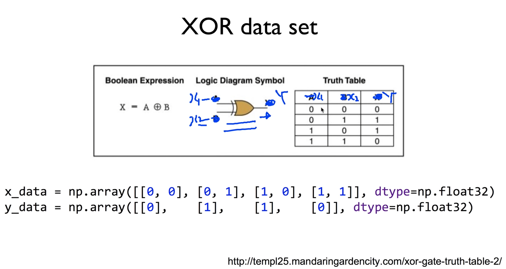

https://www.youtube.com/watch?v=oFGHOsAYiz0&list=PLlMkM4tgfjnLSOjrEJN31gZATbcj_MpUm&index=28


### Lab 9-1 NN for XOR

이번 실습 시간에는 Neural Net을 사용해서, XOR의 문제를 풀어보도록 하겠습니다.

tensorflow 사용해서 직접 구현.


https://github.com/hunkim/DeepLearningZeroToAll/blob/master/lab-09-1-xor.py

### XOR data set



우선, XOR이 뭔지 한 번 보고 들어가자.


아주 예쁜 모양의 기호로 나타낸다.

A, B 입력 들어왔을 때 X로 나간다.

어떤 값이 들어왔을 때 어떻게 나가느냐 진리표로 나타낸다.

우리가 쓰는 데이터와 비슷하게 x1, x2, Y로 바꾸자.


x1, x2가 0 0일 때는, Y는 0이 된다.

x1, x2가 0 1일 때는, Y는 1이 된다.

x1, x2가 1 0일 때는, Y는 1이 된다.

x1, x2가 1 1일 때는, Y는 0이 된다.

exclusive가 의미하듯이, 서로 다른 값이면 1이고, 같은 값이면 0이 된다.


우리가 이렇게 4개의 데이터, 4개의 인스턴스가 주어졌다.

이거로 우리가 모델을 학습할 수는 없을까?

모델을 학습한 다음 x값을 주게 되면, y 값을 예측해봐 하는 모델.


1. instance 데이터를 어디선가 읽어와야 한다.

4개밖에 안되기 때문에, 굳이 파일에서 읽어올 필요 없이, 그냥 np.array를 써서 이렇게 쓸 수 있겠죠?

```python
x_data = np.array([[0, 0], [0, 1], [1, 0], [1, 1]], dtype=np.float32)
y_data = np.array([[0], [1], [1], [0]], dtype=np.float32)
```

진리표 간단하게 데이터 형식으로 만들 수 있겠다.


이렇게 우리가 데이터가 있다면, 그 다음에 해야 할 일 -> 모델을 만들면 되겠죠?

이걸 가지고 예측하는 모델을 만들어보세요 -> tensorflow 손쉽게 할 수 있을 듯.


### XOR with logistic regression?

우리가 처음에 배웠던 logistic regression 사용할 건데, 왜 그럴까요?


```python
x_data = np.array([[0, 0], [0, 1], [1, 0], [1, 1]], dtype=np.float32)
y_data = np.array([[0], [1], [1], [0]], dtype=np.float32)

X = tf.placeholder(tf.float32, [None, 2])
Y = tf.placeholder(tf.float32, [None, 1])

W = tf.Variable(tf.random_normal([2, 1]), name="weight")
b = tf.Variable(tf.random_normal([1]), name="bias")

# Hypothesis using sigmoid: tf.div(1., 1. + tf.exp(tf.matmul(X, W)))
hypothesis = tf.sigmoid(tf.matmul(X, W) + b)

# cost/loss function
cost = -tf.reduce_mean(Y * tf.log(hypothesis) + (1 - Y) * tf.log(1 - hypothesis))
train = tf.train.GradientDescentOptimizer(learning_rate=0.1).minimize(cost)

# Accuracy computation
# True if hypothesis>0.5 else False
predicted = tf.cast(hypothesis > 0.5, dtype=tf.float32)
accuracy = tf.reduce_mean(tf.cast(tf.equal(predicted, Y), dtype=tf.float32))

# Launch graph
with tf.Session() as sess:
    # Initialize TensorFlow variables
    sess.run(tf.global_variables_initializer())

    for step in range(10001):
        _, cost_val, w_val = sess.run(
                  [train, cost, W], feed_dict={X: x_data, Y: y_data}
        )
        if step % 100 == 0:
            print(step, cost_val, w_val)

    # Accuracy report
    h, c, a = sess.run(
              [hypothesis, predicted, accuracy], feed_dict={X: x_data, Y: y_data}
    )
    print("\nHypothesis: ", h, "\nCorrect: ", c, "\nAccuracy: ", a)
```


y_data에서, y는 0 아니면 1이죠?

그니까 굳이 복잡한 softmax 사용할 필요 없이, 그냥 binary 0 1이나, 예측하는 logistic 쓰면 된다.

placeholder x, y 정하구요, 

이 x, y에 맞게 weight과 bias를 정해야 한다.

특히 weight를 정할 때는 크기가 중요하다.

그 크기가 x1, x2 2개가 있으니 2개 입력, y는 한 개 나감. 값이 하나니 1로 나감. [2, 1]

bias는 out의 수와 같음 -> [1]


이렇게 우리가 weight과 bias를 정하면, 그 다음 hypothesis는 그냥 매트릭스 곱을 하죠?

```python
hypothesis = tf.sigmoid(tf.matmul(X, W) + b)
```

이걸 sigmoid에 넣게 되면, 우리가 원하는 모델이 나온다. (hypothesis)

얼마나 예측을 잘했는가? 어떻게 계산?

cost 계산했죠?

cost를 minimize하기 위해 GradientDescentOptimizer 쓴다.

minimize 하면 학습 진행


어떻게 진행? 세션 열고, 초기화.. 똑같다.

굳이 네 개밖에 없기 때문에, 굳이 나누지도 않고 training한 것을 testing

모의고사와 똑같은 실전 문제를 줬다.

모델에 혜택을 많이 줬다.


학습한 다음에, 잘 했는지 못했는지 모의고사 문제를 실전에 준다.

정확도 어떻게 계산 -> 두 줄.

```python
predicted = tf.cast(hypothesis > 0.5, dtype=tf.float32)
accuracy = tf.reduce_mean(tf.cast(tf.equal(predicted, Y), dtype=tf.float32))
```

hypothesis가 0.5보다 클 때는 true라고 생각 -> 1이 된다.

작으면 0이 되도록 testing.

0이냐 1이냐로 예측. 값이 우리가 갖고 있는 실제 y값, 정답에 해당되는, 같은지 아닌지 비교.

True, False가 나온다. True면 맞춘거니까 좋다.

True(1)로 testing한 다음에 평균 내면 정확도가 나온다.


학습이 끝나고 정확도가 어떻게 되는지 돌려본다.

이렇게 되는거죠? 아주 간단.

이론에서 했듯이 돌리면 어떻게 될까요?


### XOR with logistic regression? But it doesn't work!

모델은 굉장히 정확하고 버그가 없음에도 돌려보면 잘 안 된다.

적게 돌린 것도 아니고, 많이 돌렸다.

만 번 이상..

백만 번 하더라도 비슷하다.

Accuracy 대략 0.5정도 나온다. 실망적..

네 개밖에 안되는 간단한 건데 이걸 못해


### Neural Net

이걸 되게 하는 게 Neural Net을 사용하는 것.

한 단만 사용하지 않고, 여러 단을 묶어 사용.


1단에 layer 하나를 더 덧붙이겠다.


어떻게 덧붙이나?

https://github.com/hunkim/DeepLearningZeroToAll/blob/master/lab-09-2-xor-nn.py


```python
W1 = tf.Variable(tf.random_normal([2, 2]), name='weight1')
b1 = tf.Variable(tf.random_normal([2]), name='bias1')
layer1 = tf.sigmoid(tf.matmul(X, W1) + b1)

W2 = tf.Variable(tf.random_normal([2, 1]), name='weight2')
b2 = tf.Variable(tf.random_normal([1]), name='bias2')
hypothesis = tf.sigmoid(tf.matmul(layer1, W2) + b2)
```

출력 값을 그 다음으로 놓으면 된다.

첫 번째 레이어를 구성한 뒤, 이 레이어에서 나온 값을 두 번째 레이어 곱하기에 넣어주면 된다.


레이어 값이 입력으로 되고, 원래 입력 X가 저기 있다.


이렇게 하는 방법으로 연결하면 된다.

layer1 값이 밑으로, X 값이 저기로

마치 그림과 같다.


hypothesis가 출력, Y햇으로 나오면 된다.

이렇게 그냥 연결만 시키면 되는데, 우리가 주의해야 할 것이 하나 있다.

이 weight의 크기를 잘 정해줘야 한다.


첫 번째 X를 받아들이는 weight의 크기

x의 입력 [x1, x2]니까 2개, [2, ?]

출력은 여러분들이 정하면 된다. 중간 단계..

우리가 2라는 숫자가 맘에 드니 2로 해보자.

[2, 2]

-> layer1의 output은 2란 소리죠?

마찬가지로 bias는 이 [layer1의] output과 같은 2가 되었죠. b1 = [2]


이렇게 layer1이 나왔구요,

layer1을 입력으로 받아들이는 layer2

입력이 뭔가요? [2, ?]

layer1의 입력이 2였죠? 2개가 나온다.

출력은 얼마인가요? Y햇으로 끌어내기 위한 Y의 출력은 정해져 있었죠? 1

[2, 1], b2 = [1]

그런 다음에, 최종 hypothesis를 구할 때는, layer1을 입력으로 해서, 

W2와 곱하고, bias 한 다음에, sigmoid로 보내면 됩니다.

```python
hypothesis = tf.sigmoid(tf.matmul(layer1, W2) + b2)
```


이렇게 간단하게 연결하면 된다.

이걸 가지고 돌려볼까요?


### NN for XOR

놀랍게도, 소스 코드는 똑같다.


달라진 게 있다면, 기존 1단에서 2단으로 바꾸었을 뿐.

보시면 알겠지만, Accuracy가 1.0

-> 예측 정확하게 했다.


hypothesis를 보면, 1일 때는 큰 값, 0일 떄는 굉장히 작은 값으로 hypothesis를 잘라서 거기에 맞게 예측한 값도 우리가 가지고 있는 y값과 같게 나왔다.

-> 굉장히 잘 학습된 모델이다, accuracy는 1.0으로 나왔다.

XOR 문제가 그냥 logistic regression으로는 잘 되지 않았는데, 몇 개 연결시키니까 잘 된다.


어? 그러면..


### Wide NN for XOR

좀 더 넓게 연결시켜볼까?

이전 모델 - 2개의 layer.

그러지 말고 좀 더 넓게 나가보자.

2개의 입력, 중간에 10개(좀 과하지만.. 실험을 위해)

10개를 입력받아서 1개를 출력

이런걸 wide하다고 얘기한다.


이렇게 한 번 구해보자..


입력 값은 정해져 있고, 출력 값을 10으로 준다.

layer2의 입력 값은, (layer1의) output과 같다.

숫자만 같게 해주면 자연스레 wide해진다.


오른쪽 초록 글자 - 이전에 있던 것.

왼쪽 노랑 박스 - 새로 wide한 것.

왼쪽 hypothesis를 보면, 큰 차이는 없지만, 작은 겂은 더 작아졌고, 큰 값은 더 커졌다.

그 이야기는, 그만큼 그 모델이 더 잘 학습되었다고 볼 수 있다.


### Deep NN for XOR

옆으로만 말고, 굉장히 깊게 들어갈 수도 있겠죠?


layer를 1, 2, 3, .., 10개..

이런걸 깊은 모델이라고 한다.

그래서 Deep Learning이란 말이 나오기도 했다.

어떻게 하면 될까요?

2개 쌓은 방법으로 마찬가지로 계속 연결해주면 된다.

처음 입력값은 정해져 있다. x에서 온 입력이니까요.

나머지 값은 여러분들이 원하는대로 하면 됨.

근데, 이 값은 그 다음 입력과 항상 똑같은 입력값이어야 한다.


그리고, 입력 처음엔 X, 그 다음 layer1, 그 다음 layer2... 으로 연결한다.

돌려보면 (왼쪽) layer 많을수록 1 나와야 하는 값 크게 나오고, 0 나와야 하는 값은 더 작게 되었다.

우리 모델이 더 잘 학습되었다.

accuracy 동일하게 1이지만 그렇게 볼 수 있다.


### Exercise


Neural Net, Neural Net wide, 깊게 가는 것을 우리가 x1에 적용해보았다.

연습문제로 지난 번에 소개해드렸던 MNIST 데이터를 가지고 좀 더 깊고 넓은 Network을 해 보시는 것을 권해드립니다.

