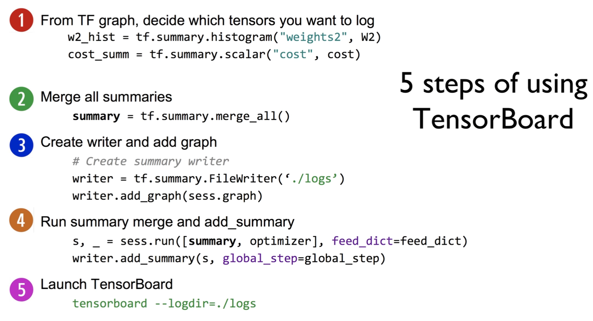

https://www.youtube.com/watch?v=lmrWZPFYjHM&list=PLlMkM4tgfjnLSOjrEJN31gZATbcj_MpUm&index=29


### Lab 9-2 Tensorboard for XOR NN

지난 실습 시간에서 XOR Neural Network 가지고 풀어봤다.

학습 길게 하거나 많이 할 때, 진행 상황을 한 눈에 볼 수 있게 해주는 것이 TensorBoard


### TensorBoard: TF logging/debugging tool


이걸 사용하면, 우리가 그래프를 복잡하고, wide하고, deep하게 그릴 때, 그래프의 모양을 볼 수 있다.

어떤 값들을 그림을 그려줄 수 있다.

- Visualize your TF graph
- Plot quantitative metrics
- Show additional data


그것이 바로 TensorBoard.

알아두시면 굉장히 유용하게 사용하실 수 있다.


### Old fashion: print, print, print


이전의 방법 - 엄청나게 많은 숫자를 화면에 출력

loss, accuracy, w값이 어떻게 변하는지 봤다.

숫자 너무 많으니 복잡..


### New way!

이렇게 하지 말고 깔끔하게 그래프로 보여주자!


loss function을 보여준다.

훈련하는 step..

step에 따라 loss가 어떻게 변하는지 그래프로 보여준다. -> 잘 되고 있군.

우리가 바로 볼 수 있다.


### 5 steps of using TensorBoard

TensorBoard를 사용하기 위한 5개의 스텝이 있다.

5개만 따라하면 아주 간단하게 바로 멋진 그래프를 볼 수 있다.



1. Tensorflow 그래프에서 어떤 값을, tensor를 logging할 지를 정한다.

```python
w2_hist = tf.summary.histogram("weights2", w2)
cost_summ = tf.summary.scalar("cost", cost)
```

logging하는 데에는 그냥 함수를 쓰면 된다.

tf.summary 하고 데이터에 따라서 histogram, scalar [조금 이따 설명]

어떤 것을 logging할 지 정하고, 거기에 값을, tensor를 [w2, cost] 넣는다.

그것을 받아온 값을 가지고 있다. [w2_hist, cost_summ]


2. 이것을 일일이 쓰지 않고 한 번에 쓰기 위해 merge 한다.

```python
summary = tf.summary.merge_all()
```

tenserflow의 summary.merge_all이라는 함수를 호출하면 어떤 summary를 돌려준다.

이것을 통해서 다 summary를 한다.


3. session에 들어가서 summary를 어디 위치에 기록할 것인지 파일의 위치를 정한다.

```python
# Create summary writer
writer = tf.summary.FileWriter('./logs')
writer.add_graph(sess.graph)
```

정한 뒤에 writer에다가 그래프를 넣어달라고 한다.


4. summary 자체도 tensor이기 때문에, 이 summary를 실행시켜 줘야 하죠?

```python
s, _ = sess.run([summary, optimizer], feed_dict=feed_dict)
writer.add_summary(s, global_step=global_step)
```

어떻게 실행시키느냐?

sess.run에 summary를 넣어주면 된다.

summary가 어떤 데이터가 필요하다면, feed_dict로 넘겨줘야 되겠죠.

그리고, 실행시켜서 나온 summary를 실제로 파일에 기록하는 부분이 두 번째 줄.

이전에 만들어놓았던 writer.

writer.add_summary하고 s를 넣어주고, step을 넣어주시면 됩니다.


5. logging이 끝났기 때문에, 실제 terminal 같은 데 가셔서,

```python
tensorboard --logdir=./logs
```

tensorboard라는 명령어가 있다.

명령어에 --logdir 하고, 앞에서 정의해줬던 ./logs 디렉토리를 정해주기만 하면 멋진 그래프를 볼 수가 있다.


### Scalar tensors


그러면, 우리가 어떤 것을 logging할 것인가?

데이터에 따라 다르다.

만약 cost 값이라면, scalar라고 하는, tf.summary.scalar를 이용해서 logging을 할 수 있다.

cost 값에 따라 scalar면 scalar


### Histogram (multi-dimensional tensors)


만약 이 값이 하나의 값을 가지고 있지 않고, 여러 개의 값을 가지고 있는 것이라면..

Histogram이란 이름으로 이 베타들을[W2, b2, hypothesis] 넣어줄 수가 있습니다.

이런 histogram은 하나의 값이 아니죠? 여러 개의 값.

이것[y축]이 step이 되겠구요, 

이것[x축]이, 예를 들어, weight 값의 분포가 되겠다.

학습이 일어나기 전 맨 처음에는 이렇게 중간에 모여있다가, 뒤로 갈수록 거의 0과 1 값으로 수렴된다 이렇게 된다.

값이 변하는 것을 histogram으로 볼 수 있게 된다.


https://github.com/hunkim/DeepLearningZeroToAll/blob/master/lab-09-4-xor_tensorboard.py

### Add scope for better graph hierarchy


```python
with tf.name_scope("Layer1"):
    W1 = tf.Variable(tf.random_normal([2, 2]), name="weight_1")
    b1 = tf.Variable(tf.random_normal([2]), name="bias_1")
    layer1 = tf.sigmoid(tf.matmul(X, W1) + b1)

    tf.summary.histogram("W1", W1)
    tf.summary.histogram("b1", b1)
    tf.summary.histogram("Layer1", layer1)


with tf.name_scope("Layer2"):
    W2 = tf.Variable(tf.random_normal([2, 1]), name="weight_2")
    b2 = tf.Variable(tf.random_normal([1]), name="bias_2")
    hypothesis = tf.sigmoid(tf.matmul(layer1, W2) + b2)

    tf.summary.histogram("W2", W2)
    tf.summary.histogram("b2", b2)
    tf.summary.histogram("Hypothesis", hypothesis)
```


우리가 그래프를 보고 싶다 -> 그래프를 볼 수 있다.

이런 경우 보통 그래프를 한꺼번에 쫙 펼쳐놓으면 그래프 보기 조금 힘들기 때문에,

tf.name_scope를 통해 우리가 사용하는 tensorflow를 정리할 수 있다.

Layer1 밑에 써주고, Layer2 밑에 써주면..

그래프 그릴 때 Layer2, Layer1을 따로 보기 쉽게 나누어준다.

원하는 Layer 누르면 안쪽으로 들어가서 자세히 보여준다.


만약 scope 없으면 작은 것들이 쫙 펼쳐져서 보기 힘들다.

그럴 때 name_scope 사용해서 각 Layer 별로 깔끔하게 정리해준다.


### 2, 3. Merge summaries and create writer after creating session

두 세번째로 할 것이 summary의 merge_all로 다 합친다.

```python
# Summary
summary = tf.summary.merge_all()

# initialize
sess = tf.Session()
sess.run(tf.global_variables_initializer())

# Create summary writer
writer = tf.summary.FileWriter(TB_SUMMARY_DIR)
writer.add_graph(sess.graph)  # Show the graph
```


세션 한 뒤에, 어느 곳을 쓸 것인지 정한다. [TB_SUMMARY_DIR]

writer 가져온 다음에 이 그래프를 sess에 넣어줘


### 4. Run merged summary and write (add summary)

마지막 단계로, summary 실행시키고, 가져온 값을 writer.add_summary에 넣어주면 된다.

```python
s, _ = sess.run([summary, optimizer], feed_dict=feed_dict)
writer.add_summary(s, global_step=global_step)
global_step += 1
```

`global_step=global_step` 이 부분이 실제로 write해주는 부분.

0~n 까지 변하는 값을 넣어준다.

이 값에 따라..

x축 step, 여기에 맞는 값들이 그려진다.


### 5. Launch tensorboard (local)

여기서 끝이 났고, 마지막으로 어떻게 하느냐?

```python
writer = tf.summary.FileWriter("./logs/xor_logs")
```

```
$ tensorboard -logdir=./logs/xor_logs

Starting TensorBoard b'41' on port 6006
(You can navigate to http://127.0.0.1:6006)
```

이 TensorBoard를 실행시킨다.


command line 가서 우리가 아까 write한 디렉토리를 그래도 주면서 실행시키면 된다.

그 다음에 브라우저를 가지고, 기본 값으로는 localhost의 6006번 값으로 브라우저를 열면,

우리가 봤떤 모든 그래프들을 볼 수 있다.


한 가지 팁?


만약 이걸 local 컴퓨터에서 돌리지 않고 remote해서 돌린다?

이런 경우 이걸, tensorboard를 돌리기 위해서는 port를 열어줘야 하는데 복잡하니까..

ssh port forwarding이라는 기법으로 할 수 있다.

이 부분 좀 복잡.. 그냥 요렇게 계속 쓰신다는 것 기억해두십쇼.

```
ssh -L local_port:127.0.0.1:remote_port username@server.com
```

저도 그냥 기억해서 그래도 사용합니다.


여러분들이, `username@server.com` 요 부분이 remote server.

remote server 이름과 로그인 아이디가 있을 것 아닙니까?

그거를 이렇게 localhost의 포트가 몇 번으로 할 것인지 remote는 정해져있죠? 6006

여러분들이 local 몇 번을 할 것인지는 이렇게 정해주면 됩니다.


예를 들어, 나는 ssh 하면서, local에서 7007번 할꺼야.

```
local>  $ ssh -L 7007:127.0.0.0:6006 hunkim@server.com
server> $ tensorboard -logdir=./logs/xor_logs
```

로컬 번호 주고[127.0.0.0], 6006은 remote server의 port라고 보면 된다.

정해져있죠? 6006

요렇게 주게 되면 연결되었죠?

그런 다음에, 안에 들어가서 tensorboard를 실행시킨다. server에서.

그 다음에, 여러분들 컴퓨터에 와서 이 번호, 7007번으로 접속하면, 서버에 있는 tensorboard를 여러분들이 볼 수 있습니다.

```
You can navigate to http://127.0.0.1:7007
```

firewall 상관 없이, ssh만 된다면, remote에 있는 tensorboard도 바로 볼 수 있다.


tensorboard 성공적으로 실행시키면, scalar 값들도 볼 수 있고,

histogram도 볼 수 있고, graph도 볼 수 있다.

image같은 나머지도 테스트해보면 좋다.


### Multiple runs

learning_rate=0.1 vs learning_rate=0.01


그런데, 가끔 내가 같은 형태의 모델을 돌리지만, 옵션을 다르게 돌리고 싶은 경우가 있다.

값 두 세개 비교해보고 싶을 때가 있다.

모델 두 개

learning_rate=0.1 vs learning_rate=0.01

LR에 따라서 학습이 어떻게 되는지 비교해보고 싶다.

이 때 사용할 수 있는 것이 이것이다.


우리가 학습할 때, 이런 식으로 옵션을 주고(learning_rate=0.1), write하는 부분에서 directory를 다르게 준다.

./logs/xor_logs

logs 안에 xor_logs라고 주고,

같은 디렉토리인데 한 디렉토리를 더 준다.

logs 안에 디렉토리를 여러 개 만든다.

logs/ _run1 _run2 _run3

이런 식으로 여러분들이 hyperparameter를 다르게 해서 여러 번 실행시키죠?

각각 디렉토리가 생겨난다.


각각의 디렉토리를 갖고 tensorboard를 실행시키지 않고, 부모에 있는 디렉토리를 갖고 tensorboard 실행시킨다.

`tensorboard -logdir=./logs`

위 그림과 같은 형태로 두 개, 또는 여러 개의 그래프들을 동시에 볼 수 있다.


예를 들면, cost 롭스(?)인데,


[파란색] learning rate이 굉장히 작은 경우에는, 학습이 잘 일어나지 않는다.

그래서 아 이런 경우에는 주황색이 잘 되는구나 비교 가능.


여러 개의 다른 디렉토리를 만든 다음에, 상위 디렉토리를 tensorboard 실행시킬 때 -logdir 주게 되면, 하위 디렉토리 값들을 한 번에 볼 수 있다.


### 5 steps of using TensorBoard

마지막으로 정리 5가지 tensorboard 스텝.


무엇을 log할 것인지 정한다.

다 summary해서 모은다.

어느 디렉토리에 실제로 이 로그를 쓸 것인지를 정하고, 그래프를 추가.

마지막 작업으로, summary했던 것을 실행시킨다. 들어간 값을 writing해준다. step 값 써줘서 올려주면 된다.

마지막으로 logging 되면 tensorboard 가지고 실행시키면 된다.

port number 줄 거고, 우리가 웹으로 접속하기만 하면 된다.

다소 복잡해보이지만, 그냥 그대로 계속 사용하시면 되기 때문에 특별하게 복잡하게 생각할 것 없이 그대로 쭉 사용하시면 됩니다.


### Exercise


연습문제

지난 번에 우리가 MNIST 문제 wide하고 deep한 네트워크 가지고 해보자 했는데,

이것이 학습되는 과정을 tensorboard로 한 번 볼 수 있도록 코드에 tensorboard 코드를 넣어보는 것을 연습해보기 바랍니다.

