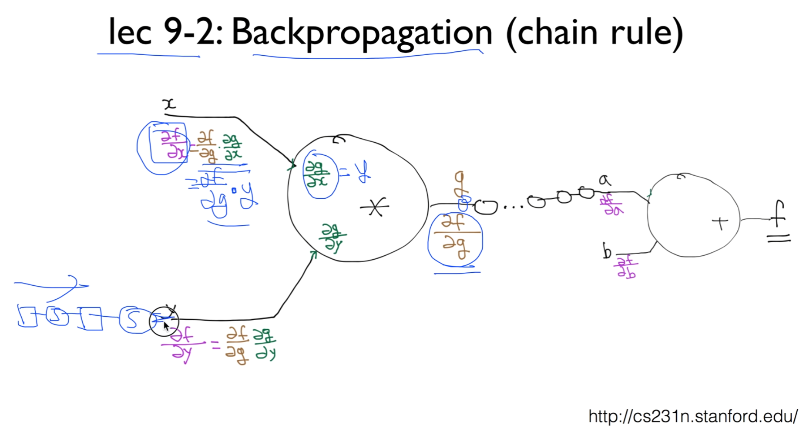
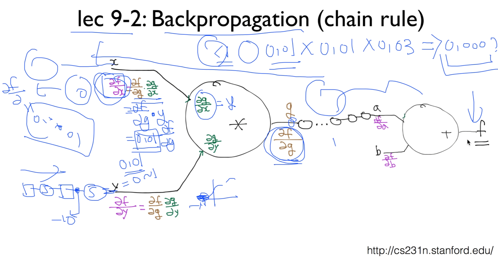

https://www.youtube.com/watch?v=cKtg_fpw88c&list=PLlMkM4tgfjnLSOjrEJN31gZATbcj_MpUm&index=30

### Lecture 10-1 ReLU: Better non-linearity

오늘은 정말 깊게 들어가는 방법에 대해 얘기하겠습니다.

### NN for XOR

지난 주에 했던 것 잠시 리뷰 하고 들어가자.

XOR같은 문제를 풀기 위해서, 하나의 유닛으로 되지 않으니까, 두 개 정도를 겹쳐서 XOR문제를 풀 수 있다는 것을 보여드렸다.

각 유닛에 sigmoid 붙어있었죠?

이런 함수들을 Network에서는 Activation function이라고 많이 부릅니다.

그 이유는, 네트워크가 연결연결 되어있죠?

그러니까 하나의 값이, 그 다음으로 연결될 때, 어느 값 이상이면 Active되고, 어느 값 이상이 아니면 Active가 되지 않는 형태의 작용을 하기 때문에, Activation function라는 멋진 이름으로 부른다.

우리가 이것을 구현할 때에는 이렇게 간단하게..

각각의 W1, W2 (2개니까) 두 개의 weight, bais를 가지고,

순차적으로 처음엔 X를 받고, 그것을 계산한 뒤에, L2를 입력에 넣어주면

2단의 네트워크가 구성된다.

3단은 어떻게 할까요?

### Let's go deep & wide!

3단 쉽습니다.

이런 식으로 3개의 weight를 마련하고, 3개의 bias를 마련한다.

3단 되면 [2, 5]같은 벡터가 복잡해짐. 어떻게 할까를 고민만 하시면 된다.

처음에 x 값 두 개 주어지죠? x1, x2

[2, 5] -> 처음에 x 값이 두 개다. 라는 의미.

그 다음은 여려분들이 정하시면 됩니다.

몇 개를 출력하고 싶어요? 5개 [2, 5]

그럼 다음에는 5개를 입력으로 받아야 한다. [5, 4]

몇 개를 출력하고 싶어요? 4개

그럼 마지막에는 4개를 받아야 한다.

제일 마지막 출력은 정해져 있다.

우리같은 경우 1.

[4, 1]

이렇게만 따라주시면 어려울 게 없다.

bias는 weight를 구성하는 두 번째와 똑같은 크기로 마련하면 된다.

그 다음에, chain하듯이 X를 입력으로 받아서 L2를 만들어내고,

L2를 그 다음 Layer에 넣고 이것이 나온 것이 L3

L3을 최종적으로 넣어주면 된다.

그림은 위와 같다

2 -> 5 -> 4 -> 1

맨 앞이랑 맨 뒤 잘라서 맨 앞을 Input layer, 맨 뒤를 Output layer라고 부르는 경우가 많다.

안에 있는 것들은 보이지가 않죠?

멋진 이름으로 hidden layer라고 한다.

특별한 의미는 없다.

입력, 출력 쪽에서 보이지 않기 때문에 hidden layer라고 부른다.

이렇게 우리가 굉장히 깊게 들어갈 수 있게 되었는데, 한 번 실제로 들어가보자

### 9 hidden layers!

처음과 마지막 숫자만 신경쓰면 된다.

나머지 숫자들은 여러분 마음대로.

그 다음 할 일 - 연결시키면 된다. chain rule 하듯이

X가 L1 만들어냄

L1이 L2 만들어냄

...

L10이 hypothesis를 가져온다.

굉장히 쉽게 구한 값. 이게 Deep Network.

이것을 학습시키면 이것이 바로 Deep Learning

지난 번에 배운 tensorboard라는 tool로 시각화하고싶다면?

이름을 줘야되겠죠? [오른쪽 참조]

tf.name_scope("layer1") 이런식으로 이름을 준다.

그 밑에 내가 원하는 Layer L1을 선언하게 되면..

### Tensorboard visualization

tensorflow 실행시킴으로써 내가 만든 그래프를 시각화할 수 있다.

이것이 굉장히 좋은 이유는, 여러분들이 굉장히 복잡한 Deep Network를 설계하실 때, 이것을 그냥 코드로만 보면 어려울 수 있는데, 보드로 보면 아 이렇게 연결되어있구나, 그리고 각각의 이런 weight들이 사용되었구나 보고 잘 되어있는지 확인할 수 있다. 충분히 사용해보시면 좋다.

### Poor results?

한 번 실행시켜봅시다.

여러 가지 숫자들이 나온다.

첫 번째가 cost [0.69314718] 이거

cost가 떨어지지 않고, 최종 결과 accuracy 0.5

이상하다.. 9단 연결했는데 accuracy 1개 한거랑 똑같아. 2개보다 더 나빠.

잘못돌린게 아니라 여러분들이 코드 똑같이 돌려봐도 결과 동일.

왜 이런 일이 벌어질까요?

이 문제가 바로..

### Tensorboard Cost & Accuracy

cost 0.64이하로 떨어져서 쭉 가버림

accuracy 0.5에서 시작해서 0.75 왔다갔다.

왜 이런 문제가 발생할까?

### Backpropagation

Backpropagation 알고리즘 1986년도에 개발되면서, 사람들 굉장히 흥분했다.

조금씩 사용하다 보니, 2~3단 정도의 그래프는 네트워크를 잘 학습한다.

오늘 우리가 사용했던 것처럼 9~10단 -> 학습이 안 된다.

이것이 큰 문제였다. 문제를 풀지 못했는데..

### lec 9-2: Backpropagation (chain rule) [27강]

왜 이런 문제가 발생했는지 보자.

Backpropogation rule 곰곰이 생각해보자.

어떻게 Backpropogation을 구했죠?

x가 최종 형태에 미치는 영향을 알기 위해서, 각각을 미분했다.

미분을 전체를 하기 어려우니 하나씩 미분을 한 뒤 그것을 곱해나갔다.

예를 들어서, x가 f에 미치는 영향의 미분 값을 구하고 싶다.

∂f / ∂x

그러면, 오른쪽에 있는 ∂f / ∂g 값이 어떻게 전달되었다고 가정하면,

이 값과 local에 있는 ∂g / ∂x 이 값을 train rule을 적용해서 곱했죠?

∂f / ∂x = ∂f / ∂g · ∂g / ∂x

이렇게 하게 되는데, * 게이트가 있을 경우

∂g / ∂x의 미분은 어떻게 되나요?

∂g / ∂x = y

위 식을 다시 쓰면

∂f / ∂x = ∂f / ∂g · ∂g / ∂x = ∂f / ∂g · y가 된다.

이렇게 될 때, y가 다른 쪽에서 왔다고 치자.

y값의 범위는 0~1 사이가 된다.

y가 sigmoid를 들어가기 전의 값이 예를 들어 -10이라고 해보자.

y값 어떻게 되었나요? 0보다 작은 값이므로, 0에 굉장히 가까운 값이 된다.

대충 0.01이라고 하자.

그러면, 이 미분값 ∂f / ∂x는 앞에 있는 미분값 곱하기 y가 되니까,

∂f / ∂x =  ∂f / ∂g · ∂g / ∂x

​			=  ∂f / ∂g · y

​			= 0.01 · ∂f / ∂g

가 되겠죠?

이것이 이 점[x]에서의 미분값이 되고,

이 미분값이 또 앞으로 나가면서 사용되어서 어떤 것과 곱이 되겠죠?

그런 이야기가 뭐냐면, 

0.01 형태의 작은 sigmoid gate를 통과하기 때문에,

단점이 항상 이 값은 1보다 작은 값이 된다.

운이 좋지 않으면, 0에 굉장히 작은 값이 계속 곱해진다. chain rule이 적용되니까.

그럼 이 값이 어떻게 되나요? -> 굉장히 작은 값이 됩니다.

최종적인 출력에서 2~3단까지는 그래도 괜찮다.

뒤로 갈수록 곱해지는 항이 많아지기 때문에,

어떤 것의 최종 미분 값은 굉장히 0에 가까운 값이 될 수 있다.

이것이 문제.

이 이야기는, 끝의 입력이 출력에 별 영향을 미치지 않는다는 얘기.

### Vanishing gradient (NN winter2: 1986-2006)

이것을, 우리가 재밌는 말로, 멋있는 말로 점차 기울기가 사라지는 문제다,

Vanishing gradient라고 부름.

최종단 근처에 있는 쪽의 경사나 기울기는 조금 나타난다.

그러나, 단수가 깊어질수록, 끝에는 경사도가 사라져버린다.

경사도가 사라진다 -> 학습하기 굉장히 어렵다.

다른 말로는, 앞의 입력이 출력에 별로 영향을 끼치지 않는다.

-> 예측이 어렵다.

이 문제때문에 NN은 2차 겨울에 들어가게 된다.

86년에 Backpropagation 으로 문제가 풀린 다음에, 2006까지 이 문제때문에, NN 안되겠는데?

2~3단까지는 괜찮지만, 넘어가면 어차피 안 돼.

많은 사람들이 실망하고, 이 지역을 떠나버린다.

### Geoffrey Hinton's summary of findings up to today

나중에 이 문제를 풀고 나서 Hinton 교수님의 회고

우리가 이 문제는 좀 잘못했다.

non-linearity. 즉, 우리가 sigmoid란 걸 좀 잘못 쓴 것 같아.

다른 걸 썼어야 했는데.. 이런 얘기

### Sigmoid!

sigmoid가 이런 문제를 불러일으켰다.

문제가 뭐였나요?

입력 값이, 어떤 값이 주어지면, 항상 1보다 작은 값이 된다는 게 문제.

1보다 작은 값을 train rule을 이용해서 자꾸 곱해나가니까, 수평적인 값은 굉장히 작은 값이 된다.

그래서, 1보다 작아지지 않게 만들면 좋지 않을까?

해서 아주 간단하게 만든게 ReLU

이 대목에서 웃을 수밖에 없다.

ReLU activate function

아주 간단.

0보다 작다 -> 꺼버려. activation 해야되니까

0보다 클 때  -> 갈 때까지 가. z값에 비례해서.

이걸 어떻게 적용하나?

### ReLU: Rectified Linear Unit

[Retify 잘못된 것을 바로잡다] 

앞에 sigmoid를 넣는 대신, ReLU를 넣으면 된다.

더이상 다른 것을 바꿀 필요 없이, 이 네트워크를 쓸 수 있게 된다.

코드로 만들 때 이전엔 sigmoid를 입력했는데,

Neural Network에선 더이상 sigmoid를 사용하면 좋지 않다.

대신 ReLU라는 새로운 함수를 사용하시면 된다.

ReLU 구현도 간단하죠?

max(0, x)

0, x 둘 중 한 개의 값으로 나오고, 이렇게 구현 가능.

### ReLu

ReLu 굉장히 좋다는 것을 알았기 때문에, 바로 적용시켜본다.

9단, sigmoid 대신 Relu

마지막 단[hypothesis]는 그래도 sigmoid를 쓴다.

마지막 단의 출력은 0~1 사이여야 한다.

0~1 사이의 binary로 출력을 놨기 때문에 마지막에 한 번 써준다.

그러나 이 앞엔 다 ReLu 사용.

### Works very well

아주 잘 되었다. Accuracy가 1로 나온다.

네트웤 잘 구성되었나 각각 layer 봤더니 ReLu 들어있는 것 볼 수 있다.

accuracy 학습 시작하자마자 1로 감

cost도 학습 시작하자마자 굉장히 급격하게 떨어져서, 

cost가 거의 없는 형태로 잘 학습이 된다는 것을 볼 수 있다.

cost 함수를, ReLU를 여러 번 돌려보니 전반적으로 굉장히 빨리 떨어진다.

sigmoid는 아예 떨어지지 않는다는 것을 알 수 있다.

### Activation Functions

**ReLu** 말고도, 

사람들 생각: ReLu 아주 잘 되는군 이걸 좀 바꾸면 어떨까?

하는 생각에서 ReLu 좀 응용해서 **Leaky ReLU** 만듦.

**ReLU** max(0, x)

음수 값 0을 너무 확 끄니까 좀 그래.. 0 값을 살려준다.

max(01.x, x)

**ELU**

0.1로 fix하지 말고, 원하는 값으로 줘보자.

**Maxout**

기존에 있는 걸 이런 형태로 구현 가능. [그림 참조]

조금씩 다른 형태죠?

우리 **Sigmoid** 잘 아는데, 이 단점 좀 극복해볼까?

하는 마음에서 나온게 **tanh**

sigmoid 0 중심으로 있지 않기 때문에, 0 중심으로 내린다.

-1 ~ 1 사이의 값이 나오도록 한다.

**tanh** 가끔 쓰는데, **Sigmoid**는 잘 사용하지 않음.

**ReLU**, **Leaky ReLU** 많이 사용.

### Activation functions on CIFAR-10

어떤 교수님이 조사를 하셨다.

어떤 걸 써야될까?

**sigmoid** 안 된다. 수렴이 아예 안된다. cost 함수가 안내려간다.

**tanh** 조금 떨어지고, **ReLU**, **VLReLU**(Very Leaky ReLU) 굉장히 잘 된다.

**maxout**도 괜찮다.

ReLU가 좀 [다른 것에 비해] 약하긴 하지만 성능 괜찮다.

기회 되면 다른 것들도 학습해보십쇼.

