https://www.youtube.com/watch?v=4rC0sWrp3Uw&list=PLlMkM4tgfjnLSOjrEJN31gZATbcj_MpUm&index=31

### Lecture 10-2 Initialize weights in a smart way

딥 러닝을 잘 하는 방법

두 번째 - 초기값이 필요하다.

### Vanishing gradient

지난번에 이렇게 이름은 멋지지만 굉장히 끔찍한 문제

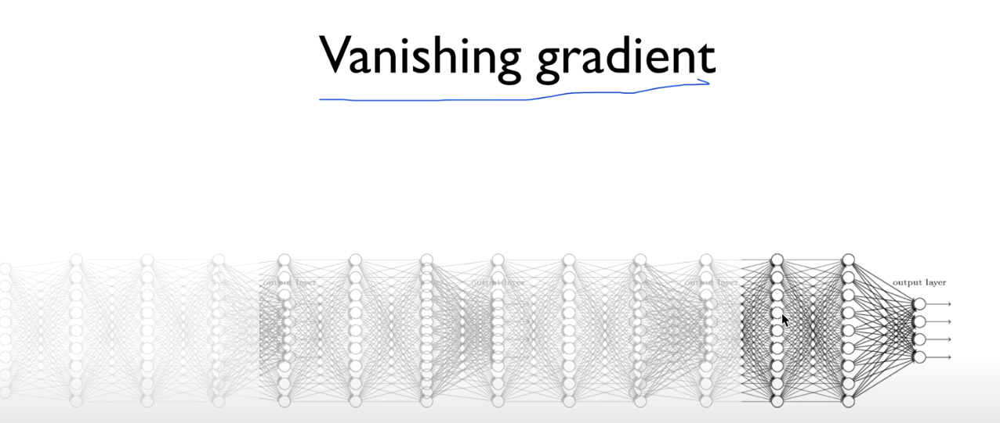

문제 해결 방법 두 가지.

하나는 ReLU

### Geoffrey Hinton's summary of findings up to today

두번째가 바로 이 문제.

Hinton 교수님 뒤를 돌아보며 그때 우리가 왜 안 됐는가 얘기할 때 네 가지 문제 지적

- Our labeled datasets were thousands of times too small.
- Our computers were millions of times too slow.
- **We initialized the weights in a stupid way.**
- We used the wrong type of non-linearity

그 중의 하나가 초기 값을 멍청하게 했다 고백했다.

### Cost function

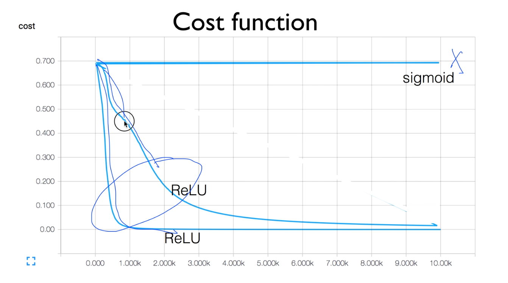

이전 데이터에도 잠시 보여드렸던 것처럼, 이 sigmoid는 안 된다.

ReLU 사용. 두 번 실행.

코드는 바뀐 게 없는데, Cost 함수가 조금 달라진다. 하나는 빨리 떨어지고 하나는 조금 덜 빨리 떨어진다.

여러분도 같은 코드 실행시켜도 조금 다른 결과가 나올 때 있다.

왜 그런가? 우리가 weight을 입력할 때 random 값을 줬다. 보통 -1 ~ 1 사이.

이 random 값에 따라서, 결과가 차이난다.

### Set all initial weights to 0

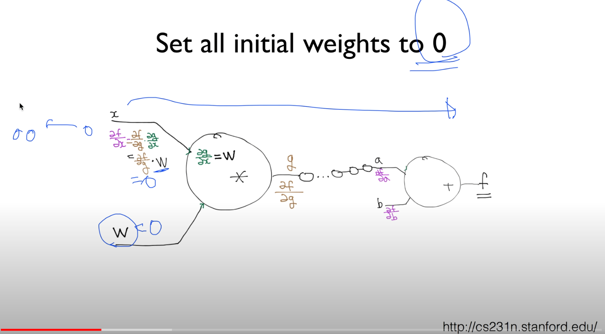

chain rule

예를 들어, w 초기값을 쿨하게 0으로 주자.

Java같은 곳 초기값 0으로 주자너

어떤 문제가 발생할까요?

w가 chain rule할 때 그 값이 사용되는데 0이다.

x라는 값을 가지고 앞으로 forward propagation하면서 값을 구한다.

이 값을 이용해서 미분 값을 실제로 구해야 한다.

∂f/∂x = ∂f/∂g · w에서 w = 0이므로 ∂f/∂x = 0, 기울기 0

-> 뒤에 있는 것들 다 기울기 0이 된다.

이것이 바로 한 예.

gradient가 사라져버리는 문제 발생

### Need to set the initial weight values wisely

- Not all 0's
- Challenging issue
- Hinton et al. (2006) "A Fast Learning Algorithm for Deep Belief Nets"
  - Restricted Boatman Machine (RBM)

어떻게 할 것인가?

그래서 우리가 초기값 굉장히 잘, 똑똑하게 입력해야 한다.

절대로 모든 초기값으로 0을 주면 안 된다. -> 네트웤이 학습이 전혀 안 된다.

깊어지다 보니 어렵..

2006년에 나온 논문에서 어떻게 하면 좋을지 설명함.

Deep Belief Nets을 어떻게 잘 학습시키느냐

 -> 여기에 사용한 것이 Restricted Boatman (RBM)

지금은 잘 사용하지 않지만, 많이 나오는 용어이기 때문에, 

Deep Learning을 하신다면 한 번쯤 뭔지 보시면 아주 좋다.

RBM을 사용해서 초기화 시키는 Network -> Deep Belief Nets(DBN)

### RBM STRUCTURE

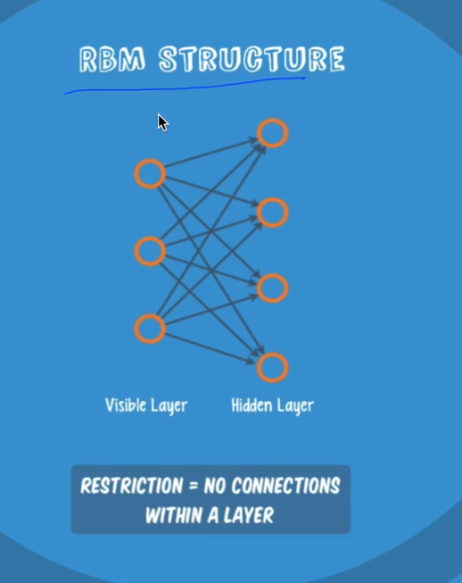

이게 RBM 구조

2단만 있다고 가정. 입력단, 출력단.

RESTRICTION 뜻: 노드들끼리 연결되지 않고, 앞뒤로만 연결되었다는 뜻.

어떤 입력 값이 있을 때..

두 가지 operation이 있다.

이 operation의 목적: 입력 재생산(RECREATE INPUT)

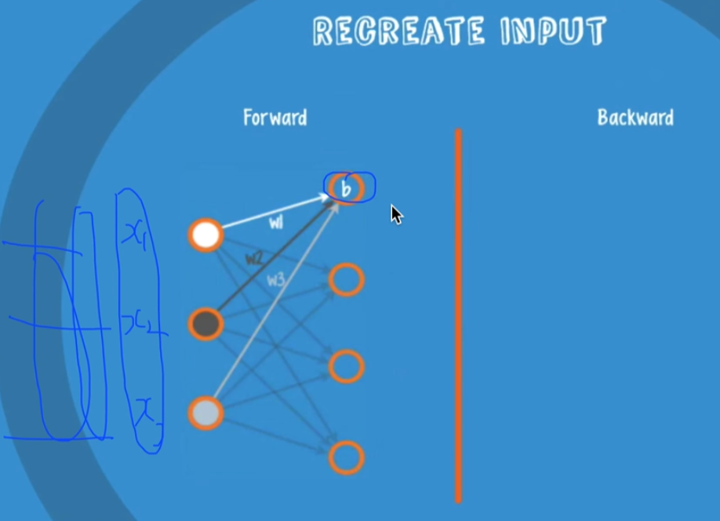

어떤 입력이 있다. x1, x2 ,x3

이게 많이 있을 것..

w, b를 곱해서 어떤 값을 낸다.

이런 것을 Forward라고 한다.

여러 값이 있을 때 x1, x2, x3가 하나의 dataset

각각 이런 방법으로 어떤 값을 만들어낸다.

값에 따라 activation이 되고 안되고 하겠죠? 값을 보낸다.

두 번째는, 똑같은 일을 반대로 거꾸로 한다.

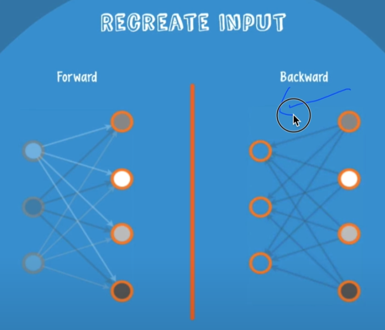

여기서 weight는 그대로 사용한다.

아까 받아놓았던 값을 그대로 weight을 곱해서 거꾸로 쏴준다.

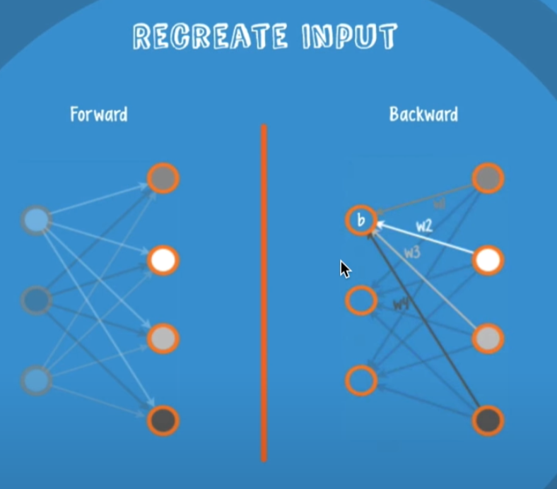

이렇게 해놓고, 우리가 첫 번째 줬던 x값이랑,

받은 값, 일종의 생성된 X햇 값을 비교한다.

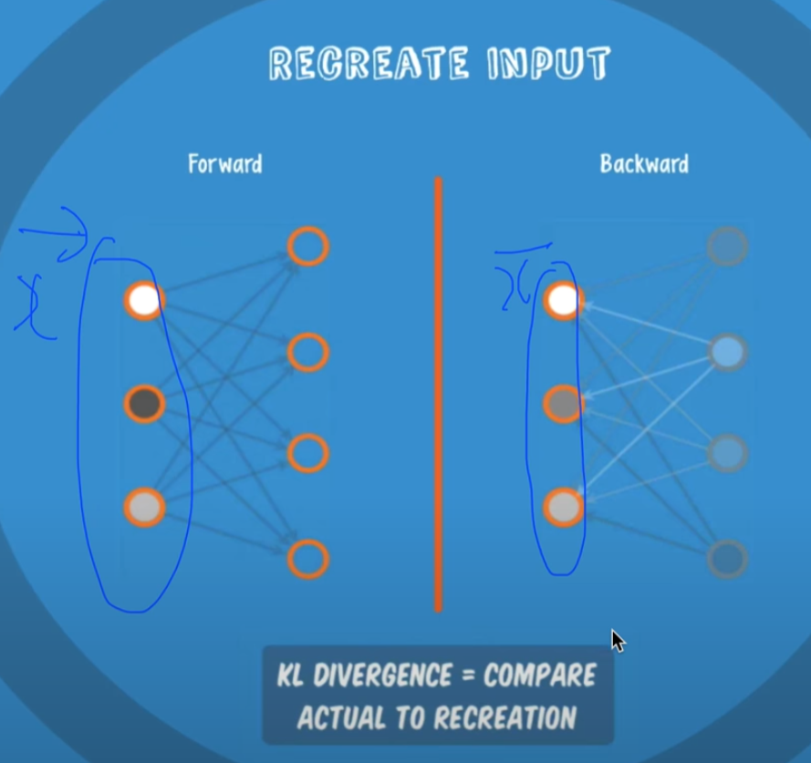

X햇이 최고가 되도록, 똑같이 되도록, 차가 최소가 되도록 weight를 조절한다.

weight를 조절해서 입력값을 쏘고, 출력된 값을 다시 거꾸로 했을 때, 비슷한 형태의 값이 나오게 weight들을 좆어하는 것을 Restricted Boatman Machine 이라고 한다.

거리를 구할 때는 KL DIVERGENCE 이런 연산자를 사용한다.

이것을 또 다른 말로는 Encoder, Decoder라고 한다.

왼쪽(3) -> 오른쪽(4) 이렇게 가는 것을 인코더라고 할 수 있고(암호화),

오른쪽 값을 거꾸로 쓰면 다시 돌아오죠? 복호화

이런 형태를 auto encoder, auto decoder라고도 한다.

### How can we use RBM to initialize weights?

이것을 가지고 처음 weight를 초기화시킨다.

이걸 가지고 어떻게 하지?

이런 아이디어

- Apply the RBM idea on adjacent two layers as a pre-training step
- Continue the first process to all layers
- This will set weights
- Example: Deep Belief Network
  - Weight initialized by RBM

레이어가 많이 있는데, 나머지는 신경쓰지 말고 두 개 레이어만 본다.

서로 encoder - decoder해서 초기 값이 내가 준 것과 유사하게 나오는 weight들을 학습시킬 수 있다. 넣었다 뺐다 하면서..

두 개 해놓고, 그 다음으로 가고, ... 하면서 학습시킬 수 있다.

예를 들어보자.

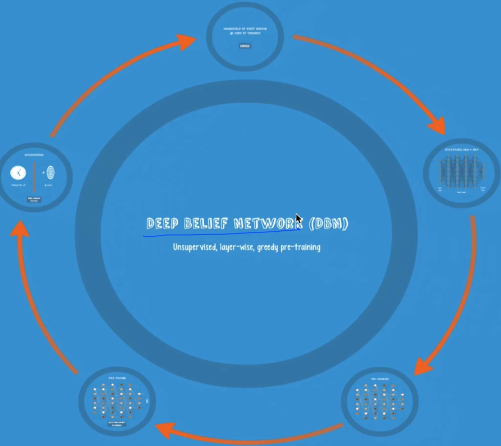

이런 것을 특별히 Deep Belief Network라고 한다.

PRE-TRAINING 과정

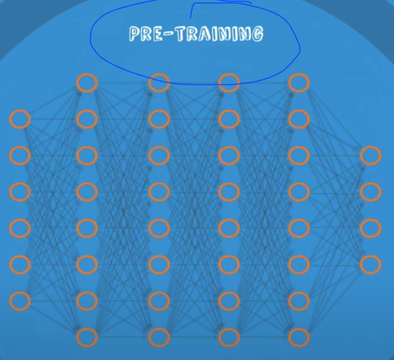

여기선 x 값만 있으면 된다.

label도 필요 없다.

x값만 있으면..

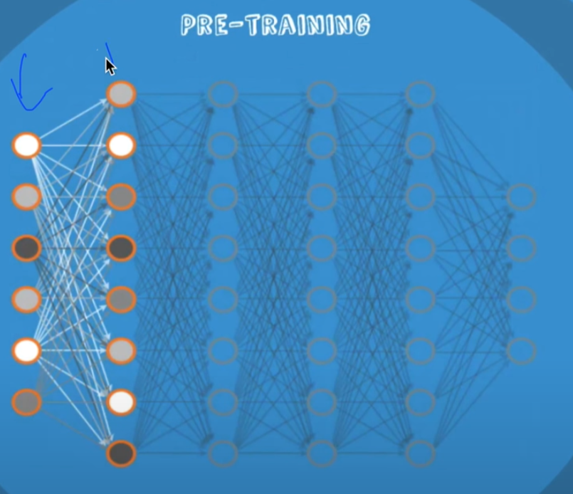

일단 두 개만 가지고, RBM(Restricted Boatman Machine)을 돌린다.

입력을 하고 출력을 하고 다시 거꾸로 쐈더니, 입력과 유사한 값이 나오는 이 weight들을 학습시키자..

그 다음 - 다른 것들은 신경 끈다. 

두 개의 레이어만 가지고 똑같이 앞으로 갔다 뒤로 갔다 하면서, 앞의 값을 만들어낼 수 있는 weight 값을 학습시킨다.

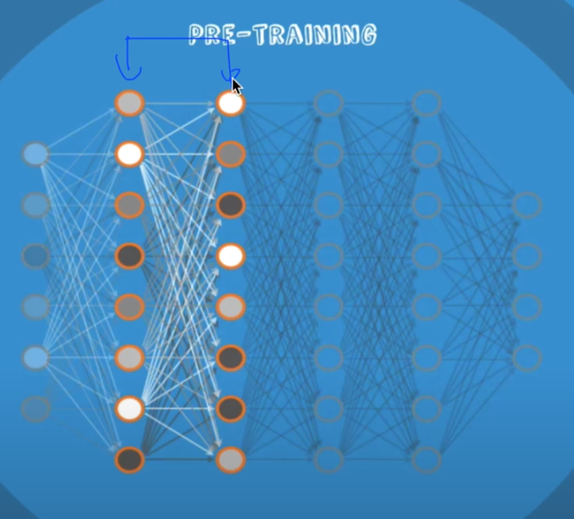

계속 진행시켜서 마지막까지 온다.

네트워크 전체를 보면, 이 weight 들이 각 시점 들어와있겠죠?

이 값이 바로 초기화된 값.

이것을 초기화 값으로 사용한다.

굉장히 훌륭하고 재밌는 아이디어.

이것이 잘 된다는 것을 보여준 것이다.

그리고 학습하듯이 실제 x 데이터를 놓고, 실제 label을 가지고 학습시킨다.

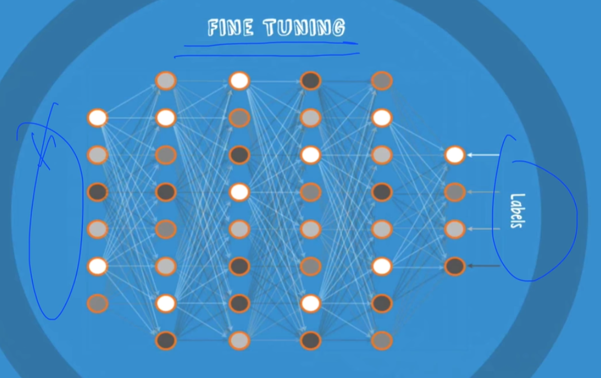

학습할 때, 데이터를 많이 쓰지도 않았는데 빨리 학습이 되었다.

이걸 학습이라고 부르지 않고, FINE TUNING이다 라고 부르기도 한다.

왜냐하면, 이미 가지고 있는 weight들이 훌륭하게 잘 학습이 되어 있고, 조금만 튜닝하면 되니까.

이것이 바로 2006년도에 세계를 깜짝 놀라게 했던 논문.

이렇게 깊은 Network. 어떻게 학습할까요? -> 초기화 값을 잘 주면 됩니다.

어떻게 초기값 줘요? -> RBM을 사용하세요.

### Good news

- No need to use complicated RBM for weight initializations
- Simple methods are OK
  - **Xavier initialization**: X.Glorot and Y.Bengio, "Understanding the difficulty of training deep feedforward neural networks," in International conference on artificial intelligence and statistics, 2010
  - **He's initialization**: K. He, X. Zhang, S. Ren and J. Sun, "Delving Deep into REctifiers: Surpassing Human-Level Performance on ImageNet Classification," 2015

좋은 소식

RBM 복잡.. 구현하기 쉽지 않다.

굳이 RBM 안써도 된다는 좋은 소식

굉장히 간단한 초기값을 줘도 되더라

Xavier initialization 2010년에 나왔던 논문. 아이디어 굉장히 간단.

하나의 노드에 몇 개의 입력이 있고 몇 개의 출력이 있는가?

이거에 맞게, 비례해서 초기값을 할당한다

2015년에 요걸 조금 개선

### Xavier/He initialization

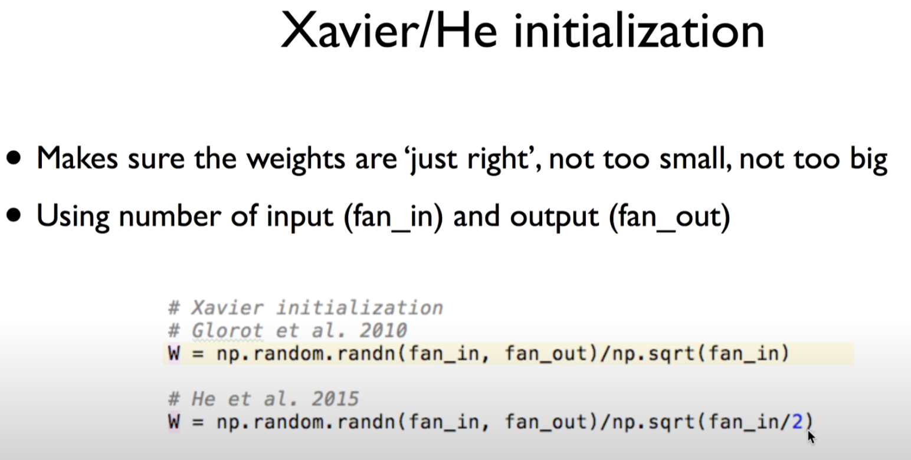

식을 보자.

기본적인 아이디어는 우리가 좋은 값을 선택하고 싶다.

입력(fan_in)이 몇 개인가, 출력(fan_out)이 몇 개인가에 따라서 구하면 된다.

weight을 random하게 준다.

fan_in, fan_out 사이 값을, sqrt(fan_in)으로 나눈 형태로 초기 값을 주니까, 

argument가 비슷하게, 더 잘 되더라

굉장히 좋은 소식. 더 간단하게 할 수 있으니까

2015년 옆동네 홍콩 중대 박사를 받은 분..

세상을 깜짝.. 모든 ImageNet 오류 3% 이하로 떨어지는 ResNet을 만든 분

이 분이 그 논문에 사용한 것.

초기값으로... /np.sqrt(fan_in**/2**)

이상하게 나누기 2를 하면 잘 되더라

실험으로써 밝혀냄.

이렇게 하시면 굉장히 좋은 성능을 낼 수 있다.

실습 시간에 보시면 굉장히 깜짝 놀랄 정도로 좋은 성능

### Prettytensor implementation

조금 더 복잡하게 보이는 것으로 구현해놓은 게 있다.

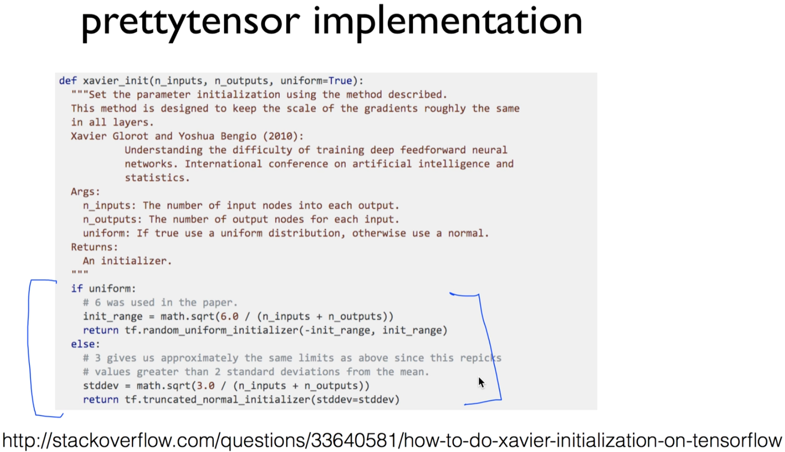

실습시간에 한 번 더 보여드리도록 하겠다.

### Activation functions and initialization on CIFAR-10

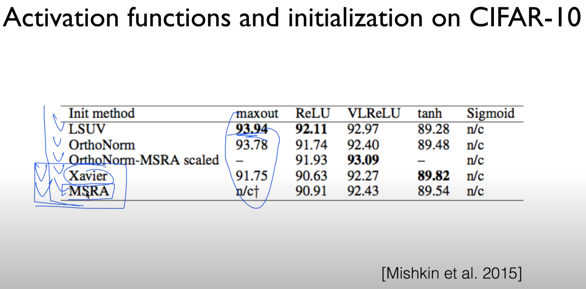

연구자들이 여러 가지 방법으로 초기화시키는 것을 해봤다.

몇 가지 다른 방법들이 있는데, 해봤더니 조금씩 차이가 있지만 이 정도의 방법들만 써도(Xavier, MSRA) 잘 되더라 가 결론.

### Still an activate area of research

- We don't know ho to initialize perfect weight values, yet
- Many new algorithms
  - Batch normalization
  - Layer sequential uniform variance
  - ...

이 분야가 아직 연구를 굉장히 많이 하고 있다. -> 우리가 모른다.

어떻게 정말 완벽한 초기값을 선택할 수 있을 것인가

여러분이 알고리즘을 적용시킬 때 데이터마다 다를 수 있다.

여러분이 가져다가 여러가지 방법으로 한 번 실행시켜보고, 그 중에 잘 되는 것을 고르면 되겠다.

### Geoffrey Hinton's summary of findings up to today

- Our labeled datasets were thousands of times too small.
- Our computers were millions of times too slow.
- **We initialized the weights in a stupid way.**
- **We used the wrong type of non-linearity.**

두 가지 문제가 해결되었기 때문에, 여러분들이 굉장히 Deep Learning을 잘 학습시킬 수 있는 모든 것들을 갖추시게 되었다.

##### Next

Dropout and model ensemble

