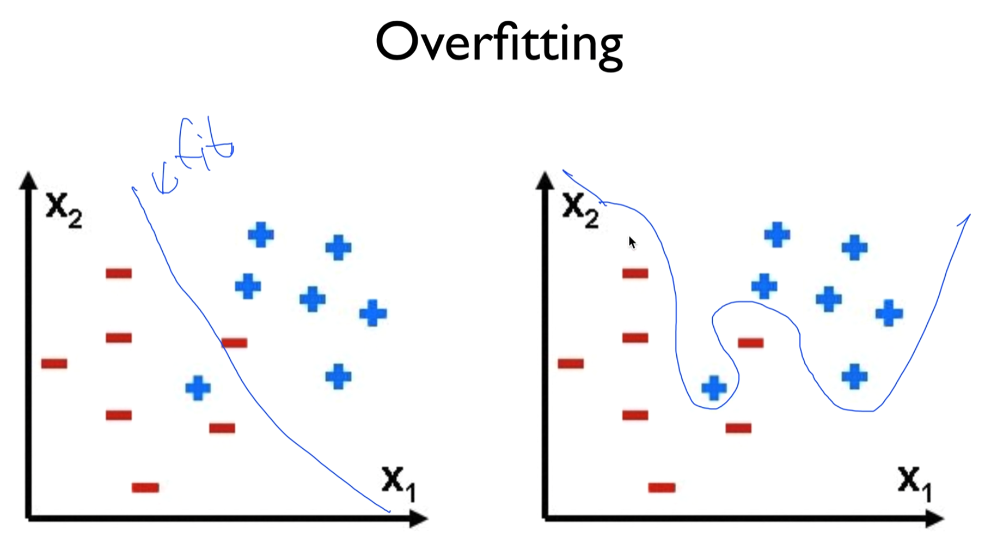
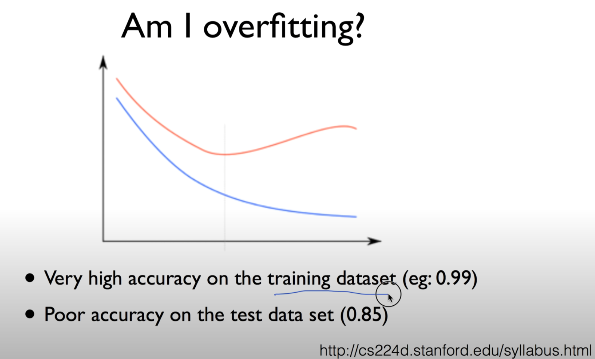
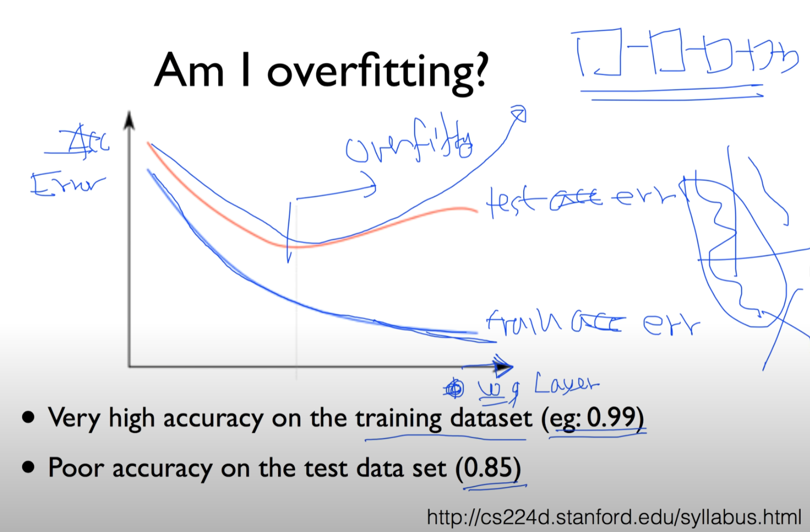
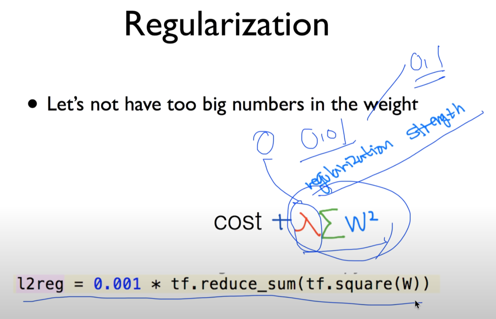
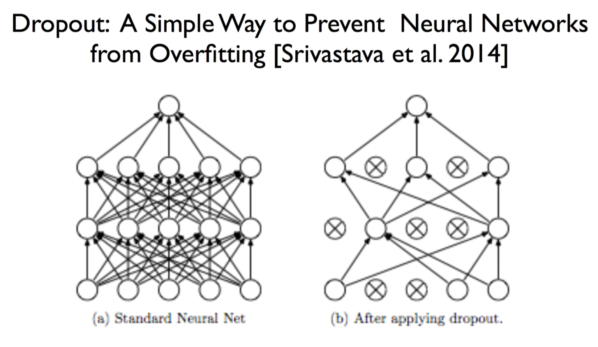
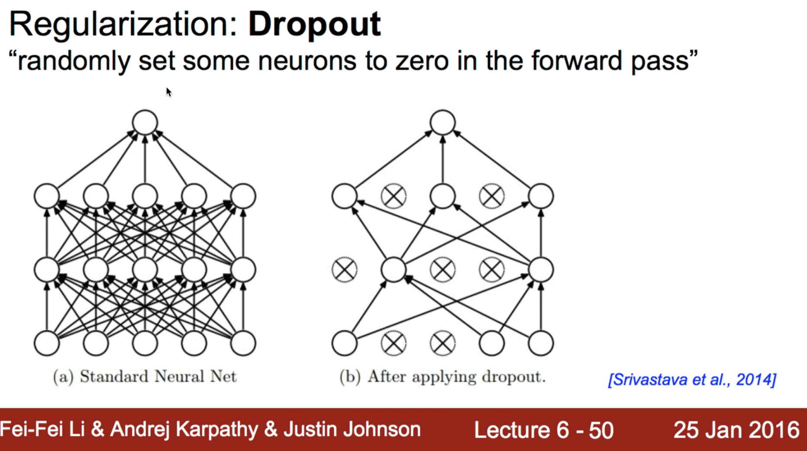
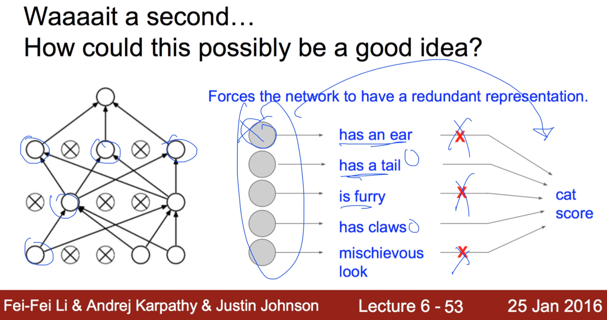
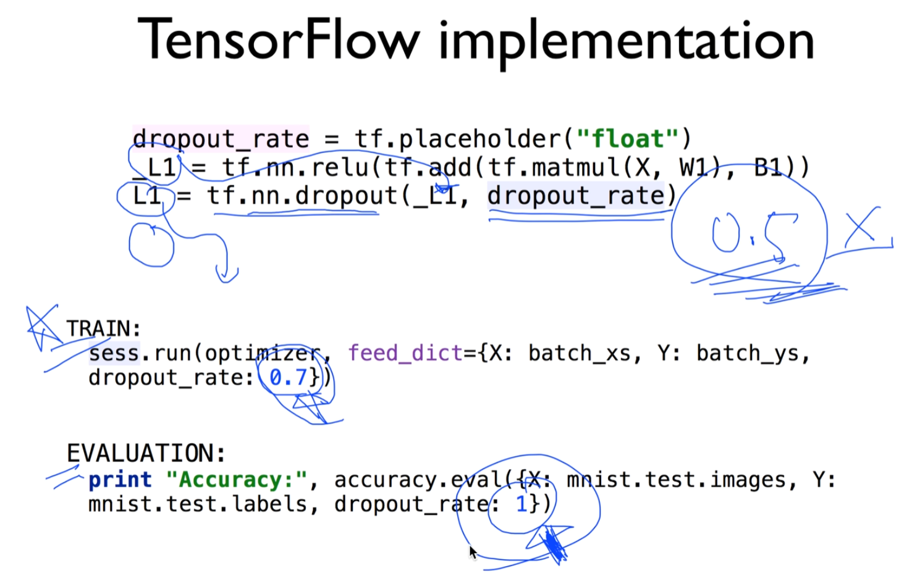
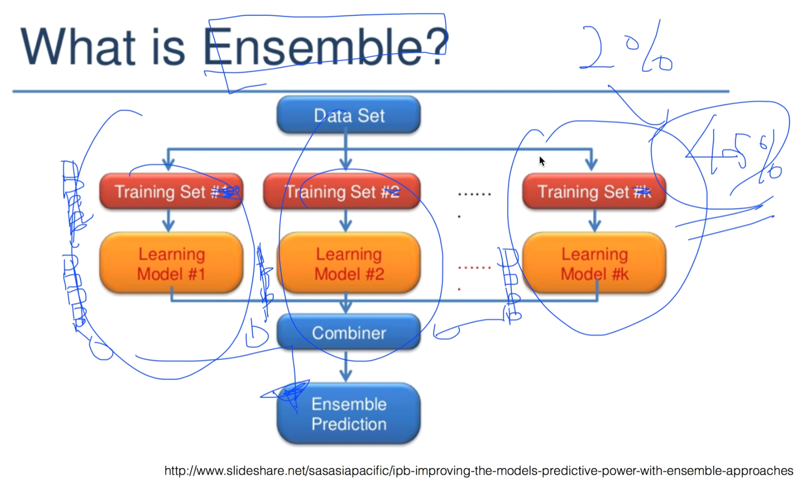

https://www.youtube.com/watch?v=wTxMsp22llc&list=PLlMkM4tgfjnLSOjrEJN31gZATbcj_MpUm&index=32

### Lecture 10 - 3 NN dropout and model ensemble

Deep Learning 잘하기 세 번째 시간

dropout, model ensemble에 대해 얘기해보겠다.

### Overfitting

이것을 하는 이유

Overfitting 기억나시나요?

간단한 데이터가 있을 때, 좋은 커브로 잘 자르면 Fit.

w에 심화 내용을 줘서 막 구부림.

학습 데이터 accuracy 100%이지만 -> Overfitting

### Am I overfitting?

내가 overfitting인지 아닌지 어떻게 알 수 있나?

학습 데이터로 설정하면 거의 100점이 나온다.

한 번도 보지 못한 데이터를 가지고 하면 85점..

모의고사 시험 막 달달외워서 똑같은거 내면 100점

내가 한 번도 보지 못한 조금 응용된 문제 실전에 나오면 잘 못 푼다. 70점

이런 경우를 overfitting 되었다고 한다.

이런 모델은 실전에는 사용하기 별로 좋지 않다. 그래서 문제.

파란색 - training accuracy

빨간색 - test accuracy

y축 Error

x축 weight 몇 개 있느냐 또는 Layer 몇 단 사용했느냐

어떤 문제가 있냐

많은 Layer를 가지고 학습할수록, training data에서는 계속 Error가 떨어진다. 

상당히 잘 학습되고 있다. 되고 있는 것처럼 보인다.

실전 데이터를 사용하면, 어느 순간까지 떨어지다가 쑥 올라간다. 에러율이.

이게 overfitting

깊게 NN할수록, Overfitting될 가능성이 높다.

굉장히 많은 형태의 변수가 사용된다.

hyperplain. 굉장히 꼬부리치게 된다.

이것을 방지해야 됨.

### Solutions for overfitting

- More training data!
- Reduce the number of features
- **Regularization**

가장 좋은 방법 - 학습 데이터를 더 많이 

더 많을수록 overfitting 방지

가능하다면 features를 줄여준다. Deep Learning에서는 굳이 그럴 필요 없다.

그래서 Regularization을 사용해야 한다.

### Regularization

지난 번에 잠깐 소개드렸다.

- Let's not have too big numbers in the weight

너무 weight 큰 값으로 꼬부리지 말고 조금 펴자 가 기본적인 아이디어.

이걸 수학적으로 표현한 것이 바로 l2 regularization, 각 element에 있는 값을 곱한 것이 너무 크지 않게 하는 것.

NN에서도 많이 사용한다.

tool을 사용할 때 변수 λ를 물을 것이다.

얼마나 중요하게 생각하냐

0 - 끄는 것.

0.01 중요

0.1 굉장히 중요하게 생각

tensorflow에서는 이걸 굉장히 쉽게 구현할 수 있다.

### Dropout: A Simple Way to Prevent Neural Networks from Overfitting [Srivastava et al. 2014]

NN에서는 다른 하나가 더 있다.

아주 재밌는 아이디어. Dropout

Dropout

그만둬버리는 것

2014년도에, 어떻게 보면 재밌다 못해 굉장히 황당한 생각.

우리가 (a)처럼 힘들게 Neural Network를 엮어놨다.

이것을 끊어버리자는 것이다. 학습할 때.

(b)처럼 만든다. 몇 개의 Node를 죽이자.

이게 Dropout. ㅋㅋㅋ

### Regularization: Dropout

"randomly set some neurons to zero in the forward pass"

Random하게 어떤 Neural들을 취소시켜버리자 ㅋㅋㅋ

처음에 얘기 들었을 때 놀랐다. 이게 될까?

이게 왜 되는가?

### Waaaait a second... How could this possibly be a good idea?

이런 의미라고 볼 수 있다.

각각의 뉴런들이 어떤 전문가. 어떤 것을 예측하는 전문가.

훈련할 때 '몇 명은 좀 쉬어'

남은 사람들만 가지고 훈련시킨다.

그 다음 훈련도.. 랜덤하게 쉬게 하면서 훈련시킨다.

ex) 어떤 뉴런이 귀가 있는지 없는지 보는 전문가

이걸 가지고 고양이인지 아닌지 학습.

쉬게 해놓고 나멎지 애들만 가지고 맞춘다.

그런 다음에, 마지막에 애들 총 동원해서 예측하면 어떨까?

더 잘 될수도 있겠죠?

이것이 바로 Dropout의 아이디어

상당히 잘 된다.

### TensorFlow implementation

Dropout 구현하는 것도 그렇게 어렵지 않다.

random하게 어떤 lost를 끊거나, activate function을 0으로 만들거나, 로프의 선을 끊어버리면 된다.

tensorflow에서 구현할 때는, 한 단을 더 넣어주면 된다.

_L1을 만들고 그것을 그 다음 Layer로 보내기 전에, dropout이라는 Layer로 보내고,

dropout에서 나온 것을 그 다음 Layer로 보낸다.

몇 프로 dropout시킬까 -> dropout_rate

random하게 고른다. rule이 있는 게 아니라. 보통 0.5 많이 쓴다. -> 반 잘라낸다.

주의하실 점) 이것은 학습하는 동안에만 Dropout시킨다.

학습할 때만 전문가 빼고 함

실전에는 전문가 모두 불러와야 한다.

실전에는 dropout_rate를 1로 한다.

1이란 말은, 모두 참여해! 이런 얘기

학습할 때 dropout_rate 0.7 -> 70%만 참여하고 30%는 쉬어 이런 얘기

학습할 때 반드시 dropout 사용

평가하거나, 실제로 이 모델을 사용할 때는 전체 다를 불러와야 한다. (dropout_rate: 1)

이것만 주의하시면, 아주 쉽게 dropout 구현할 수 있고, 구사하시면 더 좋은 효과를 볼 수 있다.

### What is Ensemble?

우리가 모델들을 학습시킬 수 있는데, 이런 말을 쓴다. 앙상블시킨다.

기계가 많고 학습시킬 수 있는 장비가 많을 때 사용할 수 있다.

아이디어 - 독립적으로 Neural Network를 만든다. 10단..

Training set 다르게 줄 수도 있고, 같게 줄 수도 있다. (같다고 가정하시는 듯)

이런 다음에 (Learning Model)9단을 만듦..

똑같은 형태의 NN, Deep Learning 3개, 10개 만든 다음에 학습을 시킨다.

초기값 조금씩 다르니까 결과값이 조금씩 다르게 나오겠죠?

그런 다음에 마지막에 얘를 합친다. combiner

그 다음에 결과를 낸다.

마치 한 명에게 물어본다. 어떻게 생각하세요?

한 명에게 물어보는 것보다, 독립된 전문가 100명에게 물어보면 조금 더 다양할 수 있다.

이렇게 하는 것을 앙상블이라 한다.

최소 2%에서 많게는 4~5%까지 성능 향상. 놀랍죠?

실전에 사용할 때는 이 앙상블이라는 모델을 사용하시면 굉장히 좋다.

