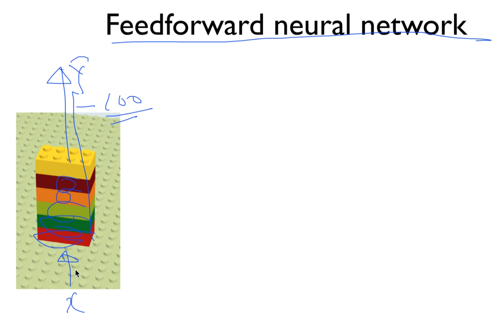
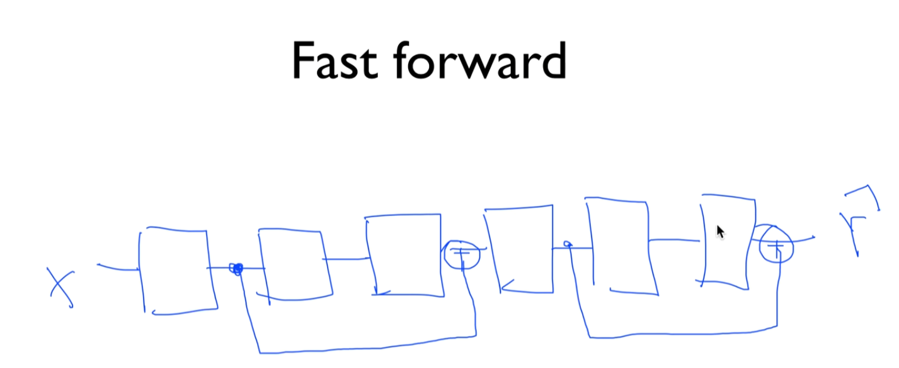
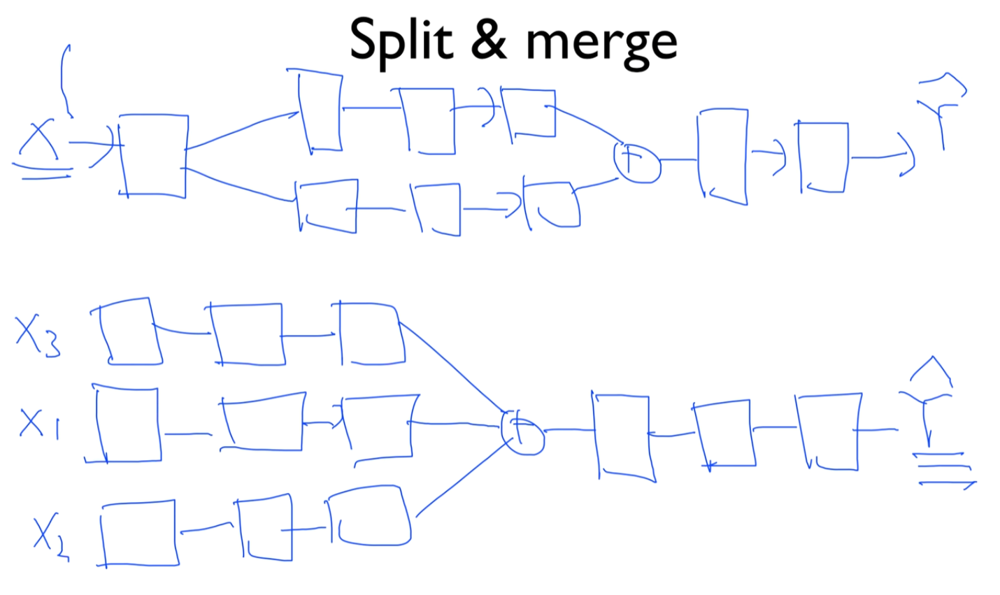
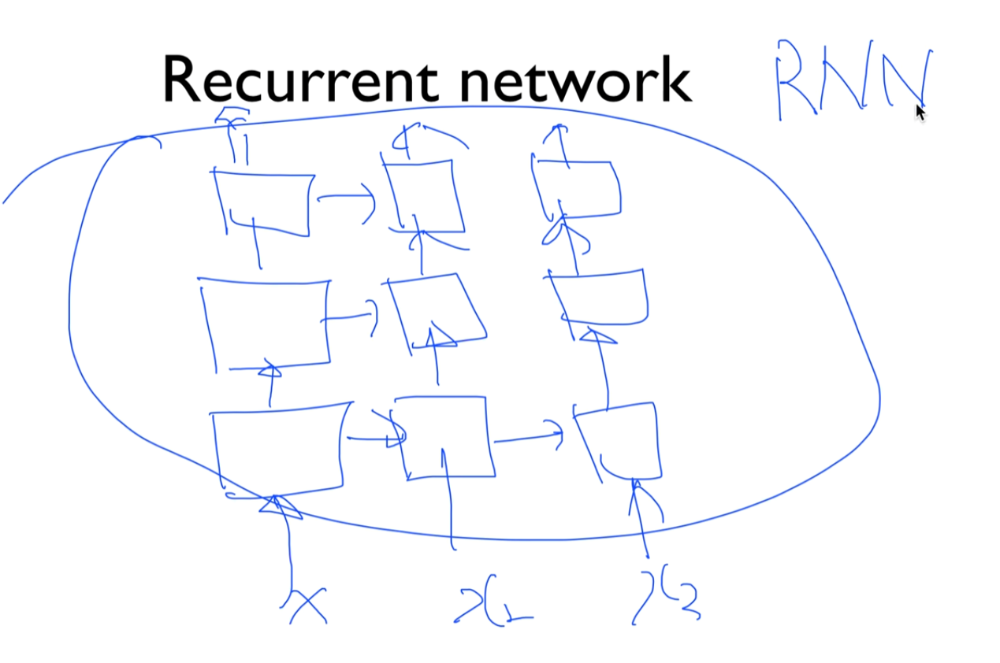

https://www.youtube.com/watch?v=YHsbHjTBx9Q&list=PLlMkM4tgfjnLSOjrEJN31gZATbcj_MpUm&index=33

### Lecture 10-4 NN LEGO Play

이제 원하는대로 네트워크를 조립하면 되는데, 마치 레고처럼 쌓기만 하면 된다.

### Feedforward neural network

입력 주어지면 계속 쌓았죠? 결과를 뽑아내는 형태로 네트워크를 많이 구성했다.

10단, 20단, 100단 이건 여러분들이 정하면 된다.

이런 형태만 있는 것이 아니라, 네트워크니까 굉장히 다양한 구조로 만들 수 있다.

### Fast forward

단순한 형태의 forward network.

여기서 나온 출력을 뽑아서 두 단 앞으로.. 붙인다.

제가 그냥 이름을 Fast forward라고 붙였다.

signal을 잡아서 앞으로 밀어줘서 들어가게 만들 수 있다.

이것이 바로 2015년에 He가 했던, 3% 이해로 ImageNet 인식을 만들어 낸 ResNet의 네트워크 구조.

기발하고 새롭다.

### Split & merge

이렇게만 하는 게 아니라, split과 merge도 한다.

두 개 나눠서 가다가.. 원하면 또 만난다. +같은 원하는 연산.

원하면 또 갈라지고.. 이런 식으로 Y값 예측할수도 있겠죠?

아니면 처음부터 입력 여러 개가 있을텐데, 나눠서 입력을 넣은 다음에, 각각 처리.

그 다음에 다시 모인다. 모아서 하나로..

이렇게 Y 예측 가능.

아래가 조금 형태는 다르지만, 많이 들어보신 Convolutional Network(한 형태)

해 보니까 잘 돼서 많은 사람들이 사용하게 되었다.

### Recurrent network

또, 봅시다..

x가 있었고 y를 출력

앞으로만 쭉 나가지 말고 옆으로 나가면 안 될까?

옆으로 이렇게 구성해보면 되겠죠?

이렇게 네트워크를 만듦. 잘 되네

이것이 여러분들이 많이 들어 본 RNN

하나의 유닛을 만드는 방법을 여러분들이 아셨기 때문에, 어떤 형태든 네트워크를 조립하고 여러가지로 해 본 다음에, 좋은 결과가 나오면 그것이 바로 여러분들만의 Neural Network, Deep Network가 될 수 있고, 여러분들만의 재밌는 문제를 풀 수 있다.

### 'The only limit is your imagination'

오직 여러분의 한계는 여러분의 상상력.

여러분의 상상력을 발휘해서 원하는대로 Lego block들을 조립해보시고, 잘 되는지 확인해보시면 아주 재밌게 Deep Learning을 사용하실 수 있게 됩니다.

비디오 여기까지 보셨으면 딥 러닝의 전문가가 되셨다, 딥 러닝을 사용하는 데에는 전문가가 되셨다고 할 수 있다.

오시느라 수고 많으셨고 다시 한 번 축하드립니다.

