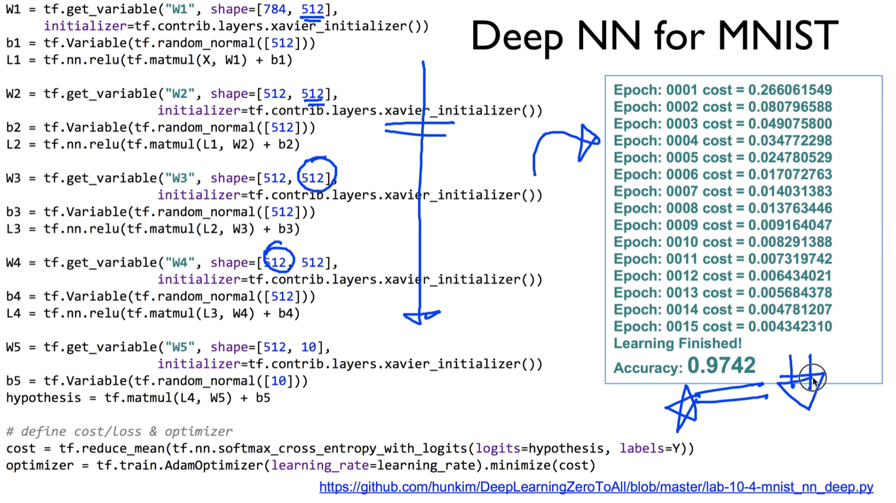

https://www.youtube.com/watch?v=6CCXyfvubvY&list=PLlMkM4tgfjnLSOjrEJN31gZATbcj_MpUm&index=34


### Lab 10 NN, ReLu, Xavier, Dropout, and Adam

이번 실습 시간에는 NN을 사용하면서 알아두시면 굉장히 좋은 tip들에 대해 얘기해보겠다.


https://github.com/hunkim/DeepLearningZeroToAll/blob/master/lab-10-1-mnist_softmax.py

### Softmax classifier for MNIST


지난 시간에 이 MNIST 데이터(손글씨)를 자동으로 인식하는 것 간단한 Softmax classifier로 만들어봤는데, 기억나시죠?

기억 잘 안나시면 Lab 7-2 [21강]에서 다뤘으니, 잠깐 슬라이드나 비디오를 보고 오십셔

소스코드의 구조 아주 간단.


784개의 벡터. W 설계시 784개가 입력으로 들어온다.

10개가 나감. 0~9 labeling하는 거니까.

기본적인 softmax 사용.


cross_entropy 소개해드렸죠? logits 이용..

이전과 같은 방법.


epoch 개념 지난 시간에 소개드렸다.

epoch에 대한 batch size 하는거도 말씀드렸다. 그대로 사용.

학습 후에 test 사용해서 accuracy 구하는 법도 얘기드렸다.


Epoch마다 cost가 나오고, 마지막에 정확도가 나온다. 90%

아주 간단한 네트워크, 모델에 관한 건 세 줄밖에 안된다.

주석, cost, optimizer


이 세 줄밖에 안되는 모델로 굉장히 훌륭한 결과를 낸다.

이것을 좀 더 개선하기 위한 팁들이 있다.


https://github.com/hunkim/DeepLearningZeroToAll/blob/master/lab-10-2-mnist_nn.py

### NN for MNIST


우선, 우리가, 이전에는 딱 한 단밖에 없었다.

더 깊게 들어갈 수 있다.

NeuralNet. softmax를 Neural Net이라하긴 어렵다.

NeuralNet이라 할 수 있을만큼, 3단 정도 추가할 수 있다.

추가할 때는 마찬가지로 가장 주의할 것이 Weight의 크기를 구하는 것.

첫 번째는 쉽다. 입력 784개자너 -> 숫자만큼 하면 됨.

256 이 값은 여러분들이 정하시면 된다.

제일 마지막 것은 10개로 확정.

중간은 여러분들이 디자인하기 나름.

주의할 것. [사이사이] 이전의 출력과 이후의 입력값은 같아야 한다.


이렇게 구성해주고 연결연결

그 다음에 우리가 모델을 할 때, 입력은 X, L1, L2가 된다.

입력을 Layer에 맞게 하면 된다.

여기 예시에서는 지난 수업에서 다룬 것처럼 ReLu라는 멋진 activation function을 사용하였다.

3단으로 모델 쌓아서.. 나머지는 똑같음

돌려보면 깜짝 놀라게 94프로까지 정확도 증가

3단으로 늘리고 ReLu 넣었는데 이런 굉장한 좋은 효과가 났다.


그 다음에 수업시간에 얘기한 것 - 우리가 초기화를 잘해야 한다.

초기화를 잘하는 방법 중의 하나 - Xavier


이걸 어떻게 할까?

구글에 가서 입력해보면 된다. 뒤에 tensorflow 붙이면 웬만한건 다 찾아진다.

보통 첫 번째 나오는 것이 답이다.

답을 한 사람은 이름 들어보셨을 듯. [ㅋㅋㅋㅋㅋㅋㅋㅋㅋㅋ 구글링하는 법까지 알려주는 교수님,,!!]

아주 간단하게 한 줄로 할 수 있다.

그대로 소스 코드로 가져와보자.


https://github.com/hunkim/DeepLearningZeroToAll/blob/master/lab-10-3-mnist_nn_xavier.py

### Xavier for MNIST


3단, ReLu 사용

바뀐 곳은 하나도 없다. 모델 그대로 사용

initializer 부분만 xavier_initializer로 하겠다. 이 부분만 바꾸었다.

그 다음에 실행해보면 와.. 깜짝 놀랄만한 결과

97.8%

재밌는 것을 보시면, 처음부터 cost가 굉장히 낮다. Epoch이 1일 때도 cost가 낮다.


앞에꺼 기억 나시나요? 


normal distribution으로 초깃값 설정

처음엔 cost 굉장히 높다. 그러다가 떨어짐.

xavier 하게 되면 처음부터 cost 굉장히 높다.

-> 초기 값이 잘 initialize되었다.

초기값만 바꿈으로써 97.83%까지 가게 된다.


여기서 멈추진 않는다. 더 잘 되게 해볼 것.


https://github.com/hunkim/DeepLearningZeroToAll/blob/master/lab-10-4-mnist_nn_deep.py

### Deep NN for MNIST



더 깊게 간다. 가능하면 넓게.

아까 3단이었는데 5단으로 늘림

아까 256정도 나갔는데, 512로 두 배로 늘리자

굉장히 넓고 깊게 파본다.

잘 될 것  같죠?

깊게 해서 돌려보면.. 초기값은 xavier.

값만 추가되었고 중간에 나가는 크기 커짐.

결과 조금 실망.. 97.42% 이전에 97.83%였는데 97.42%로 떨어짐.

더 깊게 쌓았는데 왜 이런 일이 발생했을까요?

데이터에 따라 각각 다른 요인이 있을 것.

여기에서는 아마도 overfitting..

네트워크 깊어지면 네트워크가 학습 데이터를 그냥 기억을 해버린다.

너무나 기억해버리면, 새로운 testing data가 들어오면 오히려 결과가 나빠지는 현상.

그것을 막는 여러 가지 방법 중 하나 - Dropout


https://github.com/hunkim/DeepLearningZeroToAll/blob/master/lab-10-5-mnist_nn_dropout.py

### Dropout for MNIST


네트워크가 overfitting되지 않도록, 학습시킬 때 어떤 Network가 있으면 일부를 끊고 학습시킨다.

Dropout으로 예방.

이것을 tensorflow로 어떻게 예방하느냐?

한 Layer를 더 넣어주면 된다.

```python
L1 = tf.nn.relu(tf.matmul(X, W1) + b1)
L1 = tf.nn.dropout(L1, keep_prob=keep_prob)
```

Layer에서 나온 값(L1)을 dropout이란 layer로 넣어주면 된다.

일반적인 모델이 있고, Dropout이란 Layer가 있다고 생각하면 된다.

입력 L1이고 이것이 출력되도록 했다.

여기서 몇 프로를 끊어버릴 것인가?, 몇 프로를 keep할 것인가를 정해줘야 한다.

tensorflow1.0부터는 keep_prob으로 변수명이 바뀌었다.

전체 중 몇 프로의 Network를 keep할 것인가를 정해준다.


통상적으로 학습, train할 때는 0.5 ~ 0.7을 한다.

testing, 실전에서는 반드시 1로 해야 한다.

학습할 때 - 우리 Network 친구들 좀 쉬어~ 했지만

testing할 때는 우리가 알고 있는 모든 것을 총 동원해야 한다 -> 반드시 1


보통 keep_prob를 placeholder로 정하고, 이것을 학습할 때와 testing할 때 다르게 feed_dict를 통해서 값을 넘겨주게 된다.


학습하는 단계에서 keep_prob: 0.7로 만든 뒤 학습시킬 때 넘겨준다.

모델에서는 keep_prob 0.7로 받아서 학습.

학습이 끝나게 되면, 마찬가지로 keep_prob이라는 place_holder의 값을 반드시 1로 해준다.

안해주면 좋은 결과가 나오지 않는다. 

accuracy를 testing해준다.

모든 network를 총 동원한다.

돌려보면 결과 98.04%까지 올라갔다.

97.42% -> 98.04%. 작은 값이라고 볼 수 있지만, 올리기 굉장히 힘든 일이다.

여기서 99%로 올리는 일은 정말 힘든 일이다.


### Optimizers

이전에는 GradientDescentOptimizer를 그냥 사용했다. learning rate도 주고..


그런데, Optimizer는 GradientDescent만 있는 것이 아니라 굉장히 많은 Optimizer가 있다.

여러분들이 한 번씩 사용해보셔서 어떤 것이 잘 학습되는지 test해보면 좋을 듯.


어떤 것이 더 좋은가 하는 것을 시뮬레이션하는 웹 페이지가 있다.

우리가 쓰는 여러 가지 것들에 대해 어떤 것이 더 잘 되는지 결과를 볼 수 있다.


### ADAM: a method for stochastic optimization


몇 번 정도 학습을 하느냐가 x축

cost가 y축.

cost 빨리 줄어들수록 좋은 것.

Adam이란 것이 상당히 좋은 결과를 만들어 낸다.

통상적으로 여러분들이 여러 가지 Optimizer를 test할 수 있지만, 처음에 시작은 Adam으로 하면 좋다.


### Use Adam Optimizer


해보고 안되면 다른 것으로 바꾸면 된다.

Adam - 이전에 GradientDescent 썼던 거랑 똑같이 쓰면 된다. 이름만 Adam으로 바꾼다. Learning rate는 그대로 주시면 된다.

```python
optimizer = tf.train.AdamOptimizer(learning_rate=learning_rate).minimize(cost)
```

tensorflow를 사용하시면 아주 손쉽게 다른 형태의 optimizer를 시도해볼 수 있다.

그 중 Adam을 쓰시길 권장드린다.


### Summary


전체적으로 요약

여러 가지 팁들을 다루었다.

- Softmax VS Neural Nets for MNIST, 90% and 94.5%
- Xavier initialization: 97.8%
- Deep Neural Nets with Dropout: 98%
- Adam and other optimizers
- Exercise: Batch Normalization
  - https://github.com/hunkim/DeepLearningZeroToAll/blob/master/lab-10-6-mnist_nn_batchnorm.ipynb


그냥 간단하게 softmax, 한 단에 있는 네트워크와 여러 네트워크를 갖고 해 봄. 90% -> 94.5%

Xavier initialization 하면서 97.8%까지 급격한 점프

굉장히 깊게 들어가면 overfitting 문제 -> dropout 기법으로 98%까지 구현 가능.

다른 optimizer들도 많이 있지만, Adam으로 시작하시고 다른 것들도 시도해보시면 좋겠다.

최근 들어 굉장히 많이 쓰고 있는 Batch Normalization. 입력값 Normalize 잘 하는 것이다.

깃허브에 많은 분들이 올려주신 것 보시고, 98% 성능을 더 올릴 수 있는지 연습해보시면 좋겠다.


여기서 멈추지 않고 더 나아갈 것이다.


### Lecture and Lab 11 CNN

다음 시간에 얘기할 것이 CNN.

Convolutional Neural Network. 많이 들어보셨겠지만, CNN을 사용하면.. 98% 굉장히 깊었죠?

CNN 사용하면 99%까지 올라갈 수 있다. 굉장히 신난다.

이것을 다음 시간에 얘기해보겠다.

