https://www.youtube.com/watch?v=Em63mknbtWo&list=PLlMkM4tgfjnLSOjrEJN31gZATbcj_MpUm&index=35

### Lecture 11-1 CNN introduction

Convolutional Neural Network에 대해서 얘기해보도록 하겠습니다.

### 'The only limit is your imagination'

우리 이제 기본적인 Network 구성할 수 있게 되었다.

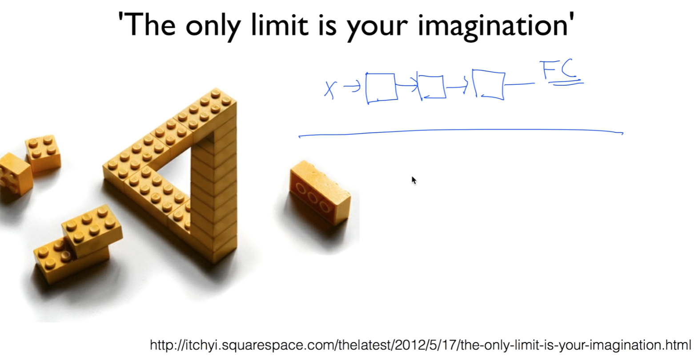

x라는 입력을 받고, 앞으로 쭉 보내서.. Forward Net이라고 불렀죠?

출력 네트워크 쉽게 생성 가능.

전체가 계속 연결되어 있다고 해서 Fully Connected Network라고도 부른다.

이런 간단한 것도 할 수 있지만,

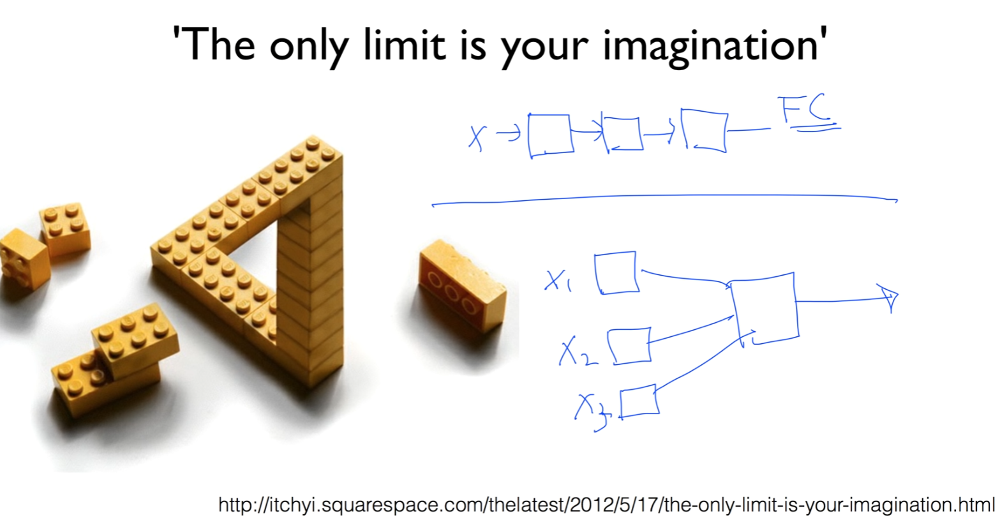

이런 네트워크도 생각해볼 수 있다.

그 다음에, 이것을 어떤 방법을 써서 하나로 합치고, 앞으로 내보낼수도 있다.

이런 형태의 네트워크 생각할 수 있다.

이것이 바로 어떻게 보면 Convolutional Neural Network의 기본적인 아이디어라고 할 수 있다.

### Convlolutional Neural Networks

오늘 사용할 슬라이드는 대부분 stanford 수업에서 가져왔다.

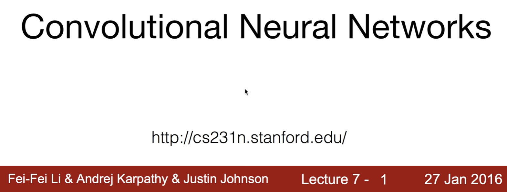

### A bit of history

Convolutional Neural Network의 기본적인 아이디어는, 고양이 실험에서 시작되었다.

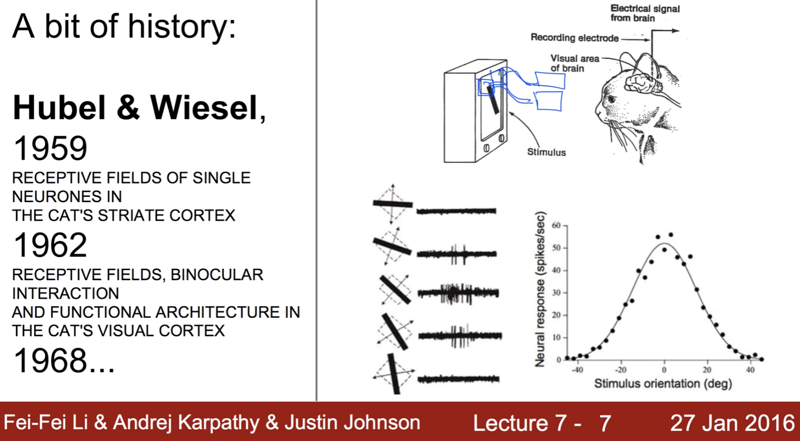

고양이에게 어떤 형태의 그림을 보여줬더니, 그림을 읽어들이는 뉴런들이 동시에 다 동작하는게 아니라, 어떤 형태의 그림, 어떤 부분의 그림들에 대해서만 반응한다는 것을 알게 되었다.

그 부분의 이미지만 바라보는 뉴런들이 있었다.

입력 어떻게 보면 나누어서 받는다.

여기에 착안해서 비슷하게 만들어보자고 하는 것이 Convolutional Neural Network의 아이디어였고, 굉장히 성공적이었다.

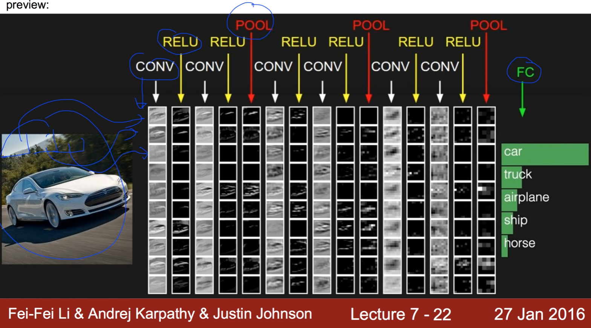

그림을 먼저 보시면,

하나의 이미지가 있게 되면 이 이미지를 어떻게 자른다.

각각의 입력으로 넘기게 되는데, 이 층을 convolutional layer라고 한다.

그래서 이 전체의 network 이름이 convolutional neural network.

그리고 우리가 좋아하는 RELU라는 함수를 중간에 넣을 수 있다.

convolutional을 한 번만 하지 않고 여러 번 할 수 있다.

중간에 pooling할 수 있다.

이런 코드를 여러 번 반복한 다음에, 마지막으로 여러분이 쉽게 구성할 수 있는 Fully Connected Neural Network을 구성해서 최종적인 Labeling을 하고 싶다. Labeling하는 10개의 Softmax Classifier를 뒤에다가 붙일 수 있게 된다. 그러면 한 Layer부터 단계적으로 어떻게 진행되었는지 얘기해보도록 하겠다.

### Start with an image (width x hight x depth)

처음에 우리가 이미지를 입력받게 되겠죠?

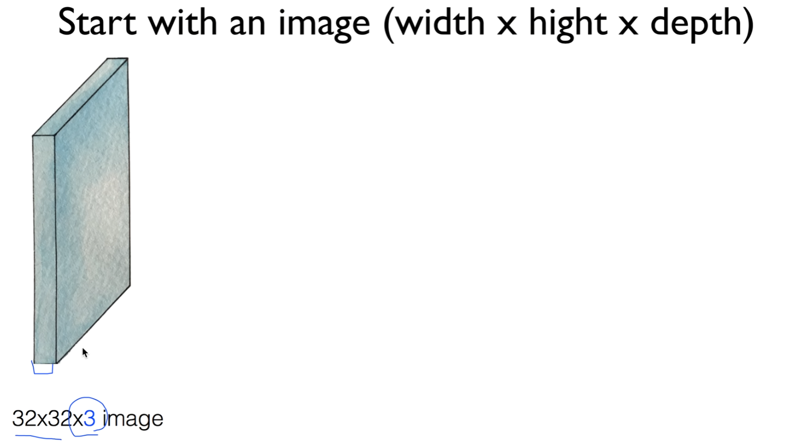

이런 형태의 이미지가 있다고 가정..

크기 32x32, color이기 때문에 3가지 색상의 RGB 형태가 있다.

이런 형태의 이미지, vector값이 주어졌다.

### Let's focus on a small area only

고양이 실험에서 한 것처럼, 전체 이미지를 하나의 입력으로 받지 않고, 이미지의 일부분만 우선 처리하고 싶다.

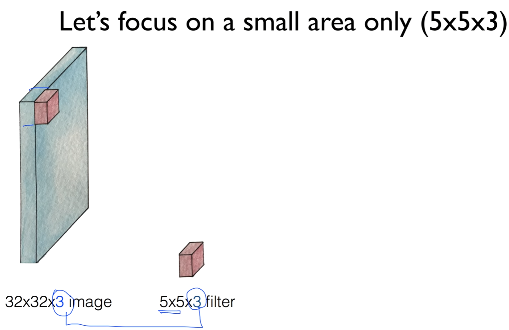

처리하는 것 - 여기서는 filter라는 개념을 가지고 설명한다. 필터라는 개념이 이해하고 설명하기 쉽기 때문이다.

5x5x3

색깔은 같이 처리 - 3, 항상 같은 값

필터의 크기는 여러분들이 정의할 수 있게 된다.

한꺼번에 얼마만큼 보고싶은지

여기선 5x5로 filter size를 정했다고 보자.

필터는 5x5에 해당하는 값들만 읽어들일 것이다.

읽어들여서 필터가 하는 일은 뭐냐?

### Get one number using the filter

필터는 궁극적으로 한 값을 만들어낸다.

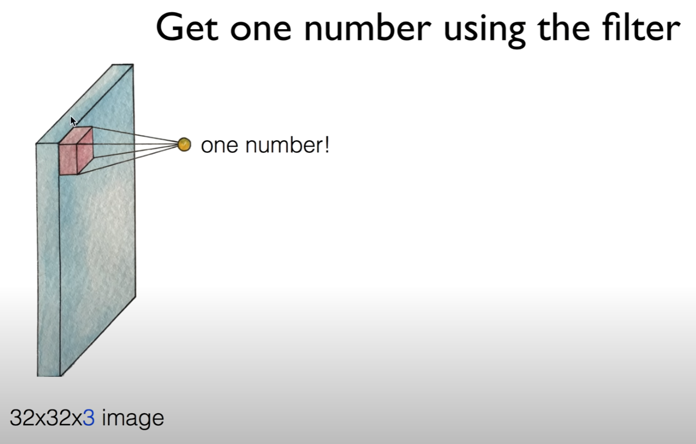

5x5 값을 x라고 하자.

전체 말고 저 값만 x

x를 입력받아서 어떤 처리를 한 다음에, 한 점만 뽑아낸다.

이것이 필터가 하는 일.

어떻게 하면.. x에 숫자가 여러 개 들어있겠죠?

5x5 필터면 5x5x3의 숫자가 들어있는데, 한 개의 값으로 어떻게 만들어낼 수 있을까요?

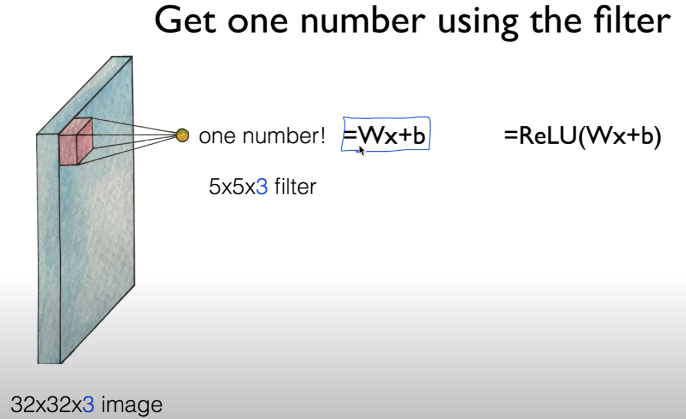

우리가 처음부터 많이 얘기했던 값 Wx + b의 폼을 많이 사용한다.

굉장히 사랑하는 term..

이것을 사용해서 한 값으로 만들어낸다.

5x5x3 이것을 간단하게 5개 있다고 보면..

x1, x2, x3, x4, x5

한 값으로 만들어내는 것 -> Linear regression에서 Multi feature가 있을 때 했던 것과 똑같은거죠?

Wx + b에서 W가 weight.

w1x1 + w2x2 + w3x3 + w4x4 + w5x5 + b 이렇게 주어지겠죠?

w 형태에 따라 이 값이 어떤 하나의 숫자로.. (지난 번엔 Y햇) 숫자로 만들어진다.

우리가 흔하게 봤던 Wx + b 이 식을 사용해서 하나의 숫자로 만들어낸다.

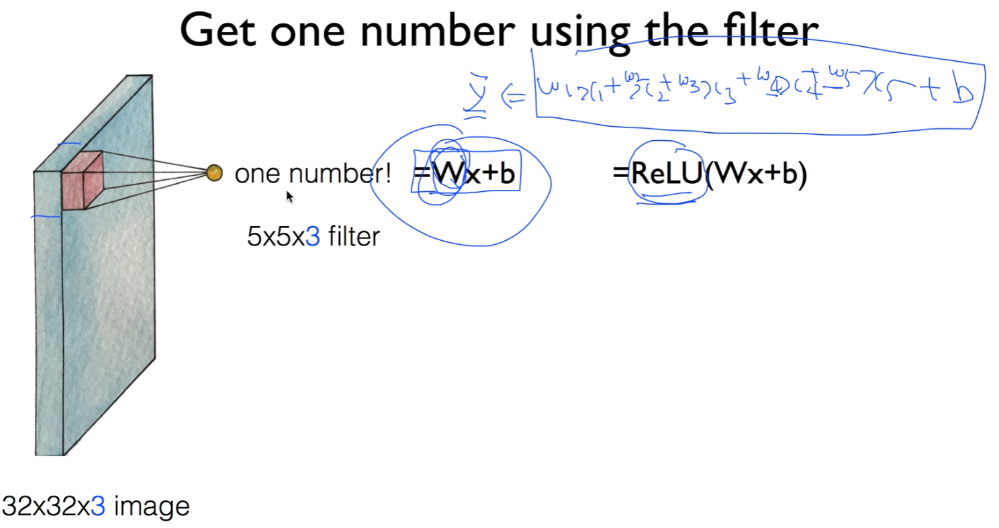

weight이라는 것이, 이런 입력(필터)가 있을 때 어떤 숫자로 만들어내는지를 결정하는 어떤 필터의 값이라고 생각하시면 된다.

우리가 또 좋아하는 ReLU를 붙이고 싶으면, 앞에 ReLU 함수를 호출해주기만 하면 바로 ReLU 창이 생긴다.

### Let's look at other areas with the same filter (w)

그러면, 이것을 가지고 똑같은 필터 w를 가지고 다른 이미지도 보자. 전체 이미지를 읽어와야 하기 때문에.

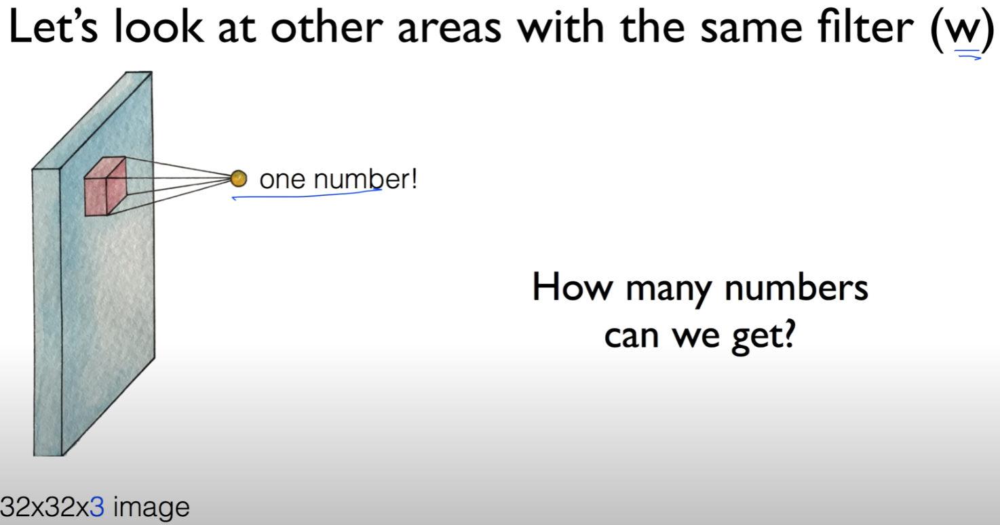

옆으로 넘기면서 그림을 점차적으로 보듯이 각각의 값을 가져오고, 밑으로도 가겠죠?

이런 형태로 우리가 하나의 필터, 같은 값을 가진 weight을 가지고 전체 이미지를 한 번 쓱 훑은 다음에, 거기서 각각의 점들을, 한 값들을 가져오게 된다.

이런 과정을 거치게 되면, 도대체 몇 개의 점을, 몇 개의 값을 모을 수 있을까요?

이것이 중요함. 왜냐하면 여러분이 네트워크를 구성할 때, 이 값들을 알아야 weight의 개수도 정하고, 그 다음으로 어떻게 넘길까하는 것도 설계 가능.

좀 복잡하게 생각할 수 있는데, 그냥 산수이다.

비디오를 보면서 종이를 꺼내서 같이 적어봐도 아주 도움이 될 것.

### A closer look at spatial dimentions:

작은 이미지에서 한 번 볼까요?

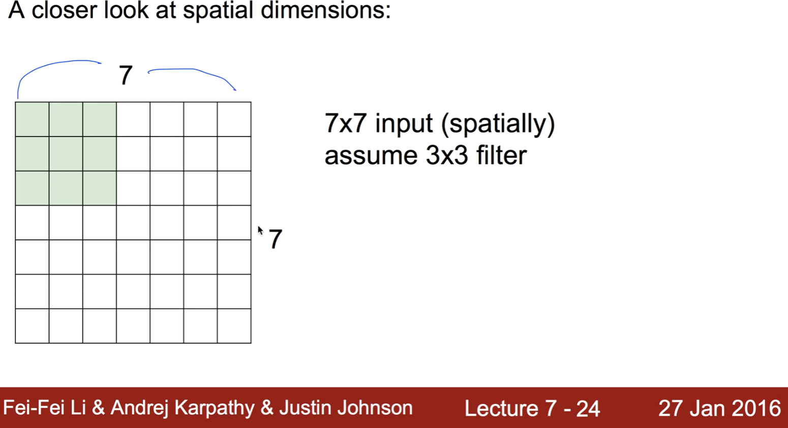

이미지 사이즈 7, 필터, 한 번에 얼마만큼 읽을 것이냐하는 필터를 3x3이라고 합시다.

필터가 한 번 읽어서 한 값을 뽑아내고, 옆으로 움직여서 한 값을 뽑아내고... 이미지 전체를 보게될 것.

몇 개가 나오게 될까요?

옆으로 다섯 번 갈 수 있다.

똑같은 방법으로 밑으로 다섯 번 갈 수 있다.

출력은 5x5가 될 것이다.

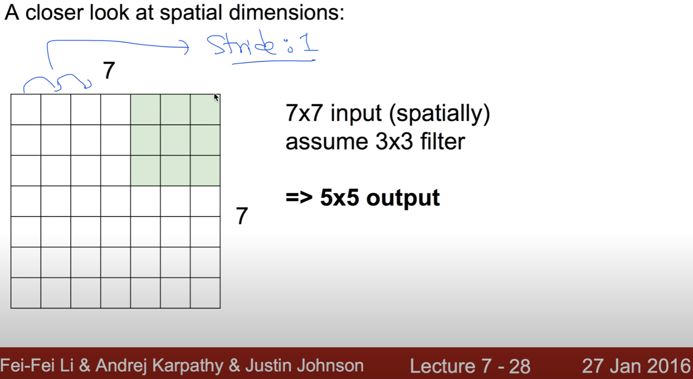

여기서 한 칸씩 움직였다. 한 칸씩 필터를 옆으로 움직였다.

이 값을 우리가 어려운 말로 stride라고 부른다.

stride의 크기가 1이다. = 한 칸씩 움직인다.

stride의 크기가 2다. = 필터를 두 칸씩 움직인다.

여기서 stride를 2로 한 번 잡아볼까요?

몇 개의 점을 뽑아낼 수 있을까요?

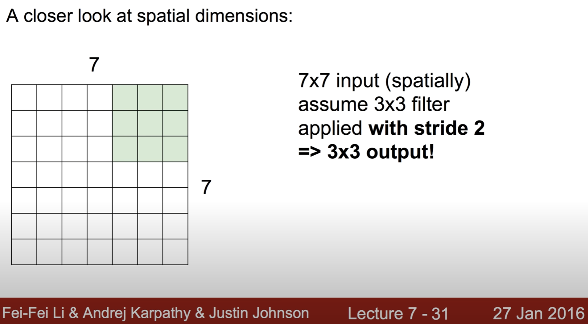

3x3의 이미지로, 출력이 3x3의 output이 생겨나게 된다.

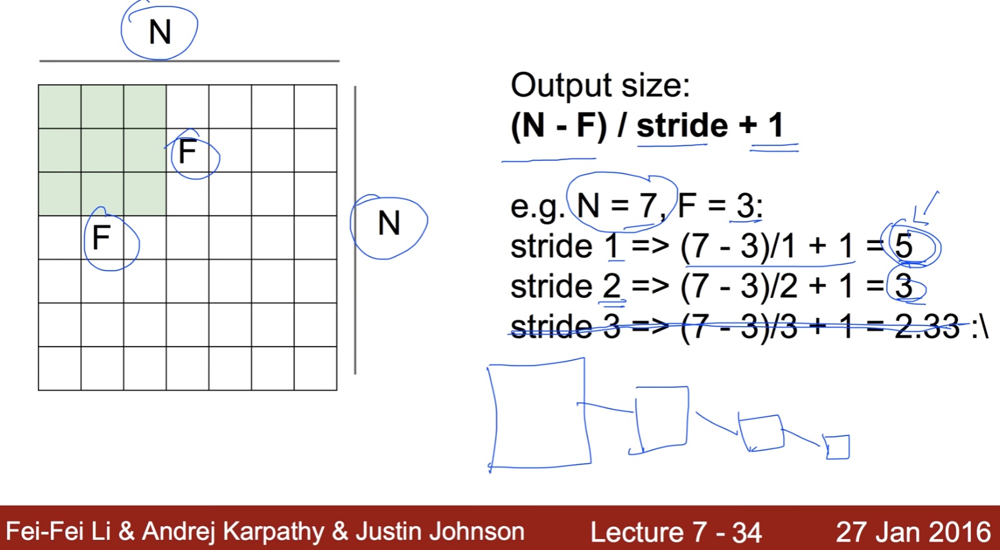

전반적으로 보게 되면, 대략적으로 NxN의 입력이 있다고 할 때, 필터 사이즈를 F라고 했을 때,

총 몇 개의 값이 뽑아질 것인가? 우리가 이 이미지에 이 필터를 적용했을 때.

Output size: (N - F) / stride + 1

이런 간단한 방법으로 계산할 수 있다.

큰 거에서 작은 것을 빼고, stride, 몇 단 움직일 것인가를 나누고, +1을 해주면 된다.

e.g. N = 7, F = 3:

stride 1 => (7 - 3)/1 + 1 = 5

stride 2 => (7 - 3)/2 + 1 = 3

stride 3 => (7 - 3)/3 + 1 = 2.33

예를 들어서, 이미지 사이즈 7, 필터 3일 때

stride 1이면 5라고 아까 나왔죠? 간단한 산수 하면 5가 된다

stride 2가 되면 3이 나오게 된다.

stride 3은 어떨까요? 할 수가 없다.

산수 한 번 해보시고, 어떤 stride를 할 수 있는지 없는지를, 이미지와 filter size에 따라서 보실 수 있게 된다.

이미지 사이즈 7 입력했는데, 필터 적용하게 되면 나오는 값이 5x5의 이미지, 3x3의 이미지..

자꾸 작아진다..

이렇게 작아질수록, 문제는 우리가 어떤 정보를 잃어버린다는 것.

### In pracitce: Common to zero pad the border

그래서 보통 실제적으로 Convolutional Network를 사용할 때는, padding이라는 개념을 사용한다.

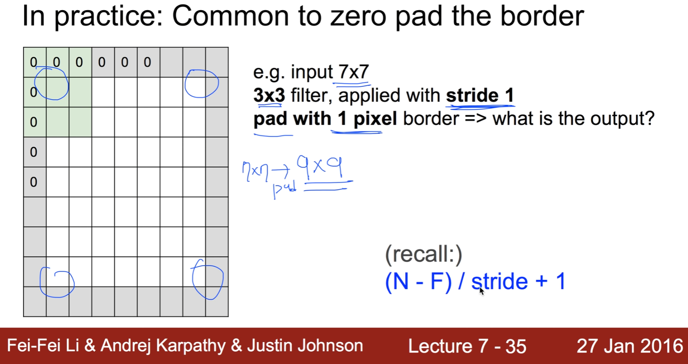

아이디어: 테두리에 0으로 값을 두르는 하나의 입력을 가상적으로 있다로 만들어준다.

두 가지 이유가 있다.

1. 그림이 급격하게 작아지는 것을 방지하기 위함.
2. 동그라미 친 부분이 모서리다 라는 것을 어떤 형태로든 우리 Network에 알려주고 싶은 것.

이렇게 하는 것을 padding이라고 한다.

e.g.

원래 이미지 7x7인데, 필터는 3x3이고, stride는 1로 하겠다.

pad를 한 pixel씩 넣겠다. 출력 값이 얼마가 될까요?

패드를 넣었기 때문에 전체 이미지 7x7 -> 9x9로 변한다.

그런 다음에 똑같은 공식을 사용해서 하면 되죠?

(N - F) / stride + 1

=> 7x7이 나온다.

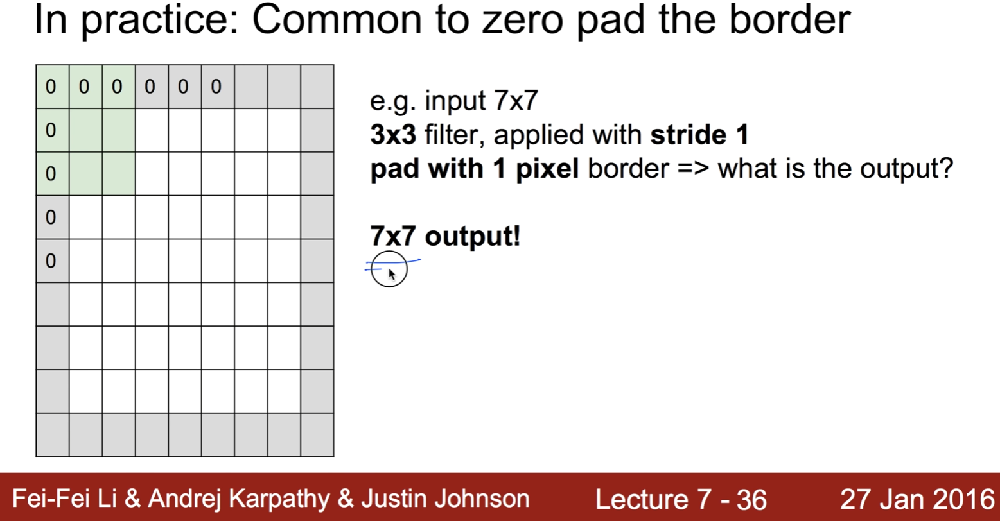

이미지를 원래 7x7로 넣었는데, convolutional layer를 실행시켜놔도 같은 사이즈의 이미지가 나온다는 얘기다.

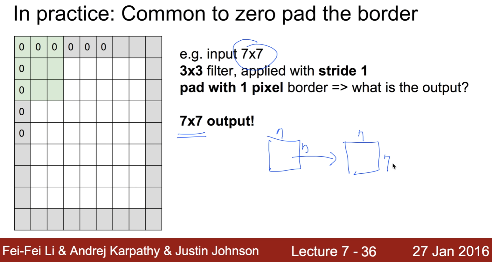

보통 패딩을 해서 원래 입력의 이미지와 출력의 이미지가 사이즈가 같게 만들어주는 것을 굉장히 일반적으로 사용하고 있다. (7x7 => 7x7)

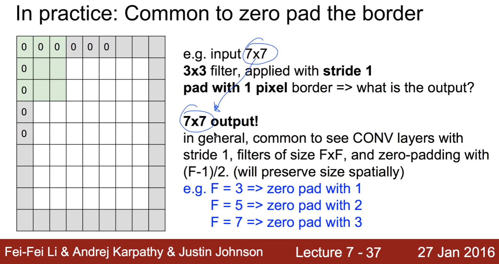

### Swiping the entire image

이것이 이제 기본적으로 하나의 layer, 하나의 convolutional layer를 만드는 방법.

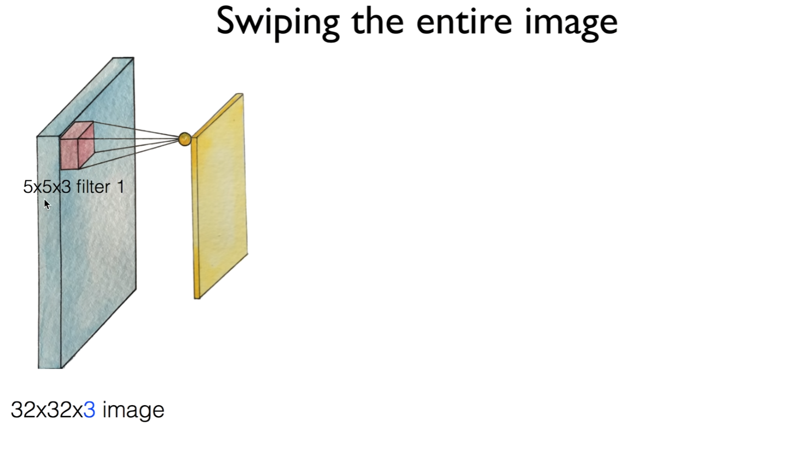

이 작업을 다시 한 번 생각해봅시다.

이런 이미지가 있을 때, 5x5x3 filter 1

노랑 형태의 이미지가 나타나게 된다.

노랑 size 계산할 수 있게 된다.

filter 1 오케이. 다른 필터를 하나 더 만든다.

다른 set의 weight이 있겠죠? 그 필터를 이용해서

filter 2

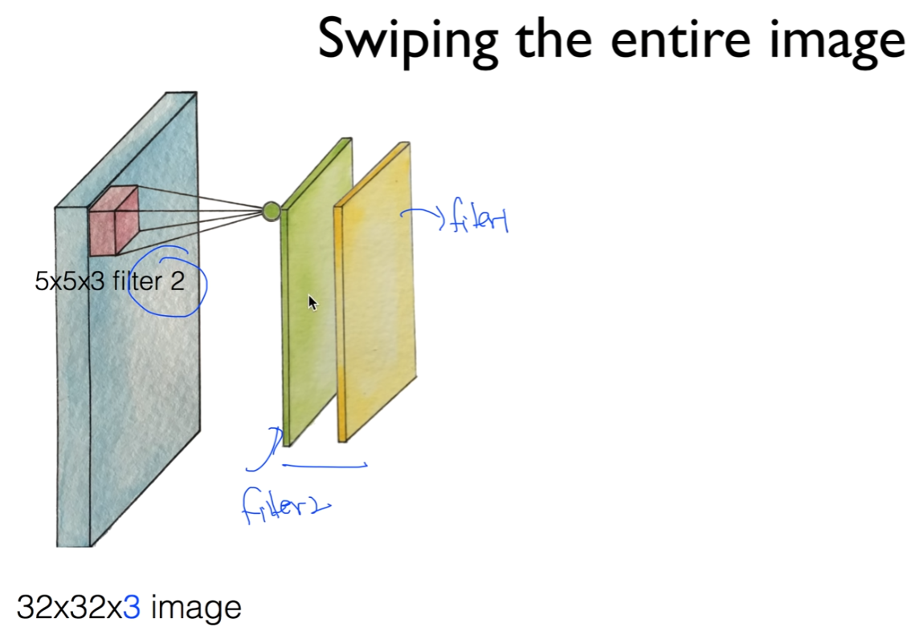

하나를 더 만들어낸다.

이것을 한 두개만 하는 게 아니라, 필터 6개를 동시에 적용시킨다.

각각의 filter는 weight이 다르기 때문에, 나오는 값이 다르다.

6개의 필터를 convolutional layer에 적용시킨다.

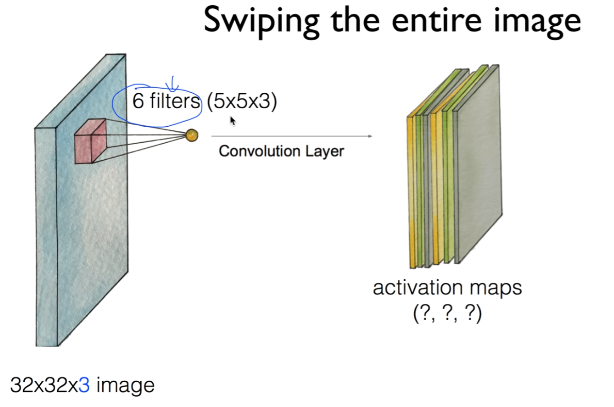

결론적으로는 어떤 형태의 값이 될까요?

6개의 필터를 사용했기 때문에, 6개가 된다. 깊이는 6이 될 것이다.

(?, ?, 6)

6은 필터의 갯수와 항상 같다.

앞의 두 값은 아까 앞에서 계산한 것처럼, 전체 이미지와 하나의 필터 사이즈에 따라서 결정된다.

padding 하지 않는다고 가정하면, (28, 28, 6)이 된다.

계산해보시고 어떻게 이렇게 나왔는지 보시면 되겠다.

이렇게 하는 것이 Convolution layer의 계층.

이것을 한 번만 할 게 아니라, 여러 번 할 수 있겠죠?

### Convolutional layers

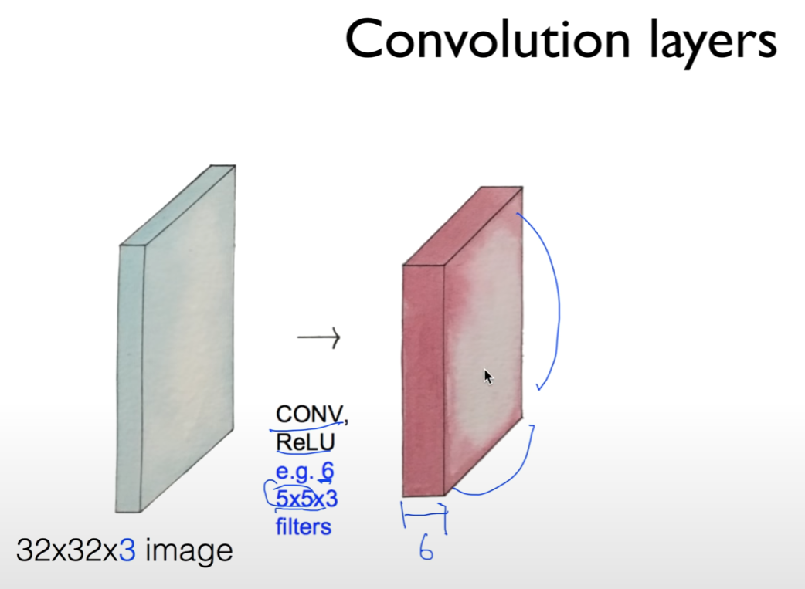

예를 들어, 이런 형태로 32 x 32 x 3의 이미지가 주어졌을 때, CONV와 ReLU를 동시에 둬서, 적용을 한다.

6개의 필터 5x5x3의 필터를 사용하면, 깊이가 6이 된다.

가로세로 값은 계산 가능

한 번 더 convolution, 혹은 여러 번을 적용할 수 있다.

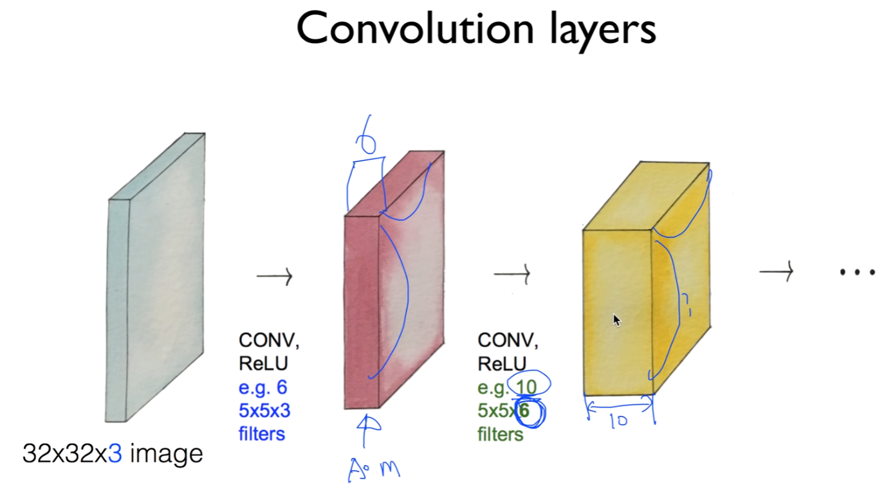

이 Activation Map(빨간색)에다가 또 convolution layer를 적용한다.

여기는 (필터)10개를 사용. 빨간색 깊이 6이었쥬? 5x5x6에서 6은 항상 앞의 깊이와 같아야 한다.

그 다음에 (필터)10개를 사용 -> 10개의 깊이로 만들어진다.

size는 얼마가 될까요? 빨강 size와 관계 있겠죠?

빨강 size에 5x5 한거니깐 한 번 생각해보시면 좋겠다.

이런 식으로 convolutional layer가 진행된다. 간단하죠?

### Convolution layers

How many weight variables? How to set them?

여기서 한 번 짚고 넘어가야 할 게

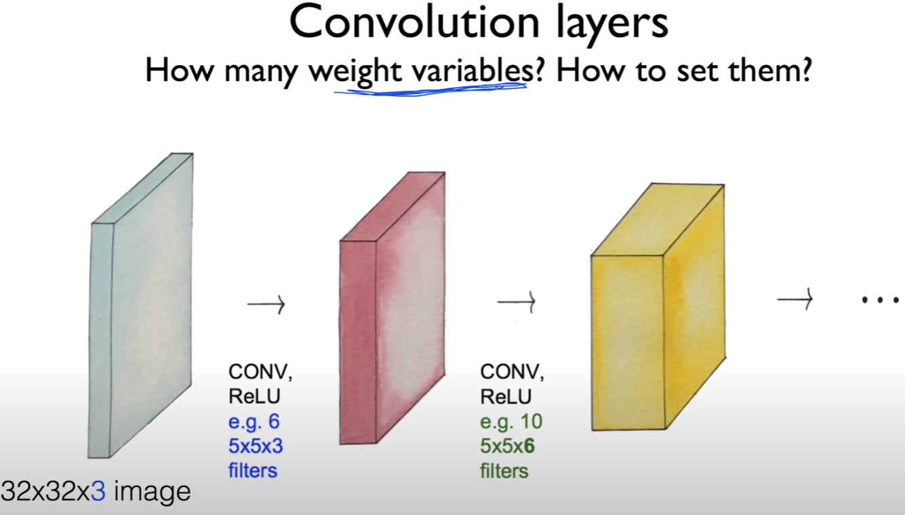

여기에 이 weight에 사용되는 variable 갯수가 얼마나 될까?

라는 것을 한 번 생각해보시면 좋다.

첫째 화살표에서는 쉽게 구할 수 있죠?

5x5x3x6 이것이 6개를 썼으니까 그 weight의 갯수

둘째 화살표에서도 마찬가지.

이 값들은 어떻게 정해지나요?

다른 Neural Network와 마찬가지로, 처음엔 초기화를 한다. random한 항목으로. Initialize

그 다음에 우리가 가진 데이터로 학습하게 된다.

