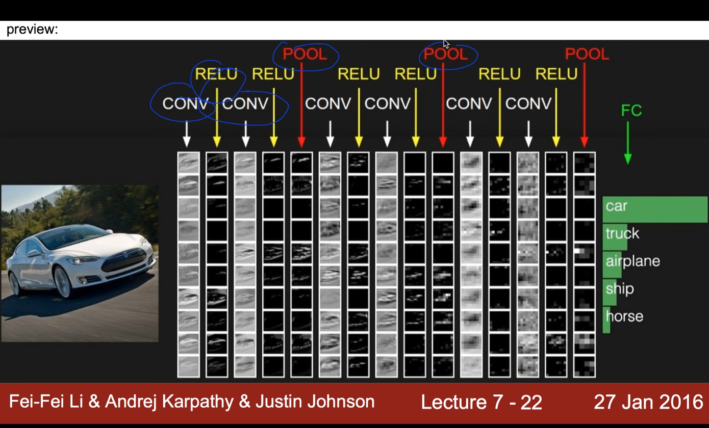
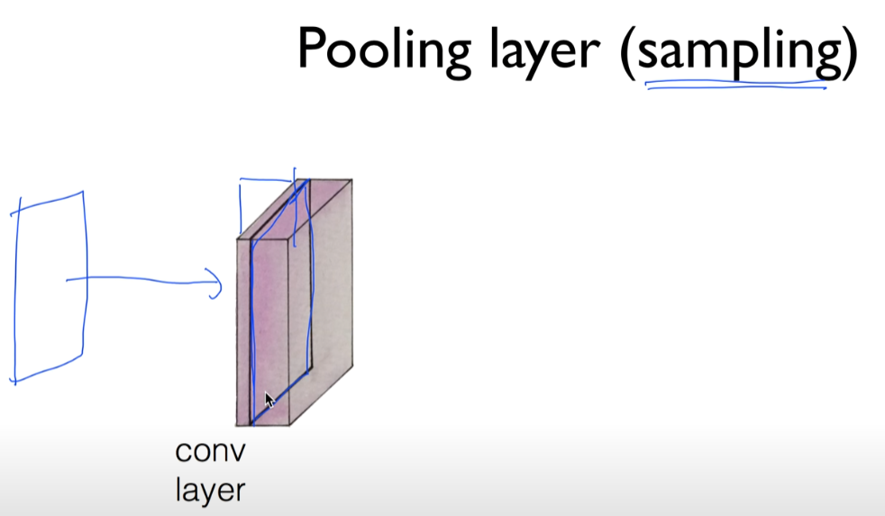
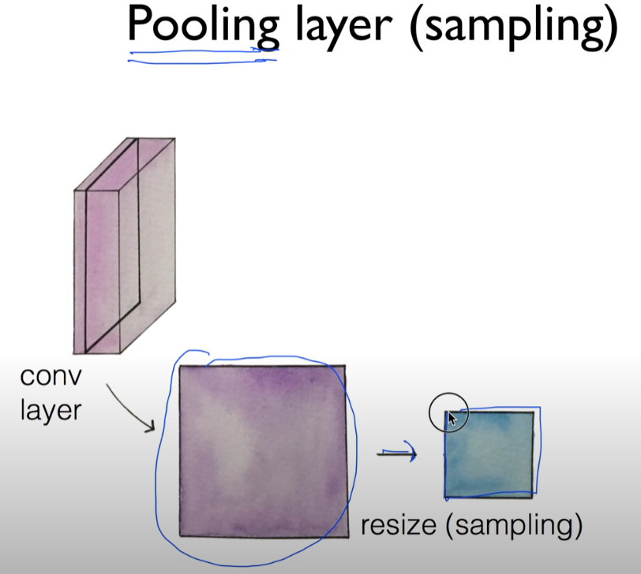
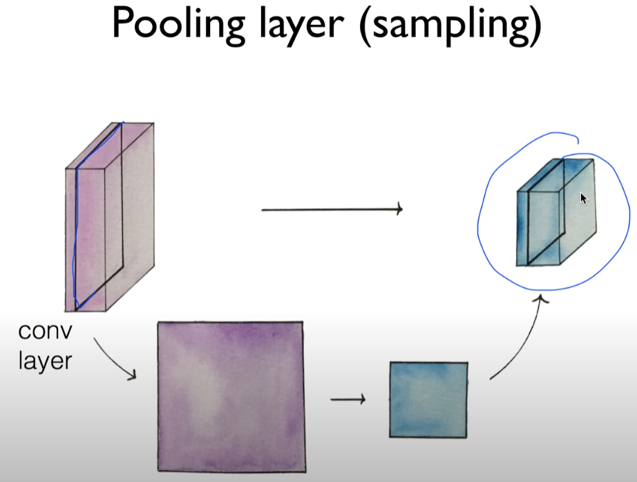
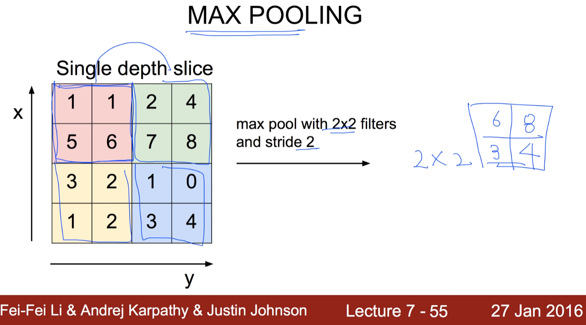
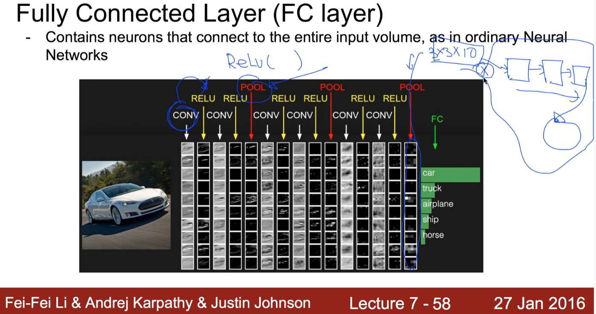

https://www.youtube.com/watch?v=2-75C-yZaoA&list=PLlMkM4tgfjnLSOjrEJN31gZATbcj_MpUm&index=36

### Lecture 11-2 CNN introduction: Max pooling and others

지난 번 비디오에서 CNN, convolutional Layer에 대해서 간단하게 소개드렸고, 

이번에는 나머지인 Max pooling과, 나머지 전체에 대해서 얘기하도록 하겠습니다.

전체 구조를 다시 보시면, Convolution과 ReLU가 붙어져 있고, 중간에 한 번씩 Pool을 하게 된다.

pool이란 것이 무엇인가

### Pooling layer (sampling)

pooling이라는 것이, 간단하게는 sampling이라고 보시면 된다.

앞에 이미지가 있고, 이미지에서 필터처리한 다음에 conv layer를 만들었지 않습니까?

깊이는 몇 개의 필터를 사용하는지에 따라 정해진다고 얘기했는데, 한 layer만 뽑아낸다.

이런 형태의 layer가 나온다. 값들이 들어있겠죠?

이것을, 보통 여러분들 이미지 가지고 resize하게 되겠죠? resize하면 사이즈 작아지는데, 비슷한 방법.

sampling. 사이즈를 작게 만드는 것을 말한다.

이것을 pooling이라고 하는데, 복잡한 게 별로 없다.

pooling을 한 다음에, 값들을 다시 쌓는다.

각각의 한 레이어씩 샘플링하고, 모아서 만들어주는 것이 pooling

### MAX POOLING

어떻게 할까요? 한 번 예를 들어보도록 하겠다.

이렇게 4x4  layer가 있다고 생각해보자.

이전에 우리가 convolutional layer와 같이, 필터라는 개념을 사용.

필터 개념 (여기서) 2x2.

stride가 2이다. 그 말은, 이 필터를 내가 한 번에 2칸씩 움직인다.

총 몇 개의 출력이 생길까요? 4개가 생기겠죠?

2x2의 output이 될 겁니다.

한 필터에서 어떤 값을 넣을까?

여러 가지 방법을 생각할 수 있겠죠?

4개의 값을 평균내자, 제일 작은 값을 고르자, 제일 큰 걸 고르자.

가장 많이 사용되는 방법이 MAX POOLING이라는, 가장 큰 것을 고르는 것.

이것을 sampling이라고 부르는 이유 - 전체 값 중 한 개만 뽑는다.

이런식으로 처리하는 것이 pooling이다.

그 다음으로 나오는 데이터 사이즈는 여러분들의 필터와 stride 개수에 따라서 처리된다.

### Fully Connected Layer (FC layer)

Contains neurons that connect to the entire input volume, as in ordinary Neural Networks

이제 우리가 이 convolution에 대해서 다루었고,

ReLU는 그냥 간단하게 convolution에 대해 나온 어떤 벡터를 ReLU라는 function에 입력하게 되면 쉽게 되는 것이죠?

Pooling - 우리가 방금 그린 샘플링하는 방법으로 pooling 가능.

어떤 식으로 쌓을 것인가? 여러분들이 원하는 방식대로 쌓으면 된다.

convolution한 다음에 바로 pooling할 수도 있고, pooling 없이 몇 번 convolution한 다음에 pooling을 할 수도 있고.. 여러분들이 정하는 형태로 구성을 하시게 됩니다.

그런 다음에, 보통 마지막에 pooling을 한 번 더 하게 되죠? 

하게 된 다음에, 값들 전체에..

예를 들어 3x3x10 이다.

이 전체 값을 X, 입력이라고 보면 좋겠죠?

원하는 만큼의 깊이에 (여러분들이 정하면 됨) 

일반적인 Neural Network, 또는 Fully Connected Network에 넣어서, 마지막 이것(출력)이 Softmax Classifier가 되겠죠?

10개면 10개 중에, 100개면 100개 중에 하나의 레이블을 고르는 형태로 여러분들이 Convolutional Neural Network를 구성하시면 되겠다.

이 부분은 앞에서 충분히 얘기가 됐기 때문에, 여러분들이 쉽게 이해하시고 구성하실 수 있을 것이라고 생각합니다.

### [ConvNetJS demo: training on CIFAR-10]

이것이 어떻게 동작하는지 혹시 웹브라우저에서 웹사이트를 가시게 되면, 아주 좋은 visualization과 함께 실제로 각각의 layer들이 어떻게 동작되는지를 보시면서 좀 더 쉽게 이해하실 수 있을 것입니다.

http://cs.stanford.edu/people/karpathy/convnetjs/demo/cifar10.html