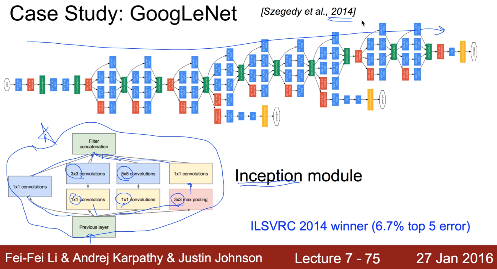

https://www.youtube.com/watch?v=KbNbWTnlYXs&list=PLlMkM4tgfjnLSOjrEJN31gZATbcj_MpUm&index=37

### Lecture 11-3 CNN case study

지난 번 비디오에서 우리가 CNN에 대해 기본적인 것을 얘기했다.

기본적인 거에서 많이 응용할 수 있다.

사람들이 어떻게 응용했는지 살펴보고 그걸 이용해서 여러분의 Network를 구성하실 수 있도록 한 번 얘기해보겠다.

### Case Study: LeNet-5

가장 처음 이 Convolutional Network를 구상한 팀 - LeCun 교수님.

처음 설계도를 보시면 이런 형태.

32x32x1 입력이 주어진다.

각각 convolution하게 되는데, 5x5 filter와 stride 1 사용한다.

총 여섯 개를 사용하게 되면, 6@28x28 이런 하나의 맵이 나오게 될 것입니다.

그런 다음에 2x2 형태로 Subsampling, stride 2

6@14x14. 6개는 그대로 간다.

이런 것들을 바로 보시면서 이해하실 수 있다.

첫 번째로 제안한 네트워크 굉장히 간단.

우리가 기본에서 설명드린 것과 굉장히 흡사한 네트워크가 되겠습니다.

### Case Study: AlexNet

그 다음으로 우리가 살펴볼 것은 AlexNet. 굉장히 유명하고, 2012년 많은 사람들의 관심을 끌었던 것.

ImageNet이라는 경진대회에서 1등을 하면서..

입력사이즈 좀 큽니다. 227x227x3 color image 입력받는다.

첫 번째 layer가 conv layer 96개를 사용한다. 11x11x3 filter를 사용한다. stride는 4

몇 개가 출력될까요? 계산해보시면 되겠죠?

일단 96개의 필터를 사용했기 때문에, [?, ?, 96]

계산하면 [55, 55, 96]

우리가 필터를 이렇게 사용했기 때문에, 첫 번째 layer에서만 35K의 변수가, parameter가 필요하다.

두 번째는 Pooling layer

3x3 필터를 사용했고, stride는 2

output이 27x27x96

pooling이니까 특별한 변수는 필요없다.

그 다음에 계속해서 이어진다.

이런 형태로.. 조금 깊죠?

깊어서 복잡하지만 여러분들이 한 개씩 보시면 아 이게 어떻게 입력되는구나 하는 것을 알 수 있다.

Normalization layer - 이름에서 여러분이 대충 느끼셨겠지만, 나온 값들을 normalize하는 것.

최근 들어서는 잘 사용하지 않는다.

굳이 안해도 되더라 그런 이야기죠?

conv maxpool conv maxpool conv conv conv(여기선 재밌게 conv만 세 번 한다.) 마지막으로 maxpool 한 번..

최종적으로 나온 [6x6x256] 이 값을 마지막에 하나의 fully connected된 Neural Network에 넣어서 이걸 4096개의 출력을 만들어낸다. (FC6)

6x6x256개의 입력을 받아서 4096개의 출력을 만들어내는 Network 여러분들이 만들어내실 수 있죠?

그런 다음에 한 번 더 씁니다. (FC7) 4096개의 입력을 받아서, 4096개의 출력을 만들어내는 Fully Connected layer.

마지막 layer(FC8)가 4096개의 layer를 입력받아서, 1000개의 label을 만드는, 세 개의 fully connected layer를 사용했다.

여러분들이 이렇게 복잡한 Alex Network 읽어보니까 이런 원리구나 하는 것을 충분히 이해하실 수 있을 거라 생각합니다.

좀 더 디테일한 걸 보면.. (파란 글)

AlexNet에서 처음 ReLU를 개발해서 사용했다. 굉장히 잘 되죠?

Norm layer 사용

drop out도 중간에 사용 0.5

batch size... 뭐 이런 것들이 있겠습니다

마지막으로, 이 네트워크를 하나만 하는게 아니라, 일곱 개를 만들어낸 다음에, 그 결과를 합쳤다. (ensemble)

이전 비디오에서 다룬 것처럼 ensemble 했다.

한 개씩 할 때는 18%정도 되는 오류가, 합치게 되니까 15%. 3%정도 에러를 줄이게 되었다.

이런 효과를 봐서, 사람들을 굉장히 놀라게 했던 AlexNet.

### Case Study: GoogLeNet

2014년 우승자인 GoogLeNet

조금 다르게 생긴게, 중간에 밖으로 나오죠? (노란색)

흩어졌다 모이고..

이것을 Inception module이라고 부르는데, 보시면 재밌게 되어있다.

하단 초록박스(Previous layer)에서 입력이 들어가고, 그럼 이게 1x1 convolutions를 병렬적으로 세 개 쓰고, 

여기(빨강박스)에다가는 또 풀링을 합니다. 풀링을 한 다음에 convolutional.

5x5, 3x3 다른 형태의 convolution을 사용하고, 그걸 또 합칩니다.

왼쪽 - 한 개만 쭉 가서 합침.

굉장히 재밌는 구조로, 마치 레고를 쌓듯이 연결시키고 그것을 굉장히 deep하게 연결시켜서 2014년에 우승을 하게 되었다.

물론 굉장히 창의적이지만, 여러분들도 충분히 이렇게 만들어낼 수가 있겠다는 생각을 하게 됩니다.

### Case Study: ResNet

2015년도에 최강자. 3.6%대로 에러를 떨어뜨림으로써 사람이 판단하는 5%대를 능가한다고 볼 수 있는 시스템.

ResNet가지고 이미지 뿐만 아니라, 다른 형태의 많은 대회를 휩쓸어버렸다고 한다.

놀라운 것이, AlexNet - 8 layers

VGG - 19 layers

ResNet - 152 layers

엄청나게 점프됐쥬?

이렇게 Layer가 깊어지면 어떤 생각 드시나요?

학습하기가 좀 어려울 것 같은데..

아무리 우리가 ReLU를 사용하고, 초기값을 잘 잡는다고 해도, 학습해보시면 어렵습니다.

어떻게 이걸 극복했을까요? 바로 이전에 한 번 설명드렸던 fast forword라는 개념 사용

보통같은 경우(왼쪽) - layer 쭉 연결된다.

ResNet에서는 중간에 값을 쭉 튀어서 앞으로 초과시켜버림.

왜 잘 학습이 되는지 설명하긴 어렵지만,

보통 여기있는 값 이렇게 점프해서 더해지기 때문에, 전체적인 깊이는 굉장히 깊지만 어떤 의미에서 보면 이게 하나로 layer가 합쳐진다고 볼 수 있겠죠?

layer 갯수는 크지만, 실제로 학습하는 입장에서 보면, layer가 그렇게 깊지 않은 느낌으로 학습할수도 있다.

잘 되는 이유 중 하나라고 생각할 수 있습니다.

그러나 아직 왜 이렇게 잘 되는지는 아직 이해 못하고 있다.

이런 형태의 상당히 엉뚱하지만, 앞으로 쭉 합치는 네트워크로 2015년 1등 먹었다.

2016년도는 아직 발표되지 않음. 얼마까지 에러를 줄일 수 있을까, 어떤 형태의 네트워크로 줄일까가 관전 포인트가 되겠다.

이미지 두 가지 형태가 어떻게 보면 다른 형태지만, 상당히 유사한 아이디어를 사용했다.

### Convolutional  for Sentence Classification [Yoon Kim, 2014]

이미지만 처리하는 것이 아니라, Convolutional Network를 가지고 여러 가지를 할 수가 있는데, 해보니까 잘 된다. 

한국 분중에 굉장히 자랑스러운 윤 김 박사님께서 2014년도에 굉장히 창의적으로 제안 - 텍스트를 Convolutional로 처리해보자.

text syntax를 classify하는 데에도, Convolutional Network 잘 활용.

많은 분들이 윤 김 박사님을 따라 Convolutional로 사용해서, Text NLP 처리에도 많이 사용되고 있다.

### Case Study Bonus: DeepMind's AlphaGo

마지막으로, 보너스

여러분들이 관심을 가지시는 알파고도 바로 convolutional neural network를 사용했다.

Nature에 나오는 논문의 일부

저도 잘 읽지는 못한다. 굉장히 어렵다.

여러분들 CNN에 대해 기본적으로 이해하셨으면, 한 번 볼까요?

보면.. 이런 얘기가 나온다. 어려워요.

policy network이 있는데, 19x19x48 이미지를 사용했다.

19x19가 바둑판의 크기죠?

48개의 어떤 Feature plane이 있는 것.

돌이 그 자리에 있다 없다 등의 여러 가지 정보를 담고 있겠죠?

처음에 5개의 hidden layer는 zero padding을 했고, 23x23으로 만들었죠?

패딩으로 19x19를 23x23으로 만들었다.

그 다음에 k개의 필터를 사용했는데, kernal size가 5고 stride가 1이다.

이런 얘기를 들으니까 어? 이제 어떻게 돌아가는지 대충 아는 것이죠.

한 번 읽어보시면..

아 이게 convolution network를 사용했고,

이런 입력에다가 어떤 패딩을 사용했고, 

그래서 첫 번째 5x5 필터를 통해서 [19x19x192] 이런 출력이 나오고, 

이런 형태로 네트워크가 구성되어있구나 하는 것을 여러분들이 아실 수 있게 됩니다.

### 'The only limit is your imagination'

여기 case study에서 보았던 것처럼, 사실 어떻게 보면 Network를 자기 마음대로 연결시킨거죠?

연결시켜서 실험해보고, 여러 번 해보다 보니 이렇게 하면 좋더라, 저렇게 하면 좋더라라는 것에 대한 직관적인 감각이 생겨서 해본 것이 잘 되었다.

역시, 여러분들이 여러분들의 네트워크를 원하는대로 구성할 수 있고, 그것을 통해서 여러분들이 원하시는 결과를  얻으실 수 있을 것입니다.

