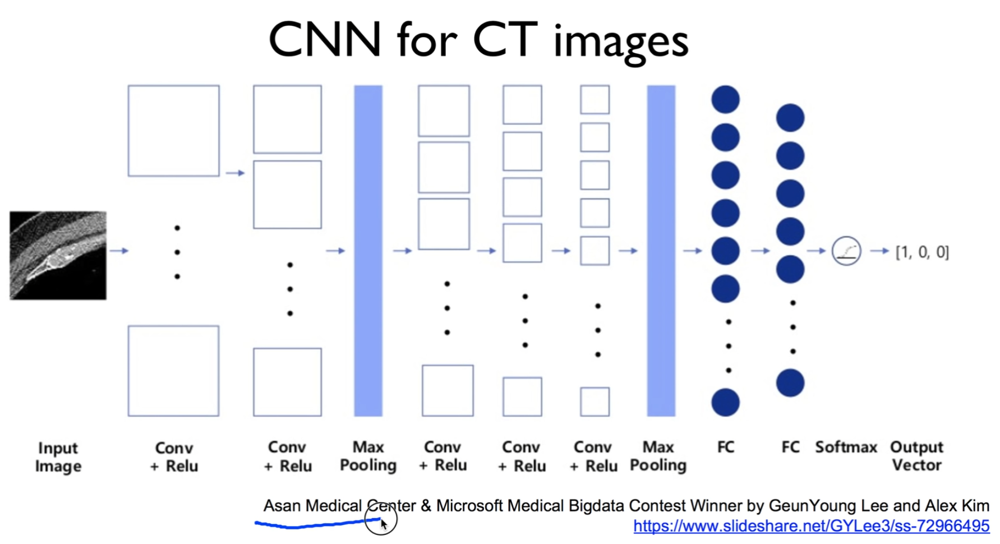
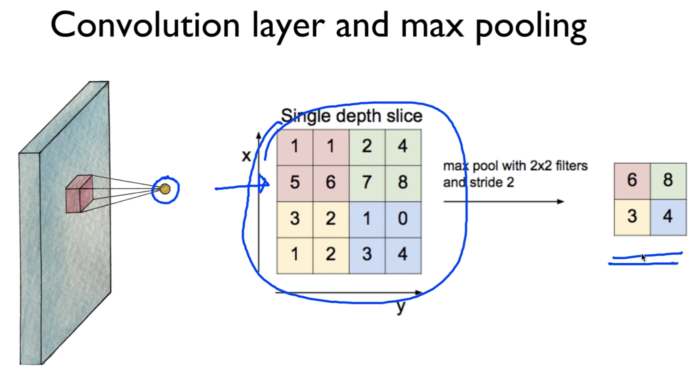

https://www.youtube.com/watch?v=E9Xh_fc9KnQ&list=PLlMkM4tgfjnLSOjrEJN31gZATbcj_MpUm&index=38


### Lab 11-1 CNN Basics

가장 많이 사용되는 Neural Net 중 하나인 CNN을 tensorflow를 이용하여 직접 구현해보도록 하겠다.


### CNN


이미지와 텍스트 분류, 여러 가지 분야에서 굉장히 좋은 성능을 발휘하게 된다.

크게 세 가지로 나눠볼 수 있다.

1. 입력된 이미지, 입력된 데이터를 convolution(필터 사용)이란 방법을 통해 여러 가지 값들을 뽑아낸다.

2. 뽑아낸 값 보통 양이 많아지니까, 작게 subsampling을 한다.

이런 걸 여러 번 반복. 특징을 뽑아내는 과정(feature extraction)

3. 최종적으로 우리가 많이 사용했던 일반적인 Neural Net, Forward Neural Net이라고 할 수 있다.

Fully Connected Network를 통해서 우리가 classification한다든지, regression 한다든지 할 수 있다.


### CNN for CT images

CNN이 특히 이미지에 큰 영향을 기여를 하고, 잘 동작한다.



한 예로, 한국의 아산병원에서의 콘테스트에서 한국의 두 분께서 CNN을 이용해서 CT 이미지 결과를 보는 콘테스트 참가, 수상하게 되는 좋은 결과를 거두었다.

CNN을 잘 알아서 사용하면 굉장히 좋은 구조가 되겠다.


### Convolution layer and max pooling

CNN은 앞에서 이야기했던 것처럼 크게 CNN 부분을 두 가지로 나뉘어 볼 수 있다.



이론 수업에서 했던 것처럼 어떤 주어진 이미지 벡터에, 필터라는 것을 갖다대어서 옆으로 stride만큼 움직이면서 각각 한 개의 값을 뽑아낸다.

여러 번 움직이기 때문에, 이런 형태로 여러 개의 값이 나온다.

이것을 샘플링 과정을 통해서 subsampling을 한다.

두 가지 과정으로 나누어 볼 수 있다.

각각의 과정을 tensorflow를 통해서 어떻게 구현하는지 볼 것이다.


### Simple convolution layer

우선, 조금 간단하게 tensorflow를 실험하기 위해서 간단한 이미지를 생각해보자.


3x3의 이미지, 색깔 x1

필터는 2x2, 역시 이미지와 같은 색깔을 가진다. x1

3x3 이미지에 2x2 필터를 stride 1x1씩 옆으로 움직이면서 그 때마다 그 값을 뽑아내는 과정을 거치는 것이 convolution

이런 과정을 거치면 몇 개의 데이터가 나타날까요?

2x2, 색깔은 한 색인 convolution data가 나올 것입니다.

여러분들이 수업시간에 했던 것처럼 계산할 수도 있지만, 

tensorflow를 이용하면 계산할 필요 없이 값을 넣으면 바로 이 값이 나오게 된다.

일일이 계산할 필요는 없으시고 이렇게 된다는 것을 전반적으로만 이해하시면 됩니다.


### Toy image

우선 tensorflow로 실습하기 위해서 이미지를 만들어보도록 하자.

https://github.com/hunkim/DeepLearningZeroToAll/blob/master/lab-11-0-cnn_basics.ipynb


```python
%matplotlib inline
import numpy as np
import tensorflow as tf
import matplotlib.pyplot as plt
```

```python
sess = tf.InteractiveSession()
image = np.array([[[[1],[2],[3]],
                   [[4],[5],[6]], 
                   [[7],[8],[9]]]], dtype=np.float32)
print(image.shape)
plt.imshow(image.reshape(3,3), cmap='Greys')
```

```
(1, 3, 3, 1)
```


3x3의 color 1개 이미지를 만들기 위해서, [[[1], [2], ..., [9]]] 형태의 array를 생각해볼 수 있다.

조금 복잡하지만, (1, 3, 3, 1) 이런 형태의 shape을 만들기 위한 것이다.

보통 우리가 이전에 데이터, 인스턴스에서 많이 다루었던 (**1**, 3, 3, 1)

앞의 이 1 값은 n개가 됩니다.

몇 개의 이미지를, 몇 개의 인스턴스를 우리가 사용할 것인가 하는 개념을 사용했다.

n=1 -> 하나의 이미지만 가지고 해보겠다.

1~9 값 이렇게 들어가는거죠?


그 이야기는, 이렇게 array를 만들어낼 수 있고, 시각화하기 위해서 이런 형태의 라이브러리를 사용해서, imshow(imageshow)라는 함수를 사용해서 그냥 시각화를 한 것입니다.


### Simple convolution layer

이런 이미지가 주어졌으면, 이런 이미지를 우리가 이전에 만들었죠?


우리가 weight을 정의할텐데요,

weight 또는 filter를 정의할 때 필터의 크기는 어떻게 할 것인가?

Image: 1, 3, 3, 1

Filter: 2, 2, 1, 1

앞의 두 개: 크기
세 번째 1: color, Image의 맨 뒤 1값과 같다.

네 번째 1: 필터를 몇 개 사용할 것인가? #filters

한 개만 사용하니 일단 1로..


이런 형태의 array를 만들 것이다.

값은 계산을 쉽게 하기 위해 [[[[1]], [[1]], ..., [[1]]]]로 두자.

이런 필터를 가지고 convolution한다

-> 필터를 그림에 올려놓고, 서로 마주보는 숫자끼리 곱해서 값을 더해줘서 한 값으로 뽑아내는 과정을 거친다.

1 + 2 + 4 + 5 = 12

이 값이 저기에 써진다. 12


stride가 1x1

필터를 한 칸씩 움직인다는 얘기. 값을 다 더해서 저기에 쓴다.

2 + 3 + 5 + 6 = 16


이런 식으로 여러분들이 필터링해서 계산 가능.

우리가 값을 계산해볼 수 있다.


이것을 tensorflow는 어떻게 구현할 수 있느냐?


```python
# print("imag:\n", image)
print("image.shape", image.shape)
weight = tf.constant([[[[1.]],[[1.]]],
                      [[[1.]],[[1.]]]])
print("weight.shape", weight.shape)
conv2d = tf.nn.conv2d(image, weight, strides=[1, 1, 1, 1], padding='VALID')
conv2d_img = conv2d.eval()
print("conv2d_img.shape", conv2d_img.shape)
conv2d_img = np.swapaxes(conv2d_img, 0, 3)
for i, one_img in enumerate(conv2d_img):
    print(one_img.reshape(2,2))
    plt.subplot(1,2,i+1), plt.imshow(one_img.reshape(2,2), cmap='gray')
```


일일이 stride를 움직이거나 할 필요 없이, 이 함수 하나로 끝난다.

conv2d = tf.nn.conv2d(image, weight, strides=[1, 1, 1, 1], padding='VALID')

여기에 이미지를 넣겠죠? 이전에 만들었던 weight를 넣고, strides 중요한데 [1, 1, 1, 1]로 만들어 넣고, 패딩은 이따 얘기.

이렇게 해서 그냥 이미지와, 우리가 만든 weight를 그냥 통과만 시키면 conv2d 값이 자동으로 계산이 되는, 굉장히 놀라운 함수이다.

이 값을 뽑아보기 위해서 tensorflow의 tensor를 .eval()을 통해 실행시킨다. 

[conv2d_img = conv2d.eval()]

그런 다음에 이 image의 shape를 출력시킬 수 있다. 

[conv2d_img.shape]

shape을 보면 예상했던 것처럼 (1, 2, 2, 1) 이런 형태의 shape이 나온다.


그 다음에, 시각화를 위해 작업을 해서 출력을 해본다.

좀 복잡한데, 여러분들 고려하지 않으셔도 좋다.

결론은 conv해서 나오는 값이 12, 16, 24, 28 이런 conv 값들이 나온다고 여러분들이 보시면 되겠다.


패딩 이라는 이야기를 우리 수업시간에 했다.

만약 Padding: SAME이란 옵션을 준다.

이것이 계산하기 복잡하자너

tensorflow는 어떻게하느냐?

padding을 SAME으로 주면, 필터 사이즈를 무엇을 하던 상관없이, stride가 1x1 기준일 때, convolution으로 나오는 이미지 사이즈는 원래 이미지 사이즈와 같게 해주겠다.

우리 이미지 3x3 -> 우리 출력하는 이미지 convolution 값도 3x3이 되고 싶다. -> SAME

여기에 맞게 tensorflow가 자동으로.. 

filter size가 2x2인데, 3x3으로 뽑아내려면 어떻게 해야 할까?

필요한 만큼 0으로 채운다.

3x3 뽑아주기 위해 하나씩만 더 채워주면 된다.

마찬가지 연산으로 첫 번째 값, 두 번째 값, ..., 을 뽑아낸다.

그런식으로 모두 9개의 값을 채울 수 있게 된다.

이것이 바로 zero padding의 역할이고, zero padding을 함으로써 입력의 size와 출력되는 convolution의 size가 같게 된다.

stride는 1x1이 기준이다.


직접 tensorflow로 구현하는 것은 매우 간단한 일이죠?


```python
# print("imag:\n", image)
print("image.shape", image.shape)

weight = tf.constant([[[[1.]],[[1.]]],
                      [[[1.]],[[1.]]]])
print("weight.shape", weight.shape)
conv2d = tf.nn.conv2d(image, weight, strides=[1, 1, 1, 1], padding='SAME')
conv2d_img = conv2d.eval()
print("conv2d_img.shape", conv2d_img.shape)
conv2d_img = np.swapaxes(conv2d_img, 0, 3)
for i, one_img in enumerate(conv2d_img):
    print(one_img.reshape(3,3))
    plt.subplot(1,2,i+1), plt.imshow(one_img.reshape(3,3), cmap='gray')
```

이렇게 구현할 수 있다.

마찬가지로 weight을 줬고(똑같고), padding은 same이라고 줍니다.

출력하는 값이 padding 돼서, 3x3의 이미지가 출력된다.

shape은 출력을 위해 조금 조작한 것이기 때문에, 크게 신경쓰지 않아도 된다.

결론적으로 [[12], [16], ... [9]] 이런 값이 나왔다.

우리가 생각한 것과 똑같은 값이 나왔죠?

이렇게 해서 convolution 계산한다 라는 것만 이해하시면 좋겠다.


물론 필터 하나만 쓸 필요 없이 여러 개를 쓸 수도 있겠죠?


```python
# print("imag:\n", image)
print("image.shape", image.shape)

weight = tf.constant([[[[1.,10.,-1.]],[[1.,10.,-1.]]],
                      [[[1.,10.,-1.]],[[1.,10.,-1.]]]])
print("weight.shape", weight.shape)
conv2d = tf.nn.conv2d(image, weight, strides=[1, 1, 1, 1], padding='SAME')
conv2d_img = conv2d.eval()
print("conv2d_img.shape", conv2d_img.shape)
conv2d_img = np.swapaxes(conv2d_img, 0, 3)
for i, one_img in enumerate(conv2d_img):
    print(one_img.reshape(3,3))
    plt.subplot(1,3,i+1), plt.imshow(one_img.reshape(3,3), cmap='gray')
```


마지막에 쓰는 필터의 갯수만 늘려주면 된다.

결국 나오는 convolution의 값들도 많아지게 된다.

필터를 세 장 쓰면 세 장의 이미지가 나온다.

한 장의 이미지로부터 세 장의 이미지가 나온다.


역시 사용하는 방법 굉장히 간단.

tf.nn.conv2d 이 함수 하나만 호출시키면 바로 세 장의 이미지가 나오게 된다.

이것이 어떻게보면 convolution의 power라고 볼 수 있고, filter를 몇 장 쓰느냐에 따라서 하나의 이미지로부터 여러 개의 다른 형태의 이미지를 뽑아낼 수 있게 된다.


### Max Pooling

우리가 이렇게 convolution을 마쳤으면, 이걸 가지고 우리가 pooling이란 작업을 할 수 있다.

즉, 어떤 데이터를 줄여서 우리가 subsampling을 한다. 그런 개념으로 보실 수 있겠죠?


```python
image = np.array([[[[4],[3]],
                    [[2],[1]]]], dtype=np.float32)
pool = tf.nn.max_pool(image, ksize=[1, 2, 2, 1],
                    strides=[1, 1, 1, 1], padding='VALID')
print(pool.shape)
print(pool.eval())
```


마찬가지로 pooling의 개념은 convolution의 개념을 이해하셨으면 굉장히 쉽게 이해하실 수 있습니다.

어떤 주어진 이미지가 있을 것이고, 그것에 대해 kernal, 즉 weight size가 얼마인지 정해준다.

그런 다음에 stride가 얼마인가 정해주고, padding은 어떻게 할 것인가만 얘기해주면 알아서 뽑아준다.

여기선 Max Pooling이란 것을 많이 사용하는데요, 실험상으로도 max pooling이 cnn과도 잘 동작합니다.

그래서 대부분 Max Pooling을 사용하게 된다. [tf.nn.max_pool]

tf.nn.max_pool 하고 이미지와 kernal size, stride, padding 알려주면 된다.

4 3 2 1 이미지 주고 padding='SAME', 입력과 출력의 사이즈가 같게 해주세요.. stride는 1x1


zero padding을 하겠죠? 첫 번째 stride에서 최댓값 - 4

두 번째는 3, 세 번째는 2, 네 번째는 1이 된다.

toy로 만들어본 것.

이렇게 max pooling을 하면 똑같은 형태의 이미지가 나온다.

간단하게 Max pooling이 어떻게 동작하는지 살펴보았다.


### MNIST image loading

그럼 이제 이것을 실전 이미지에 한 번 넣어서 어떻게 동작되는지 볼 수 있다.


```python
from tensorflow.examples.tutorials.mnist import input_data
mnist = input_data.read_data_sets("MNIST_data/", one_hot=True)
# Check out https://www.tensorflow.org/get_started/mnist/beginners for
# more information about the mnist dataset
```


```python
img = mnist.train.images[0].reshape(28,28)
plt.imshow(img, cmap='gray')
```


이것을 실존 이미지에 한 번 넣어서 어떻게 동작하는지 볼 수 있다.

MNIST라는 이미지를 사용하게 될 것.

데이터 읽어오는 방법은 이전에 이야기를 다루었다.


이 데이터의 크기는 알려져있죠? 28x28이죠?

이렇게 많이 읽어온 train data중에, 가장 첫 번째 있는 것을 28x28로 reshape한 다음에,

출력을 해보면 이런 값이 나온다.

뭔가요? 3 같네요.

이런 값으로 나오게 됩니다.


### MNIST Convolution layer

여기서 이제 Convolution layer를 한 번 통과시켜볼 수 있다.


```python
sess = tf.InteractiveSession()

img = img.reshape(-1,28,28,1)
W1 = tf.Variable(tf.random_normal([3, 3, 1, 5], stddev=0.01))
conv2d = tf.nn.conv2d(img, W1, strides=[1, 2, 2, 1], padding='SAME')
print(conv2d)
sess.run(tf.global_variables_initializer())
conv2d_img = conv2d.eval()
conv2d_img = np.swapaxes(conv2d_img, 0, 3)
for i, one_img in enumerate(conv2d_img):
    plt.subplot(1,5,i+1), plt.imshow(one_img.reshape(14,14), cmap='gray')
```

어떻게 Convolution layer를 통과시킬까요?

우선, 이 이미지를, 우리가 이 이미지처럼 reshape 시킨다.

28x28의 한 색깔, n개의 이미지, 여러 개의 이미지가 있으니까 -1 [-1, 28, 28, 1]

-1은 너가 알아서 계산해라는 reshape의 방법.

우리가 필요한 것은 28x28의 한 색깔의 이미지 (-1, 28, 28, 1)

weight을 이미지에 맞게 줘야 한다.

맞게 줘야 한다 -> 특별히 color에 신경써야 한다. [3, 3, **1**, 5]

그리고, 내가 이 필터에서는 3x3으로 하겠다 정하시면 되고, 

몇 개의 필터를 사용할 것인가? 5개의 필터를 사용하겠다.


이미지와 weight 그대로 주고, stride를 보면 2x2로 가겠다란 얘기는 [1, 2, 2, 1]

이렇게 이미지가 있으면 두 칸씩 옆으로 움직이겠다는 얘기죠?

padding은 same이 됩니다.

padding은 same이 되면, stride가 1x1 기준으로 똑같은 크기의 이미지를 만들어낸다고 했는데, stride가 2x2로 되면 아마도 반으로 줄어들게 됩니다.

28x28, stride 2면 움직이는 것이 14x14가 되겠죠?

출력이 아마 14x14의 이미지가 될 것이다.

이 stride 때문이다.


tf.nn.conv2d로 함수 호출해주면 바로 conv2d가 나올 것이다.

이것을 출력해보면.. 출력하기 위해서 제가 axe도 바꾸고 했는데 [np.swapaxes]

크게 신경쓸 필요는 없고, 그림을 출력한다 그렇게 이해하시면 된다.


tf.nn.conv2d를 통해 convolution을 실행시켰고, 

아래껄 통해 출력했다 그렇게 보시면 됩니다.


출력을 해보니까, 5장의 이미지가 나왔다.

왜 5장인가? 5개의 필터를 사용했기 때문

우리가 weight을 조금 다른 형태, random하게 줬기 때문에, 이미지 하나에서 조금씩 다른 이미지를convolution으로 뽑아냈다. 이 과정을 우리가 해봤다.


### MNIST Max pooling

그 다음에 Max Pooling을 해볼 것입니다.


```python
pool = tf.nn.max_pool(conv2d, ksize=[1, 2, 2, 1], strides=[
                        1, 2, 2, 1], padding='SAME')
print(pool)
sess.run(tf.global_variables_initializer())
pool_img = pool.eval()
pool_img = np.swapaxes(pool_img, 0, 3)
for i, one_img in enumerate(pool_img):
    plt.subplot(1,5,i+1), plt.imshow(one_img.reshape(7, 7), cmap='gray')
```


이전에 나왔던 이미지에다가, (앞에서 나온 다섯 개의 이미지) kernal size는 2x2, padding은 same이다.

stride가 [1, 2, 2, 1]로 2x2가 되니까, 또 이미지 사이즈가 줄어들 것이다.

입력 이미지 14x14였죠?

출력되는 값 아마 7x7이 되겠죠?

stride가 2기 때문에 그런 것이다.


마찬가지로 그대로 실행을 시키고, 출력을 시켜보면 이런 형태의 7x7 이미지가 나타난다.

이미지 보시면 알겠지만, 조금씩 subsampling이 되어 있다.

조금씩 해상도가 떨어져있죠?

그렇지만 우리가 max pooling이란 것을 이용해서 간단하게 subsampling할 수 있는 것을 한 번 보여드렸다.


### Lab 11-2 CNN MNIST: 99%!

다음 시간에는 우리가 기본적으로 사용한 이 함수들을 이용해서 실제적으로 MNIST에 99%의 정확도에 도전해보도록 하겠습니다.

