https://www.youtube.com/watch?v=pQ9Y9ZagZBk&list=PLlMkM4tgfjnLSOjrEJN31gZATbcj_MpUm&index=39


### Lab 11-2 CNN MNIST: 99%!

이번 실습시간에는 지난 번 우리가 얘기했던 tensorflow의 CNN 기본적인 함수를 이용해서 MNIST를 분류하는 시스템을 만들어볼텐데요,

무려 99%의 정확도에 도전해보도록 하겠습니다.


### CNN

CNN에 대해 기본적인 것들은 지난 시간에 이야기했다.

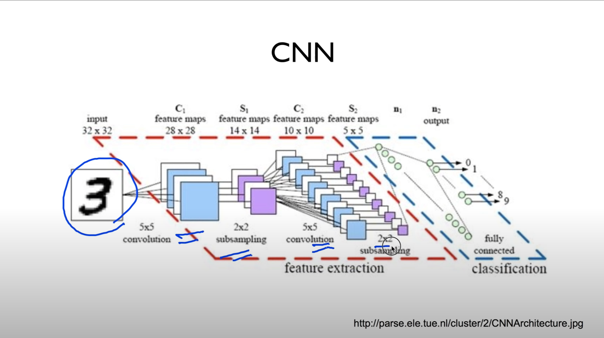

간단하게 다시 보면.. 이미지를 받아서 convolution, subsampling.. 이 과정을 여러 번 거친 다음에, fully connected network에 연결한다. 이런 말씀을 드렸구요,


### Simple CNN

이번 실습에 사용할 구조를 보면, 조금 간단하게, 이렇게 한 번 생각해볼 수 있을 것 같다.

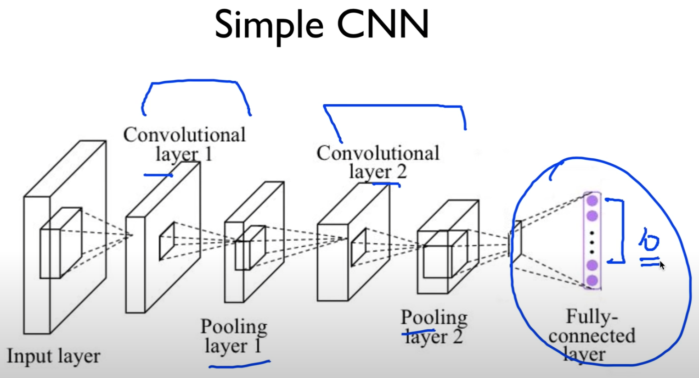


Convolution layer를 두고, Pooling layer, convolution layer, pooling layer

이렇게 두 개의 convolution layer를 두고, 거기에 나온 결과를 Fully connected layer에 연결시켜서, 10개 중에 한 개, MNIST니까 0~9까지의 숫자를 예측하는 시스템을 생각해볼 수 있다.


### Conv layer I

우선, 이걸 실제로 만들어, tensorflow로 구현해볼 텐데요, 

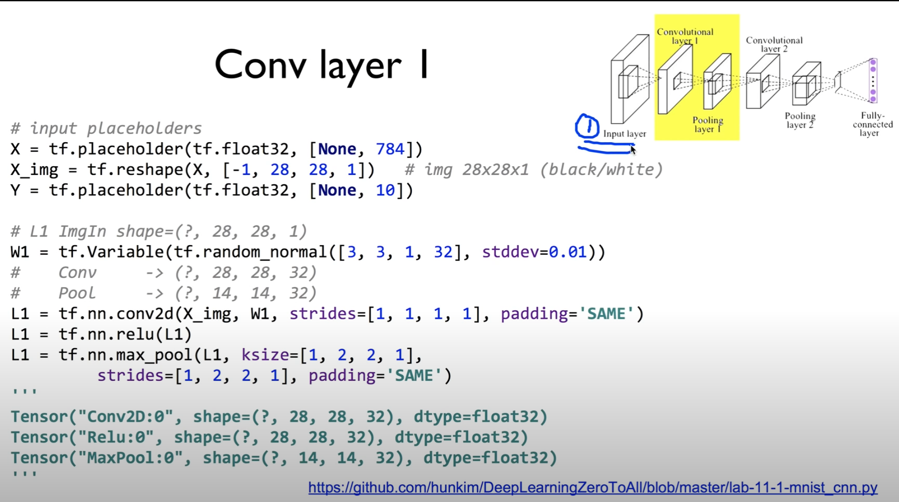

https://github.com/hunkim/DeepLearningZeroToAll/blob/master/lab-11-1-mnist_cnn.py

```python
# input place holders
X = tf.placeholder(tf.float32, [None, 784])
X_img = tf.reshape(X, [-1, 28, 28, 1])   # img 28x28x1 (black/white)
Y = tf.placeholder(tf.float32, [None, 10])

# L1 ImgIn shape=(?, 28, 28, 1)
W1 = tf.Variable(tf.random_normal([3, 3, 1, 32], stddev=0.01))
#    Conv     -> (?, 28, 28, 32)
#    Pool     -> (?, 14, 14, 32)
L1 = tf.nn.conv2d(X_img, W1, strides=[1, 1, 1, 1], padding='SAME')
L1 = tf.nn.relu(L1)
L1 = tf.nn.max_pool(L1, ksize=[1, 2, 2, 1],
                    strides=[1, 2, 2, 1], padding='SAME')
'''
Tensor("Conv2D:0", shape=(?, 28, 28, 32), dtype=float32)
Tensor("Relu:0", shape=(?, 28, 28, 32), dtype=float32)
Tensor("MaxPool:0", shape=(?, 14, 14, 32), dtype=float32)
'''
```

첫 번째로 제일 먼저 할 게, input의 이미지를 우리가 원하는대로 만들어야 되겠죠?

읽어오는 거 우리가 지난 시간에 한 줄로, tensorflow library로 읽어올 수 있다.

읽어오면, 이 데이터는 784개의 값을 가지게 된다. 우리가 지난 시간에 했던 것처럼

X를 placeholder로 보고, 784 값을 받아들인다. None은 n개의 이미지가 되겠죠?

여기까진 우리가 지난 번과 동일하다.


이것을 이미지 입력으로 넣기 위해서, reshape을 한 번 해준다.

reshape을 해줄 때, 우리가 알고 있는 것은, 이것은 28x28의 이미지고, 한 개의 색깔을 갖죠?

[-1, 28, 28, 1] 에서 맨 뒤가 1 -> 한 개의 색깔

-1 -> n개, 알아서 맞춰봐 하는 개념

우리가 중요하게 생각하는 것 - 28x28x1 이 이미지로 x img를 reshape 시킨다.

x img가 입력이 될 것이다.


x img를 가지고 첫 번째 convolution layer를 한 번 볼까요?

이미지는 (?, 28, 28, 1) 이렇게 입력됩니다.

이것을 우리가 filter를 사용해서 convolution 돌리려고 합니다.

필터의 크기는 얼마라고 하면 좋을까요?

여러분들이 정하시면 되죠?

여기선 [3, 3, 1, 32]

3x3 필터, 색깔은 하나. [위의 이미지 색깔과 동일한 값이 되겠죠?]

필터 몇 개나 사용할껍니까? 32개의 필터를 사용하고 싶다. 많이 사용하네요.

32개의 어떤 convolution 값들이 생겨날껀데요.


convolution 통과시키기 - `tf.nn.conv2d` 이렇게 통과시킨다.

X img를 입력하고, W1값 넣어준다.

여기서 정해야 할 게, stride를 얼마나 할 것입니까?

1로 할 거예요 [1, 1, 1, 1]

padding은 same으로 할 겁니다.

지난 번에도 얘기했듯이, padding이 same이란건, stride가 1x1이 기준이 될 때, [1, **1, 1**, 1]

weight의 크기와 상관없이 우리의 출력 값은 입력의 이미지 사이즈와 같습니다.

convolution을 한 번 통과하고 나오면, (?, 28, 28, 1) 이런 형태가 나온다.

1 대신에, 우리가 32개의 필터를 사용했기 때문에, (?, 28, 28, 32)

32개의 convolution 값들이 생겨난다. convolution을 통과시킨 다음의 tensor의 shape.


잘 모르시면 L1을 그냥 한 번 프린트해보시면 됩니다.

똑같은 값이 나올꺼구요,

그런 다음에 우리가 ReLU라는 것을 통과시킬거구요,

ReLU를 통과시킨 다음에, Max Pooling을 할 겁니다.


Max Pooling을 할 때, 역시 kernal size [1, **2, 2**, 1] 2x2로 정해줬고요, stride는 2x2로 정해줬습니다. [1, **2, 2**, 1]

그런 다음에 padding은 same, stride가 1x1일 경우에 같은 28x28읭 그림이 나오지만,

stride가 2기 때문에 여기서 나오는 그림은 14x14가 됩니다.

pooling을 거치면 (?, 14, 14, 32), 14x14 이런 형태의 이미지가 나온다. 채널의 개수는 32개로 똑같다.


잘 모르시면 프린트 하시면 코드 아래 주석 형태로 나온다.

원래 받았던 이미지 - (?, 28, 28, 32)

convolution 통과 - (?, 28, 28, 32)

ReLU 통과 - (?, 28, 28, 32)

MaxPool 통과 - (?, 14, 14, 32)

이런 형태의 이미지로 나와집니다.

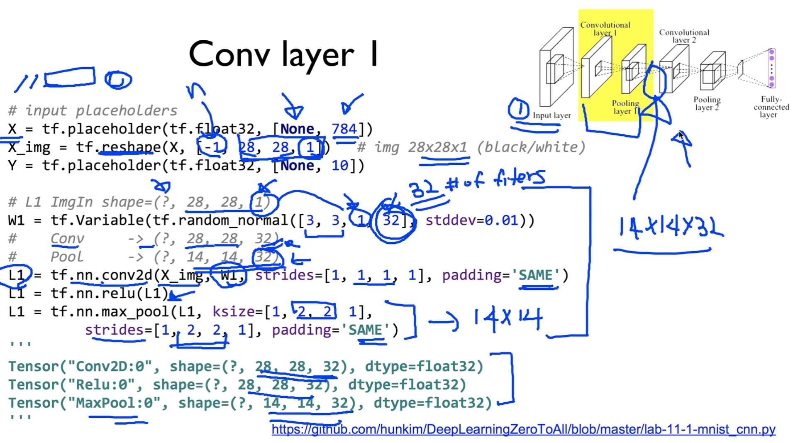


노란색 - 첫 번째 convolution layer 통과시킨 이후

여기 나온 이미지를 size를 기억해두실 필요가 있다.

14x14x32


이것을 두 번째 convolution layer의 입력으로 사용하게 된다.


### Conv layer 2

두 번째 conv layer로 들어가보도록 하자.

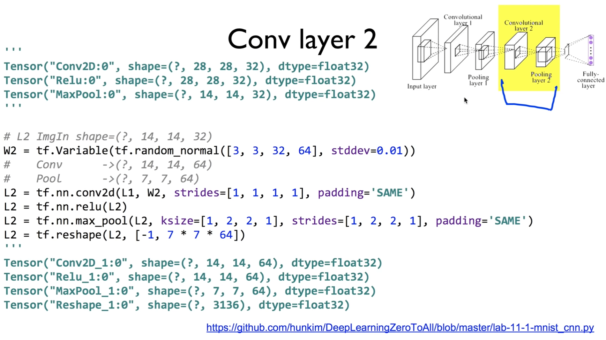

```python
'''
Tensor("Conv2D:0", shape=(?, 28, 28, 32), dtype=float32)
Tensor("Relu:0", shape=(?, 28, 28, 32), dtype=float32)
Tensor("MaxPool:0", shape=(?, 14, 14, 32), dtype=float32)
'''

# L2 ImgIn shape=(?, 14, 14, 32)
W2 = tf.Variable(tf.random_normal([3, 3, 32, 64], stddev=0.01))
#    Conv      ->(?, 14, 14, 64)
#    Pool      ->(?, 7, 7, 64)
L2 = tf.nn.conv2d(L1, W2, strides=[1, 1, 1, 1], padding='SAME')
L2 = tf.nn.relu(L2)
L2 = tf.nn.max_pool(L2, ksize=[1, 2, 2, 1],
                    strides=[1, 2, 2, 1], padding='SAME')
L2_flat = tf.reshape(L2, [-1, 7 * 7 * 64])
'''
Tensor("Conv2D_1:0", shape=(?, 14, 14, 64), dtype=float32)
Tensor("Relu_1:0", shape=(?, 14, 14, 64), dtype=float32)
Tensor("MaxPool_1:0", shape=(?, 7, 7, 64), dtype=float32)
Tensor("Reshape_1:0", shape=(?, 3136), dtype=float32)
'''
```


앞에 것과 똑같다. 이미지 들어오는 값을 (?, 14, 14, 32) 이 값으로 생각하면 된다.

W2 필터를 정할 때, 32 이 값은 (앞의 값과) 똑같은 값이어야 된다고 했죠?

[3, 3, **32**, 64]

필터의 개수는 얼마로 할 꺼예요?

내가 원하는 3x3

몇 개를 쓸 거예요? 64개의 필터.

그러면 이미지 64개로 퍼져나가겠죠?


이렇게 해서, 마찬가지로 stride 1x1로 주고, padding은 same으로 준다.

그러면 convolution layer를 통과시키면 어떻게 될까요?


L2 ImgIn shape = (?, 14, 14, 32)

Conv = (?, 14, 14, 64) 똑같은 크기, 체를 64개로 늘렸다. 필터를 64개 사용했기 때문.

그런 다음에 ReLU를 통과시키고, (통과시키는 것은 사이즈를 변경시키지 않는다.)

pooling을 할 것입니다.

마찬가지로 kernal size는 2x2로 주고, stride가 *2x2*입니다. 주의하셔야 되고요.

padding은 same. stride가 2x2이기 때문에 (출력의 shape은) 우리 이미지의 반이 된다.

Pool = (?, 7, 7, 64)


요렇게 해서 두 번째 Pooling까지 마쳤다.

이제 마지막으로 이것을 Fully connected layer로 넣을 것이다.

넣을 때는 입체적으로 되어있는 값을 한 줄로 쭉 펼쳐야 한다.

-> 이것을 하는 것이 바로 reshape

값을 reshape한다.

[-1, 7, 7, 64]

n개의 값, 7x7x64 값으로 reshape.

7x7x64개가 직선형태로 쭉 펼침. 이런 것이 n개만큼 있다.

이렇게 펼친 다음에, 우리가 Fully connected로 넣을 것이다.

역시 마찬가지로 L2값 잘 모르겠으면 print 해보십셔


conv 통과시키면 (?, 14, 14, 64) 필터 개수가 64니까

ReLU 통과시키면 (?, 14, 14, 64) 변하지 않는다.

MaxPool 통과시키면 (?, 7, 7, 64) 7x7이 됩니다. stride가 2였기 때문이다.

마지막에 펼친다.

reshape 값이 (?, 3136) 이게 feature가 되겠죠? 3136개의 벡터가 되고, n개의 데이터가 나온다.

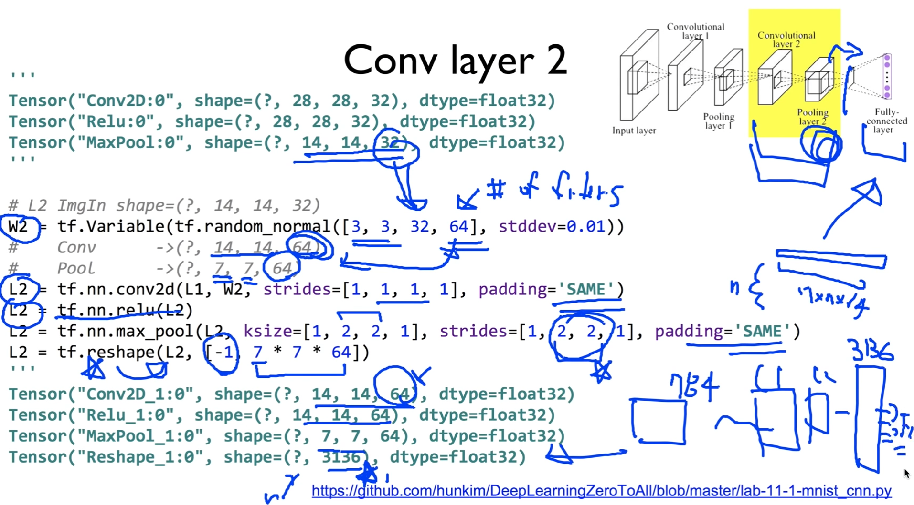

그래서 우리가 잘 기억해보시면, 이 값이 fully connected로 들어갈건데,

처음에 MNIST 이미지가 있었죠?

784였죠? 28x28

이것을 우리가 convolution layer인 c1, c2를 거치니까 3136개로 늘어났다.

이것을 fully connected로 넣을 것이다.

이렇게 연결되는 구조가 되겠죠?


### Fully Connected (FC, Dense) layer

마지막 단계. Fully Connected layer

마찬가지로 마지막으로 L2 받았죠? [-1, 7 * 7 * 64]

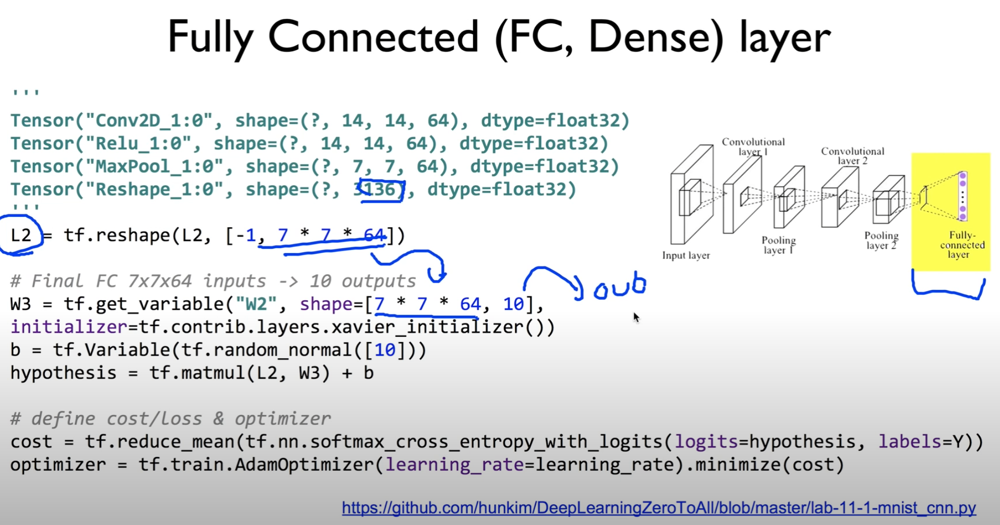

```python
'''
Tensor("Conv2D_1:0", shape=(?, 14, 14, 64), dtype=float32)
Tensor("Relu_1:0", shape=(?, 14, 14, 64), dtype=float32)
Tensor("MaxPool_1:0", shape=(?, 7, 7, 64), dtype=float32)
Tensor("Reshape_1:0", shape=(?, 3136), dtype=float32)
'''

# Final FC 7x7x64 inputs -> 10 outputs
W3 = tf.get_variable("W3", shape=[7 * 7 * 64, 10],
initializer=tf.contrib.layers.xavier_initializer())
b = tf.Variable(tf.random_normal([10]))
hypothesis = tf.matmul(L2, W3) + b
# github에는 hypothesis 대신 아래와 같이 나와있다.
# logits = tf.matmul(L2_flat, W3) + b

# define cost/loss & optimizer
cost = tf.reduce_mean(tf.nn.softmax_cross_entropy_with_logits(
    logits=logits, labels=Y))
optimizer = tf.train.AdamOptimizer(learning_rate=learning_rate).minimize(cost)
```


weight은 어떻게 결정하나요? 

많이 해본 것처럼, 입력의 값 7 * 7 * 64, 출력의 값 10개.

[7 * 7 * 64, 10]

왜 10개? 0부터 9까지의 값 중 하나를 예측하기 위한 것.

bias도 마찬가지. [10]

출력의 값과 똑같은 형태로 주어진다.


그 다음에 hypothesis를 이렇게 주면 되겠죠?

hypothesis = tf.matmul(L2, W3) + b

곱하는거죠? 많이 해봤던 것처럼..

입력 X, weight를 곱하고 bias를 더한다..


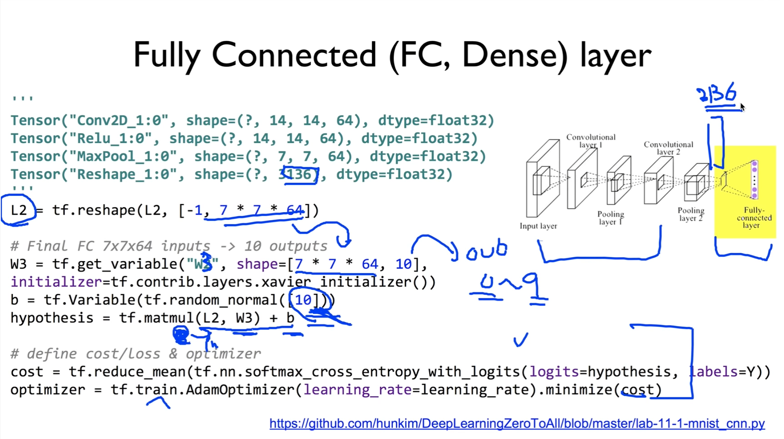

그런 다음에 이전에 했던 것과 똑같은 방법으로 이렇게..

cross_entropy, optimizer를 사용하면 된다.

이전에 했던 것과 똑같은 방법이구요,

앞부분에 convolution을 넣어서 피츠의 개수를 왕창 늘렸다. 3136개로 늘렸다.


### Training and Evaluation

그런 다음에 이제 학습하고 evaluation 하는 것은 똑같은 방법이다.

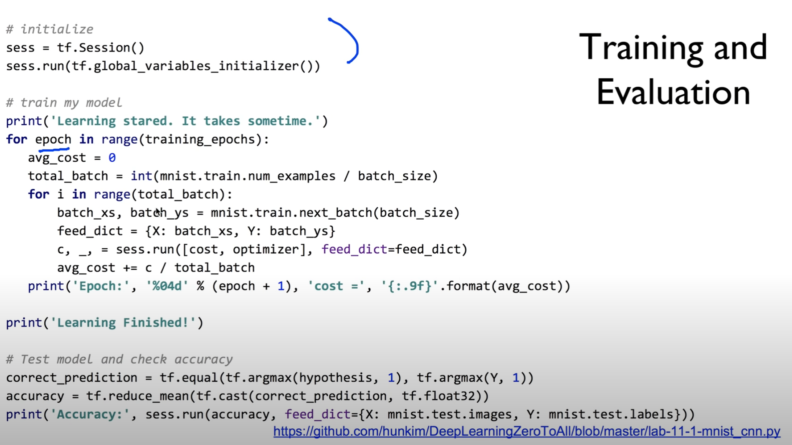

```python
# initialize
sess = tf.Session()
sess.run(tf.global_variables_initializer())

# train my model
print('Learning started. It takes sometime.')
for epoch in range(training_epochs):
    avg_cost = 0
    total_batch = int(mnist.train.num_examples / batch_size)

    for i in range(total_batch):
        batch_xs, batch_ys = mnist.train.next_batch(batch_size)
        feed_dict = {X: batch_xs, Y: batch_ys}
        c, _ = sess.run([cost, optimizer], feed_dict=feed_dict)
        avg_cost += c / total_batch

    print('Epoch:', '%04d' % (epoch + 1), 'cost =', '{:.9f}'.format(avg_cost))

print('Learning Finished!')

# Test model and check accuracy
correct_prediction = tf.equal(tf.argmax(logits, 1), tf.argmax(Y, 1))
accuracy = tf.reduce_mean(tf.cast(correct_prediction, tf.float32))
print('Accuracy:', sess.run(accuracy, feed_dict={
      X: mnist.test.images, Y: mnist.test.labels}))
```


session 열고, epoch라는 개념으로 loop를 돌고, 각각에 대해서.. batch size에 맞게끔 xs와 ys를 가져온다.

이거 가지고 feed_dict를 이렇게 만든다.

그런 다음에 cost, optimizer를 실행을 시키면 된다. feed_dict를 넣어서..

아주 간단합니다. 앞에와 똑같이..

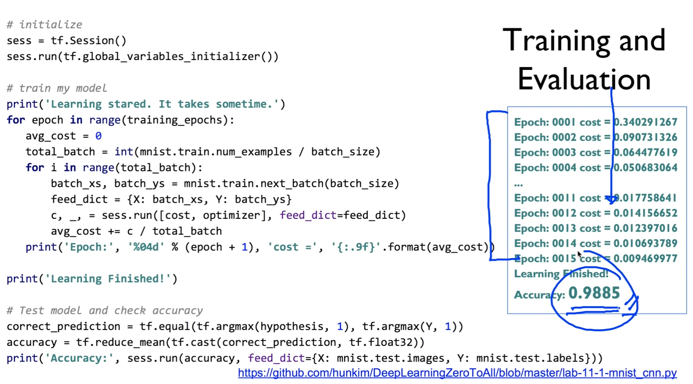

그런 다음에, 중간 코드에서 학습을 통해서 만든 모델이 정확한가? 예측하는 것은 이전과 똑같은 방법으로..

hypothesis한 것중에 가장 큰 값을(argmax) 가져오면 0부터 9까지 중에 하나가 결정되겠죠?

그것과 Y값, 실제 레이블의 값을 비교해서 같으면 1, 다르면 0이 되겠죠?

True, False로 나눠지는데, float32로 해서 평균을 구하게 되면 accuracy가 나온다.

이걸 출력하면 된다.

실행시보면 epoch마다 cost가 상당히 떨어지면서, 무려 98%의 정확도로 이 MNIST 데이터를 classification할 수 있다.

굉장히 놀라운거죠? 98%까지 가능


### Deep CNN

이제 조금 더 깊게 들어갈 수 있다.


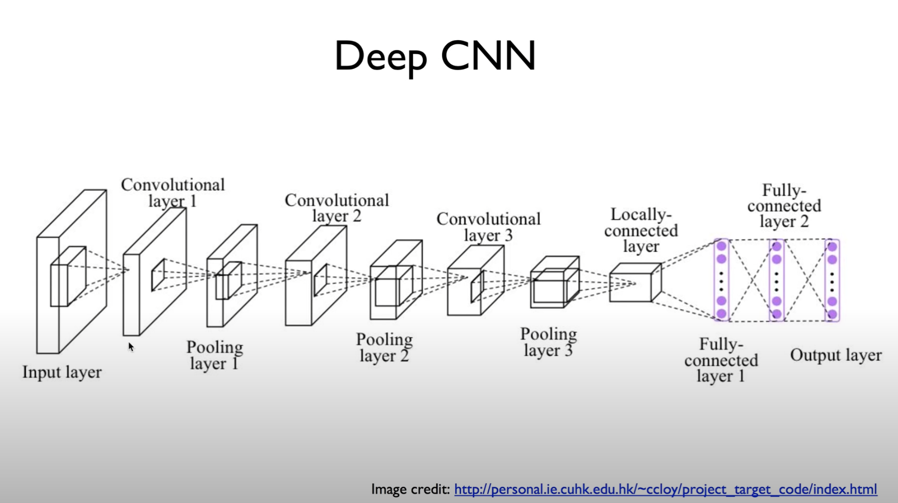


Convolution layer를 한 세 개 정도 쓰고, fully connected 두 단 정도를 사용해보도록 하겠다.


이전과 마찬가지로 기계적으로 연결만 해주면 된다.

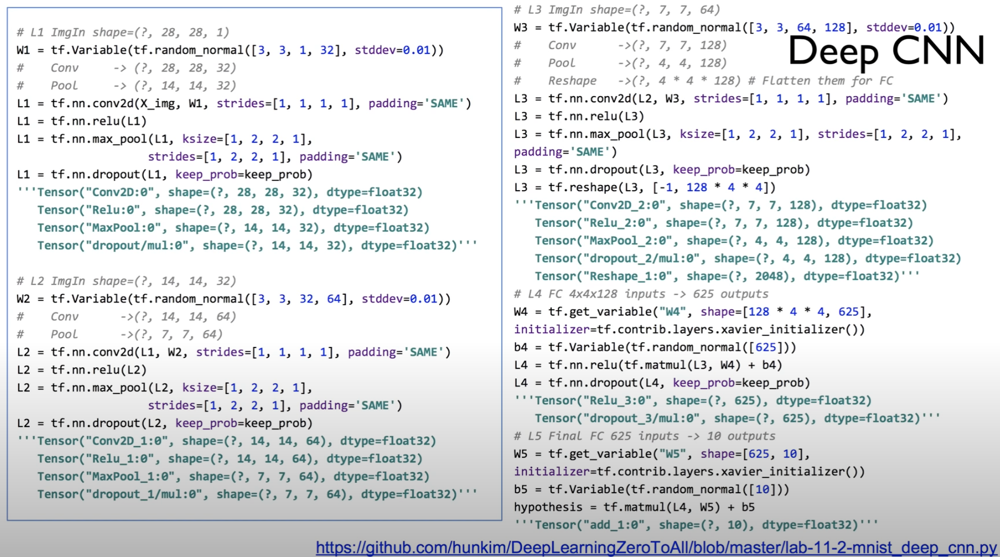

```python
# L1 ImgIn shape=(?, 28, 28, 1)
W1 = tf.Variable(tf.random_normal([3, 3, 1, 32], stddev=0.01))
#    Conv     -> (?, 28, 28, 32)
#    Pool     -> (?, 14, 14, 32)
L1 = tf.nn.conv2d(X_img, W1, strides=[1, 1, 1, 1], padding='SAME')
L1 = tf.nn.relu(L1)
L1 = tf.nn.max_pool(L1, ksize=[1, 2, 2, 1],
                    strides=[1, 2, 2, 1], padding='SAME')
L1 = tf.nn.dropout(L1, keep_prob=keep_prob)
'''
Tensor("Conv2D:0", shape=(?, 28, 28, 32), dtype=float32)
Tensor("Relu:0", shape=(?, 28, 28, 32), dtype=float32)
Tensor("MaxPool:0", shape=(?, 14, 14, 32), dtype=float32)
Tensor("dropout/mul:0", shape=(?, 14, 14, 32), dtype=float32)
'''

# L2 ImgIn shape=(?, 14, 14, 32)
W2 = tf.Variable(tf.random_normal([3, 3, 32, 64], stddev=0.01))
#    Conv      ->(?, 14, 14, 64)
#    Pool      ->(?, 7, 7, 64)
L2 = tf.nn.conv2d(L1, W2, strides=[1, 1, 1, 1], padding='SAME')
L2 = tf.nn.relu(L2)
L2 = tf.nn.max_pool(L2, ksize=[1, 2, 2, 1],
                    strides=[1, 2, 2, 1], padding='SAME')
L2 = tf.nn.dropout(L2, keep_prob=keep_prob)
'''
Tensor("Conv2D_1:0", shape=(?, 14, 14, 64), dtype=float32)
Tensor("Relu_1:0", shape=(?, 14, 14, 64), dtype=float32)
Tensor("MaxPool_1:0", shape=(?, 7, 7, 64), dtype=float32)
Tensor("dropout_1/mul:0", shape=(?, 7, 7, 64), dtype=float32)
'''

# L3 ImgIn shape=(?, 7, 7, 64)
W3 = tf.Variable(tf.random_normal([3, 3, 64, 128], stddev=0.01))
#    Conv      ->(?, 7, 7, 128)
#    Pool      ->(?, 4, 4, 128)
#    Reshape   ->(?, 4 * 4 * 128) # Flatten them for FC
L3 = tf.nn.conv2d(L2, W3, strides=[1, 1, 1, 1], padding='SAME')
L3 = tf.nn.relu(L3)
L3 = tf.nn.max_pool(L3, ksize=[1, 2, 2, 1], strides=[
                    1, 2, 2, 1], padding='SAME')
L3 = tf.nn.dropout(L3, keep_prob=keep_prob)
L3_flat = tf.reshape(L3, [-1, 128 * 4 * 4])
'''
Tensor("Conv2D_2:0", shape=(?, 7, 7, 128), dtype=float32)
Tensor("Relu_2:0", shape=(?, 7, 7, 128), dtype=float32)
Tensor("MaxPool_2:0", shape=(?, 4, 4, 128), dtype=float32)
Tensor("dropout_2/mul:0", shape=(?, 4, 4, 128), dtype=float32)
Tensor("Reshape_1:0", shape=(?, 2048), dtype=float32)
'''

# L4 FC 4x4x128 inputs -> 625 outputs
W4 = tf.get_variable("W4", shape=[128 * 4 * 4, 625],
                     initializer=tf.contrib.layers.xavier_initializer())
b4 = tf.Variable(tf.random_normal([625]))
L4 = tf.nn.relu(tf.matmul(L3_flat, W4) + b4)
L4 = tf.nn.dropout(L4, keep_prob=keep_prob)
'''
Tensor("Relu_3:0", shape=(?, 625), dtype=float32)
Tensor("dropout_3/mul:0", shape=(?, 625), dtype=float32)
'''

# L5 Final FC 625 inputs -> 10 outputs
W5 = tf.get_variable("W5", shape=[625, 10],
                     initializer=tf.contrib.layers.xavier_initializer())
b5 = tf.Variable(tf.random_normal([10]))
logits = tf.matmul(L4, W5) + b5
'''
Tensor("add_1:0", shape=(?, 10), dtype=float32)
'''
```

이전에는 두 개가 있었죠? W1, L1, W2, L2

하나를 더 연결시켜주면 된다.

그 다음에 마지막에 나왔던 (reshape 안의) 값이 조금 변경되겠죠?

128 * 4 * 4 이 값을 펼쳐내고요,

reshape를 통해서 펼쳐낸 것을 잘 기억했다가 우리가 필요한 만큼 weight을 정해서, 몇 개를 출력할껍니까? 625개 출력하겠습니다 하고,

두 번째 단(fully connected)에 625개를 입력으로 받아서, 10개를 내놓는다.

아까와 똑같지만 한 단씩 더 가지게 된다.

기계적으로 연결한다. 코드를 보시면 아마 금방 이해가 될 것이다.

이렇게 하면 어떤 장점이 있을까요?

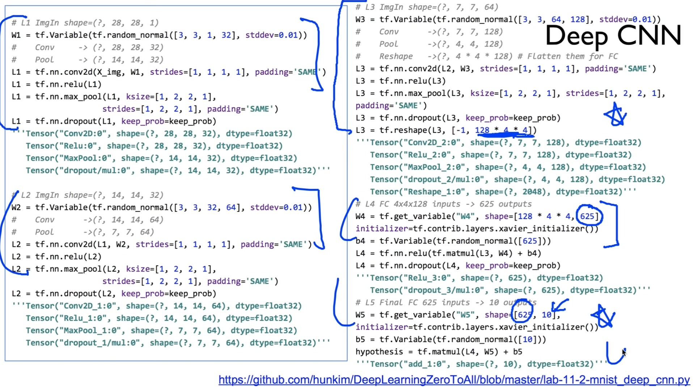

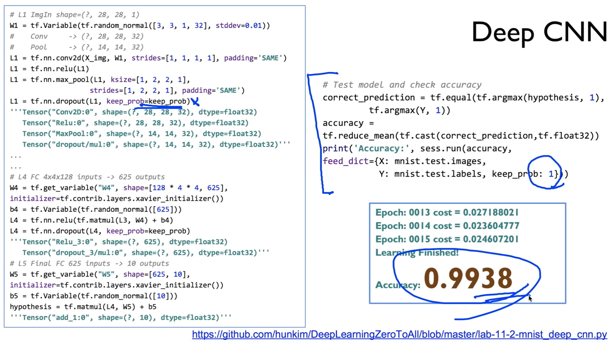

```python
# if you have a OOM error, please refer to lab-11-X-mnist_deep_cnn_low_memory.py

correct_prediction = tf.equal(tf.argmax(logits, 1), tf.argmax(Y, 1))
accuracy = tf.reduce_mean(tf.cast(correct_prediction, tf.float32))
print('Accuracy:', sess.run(accuracy, feed_dict={
      X: mnist.test.images, Y: mnist.test.labels, keep_prob: 1}))
```

accuracy 하는 방법 똑같다.


장점 - 정확도가 높아진다. 99%

정확도를 높일 수가 있다.


지난 번에도 얘기했듯, drop out을 할 때는 반드시 주의할 것이,

학습할 때는 0.5나 0.7로, 테스트할 때는 1로.

drop out 값이 변한다는 거 여러분들이 기억해주시면 좋다.


dropout과 몇 단계의 추가적인 layer를 넣었을 때, 99%까지 우리가 이룰 수 있다는 것을 해보았다.

