https://www.youtube.com/watch?v=c62uTWdhhMw&list=PLlMkM4tgfjnLSOjrEJN31gZATbcj_MpUm&index=40


### Lab 11-3 Class, Layers, Ensemble

Class와 Layer를 사용해서 CNN을 간단하게 하는 방법과, 앙상블에 대해 얘기해보겠다.


### CNN

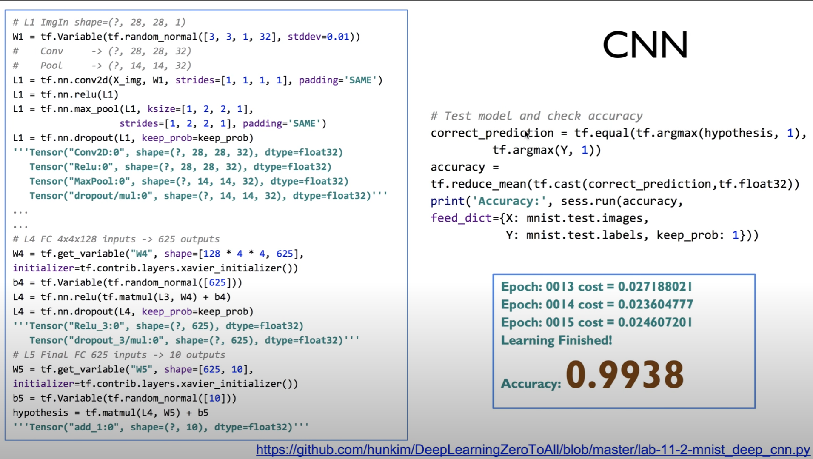


이전 시간에 CNN 깊게 들어가는 방법 사용해서, 굉장히 높은 정확도를 구현해보았다.

소스 코드를 보면 굉장히 복잡하고, 관리하기 힘든데, 


### Python Class

이것을 파이썬의 Class로 바꿔서 관리할 수 있다.

https://github.com/hunkim/DeepLearningZeroToAll/blob/master/lab-11-3-mnist_cnn_class.py

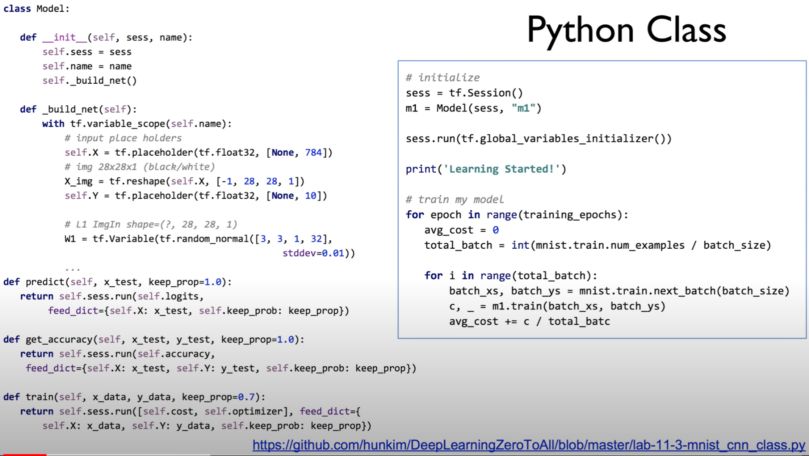

```python
class Model:

    def __init__(self, sess, name):
        self.sess = sess
        self.name = name
        self._build_net()
        
    def _build_net(self):
            with tf.variable_scope(self.name):
                # dropout (keep_prob) rate  0.7~0.5 on training, but should be 1
                # for testing
                self.keep_prob = tf.placeholder(tf.float32)

                # input place holders
                self.X = tf.placeholder(tf.float32, [None, 784])
                # img 28x28x1 (black/white)
                X_img = tf.reshape(self.X, [-1, 28, 28, 1])
                self.Y = tf.placeholder(tf.float32, [None, 10])

                # L1 ImgIn shape=(?, 28, 28, 1)
                W1 = tf.Variable(tf.random_normal([3, 3, 1, 32], stddev=0.01))
                
                # ...
            
    def predict(self, x_test, keep_prop=1.0):
        return self.sess.run(self.logits, feed_dict={self.X: x_test, self.keep_prob: keep_prop})

    def get_accuracy(self, x_test, y_test, keep_prop=1.0):
        return self.sess.run(self.accuracy, feed_dict={self.X: x_test, self.Y: y_test, self.keep_prob: keep_prop})

    def train(self, x_data, y_data, keep_prop=0.7):
        return self.sess.run([self.cost, self.optimizer], feed_dict={
            self.X: x_data, self.Y: y_data, self.keep_prob: keep_prop})
```


그 방법을 조금 얘기해보자.

파이썬 잘하시는 분은 금방 아실텐데,

클래스를 만들고, [class Model]

초기화하는 initialize를 만든다. [`def __init__ (self, sess, name)`]

이 때 session을 넘겨주면 좋다.


그 다음에 _build_net이란 걸 만들어서 network를 빌드하는 부분을 다 여기에 만든다.

convolution layer 1, 2, 3, fully connected 다 넣는다.


그런 다음에, 여기서 도움 함수 하나를 만들어낼 수 있겠죠? 

예측하는거, [def predict]

accuracy를 얻는거, [def get_accuracy]

학습하는거 [def train]

를 도움 함수를 만든다.

혹시 필요한 데이터를 이렇게 받겠죠? [def predict(self, **x_test**, keep_prop=1.0):]

예를 들면 predict는 x data를 받아서 도움을 받는 함수죠?

train 마찬가지로 cost와 optimizer를 실행시켜서 값을 돌려준다.


이렇게 class로 만들게 되면, 편리한 것이 

사용할 때는, 세션을 열고 클래스를 이렇게 만들 수 있죠?

```python
# initialize
sess = tf.Session()
m1 = Model(sess, "m1")
```

세션을 넘겨주면서 m1이라는 모델을 만들었다.


실제로 학습하는 부분 볼까요? 아주 간단하게 할 수 있습니다.

```python
# train my model
for epoch in range(training_epochs):
    avg_cost = 0
    total_batch = int(mnist.train.num_examples / batch_size)

    for i in range(total_batch):
        batch_xs, batch_ys = mnist.train.next_batch(batch_size)
        c, _ = m1.train(batch_xs, batch_ys)
        avg_cost += c / total_batch
```


epoch로 loop를 돌면서, 필요한 batch_xs와 batch_ys를 받아온다.

session None 이런거 할 필요 없이, 바로 m1의 train이라는 도움 함수(아까 정의해놓은 함수)를 바로 호출해버리면 되죠? 우리가 필요한 데이터를 넘겨주면서..

그렇게 하면 굉장히 깔끔하게 관리가 됩니다.

여러분들이 앞으로 복잡한 시스템을 만들 때, 클래스를 사용하면 굉장히 유용하게 사용하실 수 있다.


### tf.layers

또 하나는, 텐서플로우에 layers라는 패키지가 있다.

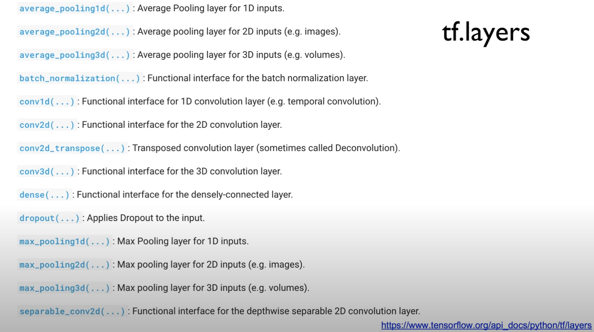

아직까지 계속해서 추가가 되고 있는 중이다.

우리가 많이 사용했던 convolution [conv2d]이라든지, pooling이라든지 [max_pooling1d] , 또는 dense, densenet 이라고 해서 fully connected network [dense] 이런 것들을 여기에다 만들어놨다.

일종의 high level의 API라고 보시면 된다.

이것을 사용하면 이전에 숫자가 굉장히 많이 나와서 복잡했던 것을, 아주 단순하게 할 수 있다.


https://github.com/hunkim/DeepLearningZeroToAll/blob/master/lab-11-4-mnist_cnn_layers.py

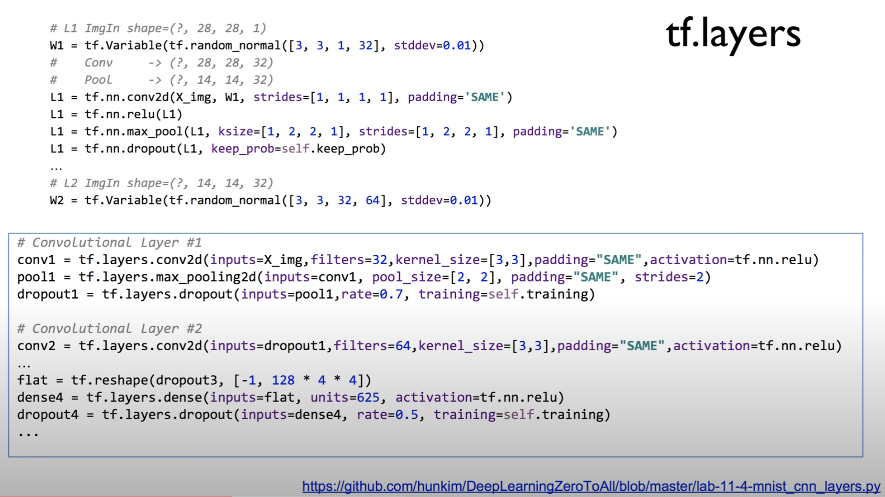

```python
# L1 ImgIn shape=(?, 28, 28, 1)
W1 = tf.Variable(tf.random_normal([3, 3, 1, 32], stddev=0.01))
#    Conv     -> (?, 28, 28, 32)
#    Pool     -> (?, 14, 14, 32)
L1 = tf.nn.conv2d(X_img, W1, strides=[1, 1, 1, 1], padding='SAME')
L1 = tf.nn.relu(L1)
L1 = tf.nn.max_pool(L1, ksize=[1, 2, 2, 1],
                    strides=[1, 2, 2, 1], padding='SAME')
L1 = tf.nn.dropout(L1, keep_prob=self.keep_prob)
'''
            Tensor("Conv2D:0", shape=(?, 28, 28, 32), dtype=float32)
            Tensor("Relu:0", shape=(?, 28, 28, 32), dtype=float32)
            Tensor("MaxPool:0", shape=(?, 14, 14, 32), dtype=float32)
            Tensor("dropout/mul:0", shape=(?, 14, 14, 32), dtype=float32)
            '''

# L2 ImgIn shape=(?, 14, 14, 32)
W2 = tf.Variable(tf.random_normal([3, 3, 32, 64], stddev=0.01))


# Convolutional Layer #1
conv1 = tf.layers.conv2d(inputs=X_img, filters=32, kernel_size=[3, 3],
                         padding="SAME", activation=tf.nn.relu)
# Pooling Layer #1
pool1 = tf.layers.max_pooling2d(inputs=conv1, pool_size=[2, 2],
                                padding="SAME", strides=2)
dropout1 = tf.layers.dropout(inputs=pool1,
                             rate=0.7, training=self.training)

# Convolutional Layer #2 and Pooling Layer #2
conv2 = tf.layers.conv2d(inputs=dropout1, filters=64, kernel_size=[3, 3],
                         padding="SAME", activation=tf.nn.relu)

# Dense Layer with Relu
flat = tf.reshape(dropout3, [-1, 128 * 4 * 4])
dense4 = tf.layers.dense(inputs=flat,
                         units=625, activation=tf.nn.relu)
dropout4 = tf.layers.dropout(inputs=dense4,
                             rate=0.5, training=self.training)
```


한 번 예를 들어보시면, [3, 3, 1, 32]

처음에 이것을 이해하시는 것도 중요하지만, 그럼에도 불구하고 숫자가 많이 나오니까 골치가 아플 수 있죠?

머리가 아플수가 있는데, 이것을 layer를 사용하면 굉장히 쉽게 할 수 있다.

어떻게 하느냐?

conv2d 할 때 layer라는 것을 사용하면, tf.layers.conv2d를 하구요, 

input 입력이 뭔지 주면, 여기서 guess, 알아낼 수 있는 것들은 다 알아낸다.

```python
conv1 = tf.layers.conv2d(inputs=X_img, filters=32, kernel_size=[3, 3],
                         padding="SAME", activation=tf.nn.relu)
```

필터 개수는 몇개로 할 것인가, 커널 사이즈는 얼마로 할 것인가만 주면 된다.

```python
W1 = tf.Variable(tf.random_normal([3, 3, 1, 32], stddev=0.01))
```

사실 위와 똑같은 표현인데, 나누어서 간략하게 입력할 수 있다.


max pooling도 마찬가지.

```python
pool1 = tf.layers.max_pooling2d(inputs=conv1, pool_size=[2, 2],
                                padding="SAME", strides=2)
```

pool_size를 얼마로 할 것인가?, stride는 2로 할래 주면, 똑같은 것인데 간단하게 할 수 있다.


그 다음 레이어도 마찬가지.

dropout1에서 나오는 것을 넣어서, 필터의 개수 몇 개 하겠습니다, 커널 사이즈 몇 하겠습니다 줄 수가 있다.

``` python
conv2 = tf.layers.conv2d(inputs=dropout1, filters=64, kernel_size=[3, 3],
                         padding="SAME", activation=tf.nn.relu)
```


똑같은 방법으로 dropout도 레이어를 사용할 수 있다.

```python
dropout1 = tf.layers.dropout(inputs=pool1,
                             rate=0.7, training=self.training)
```

다른 것중에 하나는 training인지 testing인지를 true, false로 줄 수가 있죠?

training이 아니고 testing일 경우에, rate이 자동으로 1이 됩니다.

실수를 예방할 수 있어서 아주 좋다.


그리고, fully connected layer도 우리가 weight의 개수가 얼마일까? 이런 것을 계산해야 되는데, 복잡하게 그렇게 할 필요 없이 그냥 tf.layers.dense라고 하고, inputs를 flat으로 준다.

```python
dense4 = tf.layers.dense(inputs=flat,
                         units=625, activation=tf.nn.relu)
```

여기서 알아낼 수 있는 걸 다 알아내고, units, 내가 몇 개로 출력을 할 것인가만 정해주고, 어떤 activation을 쓰겠다만 정해주면, 이 한 줄로 이전의 weight의 개수도 계산하고, activation 넣고 했던 그 모든 작업을 한 줄로 끝낼 수가 있다. 사용하시면 좋다.

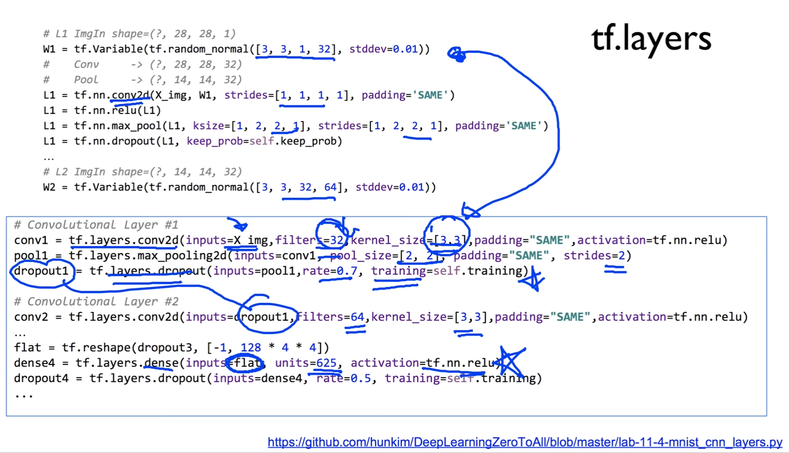


### Ensemble

앙상블이라는 것은 말도 굉장히 멋있죠?

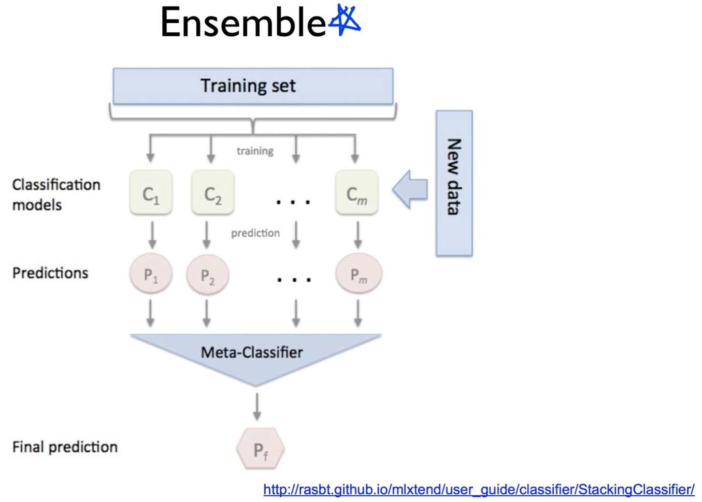

여러 개를 조합해서 우리가 굉장히 조화롭게 만들어낸다는 의미가 있다.

우리가 사용하고 있는 classification model에 대해서 ensemble을 적용한다는 것은, 여러 개의 독립된 모델을 training시키고, 새로운 데이터가 들어왔다, 테스팅할 데이터가 들어왔다 하면 각각의 모델에게 모두 다 예측해보라고 해서, 예측[Predictions]을 시킨 다음에, 예측한 결과를 어떤 방법으로든 조합을 시킨다는 겁니다.

조합한 결과를 최종적으로 내놓게 되면, 이것이 굉장히 좋은 성능을 발휘한다는 것이 앙상블의 기본적인 모델.

상당히 실제적으로 좋은 성능을 발휘하게 된다. 사용하시면 굉장히 좋다.


### Ensemble training

우리가 하고 있는 테스트에 ensemble을 어떻게 적용할 수 있을까요?

https://github.com/hunkim/DeepLearningZeroToAll/blob/master/lab-11-5-mnist_cnn_ensemble_layers.py

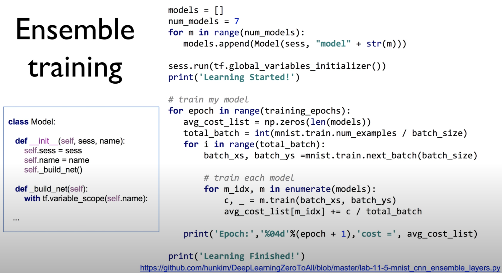

```python
class Model:

    def __init__(self, sess, name):
        self.sess = sess
        self.name = name
        self._build_net()

    def _build_net(self):
        with tf.variable_scope(self.name):
            
    // ...
    
models = []
num_models = 7
for m in range(num_models):
    models.append(Model(sess, "model" + str(m)))

sess.run(tf.global_variables_initializer())

print('Learning Started!')

# train my model
for epoch in range(training_epochs):
    avg_cost_list = np.zeros(len(models))
    total_batch = int(mnist.train.num_examples / batch_size)
    for i in range(total_batch):
        batch_xs, batch_ys = mnist.train.next_batch(batch_size)

        # train each model
        for m_idx, m in enumerate(models):
            c, _ = m.train(batch_xs, batch_ys)
            avg_cost_list[m_idx] += c / total_batch

    print('Epoch:', '%04d' % (epoch + 1), 'cost =', avg_cost_list)

print('Learning Finished!')
```

우선, 독립된 모델을 여러 개 만들어야 되겠죠?

그걸 위해서 우리가 class를 만들어두었다.

class를 사용하면, 우리가 모델을 쉽게 만들 수 있겠죠?


`models = []`

우선, 모델들을 담아낼 리스트를 하나 만든다.


`num_models = 7`

몇 개의 모델로 할 건가요? 7개. 임의로 정하면 됩니다.


```python
for m in range(num_models):
    models.append(Model(sess, "model" + str(m)))
```

그런 다음에 for loop를 돌면서, 각각 모델을 7개 만들어낸다.

모델 어떻게 만들까요? class를 초기화시키면 되는 것이죠?

이렇게 하면 class instance가 생겨나겠죠?

이렇게 해서 models라는 곳에 일곱 개를 넣어두었다.


```python
for epoch in range(training_epochs):
    avg_cost_list = np.zeros(len(models))
    total_batch = int(mnist.train.num_examples / batch_size)
    for i in range(total_batch):
        batch_xs, batch_ys = mnist.train.next_batch(batch_size)

        # train each model
        for m_idx, m in enumerate(models):
            c, _ = m.train(batch_xs, batch_ys)
            avg_cost_list[m_idx] += c / total_batch
```

그런 다음에 학습을 시킨다. 이전과 똑같은 방법.

epoch을 돌고, epoch마다 필요한 만큼의, batch size만큼의 xs, ys를 불러와서 이것을 학습을 시키게 된다.

```python
        # train each model
        for m_idx, m in enumerate(models):
            c, _ = m.train(batch_xs, batch_ys)
            avg_cost_list[m_idx] += c / total_batch
```

기존에는 모델 하나만 학습시켰는데, 이제는 일곱 개의 독립된 모델이 있기 때문에, 각각을 꺼내 온다.

m으로 꺼내 온 다음에, 이것을 training 시킨다. batch_xs, batch_ys 데이터를 줘서.

각각의 모델이 train된다.

여기같은 경우엔 cost가 어떻게 되는지 보기 위해서, 각각의 모델들로 cost를 이렇게 해서 보여주기도 한다.

이전과 똑같은 방식의 학습인데, 각각의 모델을 학습시킨다.


### Ensemble prediction

그런 다음에, 우리 이걸 가지고 prediction을 할건데요, 학습의 결과로 모델들이 생겨나겠죠?

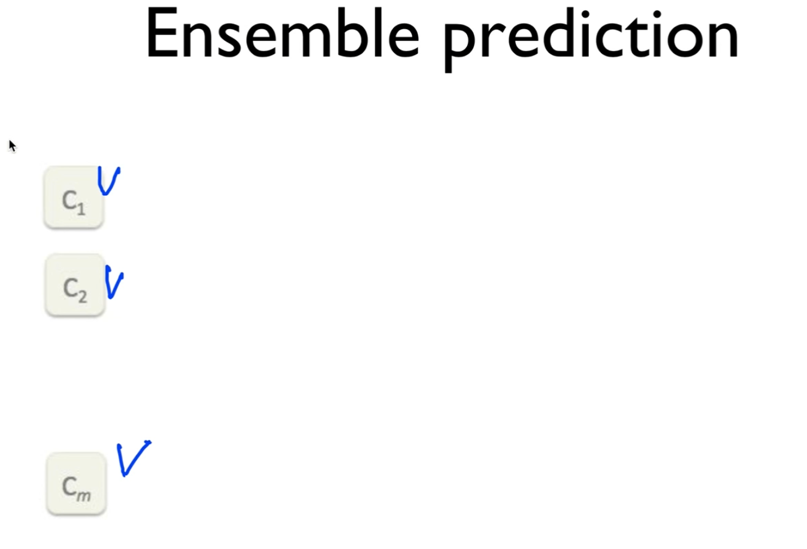

이걸 가지고 조합을 할 텐데, 여러 가지 방법이 있다.

여기에서는 간단하게 다 합하는 것으로 조합을 하겠다.


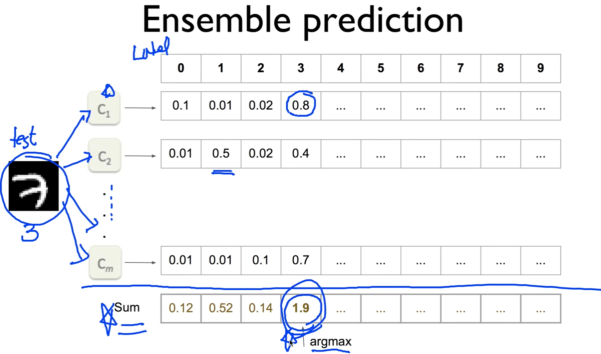

그 얘기는, 어떤 새로운 이미지가 하나 들어왔다. 테스트할 이미지.

각각의 모델들에게 물어본다. 야 너 이거 어떻게 생각해?

이 모델들은 softmax로 구현되어있죠?

softmax라는 건 각각의 label에 0이 될 확률이 얼마다, 1이 될 확률이 얼마다...

c1같은 경우 3일 확률이 높다고 예측함

c2는 조금 잘 못했죠

이런 식으로 cm까지.. 각각의 모델들에게 예측을 해봐 라고 얘기한다.

예측이 끝이 났다. 어떻게 하면 좋을까요?

그냥 다 합쳐서, 최종적으로 sum. 여기 가운데서 가장 점수가 높은 곳을 골라서 예측하겠다 하는 것이 우리의 가장 간단한, 각각의 classifier가 말하는 확률을 다 더해서 그 중에 가장 높은 것을 선택하겠다라는 간단한 방법을 할 수 있다.


이것을 구현해보면, 구현도 그렇게 복잡하지 않다.

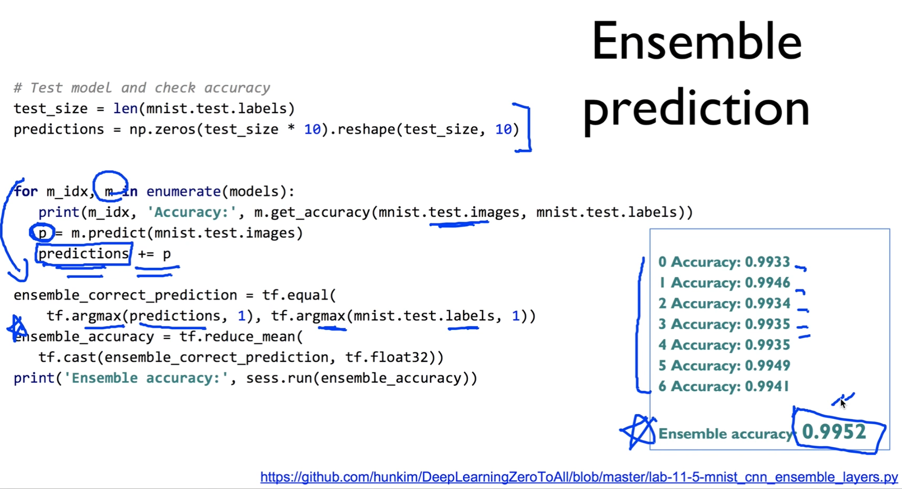

```python
# Test model and check accuracy
test_size = len(mnist.test.labels)
predictions = np.zeros([test_size, 10])

for m_idx, m in enumerate(models):
    print(m_idx, 'Accuracy:', m.get_accuracy(
        mnist.test.images, mnist.test.labels))
    p = m.predict(mnist.test.images)
    predictions += p

ensemble_correct_prediction = tf.equal(
    tf.argmax(predictions, 1), tf.argmax(mnist.test.labels, 1))
ensemble_accuracy = tf.reduce_mean(
    tf.cast(ensemble_correct_prediction, tf.float32))
print('Ensemble accuracy:', sess.run(ensemble_accuracy))
```


일단 공간이 필요하겠죠? 이렇게 공간을 만들어두고,

```python
test_size = len(mnist.test.labels)
predictions = np.zeros([test_size, 10])
```


그리고 loop를 또 돈다.

```python
for m_idx, m in enumerate(models):
    print(m_idx, 'Accuracy:', m.get_accuracy(mnist.test.images, mnist.test.labels))
    p = m.predict(mnist.test.images)
    predictions += p
```

loop를 돌면서 모델[m] 하나씩 꺼내온 다음에, 

test data[test.images]를 주고, 야 너 이거 예측해봐 하고 예측을 하게 하고[p],

예측한 값을 더한다. [predictions += p]

predictions 이라는 것은 loop가 끝나고 나면, 일곱 개의 모델이 예측한 것을 다 합한 값을 갖고 있겠죠?

이전 슬라이드의 sum이 바로 prediction이 될 것입니다.

이런식으로 다 합이 되면, prediction에 최종 합이 된 것이 들어와 있겠죠?


그런 다음에, 똑같다.

prediction에서 argmax 구하고, 실제 labels 있는 것을 비교해서 그걸 갖고 accuracy를 계산해낼 수 있다.

이렇게 하면 끝이 난다.

실제로 한 번 돌려보면, 예측한 것처럼 각각의 모델의 accuracy보다, ensemble한 accuracy가 좀 더 높게, 어떤 경우에는 상당히 더 높게 나타난다.

사용해보시면 굉장히 좋은 성능을 발휘한다.


### Exercise

그래서, 우리가 MNIST는 나름대로 CNN을 가지고 많이, 끝까지 가보았다.

여기서 그칠 것이 아니라, 몇 가지 연습문제, 숙제를 생각해보았다.

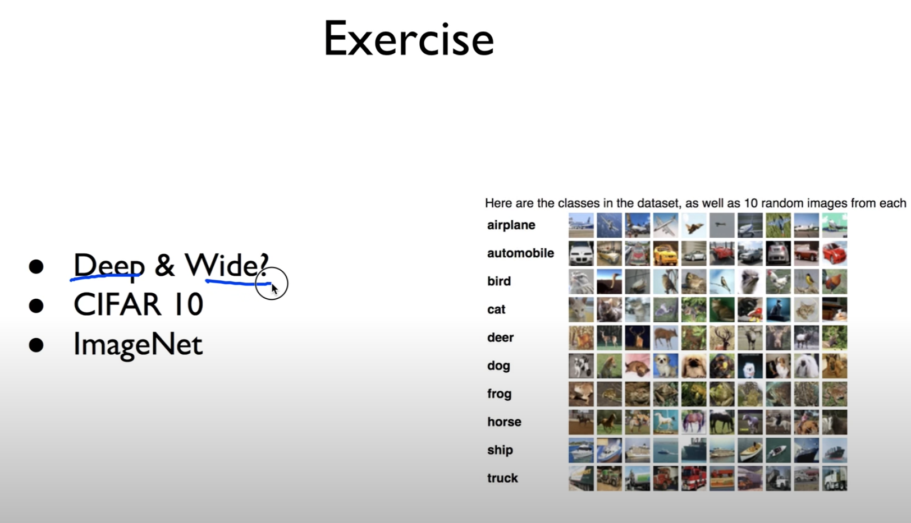

우선, 우리는 좀 더 깊게 갈 수도 있고, wide하게 갈 수도 있다.

좀 더 복잡한 데이터들, CIFAR 10이나 ImageNet같은 유명한 데이터도 있으니까, 이런 것들을 한 번 적용해보시는 것도 굉장히 좋은 도움이 될 것입니다.