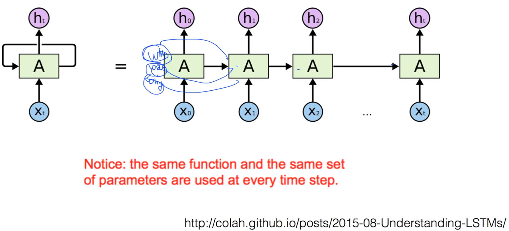

https://www.youtube.com/watch?v=-SHPG_KMUkQ&list=PLlMkM4tgfjnLSOjrEJN31gZATbcj_MpUm&index=41

### Lecture 12 RNN

Neural Network중에서 가장 재밌고, 꽃이라고 할 수 있는 RNN에 대해서 얘기해보겠다.

### Sequence data

- We don't understand one word only
- We understand based on the previous words + this word. (time series)
- NN/CNN cannot do this

우리가 사용하는 데이터들 중에서는, sequence data가 굉장히 많습니다.

예를 들어, 음성 인식, 우리가 말하는 자연어 같은 경우, 하나의 데이터가 아니라, sequence로 되어 있다.

제가 하는 얘기들을 여러분들이 이해하는 방법

하나의 단어 부분만 이해하신다고 해서, 전체 맥락을 이해하는 게 아니죠?

이전에 제가 했던 말들, 단어들을 이해하신 다음에 이해가 된다.

이런 것이 바로 sequence data가 되겠다.

기존에 있는 Neural Network나 Convolutional Neural Network같은 경우, 어떤 하나의 입력이 있었죠?

x란 입력이 있으면, 바로 출력Y로 나타나는 간단한 형태였기 때문에, 이런 형태의 시리즈 데이터[x0, x1]를 처리하기가 조금 불편했다.

그래서 많은 사람들이 고민한 끝에 만들어낸 것이, 이런 형태의 Network.

사실 series data를 얘기할 때, 이전의 결과가 그 다음에 영향을 미칠 수 있어야 한다.

이전의 연산이 그 다음에 영향을 미쳐야 그것이 series가 된다.

그런 것들을 해보자는 것에서 만들어본 것이, 어떤 현재의 state가 recurrent처럼 만들어놨지만, 이렇게 계산할 수 있겠죠? x 입력되면 y 출력

계산할 수 있는데, 현재 state가 다음 state에 영향을 미친다는 것이다.

왼쪽처럼 그림을 그렸는데, 실제로는 오른쪽처럼 구현된다고 보면 된다.

어떤 입력 [x0]이 있고, 그것을 출력. y라고 얘기합시다.

x0 입력으로 계산했던 어떤 상태, state가 그 다음꺼를 계산하는 데 영향을 미친다.

어떤 시점에서 뭔가를 계산할 때, 이전의 연산들이 영향을 미친다.

그래서 series의 데이터에 굉장히 적합한 모델이 되겠습니다.

### Recurrent Neural Network

요런식으로 표현한다했죠?

x가 있으면 RNN이란 연산을 통해 state를 계산하고, 그 state가 자기 입력으로..

각각 RNN cell에서 Y 값을 뽑아낼 수 있다.

이런 형태로 될 때 계산하는 방법에 대해 보도록 하자.

여기서 RNN에는 state라는 개념이 있죠? state를 계산하고, state를 통해서 y를 계산

state를 계산할 때 중요한 것은, timestamp 이전의 state가 입력으로 사용된다는 것이다.

x라는 입력값과, 이전에 있는 RNN Cell에서 나오는 값을 h_t-1라고 하죠?

요거 두 개를 가지고 요것을 쉽게 요렇게 해서.. h_t를, 새로운 state를 계산하는 데 같이 사용한다.

여기서 사람들이 RNN을 그림 하나로 나타내는 이유는,

이 function f_W, 즉 주어진 이전의 state[h_t-1]와 현재 x값[x_t]을 가지고 계산하는 function이, 모든 RNN에 대해 동일하다.

10개처럼 있지만, 사실 여기 사용되는 연산, function이 같기 때문에, 전체가 하나와 같다. 이렇게 표현한 것이다.

### (Vanilla) Recurrent Neural Network

구체적으로 어떻게 이 RNN의 값들을 계산하면 될까요?

여러 가지 방법이 있겠지만, 바닐라 RNN, 가장 기초가 되는 기본적인 RNN의 연산 방법은,

h_t = f_W(h_t-1, x_t)

이렇게 주어졌을 때, 이 함수를 어떻게 구성할 수 있을까요?

여러 가지로 구성할 수 있겠지만, Neural Network을 하시는 분들이 가장 좋아하는 연산자는 바로 이것.

WX

첨에 다뤘던 이것을 가지고 많이 고정한다. 입력이 두 개니까 쉽게..

h_t = tanh(W_hh h_t-1 + W_xh x_t)

이렇게 h_t-1, x_t 이것이 입력이죠?

각각의 weight를 만들어줍니다.

WX와 똑같은 형식이죠? 곱해서 더하는 형식

그 다음에 이것을 tanh, sigmoid 아시죠? 

sigmoid와 같은 형태인데, RNN에서 tanh이 잘 동작한다.

[텐 에이치]로 한 번 넣어준 다음에, 현재의 state h_t를 계산한다.

[되돌아가는 화살표] 여기가 h_t가 되겠죠?

그런 다음에 우리가 y값을 뽑아야 할 필요가 있을 때, 

h_t는 다음 값으로 넘겨주기 위한 값.

현재 상태를 해보고, 그 다음 state를 계산할 때 나를 좀 사용해줘 하는 것이 h_t였고,

y_t = W_hy h_t

y_t를 뽑을 때는, 계산된 h_t에다가, 한 번 또 다른 형태의 weight [W_hy]를 이렇게 곱해준다.

역시 WX와 공통으로 [WX꼴로] 계산을 해준다.

y가 몇 개의 벡터로, 데이터로 나올 것인가 하는 것은, 우리가 Neural Network에서 했던 것처럼 W의 형태에 따라 달려있다.

W가 어떤 형태의 벡터인가에 따라서 y의 결과값이 나온다.

h_t 여기도 다 마찬가지. 이 state가 몇 개의 벡터를 가질 것인가 하는 것은, 각각의 weight의, 벡터의 성질에 따라서 결정된다.

hidden state[h_t] 벡터가 몇 개가 될 것인지, 결과[y_t]가 몇 개가 될 것인지 하는 것은 정해진다.

weight [W_hh, W_hy]의 size, 벡터의 모양에 따라서 정해지게 된다.

예제를 보면서 한 번 이것이 어떻게 구현되는지 한 번 보도록 하자.

예제를 보여드리기 전에, 왼쪽을 오른쪽으로 표현하는데, 여기서 세 개의 weight가 있었죠?

W_hh, W_xh, W_hy

요 weight 값이 전체 cell에 똑같다는 겁니다.

똑같은 weight 사용.

그렇기 때문에, 하나만 있어도 같은 형태이다.

어디든 weight는 똑같다. 똑같은 것으로 학습을 하고, 우리가 어떤 값을 출력하게 된다.

### Character-level language model example

실제로 어떻게 이 연산이 되어가는지 그림으로 보도록 하겠다.

이것을 가지고 여러 개를 할 수 있는데, 이 예제에서는 우리가 캐릭터 레벨의 language 모델이다 이런 얘기를 함.

이 입력값을, 우리의 자이너?의 캐릭터를 준다.

예를 들어, hello라고 합시다.

그러면 character를 준다는 것은 h e l l 이렇게 입력으로 하나씩 time series 입력으로 생각한다.

여기서 하고싶은건 뭐냐?

이렇게 입력을 했을 때, RNN으로 학습하고 싶은 것이 뭐냐?

이런 입력을 줬을 때, h라는 것을 통해서 보통 그 다음에 오는 단어가 뭘까요? e

마치 네이버 연관검색어처럼.. 홍콩 검색하면 홍콩 김성훈 이렇게 연관 검색을 해주죠?

홍콩만 입력하면 예측해주죠? 마찬가지로 하고 싶다.

단어가 아니라 글씨들을.

h를 입력하면 그 다음에 e가 올 것이고,

e를 입력하면 l이 올 것이고,

l은 l이 오고, l은 o가 출력.

현재 글씨가 있을 때, 그 다음 글자가 뭘까?

맞추는 것이 language model라고 얘기함.

이렇게 예측하는 시스템을 우리가 RNN을 통해서 구현해보자.

우선 이제, 입력을 각각 벡터로 표현해야 된다.

h, e, l, l  이것을 벡터로 표현하는 방법 여러 가지가 있다.

여기서 가장 쉬운 방법인, one hot encoding이라고 부르죠?

우리가 갖고 있는 Vocabulary 4개가 있으니까, 4개의 벡터로 표시하고, 각각 해당하는 Vocabulary의 값에 해당하는 값을 1로 만든다. 이렇게 벡터로 표현할 수 있게 됩니다.

이건 한 가지 방법일 뿐..

원하는 것은 우리가 캐릭터를 벡터로 변환해야 한다.

h, e, l, o를 각각 다른 multi label로 생각하셔도 된다.

지난 번에 학점을 매길 때 a, b, c, d 이런 식으로 했죠? multi label로 보셔도 된다.

각각 자리에 1로..

우리가 이걸 이제 각각의 RNN cell에다가 입력을 할 것이다.

첫 번쨰 입력할 것이, input layer값을 상단의 공식으로 hidden state 값들을 계산했죠?

가장 첫 번째 경우엔, 이전의 h_t-1이 없다.

-> 보통 이전 값을 0으로 계산한다.

W_hh h_t-1 값은 없는 거나 마찬가지.

그냥 input layer 값에 W_xh를 곱해서 나타낸 것.

W_xh 아직 모르겠죠? 학습해서 주어지는데, 임의로 하나의 weight을 곱한 다음에 결과가 이렇게 나왔다.

가상적인 값입니다.

그 다음 단계 어떻게 진행하나요?

그 다음 값도 cell이 있을 것인데, 

왼쪽과 아래 값을 동시에 이용해서 구하게 되죠?

왼쪽 값들 세 개를 이용하고, 여기에 W_hh 값을 곱해서,

그것과 아래 값에 W_xh를 곱한 값을 더한 것이다.

두 개를 +한 값이 요게 되겠다.

이렇게 계산

마찬가지로 똑같이 계속 진행..

이렇게 보면 어렴풋이, 이전 값들이 다음 값에 영향을 미치고 있다.

영향을 미쳐서 이런 값이 나오기 때문에, RNN이란 것은 어떻게 보면 이전의 것들을 잘 기억한다 그런 의미가 있을 수 있다.

마지막으로, 우리가 y를 뽑아낼 때, output layer에는 hidden layer의 state 값에 W_hy 값을 곱한다.

y_t = W_hy * h_t

곱하기 해서 결과를 뽑아낸다.

이거도 벡터가 몇 개 될 것인가 하는 것은, W의 shape에 따라 결정된다.

우리같은 경우 출력이 글자가 나오기도 하죠?

vocaburaly 4개니까, 4개 중의 하나로 lable이 정해진다고 생각하시면 됩니다.

그럼 요걸 가지고, 여러분들이 softmax라고 보셔도 된다.

[output layer에] softmax 취하면 어떻게 됩니까?

가장 큰 거를, 선택하게 되면, 그게 그 위에 해당하는 map이 되겠죠?

첫 자리는 e의 자리가 되니까, 원하는 게 맞았던거죠? [o가 4.1이지만 스무스하게 넘어가자]

두 번째는 우리가 l을 원했는데, -1로 틀렸죠?

원하는 거가 l인데 실제로는 o가 됨

이걸 error라 할 수 있겠죠?

이런 값들이 우리가 원하는 자리가 초록색 - 실제 나온 값들과 조금 맞지 않다.

어떻게 cost 함수를 계산할 것인가 - 이전에 했던 것과 같은 softmax에 해당되는 cost 함수로 계산

네 개니까 네 개를 다 더해야겠죠?

네 개를 다 더해서 cost를 평균내면 학습을 시킬 수 있겠죠?

학습이 되면 어떻게 될까요?

글자를 넣으면 계산을 통해 그 다음 글자는 뭐가 되겠다 하는 language model이 된다.

### RNN applications

이런 형태의 RNN. 굉장히 활용하는 방법이 다양하다.

우리가 방금 얘기했던 Language Model

연관 검색어같은거 만들어내기 가능

Speech 굉장히 연속된 데이터. 이런걸 처리하는 데 굉장히 잘 된다.

Speech 란 것은 이전에 했던 말들과 상관이 있다.

RNN의 출력이 sequence한 데이터를 출력한다.

어떤 sequence한 데이터를 입력받고 출력하면 Translation도 나온다.

이걸 가지고 Bot도 만들 수 있다.

안녕? -> 새로운 문자열을 만들어 냄. 나도 좋아! 이런 식의 문자열을 만들어내는 Conversation 가능.

어떤 질문 문자열, 답변 문자열도 가능.

이미지나 비디오를 캡셔닝할수도 있다.

### Recurrent Networks offer a lot of flexibility:

이것은 RNN을 활용을 어떻게 하느냐에 따라 달려있다.

예를 들면, 그냥 Neural Network같은 경우, 이렇게 하나의 입력, 하나의 출력이 있을 수 있다.

one to one

RNN을 가지고, 여러 가지 형태로 구성을 할 수 있다.

이런 게 바로 이미지 캡셔닝의 예.

이미지 딱 주면, Caption, 나는, 모자를, 쓰고 있네

이런 형태의 series data로 값을 뽑아낼 수 있다.

또, 이런 여러 가지 문자열 입력을 받아서, 하나의 출력.

이건 Sentiment[감성]

이 문장은 좀 슬픈데? 이 문장은 좀 기쁜 문장인데 하는 것을 나타내는 하나의 출력 값을 나타낼 수 있다.

또 이렇게, Translation하는 것이 이런 형태.

값을 입력받고, 문자열로.

sequence of words -> sequence of words

또, 이런 비디오 같은 경우에는, 그림, 프레임이 하나가 아니라 여러 개가 있겠죠?

각각의 프레임을 입력받고, 출력을 설명하는 것도 받을 수가 있겠죠?

그래서, RNN도 굉장히 다양하게 확장 가능하다는 것을 알 수 있다..

### Multi-Layer RNN

RNN도 입출력이 주어질 때 layer를 하나만 둘 수 있지만, 여러 개의 layer를 둘 수 있게 된다.

더 복잡한 학습이 가능하다.

### Training RNNs is challenging

앞에서 설명한 건 Vanilla RNN이라고 한다.

기본적인 RNN.

마찬가지로 굉장히 깊어지고 layer들이 많아지다 보면, 학습하는 데에 어려움이 있다.

극복하는, 다른 형태의 RNN과 같은데 조금 다른 모델이 나온다.

그 중 하나가 LSTM이라는 모델.

보통 RNN이라고 하면 RNN자체를 쓰지 않고, 많은 경우 LSTM, 

그리고 자랑스런 조 교수님께서 만든 GRU 모델

두 개 중에 하나를 쓰게 된다.

