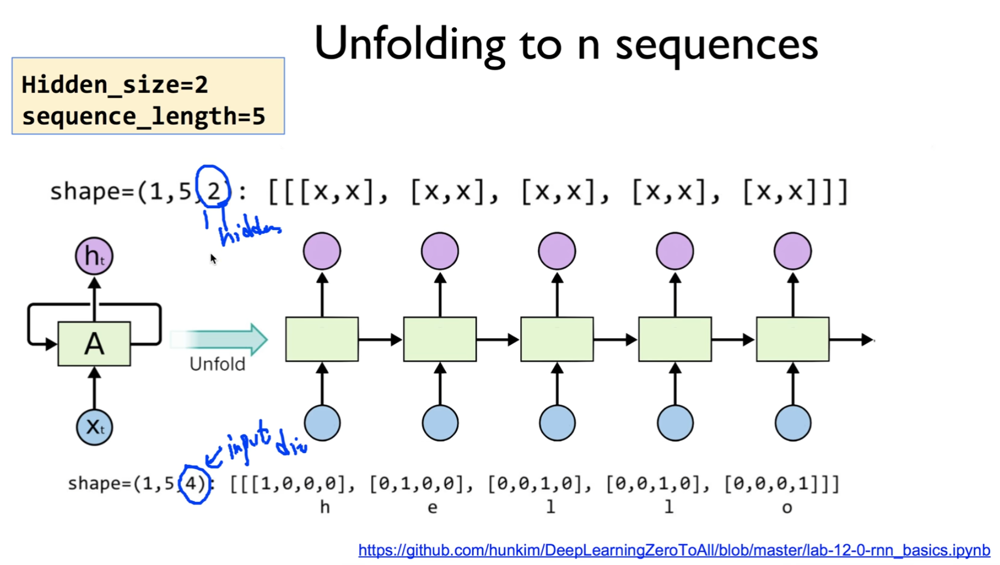
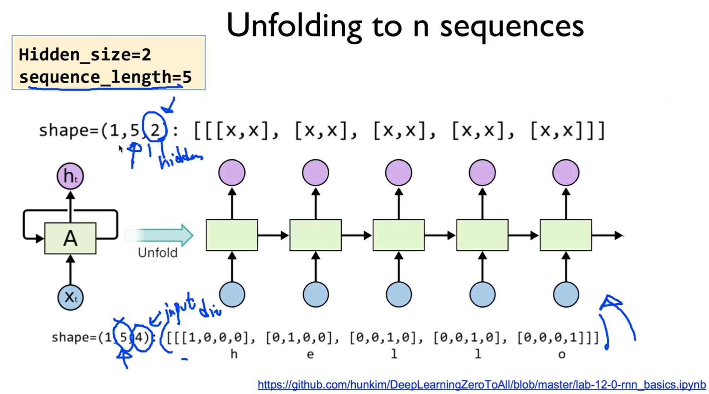

https://www.youtube.com/watch?v=B5GtZuUvujQ&list=PLlMkM4tgfjnLSOjrEJN31gZATbcj_MpUm&index=42


### Lab 12-1 RNN Basics

이번 실습 시간에는 Neural Net중에 가장 활용도가 높다고 알려져 있는 RNN에 대해 얘기해보도록 하겠다.


### RNN in TensorFlow

https://github.com/hunkim/DeepLearningZeroToAll/blob/master/lab-12-0-rnn_basics.ipynb


```python
cell = tf.contrib.rnn.BasicRNNCell(num_units=hidden_size)

...
outputs, _states = tf.nn.dynamic_rnn(cell, x_data, dtype=tf.float32)
```


RNN은 수업에서 얘기한 것처럼, 기존 Neural Net과 다른 점이 있다면, RNN의 output이 다음 cell과 연결된다. 이 점이 매우 다른 점.

어떻게 구현할까? 조금 걱정되긴 한다.

Tensorflow 사용하면 굉장히 쉽게 구현할 수 있다.

두 가지로 나누어서 구할 수 있다.

첫 번째 스텝 - cell이라는 것을 만든다.

```python
cell = tf.contrib.rnn.BasicRNNCell(num_units=hidden_size)
```

cell을 만들 때 어떤 형태의 cell을 만들 것인가?

그냥 RNN도 있고, 다른 형태도 있죠? LSTM, GRU. 이런걸 만든다.

Cell을 만들 때 가장 중요한 것 - Cell에서 나가는 output, 출력

출력의 크기가 얼마일까를 정해준다. 이것을 hidden size라고도 하고, num_units라고도 한다.

출력의 사이즈가 얼마일까만 정해준다.


두 번째 단계 - cell 만든 것을 실제로 구동시켜서, 어떤 입력을 주고 출력값을 뽑아낼 수 있다.

이것을 driver라고 부를 수도 있고, 아니면 다른 형태의 함수, refer라고 부를 수도 있는데, 보통 tensorflow rnn을 사용하게 된다.

```python
outputs, _states = tf.nn.dynamic_rnn(cell, x_data, dtype=tf.float32)
```

이걸 써서 우리가 만들었던 cell을 넘겨주고, 우리가 원하는 입력 데이터를 다시 넘겨준다.

이렇게 하면 이 dynamic rnn은 두 가지 출력을 낸다.

하나는 output 출력을 내고, 또 한 개는 마지막 state의 값을 낸다.

state의 값 사용할 일은 많지 않다.

주로 output을 많이 사용하게 된다.


이렇게 나눈 이유가 여러 가지 있을텐데, 가장 중요한 이유 중 하나는 cell을 생성시키는 부분과, cell을 가지고 학습시키고 구현, 구동을 하는 부분을 나누어 줌으로써, 우리가 원하는 형태의 cell을 만들 수 있도록 했다.

처음 Cell을 만들 때는 Basic RNN Cell을 만들어봤는데, 성능이 안나온다든지 해서, Basic LSTM 으로 바꾸고 싶다고 했을 때, 이전에 부분들은 그대로 두고, cell만 바꾸면 나머지 부분들은 그대로 사용할 수 있다.

이렇게 해서, 편리하기 때문에 두 가지로 나누었다 이렇게 보실 수도 있다.


### One node: 4 (input-dim) in 2 (hidden_size)

이제 기본적인 것은 어떻게 만드는지 이해했는데, 이걸 갖고 한 번 실제 x 데이터를 넣어주고, 어떤 값이 나오는지 관찰해보도록 하겠다.


어떤 입력을 넣을 것인가? 여기서는 문자열을 다룰 것이다.

이것을 다루기 가장 좋은 방법 중 하나가 One hot encoding.

오른쪽 위 형태로 One hot encoding으로 표현할 수 있다.

이것을 입력으로 준다.

이 입력의 dimension은 얼마가 될까요?

4개니까 input dimension은 4가 된다.


[[[1, 0, 0, 0]]] 이런 데이터를 줄 것이다.

shape = (1, 1, 4)에서 우선 마지막 4 부분만 focus를 해보자.

그래서, input dimension은 4가 될 것이다.

그러면, output의 dimension은 뭐가 될까요?


답: 여러분 마음대로

여러분들이 이 cell을 만드실 때, hidden size를 정해준다고 말씀드렸죠?

이 hidden size를 무엇으로 여러분들이 정하셨는지에 따라서, 출력은 결정된다.

여기선 hidden size를 심심하니까 2로 줘보죠.

2로 준다는 것은, 입력 데이터의 dimension이 뭐든지 상관없이, 출력의 값은 dimension은 2개로 주겠다.

[x, x] 일케 해도 되고, [0.5, 0.7] 이렇게 해도 되고, 이런 형태의 값이 된다.

이렇게 내가 만들꺼다 하는 것이 바로 hidden size

우리가 cell을 만들어낼 때 이렇게 정의한다.


### One node: 4 (input-dim) in 2 (hidden_size)

그러면 실제 코드를 한 번 써보고..


```python
 tf.variable_scope('one_cell') as scope:
    # One cell RNN input_dim (4) -> output_dim (2)
    hidden_size = 2
    cell = tf.contrib.rnn.BasicLSTMCell(units=hidden_size)

    x_data = np.array([[[1,0,0,0]]], dtype=np.float32) # x_data = [[[1,0,0,0]]]
    outputs, _states = tf.nn.dynamic_rnn(cell, x_data, dtype=tf.float32)

    sess.run(tf.global_variables_initializer())
    pp.pprint(outputs.eval())
```

학습 과정은 없다. 단순하게 입력을 주고, 출력이 어떻게 나오는지만 관찰.

우선 hidden size를 정한다.

출력은 2개로 해주세요.

이것을 이용해서 LSTM Cell을 만든다.


cell을 구동시킬 driver - dynamic_rnn을 사용할 것이다.

이 때, 입력 데이터가 필요하죠?

뭘로 할 꺼예요?

입력 dimension이 4, 4개의 vector가 있는 입력 dimension vector를 하나 만들어낸다.

그리고, 이걸 그냥 cell을 넘겨주고, 입력 데이터를 그대로 넘겨서, 이 rnn이 어떤 출력을 내는지 한 번 살펴본다. [output]

rnn은 outputs와 _states를 낼 것인데, _states는 일단 그냥 두자.

output만 한 번 보도록 하자.

역시 session을 실행시키고, variables_initializer를 한다.

output을 evalutaion하는 방법으로 출력을 해본다.


출력하면, 우리가 예상했던 것처럼 어떤 값 두 개가 나온다.

[[[ -0.42409304, 0.64651132 ]]]

두 개가 나온 이유: hidden size를 2로 두었기 때문.

이 값이 의미하는 바는 뭘까요?

아마도 이 안[cell]에 들어있는 어떤 weight들 초기에 랜덤하게 주어지죠? 그 값에 의해 나온 값들..

중요한 것: 이런 형태의 shape이 나왔다 라는 것을 이해하면 된다.


### Unfolding to n sequences

우리 그럼 이제 마지막 거는 이해를 했다.



아래 맨 뒤 - input dimension

위에 맨 뒤 - hidden size, 정해짐

앞에 두 개의 숫자가 남았는데, 한 개씩 보도록 하자.


RNN의 가장 장점 - 하나처럼 보이지만, unfold를 쭉 해서 이런 3d data를 받을 수 있다.

그럼 sequence data는 3d data를 몇 개를 받을 것인가? 이런 질문을 할 수 있다.

그 값이 바로 두 번째 값이 된다.

좀 어려운 말로 sequence length라고 부른다.

그 말은, 한 번에 sequence를 몇 개 주는가?, cell을 몇 번 펼칠 것인가? 라는 이야기.

우리가 cell을 만들 때는, hidden layer 값만 정해주기 때문에, 이[shape?] 값은 어떻게 결정되느냐?

그것은, 우리가 입력 데이터를 줄 때, 이 입력 데이터의 모양에 따라 결정된다.

우리가 sequence를 5로 주고 싶으면, (1, 5, 4) 이런 형태의 데이터를 넘겨주면 된다.

``` 
[[[1, 0, 0, 0], [0, 1, 0, 0], [0, 0, 1, 0], [0, 0, 1, 0], [0, 0, 0, 1]]]
```

그림 아래 형태의 array가 되겠죠?

이런 형태의 array를 넘겨주게 되면, dinamic rnn driver는 알아서 이걸 펼쳐내고, 출력도..

니가 sequence가 5야? 나도 5로 출력해줄께.

20 -> 나도 20

7 -> 나도 7

이렇게 똑같은 방법으로 출력을 만들어준다.




코드를 한 번 살펴보면..


```python

# One cell RNN input_dim (4) -> output_dim (2). sequence: 5, batch 3
# 3 batches 'hello', 'eolll', 'lleel'
hidden_size = 2
cell = tf.nn.rnn_cell.LSTMCell(num_units=hidden_size, state_is_tuple=True)
x_data = np.array([[h, e, l, l, o]], dtype=np.float32)
print(x_data.shape)
pp.pprint(x_data)

outputs, states = tf.nn.dynamic_rnn(cell, x_data, dtype=tf.float32)
sess.run(tf.global_variables_initializer())
pp.pprint(outputs.eval())
```

이제부터 숫자가 조금 나오기 시작하지만, 여러분들이 숫자를 한 번 찬찬히 들여다보시면, 굉장히 쉽게 이해하실 수 있습니다.

우선, 이 sequence는 입력의 모양에 따라 결정된다고 했으니까, 입력을 한 번 신경써서 만들어보도록 할까요?

숫자가 많아지니까, 각각의 hot encoding을 변수로 선언하도록 합시다.

h = [1, 0, 0, 0]

e = [0, 1, 0, 0]

이런 형태로 변수로 선언한다.

이 sequence는 어떻게 만드느냐? 이렇게 만든다.

```
x_data = np.array([[h, e, l, l, o]], dtype=np.float32)
```

이렇게 직접 변수를 써서 sequence data를 만들어준다.

sequence size 얼마인가요? 5개니까 5

```
[[[ 1.,  0.,  0.,  0.],
  [ 0.,  1.,  0.,  0.],
  [ 0.,  0.,  1.,  0.],
  [ 0.,  0.,  1.,  0.],
  [ 0.,  0.,  0.,  1.]]]
```

이렇게 생긴 다섯 개의 데이터가 생겨났다.


그럼, 이전과 마찬가지로 hidden_size=2가 되는 cell을 하나 만들 것이고, 

```
outputs, states = tf.nn.dynamic_rnn(cell, x_data, dtype=tf.float32)
```

cell을 dynamic rnn이란 drive를 통해서 cell을 넘겨주고, x_data를 여기 넘겨준다.

그럼 dynamic rnn에서 구동해서 결과를 뽑아주겠죠?

```
pp.pprint(outputs.eval())
```

그것을 우리가 output을 통해서 실행을 시켜주는거죠?

그러면, output을 한 번 볼까요?

여러분 예상은 얼마일까요?

shape = (?, ?, 2) hidden size가 2니까

shape = (?, 5, 2) sequence size가 5니까

그래서 이런 형태의 값이 나옵니다. shape = (1, 5, 2)

실제로 출력을 보면, dimension이 2개인 것이 5개 나온다.

예상한대로 출력이 나온다.


[방금 봤던 출력]오른쪽 아래 이 초록색 값은 뭘까요?

아마, 요기[cell]에 들어있는 초기화된 weight들일 것이다.

다음에 우리가 학습을 시키겠지만, 

이 것[오른쪽 아래 초록 array]은, 우리가 입력을 주고 어떤 출력이 나오는지를,

그리고 어떤 출력의 shape이 무엇인지를 한 번 살펴보는 과정이었다.


### Batching input

그럼 이제 마지막 단계. 이 값은 뭘까요?


shape = (**3**, 5, 2)

우리가 이제 학습을 시킬 때, 문자열 하나씩 학습시키면 얼마나 느리겠습니까? 얼마나 비효율적일까요?

효율적으로 만드는 방법 - sequence를, 문자열을 여러 개 주는 것.

이런 걸 좀 어려운 말로는, batch size다라는 표현을 쓴다.

우리가 이전에도 batch size라는 표현을 했다. 데이터를 여러 개 줬죠?

마찬가지로 이 RNN도 batch size를 통해서 데이터를 여러 개 줄 수가 있는데, 그걸 우리가 batch size라고 부른다.

이런 경우에는 [shape = (3, 5, 2)] 우리가 한 세 개의 문자열 정도 줍시다.

100개, 1,000개, 많이 쓸 수 있는데, 보여주기 위해서 세 개를 사용

앞의 부분은, cell을 만들 때는 전혀 고칠 필요가 없고, 입력 데이터만 이런 형태로 주면 된다.

(3, 5, 4) [4] dimension 정해주고, 5는 문자열 5개의 열이다. sequence length

이런 데이터를, sequence를 몇 개씩 뭉쳐서 넣을 거예요? 한 batch에?

batci size 3

이런 형태로 데이터를 만들어주면, 출력은 기계적으로 그대로..

shape = (3, 5, 2)

2는 우리가 정해준거죠? hidden size

3, 5 두 개는 우리가 그대로, 입력 데이터에 있는 것들을 그대로 받아서 똑같이 만들어 줘야 한다.

(3, 5, 2)의 결과가 나오면 된다.

코드를 통해서 확인해볼까요?


```python
# One cell RNN input_dim (4) -> output_dim (5). sequence: 5, batch 3
# 3 batches 'hello', 'eolll', 'lleel'
x_data = np.array([[h, e, l, l, o],
                    [e, o, l, l, l],
                    [l, l, e, e, l]], dtype=np.float32)
pp.pprint(x_data)

hidden_size = 2
cell = tf.nn.rnn_cell.LSTMCell(num_units=hidden_size, state_is_tuple=True)
outputs, _states = tf.nn.dynamic_rnn(cell, x_data, sequence_length=[5,3,4], dtype=tf.float32)

sess.run(tf.global_variables_initializer())
pp.pprint(outputs.eval())
```

이제는, 배치가 세 개니까 이렇게 세 개를 만들어준다.

만들어주고, x_data 숫자가 굉장히 많이 나온다.

batch가 하나, 둘 삼이었고요,

각 batch마다 sequence가 5개가 있고,

각 sequence에 dimension은 4가 되는 그런 데이터를 만들어냈다.


그것을 이전과 똑같이..

cell을 만들 때 역시나 hidden size만 알려준다.

dynamic_rnn을 통해서 만들어낸 cell, 입력 데이터[x_data]를 넘겨줘서 출력을 뽑아낸다.


출력을 뽑아내면, 예상했던 것처럼 똑같은 shape

그 대신, dimension은 2가 된다. hidden size가 2자너

이런 형태로 기계적으로 출력이 된다.


이것이 좀 복잡해 보였던 RNN을 사용하는 방법.

한 번만 보시면, 여러분들이 되게 간단하게 사용할 수 있구나,

그냥 숫자만 좀 많을 뿐이라고 아실 수 있다.


### Lab 12-2 Hi Hello RNN

다음 시간에는 RNN을, 학습을 통해서 뭔가 정말 우리가 원하는 출력을 만들어내는 그런 것들을 살펴보도록 하겠습니다.