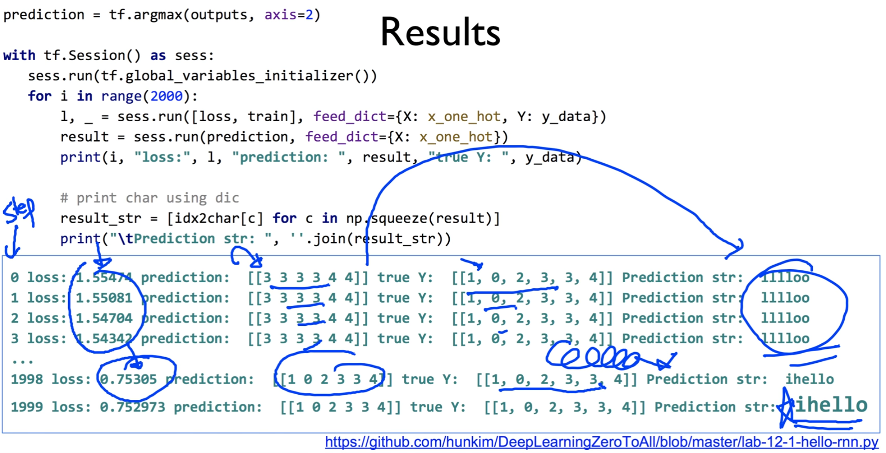

https://www.youtube.com/watch?v=39_P23TqUnw&list=PLlMkM4tgfjnLSOjrEJN31gZATbcj_MpUm&index=43


### Lab 12-2 Hi Hello RNN

지난 시간에는 RNN에 입력을 어떻게 하고, 어떤 출력이 나왔는지 살펴봤다.

이번 시간에는 정말 재밌게 이 RNN을 훈련시켜보도록 하겠다.


### Teach RNN 'hihello'

이번에 우리가 훈련시킬 것은 무엇이냐?

hi hello라는 문자열을 알아내게 훈련시켜보도록 하겠습니다.


hi, hello라는 문자열을 주고, RNN에게 h 한 자를 제외한 i hello를 만들어내게, 즉 내가 h라고 말하면 그 다음 문자가 무엇일지 예측하고, 내가 i라고 말하면 그 다음 문자가 무엇일지 예측하는, 내가 한 문자를 주면 그 다음 문자가 무엇인지 예측해보도록 학습시켜보겠다.

이 문제가 굉장히 간단한 것 같지만, h를 입력으로 주었을 때, 어떤 때는 i가 나와야 하고, 같은 h지만 어떤 때는 e가 나와야 맞습니다.

일반적인 Forward Net으로는 쉽지가 않다.

이전에 있는 문자가 뭔지 알아야, 값을 잘 출력할 수 있도록 해주는 RNN이 굉장히 효과적이다.


### One-hot encoding

기본적인 것을 정리하고 가자.


RNN이 조금 복잡하게 느껴지는 것 - RNN 자체는 간단하지만, RNN에 넣어줘야 될 입력 데이터들을 가공하는 것이 조금 복잡하게 느껴질 수 있다. 그래서 그런 것인데, 

이것도 하나씩 보면 그렇게 어렵지 않다.


우선, 여기서 우리가 입력으로 사용할, 또는 훈련시키기 위한 text는 뭘까요?

hihello라는 텍스트.

그러면, 이 텍스트를 각각의 문자열을 뽑아내고, 각각의 문자열을 one-hot encoding으로 바꾸고 싶은데, 

그럼 우선 봐야될 께 여기 유일하게 있는 문자가 뭘까요? unique한 character

h, i, e, l, o라고 다섯 개의 값이 있다.

다섯 개의 unique한 문자가 있다.

이건 단어로 말하면 unique vocabulary라고도 하고, 또는 voc 이런 표현도 한다.

유일한 문자열, 또는 단어가 몇 개 있느냐 하는 것을 알아낸다.

이것이 이제 우리가 원하는 one-hot encoding의 size가 된다.


그러면, 이렇게 정해졌으면, 우리가 이 vocabulary를, 또는 문자열을 인덱스로 표현할 수 있겠죠?

h:0, i:1, e:2, l:3, o:4

0이라는 것은 h를 말하는 거고, 1은 i 이런 식으로 우리가 줄 수 있다.

이렇게 숫자를, 인덱스를 다 붙인 다음에 이 인덱스를 one-hot으로 바꾸게 되면, 그것이 바로 one-hot encoding이 되겠죠?

h 0은 [1, 0, 0, 0, 0]

o 4는 4니까 [0, 0, 0, 0, 1] 이렇게 되는 겁니다.

문자열이 있으면 이런 형태로, one-hot encoding으로 바꾸는 과정, 그리고 우리가 필요한 index, dictionary라고도 하죠? 이걸 통해서 이 문자열이 주어지면 숫자로 바꾸고, 숫자가 주어지면 문자열로 바꾸고, 요런 거를 자유롭게 하실 수 있으면 굉장히 유용하게 RNN을 사용하실 수가 있습니다.


### Teach RNN 'hihello'

그러면, 우리가 한 번 그림을 보도록 할까요?


이런 형태로 입력이 되고 출력이 될 텐데,

입력 dimension이 얼마고, 출력 dimension이 얼마고, sequence length가 얼마인가, batch가 얼마인가 이런 거 정해야 되는데, 한 번 볼까요?


입력 값 dimension 5. 쉽게 5 알 수 있다.

sequence 길이 몇 개? -> [연초록색 네모, cell] 이거 몇 개? 6개.

sequence는 6개. 알겠구요,

우리가 그냥 간단하게 바로 출력을 뽑아내고 싶다 -> 출력의 dimension, hidden은 당연히 one hot으로 나오니까 5개가 되겠죠?

배치 몇 개일까요? 문자열 하나밖에 없으니 batch = 1

이렇게 기본적인 것만 알게 되면, 쉽게 RNN을 구성할 수 있다.


### Creating rnn cell

한 번 해 볼까요?


rnn 구성을 다시 본다.

우선 cell을 만들어야 되겠죠?

이 때 중요한 것은 rnn size이다.


물론 이 cell은 basic rnn을 썼을 수도 있지만, 

그 유명한 LSTM이나 GRU를 쓸 수가 있다.

cell의 사이즈는 얼마인가요? 출력값이니까 5가 되겠죠.


### Execute RNN

이렇게 해서 RNN의 size가 5로 주어졌으면, 두 번째 중요한 것은 입력의 size를 어떻게 가져갈까요? 어떻게 만들어낼까요? 하는 것.


우리 이전에 같은 경우, input dimension은 5라고 정해줬고,

sequence length는 hihello에서 6이 되었다.

이렇게 정해줬다.

여기에 맞게 데이터를 만들어서 넣어주면 된다.

그럼 우리 출력이 얼마나 나올까 예상해볼 수 있다.


### RNN parameters

한 번만 더 정리해볼까요?


hidden size 5가 됐구요,

input dimension 역시 5가 됐구요,

batch size 하나로만 갑니다.

sequence length 6. 이제 이건 다 이해되셨죠?


### Data creation

그럼 이제 이것을 기반해서 데이터를 만들어보도록 하겠습니다.

https://github.com/hunkim/DeepLearningZeroToAll/blob/master/lab-12-1-hello-rnn.py


```python
idx2char = ['h', 'i', 'e', 'l', 'o']
# Teach hello: hihell -> ihello
x_data = [[0, 1, 0, 2, 3, 3]]   # hihell
x_one_hot = [[[1, 0, 0, 0, 0],   # h 0
              [0, 1, 0, 0, 0],   # i 1
              [1, 0, 0, 0, 0],   # h 0
              [0, 0, 1, 0, 0],   # e 2
              [0, 0, 0, 1, 0],   # l 3
              [0, 0, 0, 1, 0]]]  # l 3

y_data = [[1, 0, 2, 3, 3, 4]]    # ihello
X = tf.placeholder(tf.float32, 
        [None, sequence_length, input_dim])  # X one-hot
Y = tf.placeholder(tf.int32, [None, sequence_length])  # Y label
```


우선, 우리가 가지고 있는 문자열 h, i, e, l, o

이걸 그냥 array로 줘서, 

idx2char 일종의 dictionary. index를 character로 바꾸는 것을 한 번 만들어봤다.


그 다음에 x_data를 주면, x_data는 hihell이죠?

인덱스를 통해 써본다. 

hihell을 갖고 예측하고 싶은 게 ihello, [[0, 1, 0, 2, 3, 3]]을 입력하면,

y_data가 true가 되겠죠? 우리가 학습하고 싶은 결과값.  

y_data. [[1, 0, 2, 3, 3, 4]]

ihello라는 뜻.


그럼 이제 우리가 x_data를 그대로 쓰지 않고 one_hot으로 바꾼다고 했죠?

0은 [1, 0, 0, 0, 0]

1은 [0, 1, 0, 0, 0]

이렇게 해서 각각이 하나씩 one-hot으로 만들어지는 것이죠?

각각을 one-hot으로 치환

이런 형태의 데이터를 우리가 입력으로 사용하겠습니다.


### Feed to RNN

그러면, 우리가 조금 더 X와 Y를 일반화하기 위해서 placeholder로 정의할 수 있겠죠?


```python
X = tf.placeholder(
    tf.float32, [None, sequence_length, input_dim])  # X one-hot
Y = tf.placeholder(tf.int32, [None, sequence_length])  # Y label

cell = tf.contrib.rnn.BasicLSTMCell(num_units=hidden_size, state_is_tuple=True)
initial_state = cell.zero_state(batch_size, tf.float32)
outputs, _states = tf.nn.dynamic_rnn(
    cell, X, initial_state=initial_state, dtype=tf.float32)
```

X는 one-hot이 되겠구요,

size는 어떻게 할 것인가 한 번 생각해봐야 하는데, 마지막 안에 있는게 input dimension

그 다음에, sequence 길이가 두 번째가 될 것이다.

sequence 길이가 one hot이 몇 개인지를 결정하는 것이다.

input dimension은 one hot의 크기가 되겠죠?

input dimension의 크기는 5, one-hot의 크기는 6이 되겠죠?

None은 batch size가 될 것인데, 1이지만 편하게 'batch가 많아도 괜찮아' 하는 거다.


Y는 lable로 그냥 표시되죠? sequence 크기만큼의 label 값이 된다. None은 Batch size.


우리가 그 다음에 cell을 만들 것이다.

cell을 만들 때에는, 출력에 해당되는 hidden size가 5가 되겠죠?


여기선 initial state를 만들어보는데, initial state는 다 0으로 주도록 하자. [cell.zero_state]

batch size를 주면 된다.


그런 다음에, 우리가 이전에 많이 봤던 dynamic rnn을 사용해서, 

cell과, 우리가 만들어놓은 X 데이터(one-hot)를 주고, 그런 다음에 필요하면 initial state를 만들어준다.

그러면 output이 나오겠죠? output size는 우리가 예상할 수가 있구요,


### Cost: sequence_loss

https://github.com/hunkim/DeepLearningZeroToAll/blob/master/lab-12-0-rnn_basics.ipynb


```python
# [batch_size, sequence_length]
y_data = tf.constant([[1, 1, 1]])

# [batch_size, sequence_length, emb_dim ]
prediction = tf.constant([[[0.2, 0.7], [0.6, 0.2], [0.2, 0.9]]], dtype=tf.float32)

# [batch_size * sequence_length]
weights = tf.constant([[1, 1, 1]], dtype=tf.float32)

sequence_loss = tf.contrib.seq2seq.sequence_loss(logits=prediction, targets=y_data, weights=weights)
sess.run(tf.global_variables_initializer())
print("Loss: ", sequence_loss.eval())
```


자, 그러면 이 output이 얼마나 좋은가? 하는 것을 우리가 loss로 계산해야 되겠죠?

그래야지 우리가 학습을 시킬 수 있다.

여러분들 sequence가 있으니까, 나온 값의 sequence를 다 알고 있으니까,

사실 각각을 cross-entropy같은 거로 계산해서 평균을 낸다던지 할 수 있다.

그럼 좀 복잡해지는 문제가 있겠죠?

그래서, tensorflow에서는 우리를 도와주기 위해서, sequence_loss라는 것을 하나 만들었다.

이 함수가 아주 멋집니다.


```python
sequence_loss = tf.contrib.seq2seq.sequence_loss(logits=prediction, targets=y_data, weights=weights)
```

이 sequence를 받아들이는데요,

우선 logits이라는 것 어디서 많이 본 것 같죠?

logits이라는 것 입력을 받는다. 우리의 예측이 되겠죠? prediction

그리고 target 하면 약간 y 느낌이 나죠? true data

요걸 다 sequence[y_data]로 준다는 것이다. 혹은 batch sequence로 줄 수 있죠?

weight은 각각의 자리를 얼마나 중요하게 생각하느냐 하는 것.

그냥 모두 다 1이다 하면 된다. [1, 1, 1] 다 똑같다고 줄 수 있다.


이렇게 하면 바로 계산이 되는데요, 실제로 어떻게 되는지 볼까요?

y_data를 [1, 1, 1]로 줍시다.

이것을 예측합니다. [prediction] 이것은 one-hot으로 나타나겠죠?

또는 우리 softmax와 상당히 유사합니다.

임의로 준 값이라 큰 의미는 없습니다만, 

[[[0.2, 0.7], [0.6, 0.2], [0.2, 0.9]]]

순서대로 1, 0, 1에 가깝게 예측한 것이다.


이 예측 값이 얼마나 좋을지를 알아내는 것이 loss

sequence_loss 여기다가 그냥 넣어줍니다.

y data는 target으로 주고, prediction은 logit으로 줍니다.

이걸 출력해보면 Loss: 0.59 이렇게 나온다.

[Loss가] 아주 낮은 값이 아니다 = 일부는 맞고 일부는 틀렸다는 말.


좀 더 자세하게 볼까요?


```python
# [batch_size, sequence_length]
y_data = tf.constant([[1, 1, 1]])

# [batch_size, sequence_length, emb_dim ]
prediction1 = tf.constant([[[0.3, 0.7], [0.3, 0.7], [0.3, 0.7]]], dtype=tf.float32)
prediction2 = tf.constant([[[0.1, 0.9], [0.1, 0.9], [0.1, 0.9]]], dtype=tf.float32)

# [batch_size * sequence_length]
weights = tf.constant([[1, 1, 1]], dtype=tf.float32)

sequence_loss1 = tf.contrib.seq2seq.sequence_loss(prediction1, y_data, weights)
sequence_loss2 = tf.contrib.seq2seq.sequence_loss(prediction2, y_data, weights)

sess.run(tf.global_variables_initializer())
print("Loss1: ", sequence_loss1.eval(),
      "Loss2: ", sequence_loss2.eval())
```


자세하게 보면..

true는 [1, 1, 1]을 예측하는 것이 좋다.


첫 번째 예측 prediction1을 보면 모두 1, 1, 1 예측했다.

두 번째 한 걸 보면, 더 강하게 예측한다. 0.7 -> 0.9

loss를 넣으면 누가 더 loss가 낮아야 될까요? 어떤 게 더 좋은가요?

prediction2가 더 좋으니까, prediction2가 더 낮아야 되겠죠?

실행해보면..


weight는 다 1로 준다. [1, 1, 1]로 주고,

sequence_loss를 이용해서 logit, y_data를 준다.

결과를 출력해보면, 우리가 예상했던 것처럼 첫 번째는 0.5,

두 번째는 0.3으로 우리가 원하는 값이 실제의 label과 가까워질수록 loss가 작아진다.

그래서 우리가 원하는 형태의 loss다, 

sequence_loss 각각의 값은 어떤 것을 넣어야 한다 이제 여러분들이 이해하셨구요,

그럼 이제 이걸 그대로 사용해서 학습을 진행해보도록 하겠습니다.


### Cost: sequence_loss

https://github.com/hunkim/DeepLearningZeroToAll/blob/master/lab-12-1-hello-rnn.py


```python
outputs, _states = tf.nn.dynamic_rnn(
    cell, X, initial_state=initial_state, dtype=tf.float32)
weights = tf.ones([batch_size, sequence_length])

sequence_loss = tf.contrib.seq2seq.sequence_loss(
    logits=outputs, targets=Y, weights=weights)
loss = tf.reduce_mean(sequence_loss)
train = tf.train.AdamOptimizer(learning_rate=0.1).minimize(loss)
```

output이 있었죠? seq2seq.sequence_loss에서 logit으로 사용하게 될 것이다.

그런 다음에, target은 Y값이었죠?

weight은 그냥 다 1로 만들어준다.

자동적으로 sequence_loss 다 계산하는 거고,

평균을 낸 다음에 평균낸 loss를 우리가 좋아하는 AdamOptimizer에게 minimize해주세요! 라고만 하면, 학습이 자동으로 일어나버리는 것이다. 굉장히 놀라움.

그래서 쉽게 할 수 있다.

seq2seq.sequence_loss도 그냥 쓰면 된다.

한 가지만 노트를 하고 넘어갈 것이, 

사실 RNN에서 나오는 값을 바로 logits에 넣으면, 좋은 게 아니다. 틀린 것.

간단하게 하기 위해 RNN에서 나온 값을 바로 예측해서 사용.

조금이따 나오기도 한다.

일단은, 그냥 간단하게, output에서 나오는 sequence data를, sequence_loss를 사용해서 간단하게 계산한다. 라는 정도만 이해하시면 된다.


### Training

그런 다음에, 학습 과정을 거쳐볼까요?


```python
prediction = tf.argmax(outputs, axis=2)

with tf.Session() as sess:
    sess.run(tf.global_variables_initializer())
    for i in range(2000):
        l, _ = sess.run([loss, train], feed_dict={X: x_one_hot, Y: y_data})
        result = sess.run(prediction, feed_dict={X: x_one_hot})
        print(i, "loss:", l, "prediction: ", result, "true Y: ", y_data)

        # print char using dic
        result_str = [idx2char[c] for c in np.squeeze(result)]
        print("\tPrediction str: ", ''.join(result_str))
```

학습 과정은, 마찬가지로 session을 열고, initialize하고, 우리가 알고 있는 train을 실행시키면 된다. 우리가 필요한 X 데이터와 Y 데이터를 넘겨주면서..

이렇게 하면 끝난다.

이런 과정에서 loss를 한 번 출력해볼 수 있겠죠? 얼마나 loss가 떨어지는지..

그리고, 좀 재밌게 하기 위해서, 우리가 예측한 값이 (one_hot처럼 나오겠죠?)

one_hot 나온 것을 고르는 것이 argmax. softmax에서 많이 사용하는 것처럼.. prediction하는 값이 될 것이다.

prediction한 값은 아마 숫자가 될 것입니다. 0, 2, 3 이런 숫자가 될 텐데, 

이 숫자를 다시 character로 다시 뿌려줘볼까요? 그래야 우리가 string을 볼 수 있으니까..

```python
result_str = [idx2char[c] for c in np.squeeze(result)]
```

idx2char[c]에서 숫자 c를 넣으면 해당하는 char가 나오겠죠?

이렇게 예측한 문자열이 무엇인지, 우리가 예측한 값이 무엇인지를 한 번 출력해보는 것이다.


### Results

학습 과정을 한 번 보겠다는 건데, 학습 과정의 출력 결과입니다.



```python
'''
0 loss: 1.55474 prediction:  [[3 3 3 3 4 4]] true Y:  [[1, 0, 2, 3, 3, 4]]
	Prediction str:  lllloo
1 loss: 1.55081 prediction:  [[3 3 3 3 4 4]] true Y:  [[1, 0, 2, 3, 3, 4]]
	Prediction str:  lllloo
2 loss: 1.54704 prediction:  [[3 3 3 3 4 4]] true Y:  [[1, 0, 2, 3, 3, 4]]
	Prediction str:  lllloo
3 loss: 1.54342 prediction:  [[3 3 3 3 4 4]] true Y:  [[1, 0, 2, 3, 3, 4]]
	Prediction str:  lllloo
...
1998 loss: 0.75305 prediction:  [[1 0 2 3 3 4]] true Y:  [[1, 0, 2, 3, 3, 4]]
	Prediction str:  ihello
1999 loss: 0.752973 prediction:  [[1 0 2 3 3 4]] true Y:  [[1, 0, 2, 3, 3, 4]]
	Prediction str:  ihello
...
```

첫 번째가 step

loss 보시면 첨에 상당히 큽니다.


그 다음에 이제 여기서부터 중요

prediction한 값 -> 자기 마음대로.

Y가 true 값이죠?

prediction한 값의 char도 자기 마음대로.


그런데, 시간이 지속되고 학습이 진행됨으로써 보시면, loss가 떨어지고, prediction도 제법 근사하게 우리가 원하는대로 되고 있고, 문자열 보니까 정말 잘 예측했다.

우리가 만든 RNN이, 성공적으로 우리가 원하는 다음 문자를 예측했다.

