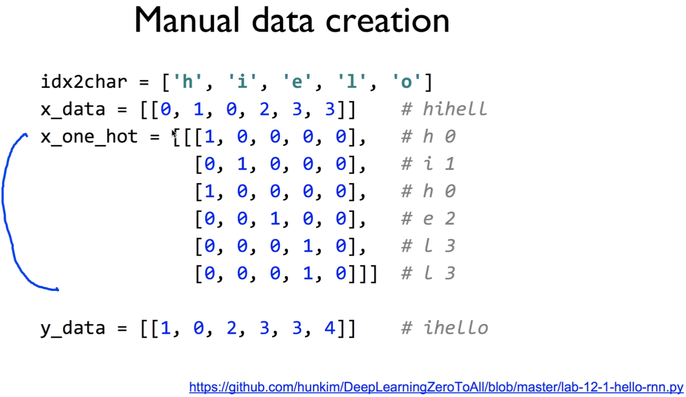
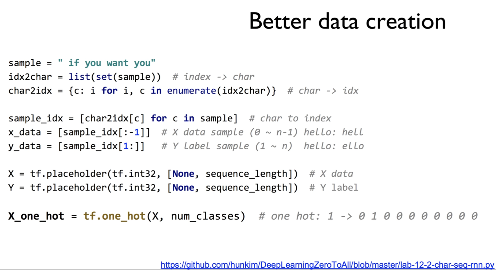
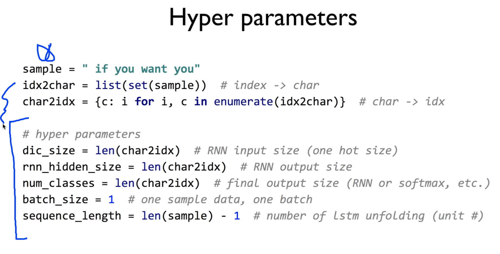
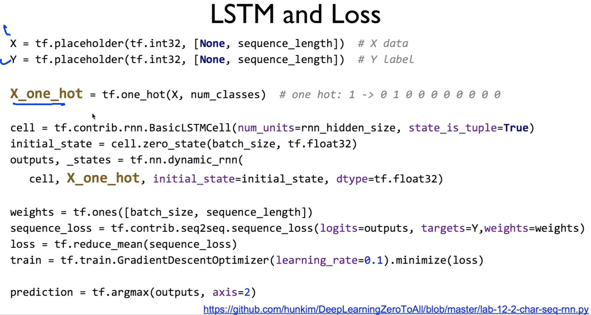
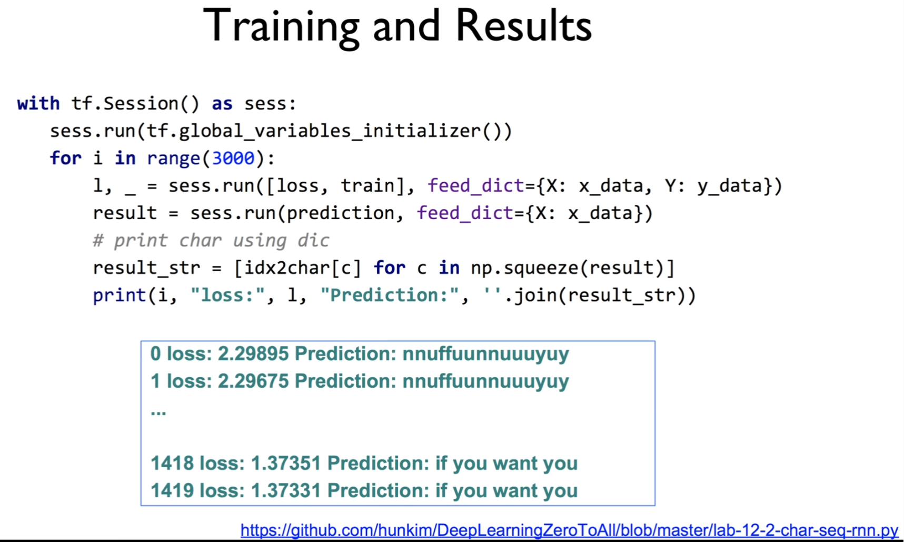
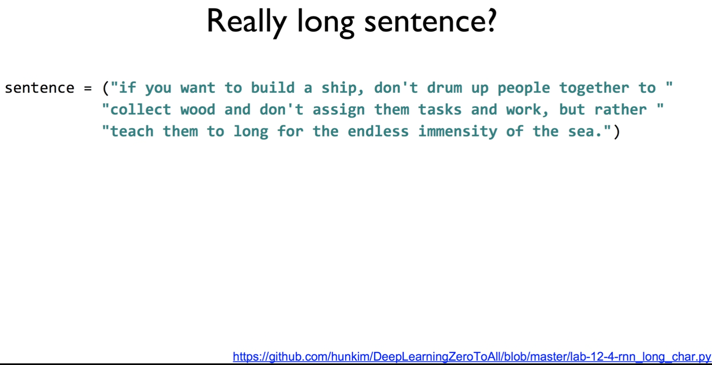
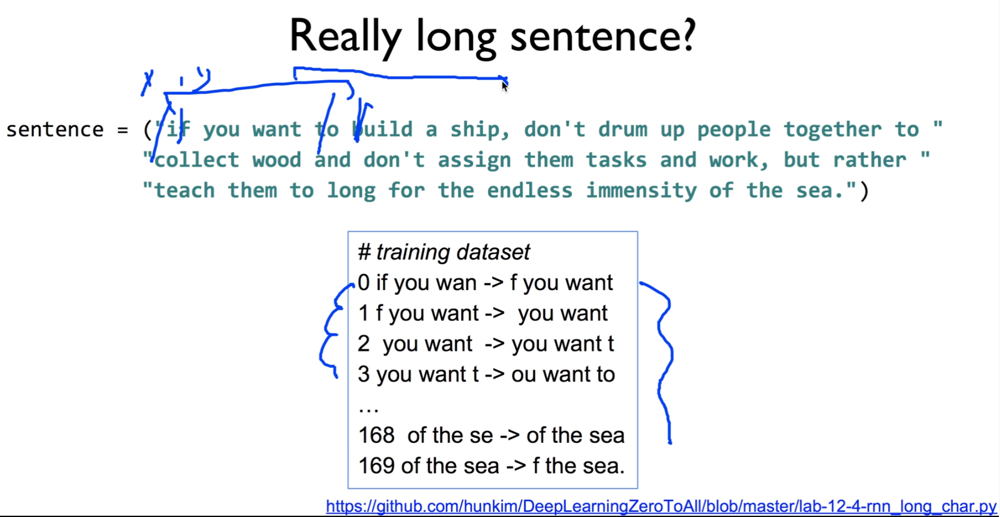
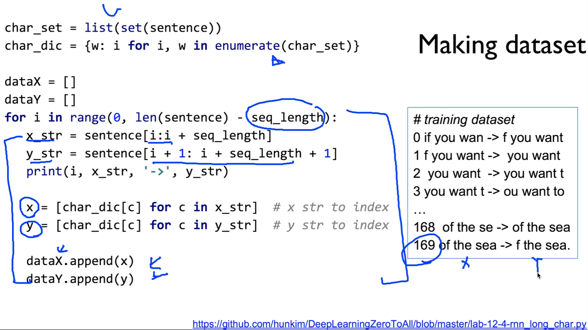
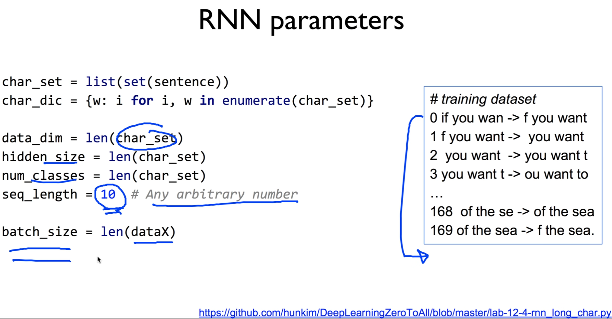
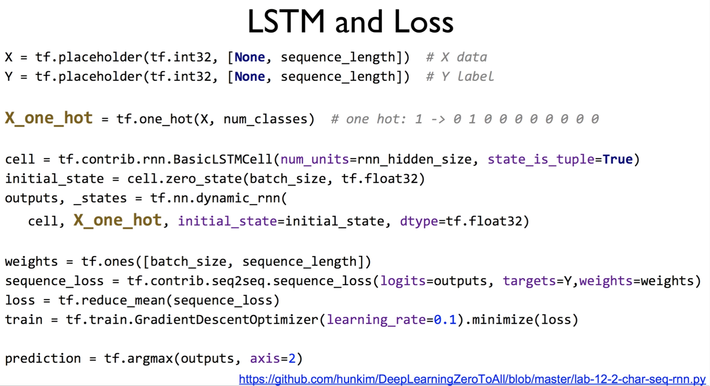

https://www.youtube.com/watch?v=2R6nfCNNz1U&list=PLlMkM4tgfjnLSOjrEJN31gZATbcj_MpUm&index=44


### Lab 12-3 RNN with long sequences

RNN은 하면 할 수록 굉장히 재밌다.

이번에는 굉장히 긴 long sequence를 가지고 공부해보도록 하겠다.


### Manual data creation

https://github.com/hunkim/DeepLearningZeroToAll/blob/master/lab-12-1-hello-rnn.py



```python
idx2char = ['h', 'i', 'e', 'l', 'o']
# Teach hello: hihell -> ihello
x_data = [[0, 1, 0, 2, 3, 3]]   # hihell
x_one_hot = [[[1, 0, 0, 0, 0],   # h 0
              [0, 1, 0, 0, 0],   # i 1
              [1, 0, 0, 0, 0],   # h 0
              [0, 0, 1, 0, 0],   # e 2
              [0, 0, 0, 1, 0],   # l 3
              [0, 0, 0, 1, 0]]]  # l 3

y_data = [[1, 0, 2, 3, 3, 4]]    # ihello
```

지난 번에 RNN을 사용할 때, One hot이란 데이터, 각각에 들어가는 문자열, 각각 문자에 대한 인덱스, 해당되는 번호 이런 것들을 다 손으로 만들었죠? manual하게 작업했는데, 

문자열이 길어진다거나, 책을 한 권 입력하면, 힘들다.


### Better data creation

그래서, 이렇게 하지 말고 자동으로 해보자. 프로그램으로, 파이썬으로 해보자.

https://github.com/hunkim/DeepLearningZeroToAll/blob/master/lab-12-2-char-seq-rnn.py



```python
sample = " if you want you"
idx2char = list(set(sample))  # index -> char
char2idx = {c: i for i, c in enumerate(idx2char)}  # char -> index

sample_idx = [char2idx[c] for c in sample]  # char to index
x_data = [sample_idx[:-1]]  # X data sample (0 ~ n-1) hello: hell
y_data = [sample_idx[1:]]   # Y label sample (1 ~ n) hello: ello

X = tf.placeholder(tf.int32, [None, sequence_length])  # X data
Y = tf.placeholder(tf.int32, [None, sequence_length])  # Y label

x_one_hot = tf.one_hot(X, num_classes)  # one hot: 1 -> 0 1 0 0 0 0 0 0 0 0
```

샘플 변수를 준다. 문자열을 string으로 하나 준다.

그러면, 여기서 필요한 데이터들을 다 뽑아내면 좋겠죠?

첫 번째로 필요한게, index to character, 각각의 character중에 unique한 걸 뽑아내고, 거기다가 인덱스를 준다.

그걸 가장 간단하게 set이란 명령으로 sample을 주면 unique한 문자열이 들어오죠? 그걸 list로 처리한다.


idx2char에서 반대로 char을 주면 index를 만들어주는 걸 만들 수 있겠죠?

idx2char 돌려서 각각에 해당하는 숫자와 해당되는 char를 만들어서 딕셔너리를 만들어주면 되겠죠?

이렇게 해서 자동으로 만들었다.


우리가 가지고 있는 sample data의 index는 뭘까요?

어떤 숫자로 만들고 싶다 -> sample_idx로 만든다.

sample에 있는 char를 한 자씩 가져와서, char2idx에서 우리가 만들어놨던 숫자로 바꿔주면 되겠죠?

이제 x data, y data를 만들어야 한다.

if you want you에서

x data는 `if you want yo`까지가 되겠고,

y datat는 한 글자씩 밀린 `f you want to`가 된다.

이렇게 해서 i일 때 f를 예측하고 이런 식으로 된다.


이걸 기계적으로 하는 방법이 x data -> [:-1]

y data -> [1:]

이렇게 x data와 y data를 가져왔다.

요걸 그대로 placeholder로 가져오면 된다. sequence length로 준다.


이전 RNN에서 보면 입력 one hot으로 줬죠?

one hot으로 어떻게 일일이 변환할 것인가?

일일이 할 필요 없이 tensorflow의 one hot이라는 아주 아름다운 함수를 그대로 사용하면 된다.

```python
tf.one_hot(X, num_classes)
```

우리가 X 값을 넘겨줄꺼구요, 이 함수를 줄 때는 몇 개의 one_hot으로 만들어줄까? 하는 num_classes

num_classes는 idx2char의 크기와 똑같다. 유일한 문자열의 개수.

one_hot으로 만들 때 한 가지 주의하실 게, dimension에 차이가 있다.

항상 one_hot으로 만들 때, 그 shape이 어떻게 변하는지 한 번 살펴보셔야 한다.


### Hyper parameters

그런 다음에, 이런 hyper parameters들도 우리가 자동으로 다 뽑아낼 수 있다.

sample만 바꾸면 나머지는 다 자동으로 바뀌도록 하는 게 목표다.



```python
sample = " if you want you"
idx2char = list(set(sample))  # index -> char
char2idx = {c: i for i, c in enumerate(idx2char)}  # char -> index

# hyper parameters
dic_size = len(char2idx)  # RNN input size (one hot size)
hidden_size = len(char2idx)  # RNN output size
num_classes = len(char2idx)  # final output size (RNN or softmax, etc.)
batch_size = 1  # one sample data, one batch
sequence_length = len(sample) - 1  # number of lstm rollings (unit #)
learning_rate = 0.1
```


dic_size는 뭘까요? char2idx의 길이.

이것이 어떻게 보면 입력의 데이터, 출력의 클래스 데이터가 되겠죠?

hidden size의 길이도 같게 되겠죠?

사실 num_classes까지 다 같은 값.


batch_size 하나로 할 꺼고요,

sequence length는 [처음부터 끝에서 하나] 뺀 게 되겠죠? 전체 길이 - 1

x data는 처음부터 맨 끝에서 하나 뺀 거, 

y data는 둘 째부터 맨 끝까지

요거 하나가 sequence죠?


그래서 모든 hyperparameter들도 우리가 자동으로 가지고 있는 데이터에서 쭉 만들어주면 좋겠죠?


### LSTM and Loss

이렇게 되면, 실행시키는 것은 이전과 똑같다.



```python
X = tf.placeholder(tf.int32, [None, sequence_length])  # X data
Y = tf.placeholder(tf.int32, [None, sequence_length])  # Y label

x_one_hot = tf.one_hot(X, num_classes)  # one hot: 1 -> 0 1 0 0 0 0 0 0 0 0

cell = tf.contrib.rnn.BasicLSTMCell(num_units=hidden_size, state_is_tuple=True)
initial_state = cell.zero_state(batch_size, tf.float32)
outputs, _states = tf.nn.dynamic_rnn(
    cell, x_one_hot, initial_state=initial_state, dtype=tf.float32)

weights = tf.ones([batch_size, sequence_length])
sequence_loss = tf.contrib.seq2seq.sequence_loss(
    logits=outputs, targets=Y, weights=weights)
loss = tf.reduce_mean(sequence_loss)
train = tf.train.AdamOptimizer(learning_rate=learning_rate).minimize(loss)

prediction = tf.argmax(outputs, axis=2)
```

X, Y 데이터 placeholder로 했고, one_hot 아래에서 받았다.

그 다음에 cell을 만든다.

cell을 만들 때에는 hidden size 준다고 했죠?

이 hidden size는 이전의 dictionary size와 같다고 했죠? one hot size와 같고,

initial_state 만들고, tensorflow로 dynamic RNN을 구동시킨다.

이 때 우리가 만들었던 cell을 넘겨주고, 우리가 만든 X_one_hot을 넘겨준다.

그런 다음에 weight은 모두 1로 만들고, 이제 이 sequence loss를 정해야겠죠?

마찬가지로, logits를 outputs 그대로 쓰는 건 문제가 있지만, 일단 간단하게 해보자.

우리가 원했던 타겟 y, weights는 다 1로 만들어져 있죠?

그 다음에 이걸 평균낸 loss,

AdamOptimizer를 써서 이 loss를 minimize시켜라 라고 하면, minimize 된다.

우리가 나온 출력에 대해서 prediction[이라고] 이렇게 할 수 있다.


### Training and Results

그러면, 이걸 학습을 어떻게 할 것인가?



```python
with tf.Session() as sess:
    sess.run(tf.global_variables_initializer())
    for i in range(50):
        l, _ = sess.run([loss, train], feed_dict={X: x_data, Y: y_data})
        result = sess.run(prediction, feed_dict={X: x_data})

        # print char using dic
        result_str = [idx2char[c] for c in np.squeeze(result)]

        print(i, "loss:", l, "Prediction:", ''.join(result_str))
```


마찬가지로, x_data와 y_data의 학습은 어떻게 할 것인가?

x_data, y_data를 넘겨주면서 train을 실행시키고, 그 때마다 loss를 한 번 보고, 

그 때마다 prediction을 보면서 마찬가지로 [result_str] 결과값 출력해보면 되겠죠?


돌려보시면, 문자열이 조금 길어져서 그런지, 천 번 이렇게 하면 잘 안 될 겁니다.

3000번 이렇게 돌려보면 되는데, 전반적으로 loss가 떨어진다.

많이 떨어지진 않는다.

운이 좋으면 `if you want you`라고 맞춘 문자열을 볼 것이다.

처음엔 아무 말이나 나온다.

학습이 조금 이루어지긴 할꺼다.


이전 부분과 똑같고, 데이터를 입력하는 부분을 자동화시켰다.

어떤 문자열이라도, 우리가 입력을 처리할 수 있도록 만들었다.


### Really long sentence?

한 단계 더 들어가볼까요?



굉장히 긴 문자열을 우리가 이 RNN에게 학습시켜 보도록 하겠다.

교수님이 굉장히 좋아하는 문장.

배를 만들고 싶으면, 사람들을 굴리고 할 게 아니라, 바다에 때한 끝없는 갈망을 하게 하라 이런 내용

어린 왕자에 나오는 문자열

이것을 RNN에게 학습시켜 보자.





여기서 training data set을 뽑아내야 한다.

한 번에 다 하기는 좀 그렇다..

좀 잘라서 여러 개의 배치, 여러 개의 training data set을 낼 것이다.

if you want까지 주면, 그 다음 문자열을 만들어내고 하는 식으로 데이터 셋을 만들어내는 것도 자동으로 해보겠다.


### Making dataset

https://github.com/hunkim/DeepLearningZeroToAll/blob/master/lab-12-4-rnn_long_char.py



```python
dataX = []
dataY = []
for i in range(0, len(sentence) - sequence_length):
    x_str = sentence[i:i + sequence_length]
    y_str = sentence[i + 1: i + sequence_length + 1]
    print(i, x_str, '->', y_str)

    x = [char_dic[c] for c in x_str]  # x str to index
    y = [char_dic[c] for c in y_str]  # y str to index

    dataX.append(x)
    dataY.append(y)
```


이전과 똑같다.


우선, char_set같은 건 자동으로 가져오고,

여기서 이제 우리가 일정한 sequence 크기를 준다.

sequence length를 주고 loop를 돌면서, 이만큼 [문자열을] 자른다.

window를 옮겨가면서 정해진 sequence만큼 자른다.

sequence length 여러분들이 원하는대로 정해주고, sequence만큼 window를 움직이면서 x_str, y_str을 뽑아낸다. slicing을 이용해서.

뽑아낸 것을 x, y라는 index 값으로 만든다.

index로 만든 다음에, 그것을 우리가 갖고 있는 data set [dataX, dataY]에 추가한다.

우리가 갖고 있는 array에 쭉쭉 쌓는 것이죠?

파이썬 코드 복잡해보이지만, 천천히 뜯어보시면 일반적인 python code에, data를 array해서 쓴다.

전체 데이터 셋에 169개의 array가 생긴다.

앞에 것이 X, 뒤에 것이 Y가 되겠죠?


### RNN parameters

그런 다음에, RNN의 parameter 역시 자동으로 만들어낼 수 있겠죠?



```python
char_set = list(set(sentence))
char_dic = {w: i for i, w in enumerate(char_set)}

data_dim = len(char_set)
hidden_size = len(char_set)
num_classes = len(char_set)
sequence_length = 10  # Any arbitrary number

batch_size = len(dataX)
```


data dimension은 char_set 길이,

hidden size 마찬가지, num of classes 마찬가지

seq length는 우리가 임의로 10개로 정해줄 수도 있고, 여러분들이 원한다면 20개, 50개로 정해주셔도 됩니다.


이렇게 하고 난 다음에, batch size라는 개념이 들어간다.

이전에는 우리 데이터가 한 줄밖에 없었으니 batch size 항상 1이였다.

이런 경우 데이터가 많다 -> batch size 중간에 잘라도 되지만, 우리는 과감하게 전부 다 넣어보도록 한다.

우리가 가지고 있는 전체 데이터의 길이, 여기서는 169가 된다.

그렇게 batch size를 정해준다.


### LSTM and Loss

이거가 정해졌다면, 나머지는 굉장히 기계적으로 할 수 있겠죠?



```python
X = tf.placeholder(tf.int32, [None, sequence_length])  # X data
Y = tf.placeholder(tf.int32, [None, sequence_length])  # Y label

x_one_hot = tf.one_hot(X, num_classes)  # one hot: 1 -> 0 1 0 0 0 0 0 0 0 0

cell = tf.contrib.rnn.BasicLSTMCell(num_units=hidden_size, state_is_tuple=True)
initial_state = cell.zero_state(batch_size, tf.float32)
outputs, _states = tf.nn.dynamic_rnn(
    cell, x_one_hot, initial_state=initial_state, dtype=tf.float32)

weights = tf.ones([batch_size, sequence_length])
sequence_loss = tf.contrib.seq2seq.sequence_loss(
    logits=outputs, targets=Y, weights=weights)
loss = tf.reduce_mean(sequence_loss)
train = tf.train.AdamOptimizer(learning_rate=learning_rate).minimize(loss)

prediction = tf.argmax(outputs, axis=2)
```


X, Y sequence length 주고, None은 batch size가 되겠죠? 우리가 원하는 batch size

아무거나 batch size 하고, one hot 만들고, 나머지 과정은 똑같다.

실행을 시켜보면 되는데, 


### Exercise

- Run long sequence RNN
- Why it does not work?


실행을 시켜보는 건 Exercise로 두도록 하겠다.

해보시면, 잘 안 됩니다.

왜 잘 안 되는지 생각해보는 게 Exercise

힌트를 하나 드리면, logits가 좀 그랬고, 우리 RNN이 깊지 않다.

고런 부분 다음 시간에 얘기해보도록 하겠다.

