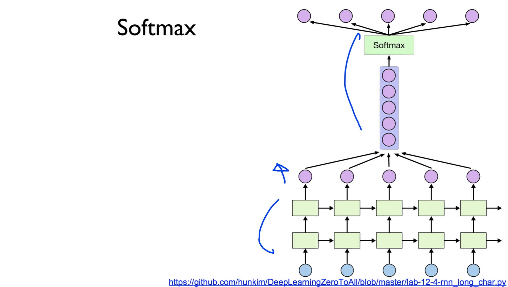
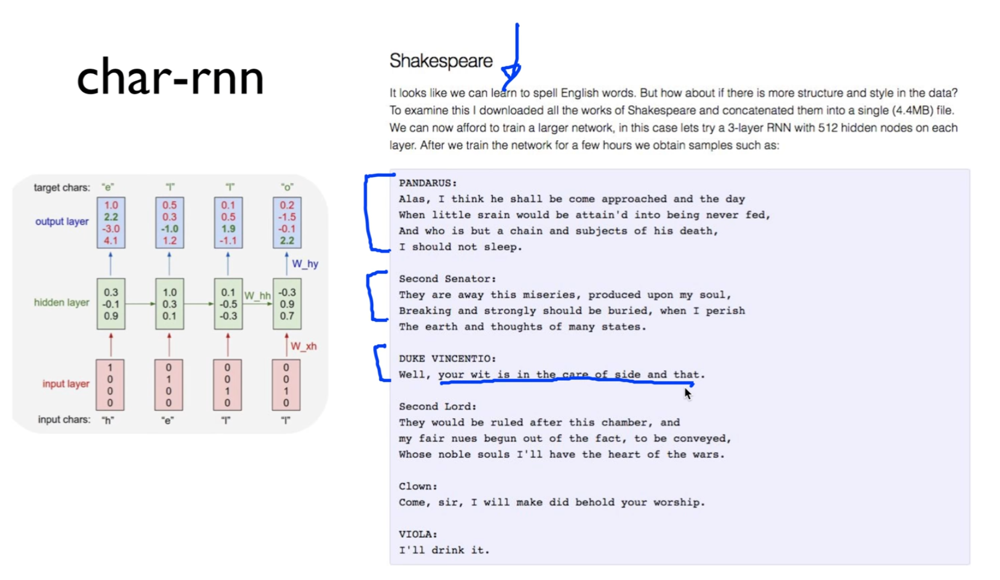

https://www.youtube.com/watch?v=vwjt1ZE5-K4&list=PLlMkM4tgfjnLSOjrEJN31gZATbcj_MpUm&index=45


### Lab 12-4 RNN with long sequences: Stacked RNN + Softmax layer

이번 실습 시간에는 RNN sequence의 완성이라고 할 수 있다. 여러 층의 RNN, Softmax Layer를 추가해보도록 하겠다.


### Really long sentence?

https://github.com/hunkim/DeepLearningZeroToAll/blob/master/lab-12-4-rnn_long_char.py


지난 번에 이렇게 굉장히 긴 문장을 시도해봤죠? 배치도 여러 개면서..


조금 RNN으로 봐서 복잡한 형태를 해봤는데, 잘 안 된다.


### Making dataset

잘 안됐는데, 이런 식으로 dataset도 만들고, 자동화해서


### RNN parameters

파라미터도 자동으로 읽어와서 실험을 시켜봤는데 잘 안 됐다.


### Wide & Deep

그 이유중에 하나가, 굉장히 복잡하고 많은 데이터를 다루기엔 우리 RNN cell이 너무 얕다.


기본적으로 Deep Learning의 핵심적인 아이디어는 Wide하고 **Deep**하게 가야 한다.

우리 RNN 하나밖에 없었죠? 한 층밖에 없었다.


### stacked RNN

이걸 좀 쌓을 수 없을까? 하는 것이 첫 번째 우리 솔루션.


stacked RNN. 우리가 2층으로 쌓고 싶다. 또는 3층, 원한다면 100층으로 쌓을 수도 있다,

쌓고 싶다. 어떻게 하면 좋을까요? 굉장히 간단하다.


다른 건 건들 필요 없고, cell을 만들 때 하나의 셀을 만든다. 한 층을.

그런데, 이 RNN의 tensorflow function 중에는 MultiRNNCell이라는 아주 아름다운 함수가 있다.

왜 아름답냐면, 위에 우리가 cell을 하나 만들어놓고, 

cell을 만들 때 가장 중요한 것은, 출력을 얼마로 할꺼냐 라는 요 hidden_size를 정하는거죠? hidden size를 정하는 것만 해놓고,

그런 다음에, 내가 MultiRNNCell에다가 [cell] * 몇 개 쌓을 것인가를 주면 된다.

너무 아름다운데, 곱하기를 바로 해버리면, 쌓고 싶은 만큼 곱하면 된다.

나머지 부분은 똑같다.

cell을 그대로 dynamic_rnn에 넘겨주면, 모든 것은 자연스럽게 이뤄진다.

약간 층을 쌓아서, 깊게 한 번 가볼수가 있다.


### Softmax (FC) in Deep CNN

두 번째. 여러분 기억 나시나요?


CNN 할 때,  CNN을 쭉 써놓고, 갑자기 뒤에서 Fully Connected layer를 썼다.

이렇게 하는 이유: 이거 쓰면 잘 되니까.


### Softmax

마찬가지로, 우리도 RNN에서 나온 값을 그대로 사용하지 말고, 뒤에 Softmax같은 거 하나 붙여주자.



Fully Connected Network 있겠죠?

하나 붙여주자 라는 것을 생각해볼 수 있다.

Softmax 붙여주는 방법은 여러 가지가 있겠다.

RNN 각각에 맞게 입력을 만들어서, Softmax를 붙여도 좋다.

그 대신 memory나 weight 많이 쓰겠죠?

사실 여러분들이 RNN을 보면, 이렇게 쭉 펼쳐져있지만(이미지 하단 초록 사각형), 하나예요.

하난데 이게 Unroll이 되는거죠?

그러니까, 굳이 sequence가 100개라고 해서, 100개에 맞게 Softmax를 만들어줄 필요는 없고, [한 줄]이게 Unroll된 거기 때문에 한 개로 만들어주면 된다.

그 이야기는, 이렇게 [한 줄에서] 나온 데이터를 마치 쭉 쌓아서 넣어주고, 이걸 Softmax로 넣은 다음에, 나온 결과를 또 쭉 펼쳐만 주면 된다.

요 과정 조금 복잡하게 느껴질 수 있다.

요거는 그냥 여러분들이 RNN으로 sequence 쓰듯이 이렇게 한다 정도로만 이해해주시면 된다.


https://github.com/hunkim/DeepLearningZeroToAll/blob/master/lab-12-4-rnn_long_char.py


그러려면, 이렇게 나와있는 데이터를 softmax에 들어갈 수 있도록 shape을 한 번 해주는 거겠죠?

내가 softmax를 디자인하는 입장에서, 이렇게[일렬로] 들어오는 입력을 이렇게[여러 개로] 보내고, 한 번 더 reshape을 해준다 해서 softmax에 맞는 weight을 디자인만 해주면 된다.


우리가 두 번의 reshape을 할텐데, 그냥 기계적으로 항상 이렇게 한다 라고 여러분들이 기억하시면 좋다.

```python
outputs = tf.reshape(outputs, [batch_size, seq_length, num_classes])
X_for_softmax = tf.reshape(outputs, [-1, hidden_size])
```

[X_for_softmax]

X를 softmax에 맞게.. 입력이 뭐냐? RNN에서 나온 outputs

이것을 어떻게 reshape할 것인가?

hidden size가 뭘까요? -> 입력값, 입력의 dimension.

이 hidden size에 맞게, 나머지는 알아서 쌓아 라고 reshape 해주면, 이게 바로 보라색 사각형처럼 reshape 된다.


그 다음에 Softmax는 그대로 출력을 할 것이다.

그러면, 다시 이 outputs처럼 펼쳐 라는 것은, 이 Softmax에서 나온 outputs을 어떻게 펼칠 것인가?


number of classes, 그리고 sequence length, batch size로 펼치면 된다.

이렇게 하면 데이터가 섞이지 않을까요? -> 잘 생각해보시면, 섞이지 않고 잘 펼쳐집니다.


첫 번째 펼치는 과정은 1로, 두 번째 과정은 2로 reshape할 수 있다.


코드를 한 번 보도록 할까요?


```python
X_for_softmax = tf.reshape(outputs, [-1, hidden_size])

softmax_w = tf.get_variable("softmax_w", [hidden_size, num_classes])
softmax_b = tf.get_variable("softmax_b", [num_classes])
outputs = tf.matmul(X_for_softmax, softmax_w) + softmax_b

outputs = tf.reshape(outputs, [batch_size, sequence_length, num_classes])
```

실제로 코드를 보게 되면, 앞의 RNN에서 나오는 output을 넣어서 reshape 한다.

그럼 이제, softmax를 위한 입력이 생겼다.

그러면, 여기서 이제 우리가 weight과 bias를 정해주겠죠?

weight과 bias를 정해줄 때, size를 정해줘야 되겠죠?


```python
softmax_w = tf.get_variable("softmax_w", [hidden_size, num_classes])
```

hidden_size 이거는 입력 사이즈, num_classes 이건 출력 사이즈.

이 경우엔 같다.

그러나, 입력은 hidden size, 즉 RNN에서 바로 나오는 크기, output은 우리가 예측하고자 하는 것의 one hot의 size가 되겠죠? 그래서 number of classes가 되고,

bias 값은 output과 같은 number of classes..


그래서 이것을, 우리가 softmax 곱하기를 한다.(tf.matmul)

```python
outputs = tf.matmul(X_for_softmax, softmax_w) + softmax_b
```

outputs 이것이 이제 softmax output이 되겠구요, 


```python
outputs = tf.reshape(outputs, [batch_size, sequence_length, num_classes])
```

이것을 여기에 넣고, 한 번 더 펼쳐주는 과정을 거칩니다. [2]

펼쳐지는 과정을 거쳐서, 

이 outputs는 이 RNN의 output과 같은 shape을 갖고 있죠? 같도록 만들어준다. 


### Loss

그런 다음에, 이 output을 어떻게 하면 될까요?


```python
# reshape out for sequence_loss
outputs = tf.reshape(outputs, [batch_size, sequence_length, num_classes])

# All weights are 1 (equal weights)
weights = tf.ones([batch_size, sequence_length])

sequence_loss = tf.contrib.seq2seq.sequence_loss(
    logits=outputs, targets=Y, weights=weights)
mean_loss = tf.reduce_mean(sequence_loss)
train_op = tf.train.AdamOptimizer(learning_rate=learning_rate).minimize(mean_loss)
```

이 outputs을 이제, 우리가 원하는 sequence loss에 넣어주면 된다.

outputs을 생각해보시면, 이전에 보면, 이 outputs는 activation function을 거치지 않았죠?

`outputs = tf.matmul(X_for_softmax, softmax_w) + softmax_b`

그냥 곱하기만 한 거다. [matmul]

그래서, 사실 이 outpus을 logits에다가 넣는 것이 맞는 것이다.


이전엔, 있는 값을 그대로 넣었죠?

이 값은 사실 Activation function이 들어있다.

여기 있는 것을 logits로 그대로 쓰면, 사실 틀린 거였다.

그래서 softmax layer을 하나 깔고, 이 softmax layer에서 나오는 마지막 값은 activation을 거치지 않은 logits을 입력으로 넣는다.

`sequence_loss = tf.contrib.seq2seq.sequence_loss(
    logits=outputs, targets=Y, weights=weights)`

이 점을 주의하셔야 좋은 성능을 얻을 수 있다.

나머지는 다 똑같다.

target Y 그대로 주고, weights은 모두 1로 주었다.

그 다음에 loss 계산하고, optimizer 돌리게 된다.


### Training and print results

Training하는 과정 이전과 똑같다.


```python
sess = tf.Session()
sess.run(tf.global_variables_initializer())

for i in range(500):
    _, l, results = sess.run(
        [train_op, mean_loss, outputs], feed_dict={X: dataX, Y: dataY})
    for j, result in enumerate(results):
        index = np.argmax(result, axis=1)
        print(i, j, ''.join([char_set[t] for t in index]), l)
```


여기서 training 할 때, dataX, dataY 그대로 두고,

train_op, mean_loss, outputs 이런거 같이 보도록 하죠.

그래서 이 outputs이 나오면, 요것을 요렇게 화면에 출력한다.

outputs에 나오는 글자들 그대로 한 번 출력을 해본다.

이 results는 굉장히 batch가 들어가 있기 때문에, 굉장히 많이 나온다.

각각 배치의 출력을 이런 식으로 출력해본다.

실행을 쭉 해보면, 처음에는 아무 말이나 나오고 loss도 굉장히 크다.

시간이 지날수록 loss가 굉장히 작은 값으로 나오면서, 마지막엔 굉장히 우리가 원하는 값으로 출력이 일어난다.


```python
# Let's print the last char of each result to check it works
results = sess.run(outputs, feed_dict={X: dataX})
for j, result in enumerate(results):
    index = np.argmax(result, axis=1)
    if j is 0:  # print all for the first result to make a sentence
        print(''.join([char_set[t] for t in index]), end='')
    else:
        print(char_set[index[-1]], end='')
```

한 단계 더 들어가서, 모든 학습이 다 끝나고 나면, 각각 배치에 있는 출력을 다 모아서 한 번 뿌려보도록 하자.


아래처럼 원래 문장과 같이, 우리가 원래 예상했던 것과 거의 같게 그 다음 문자를 예측할 수 있다.

for문으로 result를 다 모은 거다.

출력을 해보면, 우리가 원하는대로 아주 잘, 굉장히 긴 문장도 잘 학습을 했다. 라는 것을 알 수 있다.


### char-rnn

우리가 방금 보여드렸던 그런 형태의 source code면, Shakespeare같은 것을 학습할 수 있다.



밑에 읽어보시면, 굉장히 멋진 표현이 있다.

Shakespeare가 쓴 것 같은데, 그게 아니라 우리가 만들어놓은 이 RNN으로 학습을 한 다음에 만들어낸 것이다.


더 깜짝 놀라는 것은, 여러분들이 그냥 영어 문자뿐만 아니라, 이런 소스 코드를 학습 데이터로 입력을 많이 시키게 되면, 그러고 나서 RNN으로 만들어봐 하면 소스코드를 만들어낸다.

심지어는, 마치 사람이 쓴 것처럼 주석도 단다.

말은 좀 안되지만 변수도 선언하고, if문도 선언하고, indentation도 잘 맞게 했다.

이것이 우리가 쓴 게 아니라, RNN을 통해서 직접 생성한 것이다. 굉장히 놀랍죠?


간단하게 만들어본 RNN이지만, 굉장히 재밌게 우리가 쓸 수 있다.


### char/word rnn (char/word level n to n model)


좀 더 자세하게는, 이런 사이트를 통해서, 좀 더 복잡하게 구현된 char rnn이나,

제가 지금 만들고 있는 word rnn같은 데 가서, 소스 코드를 돌려보면서 굉장히 멋진 형태의, 여러분들이 원하는 것을 만들어낼 수 있게 된다.