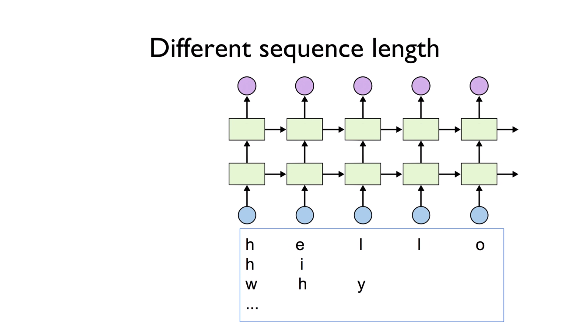
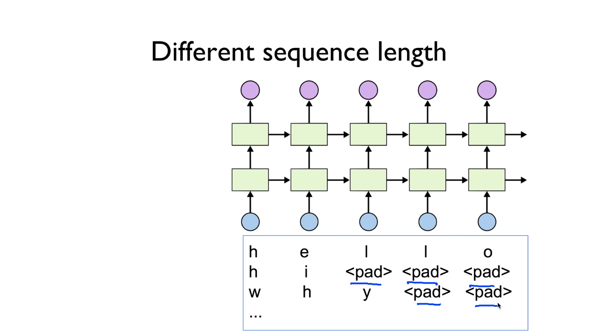
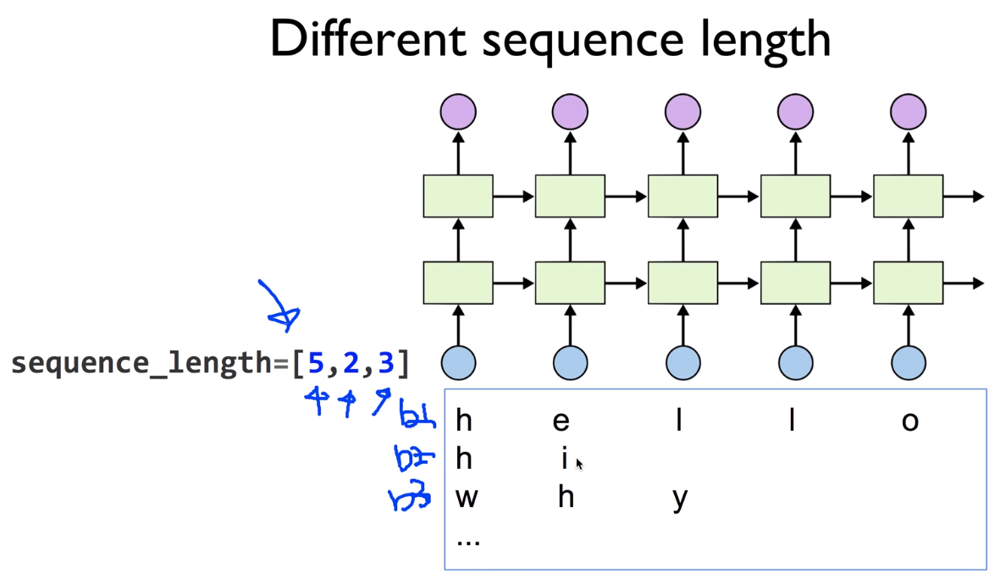
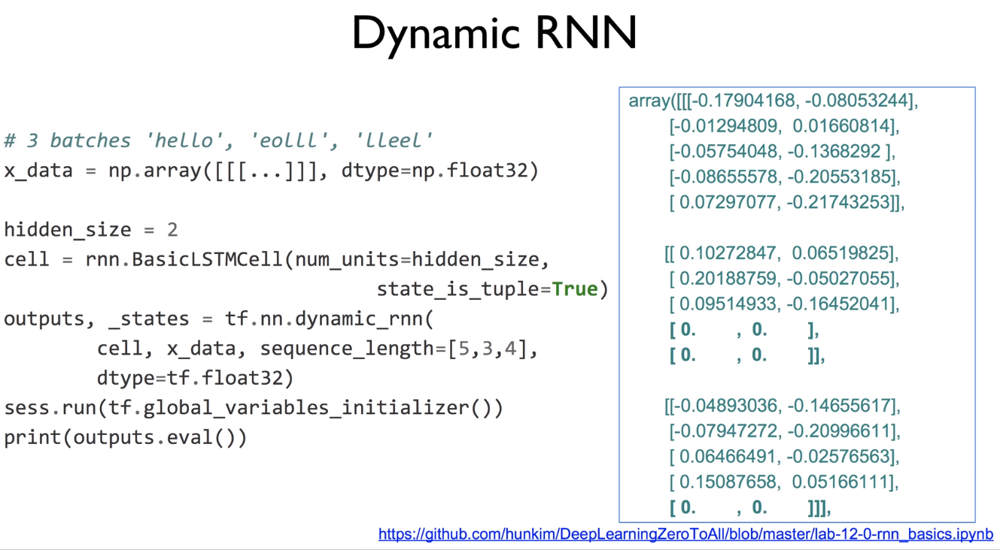

https://www.youtube.com/watch?v=aArdoSpdMEc&list=PLlMkM4tgfjnLSOjrEJN31gZATbcj_MpUm&index=46


### Lab 12-5 Dynamic RNN

이번 실습 시간에는 tensorflow의 새로운 기능 중 하나인 Dynamic RNN에 대해서 얘기해보도록 하겠다.


### Different sequence length



RNN의 가장 강점 - sequence data를 처리할 수 있다.

이전 예시에서 sequence는 정해져 있었다.

실전에서 RNN sequence를 데이터로 받다보면, 정해지지 않을 때가 있다.

예를 들어 번역 - 원하는 문자를 주면 번역해주겠다.

어떤 사람은 문자를 5개만 주고 번역해달라고 할 수 있고,

어떤 사람은 문자를 20개, 500개 주겠죠?

이렇게 가변한다.


우리가 편하게 하기 위해서 "야 항상 번역할 때는 문자열을 꼭 20개로 만들어줘야 번역할꺼야"

아니면 저는 번역할 수가 없어요 -> 이렇게 하면 사용자들이 굉장히 불편하다.

그래서, RNN은 기본적으로 가변하는 sequence를 입력으로 받아들여야 한다.

어떻게 할 수 있을까요?

예를 들어 지금 이런 경우에, hello라는 5개를 주고,

어떤 경우는 hi, 어떤 경우는 why 이렇게 다른 값의, 다른 길이의 문자를 준다.

어떻게 처리할까요?




기존의 방법엔, 우리가 어떤 padding이라는 특별한 기호를 삽입한다.

우리가 희망하기는, 출력 값이 padding이 있으면, 알아서 없는 것으로 출력해주기를 원하는 마음으로 padding을 넣었다.


사실 이렇게 넣는다고 해도, weight들이 들어있기 때문에 어떤 값이 나온다.

값이 나오기 때문에, 이 나온 값은 어떻게 보면 loss 함수를 계산할 때, loss를 조금 헷갈리게 할 수가 있다.

그래서 그 결과가 좋지 않을 수가 있다.


그래서 새로운 tensorflow에서는 어떻게 이 문제를 해결했나?



문자를 줄 때, 각각 batch에 문자열, 또는 sequence의 길이를 좀 알려줄래? 라고 해서,

sequence length로 array를 정의하게 한다.

이건 5개고, 이건 2개고, 이건 3개다 라고 얘기해준다.

그러면 어떤 결과가 있냐? sequence에 맞게만 값을 출력하고, 나머지는 다 0으로, 출력값에서 0으로 만들어버려서, 이 loss가 헷갈리지 않도록 도와준다.


### Dynamic RNN

한 번 볼까요?

https://github.com/hunkim/DeepLearningZeroToAll/blob/master/lab-12-0-rnn_basics.ipynb



```python
# 3 batches 'hello', 'eolll', 'lleel'
x_data = np.array([[h, e, l, l, o],
                   [e, o, l, l, l],
                   [l, l, e, e, l]], dtype=np.float32)

hidden_size = 2
cell = tf.nn.rnn_cell.LSTMCell(num_units=hidden_size, state_is_tuple=True)

outputs, _states = tf.nn.dynamic_rnn(
    cell, x_data, sequence_length=[5, 3, 4], dtype=tf.float32)
sess.run(tf.global_variables_initializer())
print(outputs.eval())
```

이전과 똑같구요, 어떤 x_data가 있다고 가정합시다.


hidden size는 2로 둘 거예요. 출력은 2가 된다.

LSTMCell을 만들고,

dynamic_rnn을 구동시킵니다. 이전과 똑같은 방법이죠?


cell을 주고, x_data를 준다.

단 하나 다른 점은,  sequence length를 임의로 5, 3, 4 이렇게 준다.


출력이 어떻게 나오는지 한 번 볼까요?

출력을 만들어내는 방법: 마찬가지로 session을 실행시키고, 

출력을 outputs.eval()로 evaluation 시킨다.

그러면 출력이 나온다.


사진 오른쪽이 output

보시면, 재밌는 것은 내가 sequence를 다 5개로 줬을 때는, 다섯개 모두 어떤 값을 가집니다. [맨 위]

이 weight에 의해 곱해진 값이겠죠?


그런데, sequence를 3으로 주면, 앞의 3개만 값을 내고, 나머지는 그냥 0으로 출력을 만들어버린다.


4로 주면 어떻게 될까요? 마찬가지로 앞의 4개는 값을 주고, 한 개를 0으로 만들어버린다.


그래서, 확실하게 내가 없는 데이터의 값은 0으로 만들어져서, 둘이 loss가 굉장히 잘 동작되도록 만들어준다.

이것이 바로 이 Dynamic RNN의 장점.

굉장히 간단하게, 여러분들이 sequence length를 주기만 하면 됩니다.


### Lab 12-6 RNN with time series data (stock)

여기까지 우리가 RNN의 기본적인 sequence data를 가지고, 문자열 같은 것을 처리하는 것을 해봤다.

마지막 RNN 수업으로 time series data, 특히 stock market에 있는 것을 예측할 때 어떻게 할 수 있는지 살펴보도록 하겠습니다.

