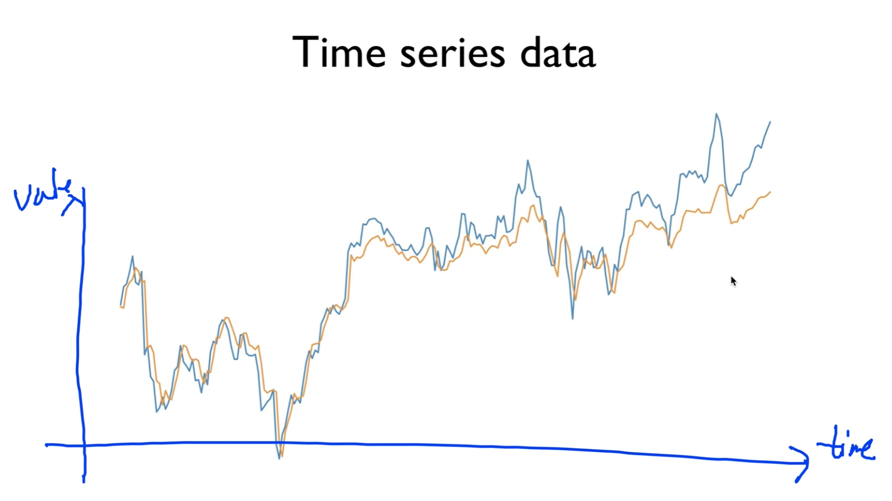
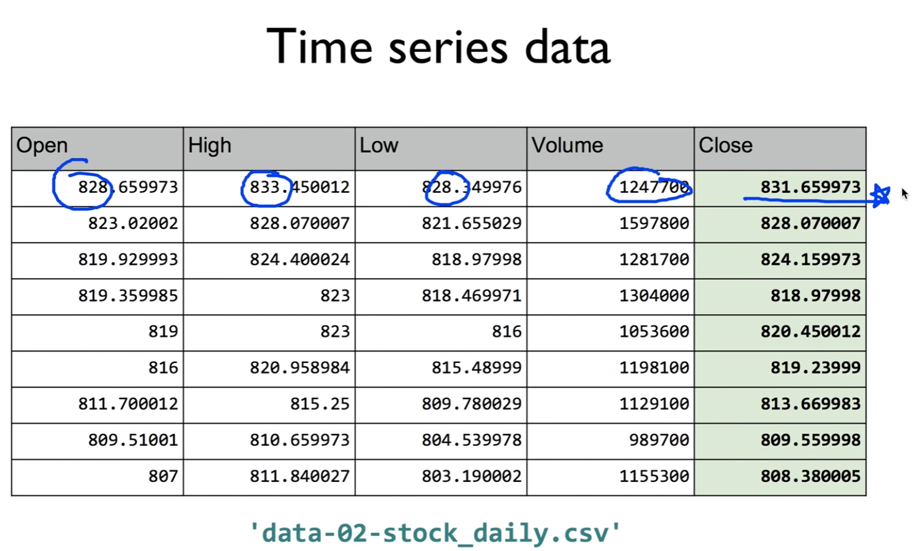
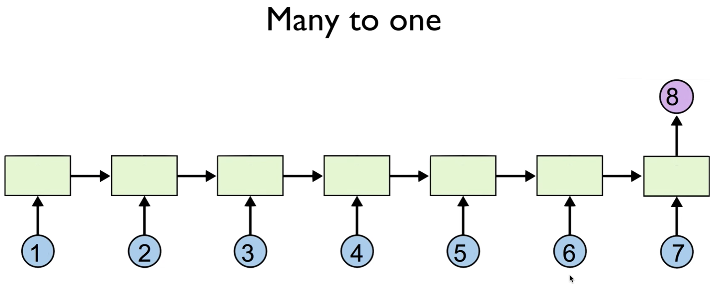
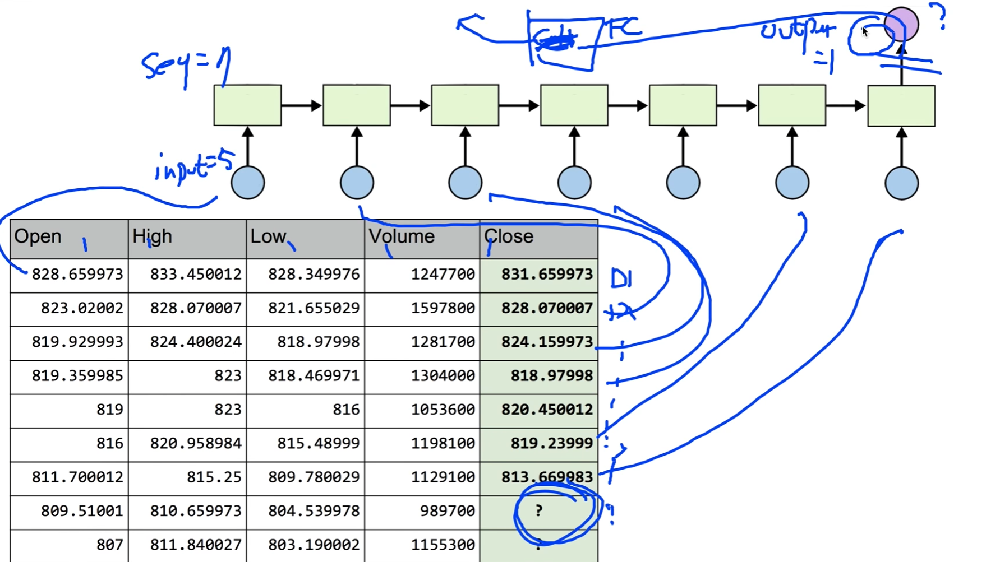
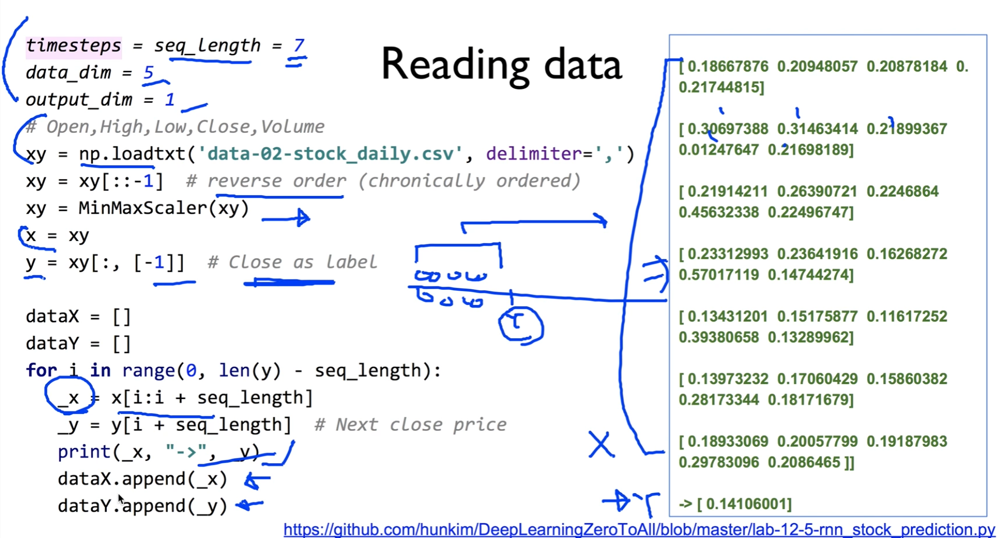
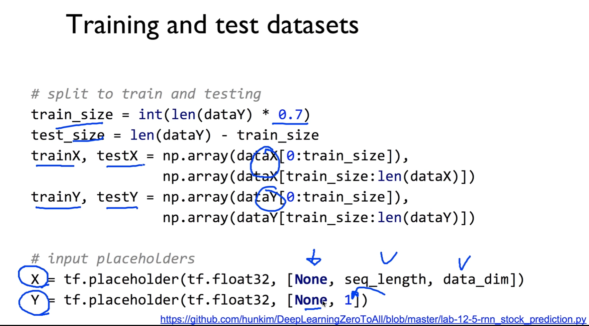
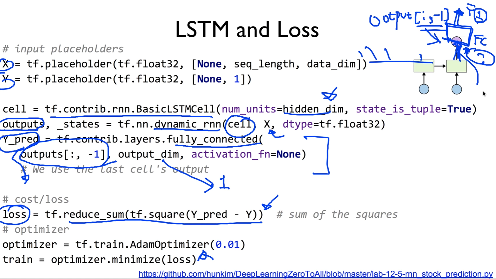
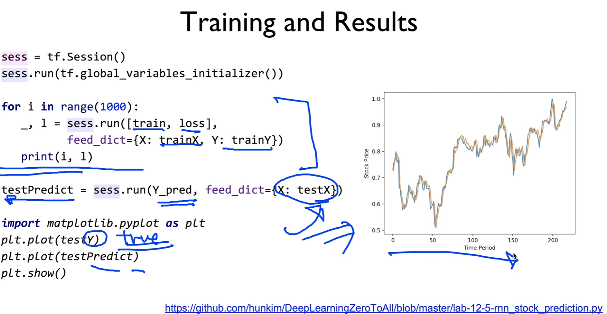

https://www.youtube.com/watch?v=odMGK7pwTqY&list=PLlMkM4tgfjnLSOjrEJN31gZATbcj_MpUm&index=47


### Lab 12-6 RNN with time series data (Stock)

이번 시간에는 RNN을 이용해서 stock market같은 time series data를 예측하는 방법에 대해 얘기하고 구현해보도록 하겠다.


### Time series data

Time series data라는 것은 뭘까요?

시간에 따라 값이 변한다 그런 얘기가 되겠죠?



time, value 축

시간이 지나면서 값이 변하는 data를 예측해보자.




한 예로 여러분들이 잘 알고 계시는 주식 시장의 가격

시가, 최고가, 최저가, 거래량, 종가

날마다 이어지니까 time series라고 할 수 있다.


### Many to one

이걸 갖고 예측을 하고 싶다.



RNN을 갖고 예측하고 싶다.

위와 같은 형태가 되겠죠? Many to one

왜냐하면, 우리가 가지고 있는 데이터가 7일 정도라고 칩시다.

7일 정도의 데이터를 쭉 넣고, 8일째 되는게 궁금한거죠? 내일의 가격은 어떻게 될까 예측

이런걸 Many to one이라고 할 수 있겠죠?

이런 형태의 예측은, 우리가 [7일]앞에 것이 하나도 없다고 가정하면, 7일, 하루 데이터를 가지고 예측하는 것보다, 이전의 데이터들을 다 연결해서 이전에 있는 것들이 어떤 영향을 미친다. 라는 것이 기본적인 time serires의 가설이다.

[앞에 있는] 이런 것들을 다 이용하자는 것이 Many to one의 아이디어




그러면 구체적으로 우리가 갖고 있는 데이터를 어떻게 넣을까요?

우리가 갖고 있는 데이터가 이런거죠?

우리가 알고싶은 데이터가 ?다

? 위에 것들이 이전 데이터가 되겠죠?

이 데이터들을 위에 하나씩 넣어준다.

이렇게 한 다음에, 우리가 알고 싶은 ? 값을 예측해봐라 라고 하는 것

물론 학습할 때는 실제 데이터를 가지고 전체 네트워크를 학습 하게 되겠죠?

이런 형태의 모델로 값을 입력하게 된다.

우리가 생각해 볼 것이 있다.

입력의 dimension은 얼마일까요? sequence의 길이는 얼마일까요? 출력의 hidden size는 얼마일까요?

이런 걸 우리가 계산해야 되겠죠?

대충 한 번 보자..

입력 dimension 5개 값을 갖고 있기 때문에[Open, High, Low, Volume, Close], input dimension은 대략 5가 되겠죠?

sequence의 길이는 얼마일까요? sequence = 7이 될 겁니다.

output dimension은 우리가 ? 하나만 필요하겠죠? output dimension = 1 이렇게 줄 수 있다.

물론 output 뒤에 연결해서 뽑을 수 있겠죠? softmax 같은거..

softmax 보단 fully connected layer 연결해서 할 수 있겠죠?

이런 데는 우리가 output 원하는대로 줄 수 있겠다.


### Reading data

이제 한 번 정리를 해볼까요?

https://github.com/hunkim/DeepLearningZeroToAll/blob/master/lab-12-5-rnn_stock_prediction.py



```python
timestemps = seq_length = 7
data_dim = 5
output_dim = 1


# Open, High, Low, Volume, Close
xy = np.loadtxt('data-02-stock_daily.csv', delimiter=',')
xy = xy[::-1]  # reverse order (chronically ordered)
xy = MinMaxScaler(xy)
x = xy
y = xy[:, [-1]] # Close as label

dataX = []
dataY = []
for i in range(0, len(y) - seq_length):
    _x = time_series[i:i + seq_length]
    _y = time_series[i + seq_length]  # Next close price
    print(_x, "->", _y)
    dataX.append(_x)
    dataY.append(_y)
```


seq_length는 7이 될꺼고, data size, dimension은 5, output은 1이 될꺼다.

그런 다음에 데이터를 읽어오고[np.loadtxt], 그 다음에 이것을 시간 순으로 만들기 위해서 xy를 거꾸로 뒤집는다.

값이 좀 들쑥날쑥하죠? 큰 값도 있고 작은 값도 있고 하니까, 그것을 MinMaxScaler를 써서 좀 Normalize하게 된다.

x 값은 전체를 가지고, y는 close된 label만 갖도록 한다.


그런 다음에 우리가 series data를 만들어낸다.

아이디어는, 전체 데이터가 이렇게 있다면, 우리가 요만큼의 sequence data, sequence 길이만큼 x 데이터를 다 모으고, 그 다음날 요거를 y로, 이런 식으로 하겠죠.. [종가 얘기하시는 듯.]

그런 다음에 이 window를 계속 옮겨가면서 하게 된다.

그것이 바로 이 for loop가 도는 것이다.

`_x = time_series[i:i + seq_length]`

이렇게 읽어오게 되면 x값을 읽어오게 된다.

y를 그 다음 날 y로 가져오게 된다.


요걸 한 번 출력해보면, 우측 초록색 글씨처럼 나타나게 된다.

보시면 알겠지만, 처음부터 마지막 - 1행까지가 X값이고, 마지막 행이 Y 값이다.

X는 어떻게 보면 sequence가 7이니까 7개, sequence가 있는 각각의 sequence는 5개의 data가 있죠?

Y는 우리가 예측하려는 값. 이렇게 해서 값을 만든 다음에, 이것을 갖고 있는 각각의 우리가 갖고 있는 dataX, dataY array 리스트에 쌓아준다.


### Training and test datasets

그런 다음에 이제 training과 test set으로 나누게 될텐데요,



```python
train_size = int(len(xy) * 0.7)
test_size = len(dataY) - train_size
trainX, testX = np.array(dataX[0:train_size]), np.array(dataX[train_size:len(dataX)])
trainY, testY = np.array(dataX[0:train_size]), np.array(dataX[train_size:len(dataY)])

# input place holders
X = tf.placeholder(tf.float32, [None, seq_length, data_dim])
Y = tf.placeholder(tf.float32, [None, 1])
```


대략 70%정도를 training으로 쓰고, 나머지를 test로 쓰기로 하자.

그런 다음에, 우리가 갖고 있는 dataX에서, train만큼 또는 test size만큼을 각각 trainX, testX로 가져온다.

dataY에서  trainY, testY로 나눠 가진다.


그런 다음에, 이전과 마찬가지로 placeholder를 가질텐데요,

X는 sequence data죠? data dimension과 seq_length, None은 batch size가 되겠죠?

Y는 이런 경우에는 그냥 하나가 되겠죠? 출력 값이 1이 되고, 

역시 batch size = None. 이렇게 된다.


### LSTM and Loss

그런 다음에 이제, LSTM에 그대로 rmsid 넣어서 우리가 실행시키면 된다.



```python
# input place holders
X = tf.placeholder(tf.float32, [None, seq_length, data_dim])
Y = tf.placeholder(tf.float32, [None, 1])

# build a LSTM network
cell = tf.contrib.rnn.BasicLSTMCell(
    num_units=hidden_dim, state_is_tuple=True)
outputs, _states = tf.nn.dynamic_rnn(cell, X, dtype=tf.float32)
Y_pred = tf.contrib.layers.fully_connected(
    outputs[:, -1], output_dim, activation_fn=None) 
# We use the last cell's output

# cost/loss
loss = tf.reduce_sum(tf.square(Y_pred - Y))  # sum of the squares
# optimizer
optimizer = tf.train.AdamOptimizer(0.01)
train = optimizer.minimize(loss)

```


X, Y 한 번 더 확인한다.

그런 다음에, cell을 만든다.

cell을 만들면서, 바로 여기 있는[출력] 값을 사용하려면 output은 1이여야 겠죠?

그런데, 여기같은 경우 바로 사용하지 않고 여기다가 Fully Connected를 하나 더 넣을 겁니다.

이렇게 해야 보통 잘 된다.

그런 다음에, 여기의 값을 실제로 Y햇으로 예측하게 된다.

이렇게 하기 위해서[Fully Connected 사용하기 위해서], 여기[출력]은 몇 개로 출력하면 될까요?

여러분들이 자유롭게 하시면 된다.

hidden size를 정해주고,

그런 다음에, dynamic rnn을 통해서 마찬가지 방법으로 cell, X를 넣어줌으로써 우리가 output을 만들어낼 수 있다.

이 output을, 우리가 이제 layers라는 것을 통해 표현하겠죠? fully connected를 하나 만들구요,

이 outputs 중에... 연두색 박스가 다 outputs죠? 

outputs 중에 마지막 하나만 쓴다. 이것이 바로 slides를 이용한.. `output[:, -1]`

마지막꺼만 쓰겠다는 얘기가 되겠죠?

fully connected의 최종 출력 output_dim은 1이 되겠죠?

이렇게 해서 Y_pred를 우리가 Y의 예측값이라고 봅니다.


그런 다음에, 우리가 loss를 정의해줘야 되겠죠?

loss같은 경우, 여기는 sequence loss가 아니죠?

그냥 하나의 loss, 즉 linear loss가 되겠죠?

`loss = tf.reduce_sum(tf.square(Y_pred - Y))`

그래서 이렇게 간단한 mean square error같은거로 loss를 주면 된다.

그런 다음에 loss가 정해지면, 우리가 바로 optimizer를 정의하고, 

optimizer를 minimize하시오 라고 하시면 전체 모델 세팅이 끝났다.


한 번만 더 주목할 것은 이 부분에 Fully Connected layer를 넣었다.

```python
Y_pred = tf.contrib.layers.fully_connected(
    outputs[:, -1], output_dim, activation_fn=None) 
```

LSTM에서 나온 다음에, Fully connected한 것을 거쳐서 Y로 간다.

Y 최종의 dimension은 1이 될꺼구요(값이 하나니깐),

연두 최종 박스 - 보라 원 사이의 값은 [Fully Connected 하기 전]여러분들이 정해주면 된다.

이 인풋이 5니까, 그 사이의 값, 10, 7, 6, 5, 4 이렇게 정해주시면 되겠다는 것이 핵심


### Training and Results

그런 다음에, training 한 번 해볼까요?



```python
sess = tf.Session()
sess.run(tf.global_variables_initializer())

# Training step
for i in range(1000):
    _, l = sess.run([train, loss], feed_dict={
        X: trainX, Y: trainY})
    print("[step: {}] loss: {}".format(i, l))
    
# Test step
test_predict = sess.run(Y_pred, feed_dict={X: testX})

import matplotlib.pyplot as plt
plt.plot(testY)
plt.plot(test_predict)
plt.show()
```

training하는 것은 이렇게 진행하면 되겠죠?

마찬가지로, trainingX, trainingY를 줘서 학습을 시키면 된다.

train, loss 출력해보면 된다.

그러면 여러분들 화면에, 아마 학습을 통해 출력이 될 것이다.


그런 다음에 이 학습이 다 끝났다 -> Y라는 prediction을 통해 Y 값이 무엇일지 예측을 해본다. testX값을 줘서 예측해보도록 한다.

그러면 test_predict 값이 쭉 나오겠죠?

쭉 나오면, 이것을 그냥 화면에 plot 해본다.

우리가 갖고 있는 testY값. 이건 true죠?

true라는 값을 출력하고, 예측한 값을 화면에 출력해본다.

보시면 알겠지만, 뭐가 true였고 뭐가 prediction인지 모를 정도로 선이 굉장히 근접하게 예측하는 것을 볼 수 있다.

그래서, 굉장히 간단한 모델이었지만, 어떻게 보면 time series를 잘 예측한다 라고 우리가 결론을 내릴 수가 있겠습니다.


### Exercise

- Implement stock prediction using linear regression only
- Improve results using more features such as keywords and/or sentiments in top news

우리가 지금 사용한 걸 가지고 stock market에 뛰어들까? 하는 굉장히 위험한 생각..

우선 비교를 위해서, stock prediction을 linear regression만 갖고 한 번 해 보시고, 

LSTM과 linear regression이 어떤 차이가 있는지 한 번 보는 것도 굉장히 중요할 것 같다.

그런 다음에, 내가 실제로 한 번 써보겠다 하시는 분들은 여러 가지 방법으로 Improve하실 수 있다.

굉장히 간단한 data만 사용했는데, 뉴스에 나오는 sentimental analysis[정서 분석, 감상적 분석]라든지,  어떤 관련 기사라든지 이런 것들을 추가로 이용할 수 있다.


### Other RNN applications

- Language Modeling
- Speech Recognition
- Machine Translation
- Conversation Modeling/Question Answering
- Image/Video Captioning
- Image/Music/Dance Generation


그리고 이제, RNN 전체를 마치는 입장에서 RNN은 굉장히 재밌고 활용할 곳이 굉장히 많다.

Language Modeling 해봤구요, 여러 가지 것을 사용할 수 있기 때문에, RNN을 굉장히 잘 학습하시면 굉장히 재밌다는 것을 말씀드립니다.

