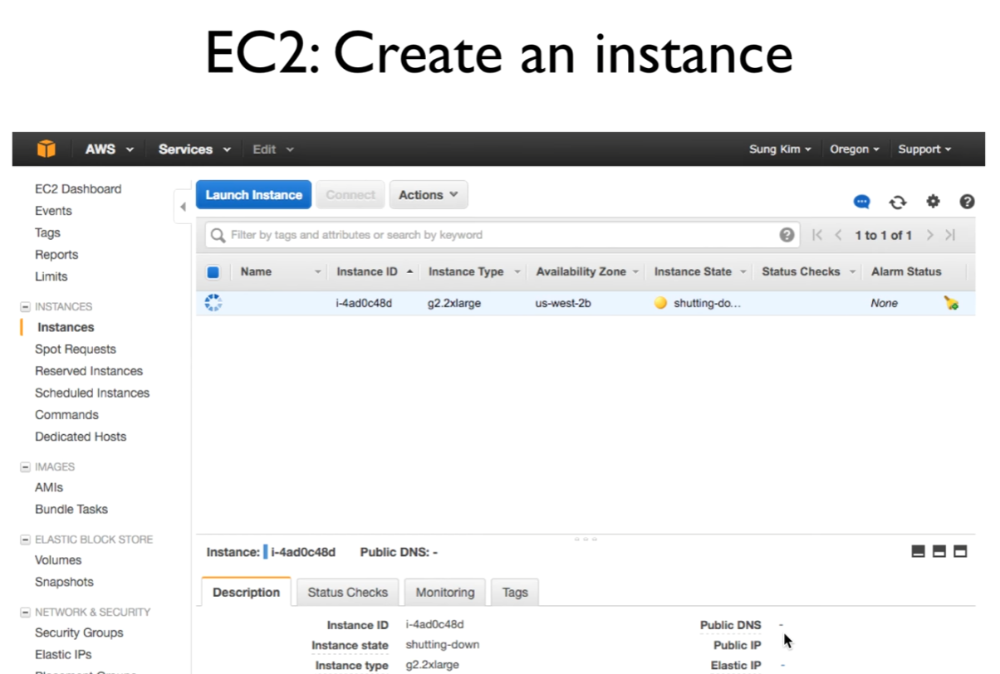

https://www.youtube.com/watch?v=9VckXVoJEe0&list=PLlMkM4tgfjnLSOjrEJN31gZATbcj_MpUm&index=48


### TensorFlow GPU @AWS

이번 비디오에서는 그동안 우리가 열심히 공부했던 TensorFlow를 AWS(Amazon Web Service)를 이용하여 굉장히 효율적으로 실행시켜보는 법에 대해서 얘기해보도록 하겠습니다.


지난 번 비디오에서 한 번 보여드렸었는데요[47강 얘기는 아니신 듯], 아래 URL에 여러분들이 필요한 정보를 입력하시면, 아마존 Web Service를 사용하실 수 있는 100달러의 무료 크레딧을 받으실 수 있게 됩니다.


### Deep Network

- Takes a long time for training
  - Many forward/backward propagation and weight updates
  - Many metrics multiplications
- Very quick for testing and use in practice
  - One simple forward propagation

우리가 그동안 많이 얘기했던 Deep Neural Network의 가장 큰 장점중의 하나가, 학습이 된 다음에는 간단하게 forward propagation만으로 어떤 걸 실행할 수 있기 때문에, 실제 사용에서는 굉장히 빠르게 학습된 모델을 사용할 수 있게 됩니다.

그런데, 불행히도 이것을 학습하기 위해서는 굉장히 많은 양의 데이터가 필요하구요, 또 이야기한 것처럼 forward, backward propagation을 동시에 거쳐야 하기 때문에, 상당히 많은 양의 matrix 연산을 필요로 하고, 그것으로 인해서 상당히 오랜 시간이 걸릴 수 있게 됩니다. 


### GPU

이것을 해결하기 위한 한 가지 방법 - GPU를 사용하는 것.


GPU는 여러분들이 아시는 것처럼, 그래픽의 효율을 높이기 위해서 만들어진 유닛인데, Matrix 계산을 굉장히 병렬적으로 빠르게 처리할 수가 있습니다.

그래서 이 GPU를 가지고 있으면, Neural Network, 우리 같은 경우에 굉장히 속도를 높혀줄 수 있다.


### GPU version

이를 위해서 tensorflow도 배포를 할 때 GPU 버전을 따로 배포하게 됩니다.


그래서 여러분들이 자세하게 보시면, [tensorflow]0.9같은 경우에도 GPU 버전이 따로 있다.

그래서 여러분들이 GPU가 있다면, 이것을 다운받아서 실행하시면 굉장히 더 빠르게 학습을 시킬 수가 있다.


문제) 여러분들이 GPU가 없거나(저도 없습니다), 컴퓨터 성능이 조금 떨어질 경우에는 바로 이 GPU를 가지고 있는 Cloud Service를 이용하시면 됩니다.

대부분의 모델 여러분들의 컴퓨터에서 간단하게 프로그램을 개발해보시고, 아 이게 돌아가는구나 정도만 확인한 다음에, 이 프로그램을 cloud에 올려서 cloud에서 빠르게 실행시키는 이런 형태의 모델이 많이 사용됩니다.


많은 클라우드가 있지만, 그 중에서도 오늘은 AWS를 가지고 한 번 우리가 tensorflow를 돌려보겠다.


### AWS GPU price in Oregon


AWS 이용하는 이유 중 하나가, 현재 GPU를 지원하는 것이 AWS인 것으로 알고 있고, 또 이 GPU AWS같은 경우에는 두 종류의 인스턴스를 제공합니다.

g2.2xlarge, g2.8xlarge인데요, 이것은 몇 개의 GPU, 메모리 얼마나 있느냐 차이죠?

이런 인스턴스를 쓰면, 여러분들이 시간당 과금을 그 쪽, AWS에서, 아마존에서 하게 된다.

지역별로 조금 가격 차이가 있다. 서울은 좀 비싼 것 같다. 제일 싼 곳중에 하나가 Oregon[미국 서북부의 오리건 주]입니다.

굳이 빠른 접속을 할 필요가 없기 때문에, Oregon에 가서 여러분들이 서버를, 인스턴스를 만드시는 것이 좋다.

가격을 보시면, 한 시간에 0.65불 정도를 차지하게 됩니다. 2xlarge의 경우는.

8xlarge는 2.6불.. 그래서 여러분들이 효율적으로 이것을 잘 사용해야 비용도 줄일 수 있게 된다.


### EC2 Console: Oregon

이것을 어떻게 그러면 실제로 내가 원하는 나만의 서버를 만들고, 구동을 시키느냐?


그런 것은 이미 많은 자료들이 있고, 여러분들이 구글로 '윤석찬'님을.. 윤석찬님께서 이미 많은 강의를 하시고 자료들을 올려놓으셨기 때문에, 쉽게 원하시는 정보를 찾으실 수 있을 것입니다.

우선 가장 간단하게는, AWS에 가서 계정을 만드시고 로그인하신 다음에, 서비스 중에 EC2라는 게 있습니다.

EC2에 들어가시면 이런 형태의 콘솔이 보일 텐데요,

여기서 새로운 인스턴스를 만들기 위해서는 Create Instance 부분에 한 번 Launch Instance를 클릭하시면 되겠죠?


### ubuntu, GPU, 12G or more


클릭하시면, 물어보는 것이, 어떤 OS의 인스턴스를 만들고 싶냐? 하는 것인데,

가장 많이 사용되고 있는 ubuntu를 선택하는 것이 좋다.

굉장히 특별한 어려움 없이, 모든 것을 설치할 수 있다.


두 번째, 만들 때 어떤 인스턴스 타입을 사용하겠느냐? 할 때

여러분들이 data를 시간에 따라서 좀 더 큰 걸 사용할 수 있지만, 

대부분의 경우에는 g2.2xlarge 정도로 하루 안에 학습이 가능할 것입니다.

그래서 요런 정도로 한 번 선택해보시구요,


그러고 이제 나머지는 일반적인 것을 선택하시면 되는데, 그 중에 주의하실 것이 하드디스크의 용량을 물어봅니다.

이 때 기본이 8G인데요, 

8G는 여러분들이 어느 정도의 data가 있느냐에 따라 다르겠지만, 조금 적은 것 같은 기분이 듭니다.

그래서 저 같은 경우 12G정도 하고, 학습 데이터가 많은 경우에는 20G 정도..

여기에 따라서도 추가 과금이 있기 때문에, 무작정 큰 것을 할 게 아니라 여러분들에게 맞는 정도 용량, 저 같은 경우 12G정도로 지정을 한 다음에 바로 실행시키면 됩니다.


### key to access the server

Launch를 할 때, 마지막으로 하나 더 물어본다.


어떤 키를 사용할 것인가?

아마존이 password를 가지고 server에 로그인을 하는 게 아니라, 보안을 위해서 키를 사용하게 되는데요,

이 부분도 굉장히 많은 자료가 있기 때문에 참고하시면 된다.

키가 없는 경우에는 새로 만드시면 된다.

있는 경우에는 재활용해서 사용하실 수 있습니다.

그 다음에 Launch를 하시게 되시면


### EC2: Create an instance

콘솔 화면으로 다시 돌아가면서 여기에 새로운 인스턴스가 하나 생겨서, 활성화가 되려고 합니다.



이 때 인스턴스가 준비가 되면, 


### It's ready to ssh!

여러분들이 Public DNS 이 부분을 보시면, 


DNS 또는 IP address, 이 부분만 가지고, 또 여러분들이 이전에 발급해놓으셨던 키를 가지고 있으면, 이 서버로 접근이 가능하게 됩니다.

대부분의 작업은 ssh를 사용해서 작업하게 된다.

이 키와 서버 IP를 이용해서, ssh를 이용해서 접속하시면 여러분들이 갖고 있는 서버를 마음대로 사용할 수가 있게 됩니다.


### Requires CUDA and CuDNN

그런데, 여기서 바로 tensorflow를 깔 수 있으면 좋은데, 


tensorflow가 원하는 것이 CUDA toolkit 7.5와 CuDNN v4를 필요로 합니다.

이것들을 다 설치해줘야 되는데요,


### CUDA

이것을 설치하기 위해서는 인터넷에, 구글같은데 찾아보면 금방 나온다.


CUDA 8.0도 나오고 9.0도 나올 것인데, 앞으로도 마찬가지이다.

업데이트 될 때마다 구글에 찾아보시면 대략 10개 정도의 명령어로 어떻게 설치하면 된다 라는 것이 나온다.

따라서 쭉 해보시면 된다.


### cuDNN

그리고 cuDNN도 마찬가지 방법으로 인터넷에 많은 자료가 있다.


이런 경우에는 이것을 바로 다운받으신 다음에, 바로 압축을 풀고 copy하는 정도로 간단하게 설치가 끝난다.

이것을 선행해서 설치해주셔야 한다.


### 16 commends

저도 한 번 간단하게 따라서 설치해보았는데요,


시간이 좀 걸릴 것 같아서 여기서 직접 보여드리진 않고, 설치를 하고 tensorflow 0.8을 깐 모델이다.

설치하는 코드 16가지 코멘드로 설치했다.

요걸 참고하셔도 되고, 이전에 CUDA 웹 페이지를 참고하셔서 두 개 라이브러리[CUDA, cuDNN]를 설치한 다음에, 마지막으로 tensorflow를 설치하시면 됩니다.


### Add Path

- export PATH=/usr/local/cuda/bin:$PATH
- export LD_LIBRARY_PATH=/usr/local/cuda/lib64:$LD_LIBRARY_PATH

한 가지 주의할 점이, 항상 라이브러리를 설치한 다음의 library의 path와 LD_LIBRARY_PATH를 넣어주시면 된다는 걸 여러분들이 직접 넣어서 활성화시켜주셔야 프로그램에 tensorflow가 들어갈 때 라이브러리를 잘 찾을 수가 있게 됩니다.


### Requires CUDA and CuDNN

그럼 이제 마지막으로 두 라이브러리가 설치되었기 때문에, tensorflow를 설치하시면 되구요,


tensorflow에 여러분들 프로그램 올려서 실행하시면 될 것입니다.


### Reuse ami-9e39dcf3 (N.Virginia) ami-38f60658(oregon)

여러분들 편의를 위해서, 이미 cuda 버전이 설치되어있는 것을 가지고 이미지를 만들어두었다.


이미지 번호가 위와 같은데요,

oregon이나 Virginia region에 가셔서 AMIs라는 것을, 이비지를 선택하신 다음에, 여기서 검색을 하시면 됩니다.

public으로 만들어두었기 때문에, 검색을 하시면 요렇게 이 이미지를 보실 수가 있고,

이 이미지를 선택하신 다음에 바로 Launch를 하시면, 이 이미지를 그대로 copy해서 여러분들의 instance로 만들어줄 수 있기 때문에, 굳이 내가 CUDA를 설치하고 싶지 않다 하시는 분들은 바로 이 이미지를 사용하시면 되겠습니다.


### Creating TensorFlow device (/gpu:0)

그런 다음에 Tensorflow가 설치가 됐고, 여러분들이 갖고 있는 작업을 실행시키면 


밑에 이제 많은 메세지가 뜰 텐데요,

그 중에 하나를 자세히 보시면[하늘색 밑바탕] GPU가 활성화되었다는 메시지를 보실 수 있을 것입니다.

아마 이 메시지가 정상적으로 보이지 않는다면, 설치에 문제가 있으니까 한 번 더 살펴보셔야 되구요,

이것이 보이면 정상인 것입니다.


그럼 이것이 얼마나 빠른 속도로.. GPU가 있는 경우와 없는 경우가 차이가 있을까요?


왼쪽) GPU 사용한 것

오른쪽) 교수님 갖고 계시는 Mac 컴퓨터. 상당한 사양의 컴퓨터.

이 두 가지 얼마나 빠르기의 차이가 있는지 실험시켜보았다.


[11:20 경]

보시면 알겠지만, 맨 앞이 실행되는 번호

똑같은 프로그램을 똑같은 data를 가지고 실행시켰는데, 보시면 대략 많게는 25배까지 차이가 난다.

GPU 갖고 있는 Cloud에서 실행시키면 하루 만에 테스트할 수 있는데, 이것을 Mac에서 실행시키면 무려 25일이나 걸려서 학습이 끝난다.

하루 vs 25일. 굉장히 큰 차이가 난다 이렇게 보실 수 있습니다.


### AWS GPU price in Oregon

아쉽게도 GPU를 사용하면 굉장히 좋긴 한데, 이것들이 무료가 아니다.


돈을 내게 되죠?

예를 들어서, 여러분들이 큰 학습을 위해서 8xlarge를 사용한다 -> 한 시간에 2.6달러

하루종일 사용하면 24시간, 한 달간 사용하면 무려 1872불을 지불하셔야 합니다.

항상 이 가격에 굉장히 주의하셔야 하고, 내가 사용한만큼만 내기 때문에 사용하지 않을 때는 반드시, 반드시 서버를 stop시키셔야 합니다.


### Spot instances

또 다른 하나의 방법은, 이렇게 많은 돈을 지불하는 것보다, 혹시 그 당시에 놀고 있는 서버가 있다든지 할 경우에, 조금 더 저렴한 값으로 서버들을 사용할 수 있다. 


그것들을 Spot instances라고 합니다.

역시 EC2 Console에 가셔서, Spot instances에 들어가셔서 보시면 Request를 할 수 있다.

Request를 하기 전에, Request를 한다는 것은 마치 여러분들이 경매를 하듯이, 내가 서버를 1$에 돌려보고 싶다/2$에 돌려보고 싶다 이렇게 돈을 여러분들이 bidding할 수 있다.

그 중에 서버 아마존 입장에서는 가장 큰 돈을 bidding한 사람에게 서버를 빌려줘야 되겠죠?

이런데, 과연 돈을 얼마를 걸면 좋을까?

그런 것을 미리 볼 수 있는게, pricing history를 클릭하시면, 


이 history들을 볼 수 있다. 대략 이전에 얼마에 사용이 되었다. 지역별로..

이 값을 참고하셔서, 여러분들이 너무 낮은 값을 [입찰]하게 되면 서버들을 못 받게 되겠죠?

또, 너무 높은 값을 하게 되면 여러분들 돈이 많이 나가기 때문에, history를 보고 여러분들이 적절한 값으로 bidding하시면 됩니다.


### Price bidding

비딩하면 대략 이렇다.


몇 개 인스턴스를 할 것인가?

현재 내가 돈을 얼마나 내겠다라는 것을 돈을 지정하면,

그런 다음에 똑같습니다.

인스턴스를 만들어서 내가 실행시키게 되면,

만약에 내가 원하는 가격에 인스턴스들이 있게 되면, 서버들이 활성화가 되는 것이죠?

아니면 한참 기다려도 올라오지 않거나, 하는 일이 생깁니다.

그러면 가격을 조금 더 올려보셔야죠.

이렇게 여러분들 가격을 줄일 수 있는데요,


### bill, bill, bill!

그래도 여러분들 굉장히 주의하셔야 합니다.


항상 요금이 얼마 나왔는지 확인하셔야 되구요,

여러분들이 어느 날 들어가봤더니, 이런 형태의 bill을, 계산서를 받을 수가 있게 되죠?

굉장히 큰 돈..

이 경우에는, 여러분들이 여러 가지로 주의하셔야 되는데, 

청구 같은 경우 자기가 갖고 있는 key를 실수로 github같은 곳에 올려놔버린 것이죠..

그러니깐 다른 분들이 오셔서 '오 이거 지금 무료로 사용할 수 있는 서버가 있다' 해서 

서버를 마음대로 아마 사용해서 이렇게 큰 돈을[청구서를] 받은 것인데요,

여러분같은 경우 키를 잘 보관하셔야 합니다.


### Check, stop, and terminate

두 번째는, 항상 내가 사용하지 않으면, 항상 이걸 끄셔야 합니다.

전기와 같아요.


집에 에어컨이 있다고 가정하면, 에어컨 쓰지도 않는거 한 달동안 그대로 켜놓고 다시 돌아오면 전기세가 많이 나오겠죠?

같은 이치입니다. 여러분들이 AWS 서버를 쓰실 때, 학습이 끝나면 바로 서버를 꺼두셔야 합니다.

끄시면 여러분들의 Storage 12G, 20G 얼마 안 되는데, 그것만 차지하게 되니까 활용이 끝나면 반드시 Stop을 해주셔야 하고요,


### Cloud Watch

그럼에도 불안하다 -> Cloud Watch라는 시스템을 AWS에서 제공한다.


이 기능은 어떤 CPU가 어떤 상태에 놓였을 때, 이 서버를 중간에 끄게할 수 있다.


### Stop when CPU utilization <= 0.3

그 중에서 제가 쓰는 것은 이런 형태의 알람입니다.


CPU의 부하가 0.3보다 적게, 그리고 그것이 5분 동안 지속됐다.

그러면, 자동으로 서버를 꺼라

이런 형태의 알람도 지정해둘 수가 있습니다.

내가 혹시 깜빡하고 이 학습이 다 끝났는데도 깜빡했을 때, 이런 형태의 알람이 자동으로 꺼줄 수 있고요,


### Shutdown after training

그리고 여러분들이 보통 screen이라는 명령어를 사용해서 많이 실행시키죠?

```
$ screen

$ sudo -i
# python train.py; shutdown -h now
```


왜냐하면 시간이 길게 걸리기 때문에, 접속이 끊어지더라도 계속 돌아갈 수 있도록 하는 것인데요,

이 때 여러분들이 ;를 사용해서, 학습이 끝난 다음에 바로 컴퓨터를 shujtdown시켜라 하는 명령을 줄 수도 있습니다.

그러면 바로 stop이 되죠?

그래서 이렇게 여러분들이 명령을 실행시키는 것도 굉장히 좋은 습관이라고 할 수 있겠습니다.


### Deep learning for Everyone Season 2 coming soon!

여기까지 이제 우리가 갖고 있는 tensorflow 프로그램을 AWS를 이용해서, GPU를 이용해서 빠르게 돌리는 방법을 설명드렸는데요,

이 정도면 여러분들께서 원하시는 프로그램을 만들고, 많은 양의 데이터를 충분히 학습할 수 있는, 학습된 모델을 여러분들 실무에 직접 사용할 수 있는 정도까지가 된 것 같습니다.

Season 1의 강의는 여기서 공식적으로 마치도록 하겠구요,

준비가 되는대로 Season 2의 강의를 Open하도록 하겠습니다.

여러분들의 의견도 기다리고요, 특히 Season 1을 보시면서 부족했다거나 개선해야 될 점, 그리고 Season 2에 이런 것들을 포함했으면 좋겠다 라는 것들 있으면 아래 이메일로 주시면 제가 참고해서 더 좋은 수업들을 만들어보도록 하겠습니다. 감사합니다.


Sung Kim <humkim+ml@gmail.com>

http://hunkim.github.io/ml/

