https://www.youtube.com/watch?v=orIXr5xd6P0&list=PLlMkM4tgfjnLSOjrEJN31gZATbcj_MpUm&index=49

### TensorFlow GPU @AWS Spot Instances without losing data + 100 USD credit

이번 비디오에서는 AWS에 있는 Spot Instances를 사용해서 굉장히 저렴한 가격으로 tensorflow를 돌려보는 것을 설명드리도록 하겠습니다.

이 Spot Instance의 장점은 방금 말씀드린 것처럼 가격이 굉장히 저렴하지만, 

단점은 이 Instance가 항상 보장이 되지 않기 때문에 사용하는 도중에 없어질 수가 있습니다.

그럼에도 불구하고, 여러분들이 학습하던 데이터를 잃어버리면 안되는데요,

그렇게 하는 방법과,

또 이 비디오의 마지막에는 여러분들이 배포를 받아서 실습을 해볼 수 있는 것도 함께 소개드리도록 하겠습니다.

여기에 나오는 내용들은 저도 Channy Yun님과 DoHyun Jung님에게 배워서 여러분들에게 설명드리는 것입니다.

### GPU

GPU라는 것은, 많은 분들이 사용하시도 하시고 잘 아시는 것처럼, 특히 게임할 때도 유용하지만, 벡터같은 것을 계산할 때도 유용하다.

tensorflow처럼 벡터 계산이 많은 경우에, 여러분들이 GPU가 없이 사용하시면 굉장히 느린데,

GPU가 있을 경우 없는 것보다 약 10배 ~ 30배의 속도 증가가 있다고 합니다.

GPU가 없으면 한 달 걸릴 거 있으면 하루만에 끝난다 그렇게 이야기할 수도 있겠죠?

### AWS G2 and P2 Instances

특히 AWS는 최근에 P2라는 새로운 GPU를 도입했다.

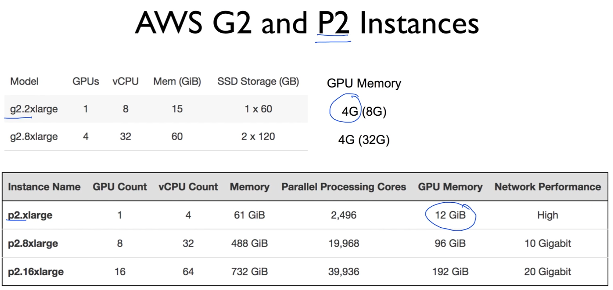

G2는 기존에 4G의 메모리였는데, P2로 가면서 12G까지 좋아져서, 여러분들이 더 많은 배치를 한 번에 학습시킬 수도 있고, 메모리가 더 많이 필요한 학습을 할 수 있기 때문에 상당히 유용합니다.

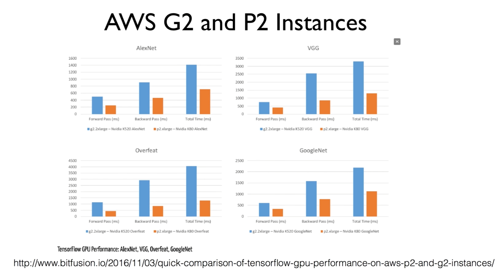

여러분들이 상상하실 수 있는 것처럼, G2와 P2의 성능을 비교해보면, (앞의 파란색이 G2, 빨간색이 P2) 사용된 시간, 같은 작업을 할 때 얼마나 시간이 들었나..

보시면 대략, 대부분의 경우에서 P2가 굉장히 빠르고, 많게는 3배까지 속도가 빨라진다고 합니다.

그래서 여러분들이 가급적 P2를 사용하시면 좋은데요,

### US EAST (N.Virginia) On-Demand Price

문제는 얘들의 가격.

가격이 만만치가 않다.

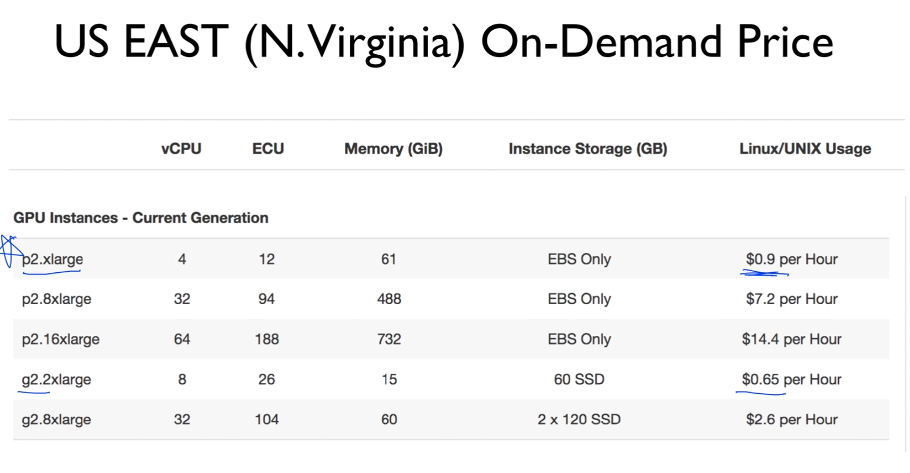

P2에 GPU가 하나밖에 없는 걸 봐도, 한 시간에 1$. 비싼 건 10불이 넘어간다.

이전에 있는 4G짜리 메모리를 보더라도, 한 시간에 0.65불이 된다.

그래서 여러분들이 어떤 학습을 시키느냐에 따라 다르지만, 저 같은 경우에는 대부분 50~100시간정도 학습 시간이 필요하다.

그러면 50~100불이 필요하다는 얘기가 됩니다. 굉장히 큰 돈이죠?

### US EAST (N.Virginia) Spot Instance Price

그런데, 여러분들이 이렇게 On-Demand를 사용하지 않고, Spot Instance를 사용하시게 되면, 가격이 대폭 줄어듭니다.

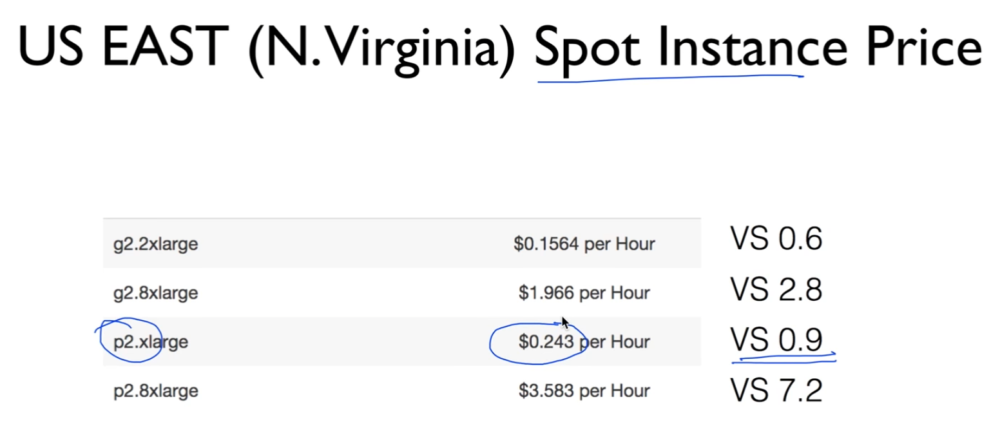

보시면, P2같은 경우 이전에 약 1불

이것이 약 0.24불에 여러분들이 사용하실 수 있게 됩니다.

100시간 돌려도 한 20여 불, 50, 30시간 돌리면 10불 이하로 여러분들 학습이 가능해지는 것이죠?

### On-Demand VS Spot Instances

On-Demand와 Spot Instances의 차이를 보시면,

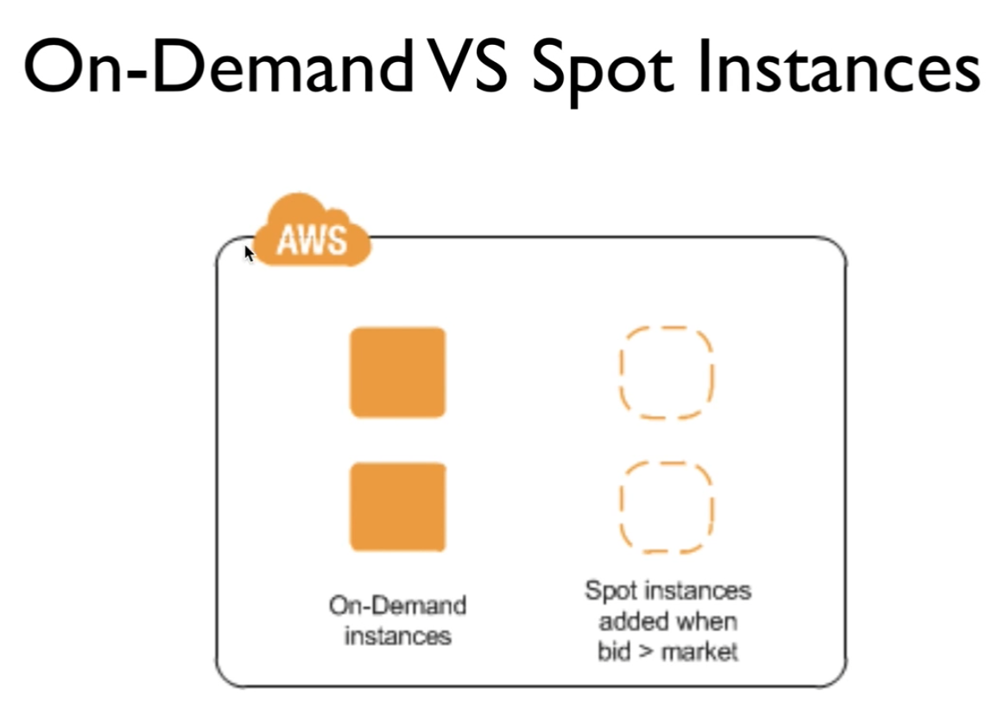

On-Demand는 이렇게, AWS의 공식 아이콘입니다만, 굉장히 진한 그림으로 표시되어 있다.

이 이야기는, 이 인스턴스는 신청하면 여러분들에게 주어집니다. 그리고 항상 여러분들이 사용할 수 있습니다.

그러나, Spot Instance의 예를 볼까요? 이렇게 점선으로 되어 있는데요,

가격이 저렴하지만 점선으로 표현한 이유는, 사용하는 도중에 AWS가 필요하면 가져갈 수가 있습니다.

왜 그런가 하면, AWS 입장에서도, 자기가 가지고 있는 서버들이 항상 배포로 다 판매가 되지 않을 것 아닙니까?

남아있는 것들을 Spot Instance라는 이름으로 여러분들에게 판매하는 겁니다.

그런데, 또 사람들이 많이 쓰고싶다 해서 서버가 많이 필요하면 어떻게 할까요?

Spot Instance를 없애 버린다. 강제로.

더 비싸게 판다.

그러다보니, 여러분들이 사용하는 Spot Instance가 없어질 수가 있다.

그것이 Spot Instance의 단점. 그래서 점선으로 표시해둔 것 같습니다.

### Request spot instances and save $

자, 우선 이 spot instances를 한 번 만들어보도록 하죠.

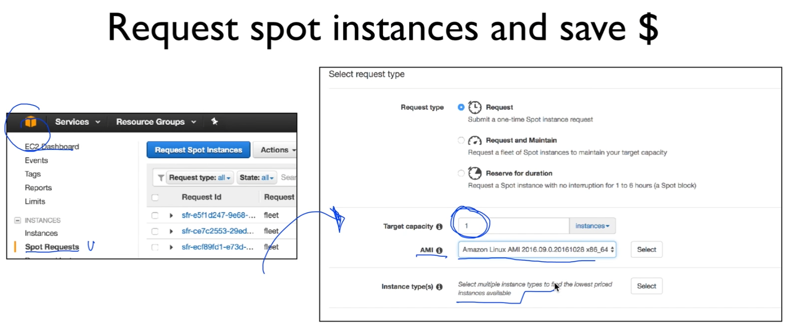

그래서 사용해볼텐데요,

만드는 방법은 굉장히 간단합니다.

로그인을 하신 다음 EC2 콘솔로 가셔서, Spot Requests로 가시면 됩니다.

오른쪽 화면이 열릴 텐데요,

인스턴스를 만드는 방법은 굉장히 간단합니다.

첫 번째로, 여러분들이 몇 개의 서버를 돌릴 것인가? 1개 정도만 해보죠.

그리고 AMI라고 이미지, 이런 경우에는 여러분들이 매 번 Spot을 띄울 때마다 tensorflow를 설치하고, 컴파일하고, 귀찮으니까, 이미 컴파일한 것을 이미지로 하나 만들어두시면 됩니다. 그것을 매 번 [돌리지 않고 만들어두신 이미지를]선택하시면 되고요,

그리고, 어떤 타입을 할 것인가를 정할 텐데요, 선택을 하시게 되면 

이런 화면이 열립니다.

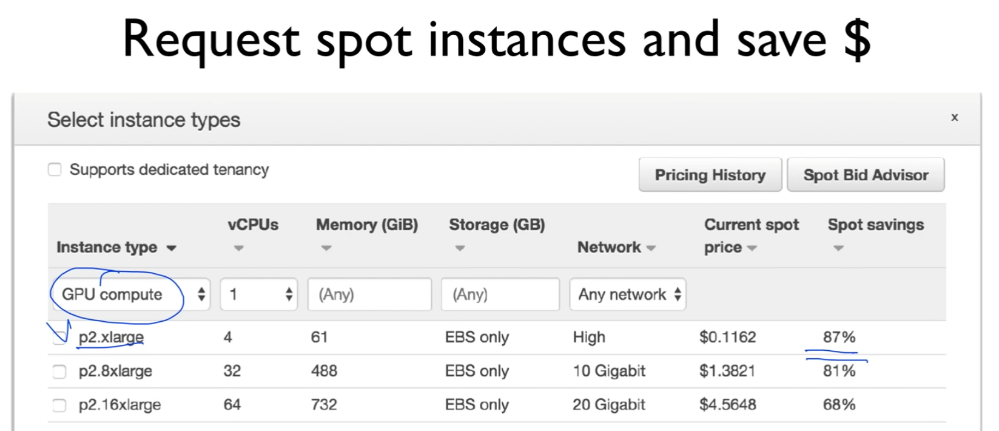

이 중에 GPU를 여러분들이 선택하시구요, 

그 중에 p2를 하겠다 마음을 먹고 계시면, 

오른쪽에 보면 얼마나 가격이 saving되는지 하는 정보가 나옵니다.

이런 경우에는 87%의 가격을 save할 수 있다.

그래서 기분 좋게 여러분들이 launch를 할 수 있고요,

### Request spot instances ready (takes 2~3 min)

launch를 하시게 되면, 여러분들이 instance에 가시게 되면 이 spot instances를 볼 수 있는데,

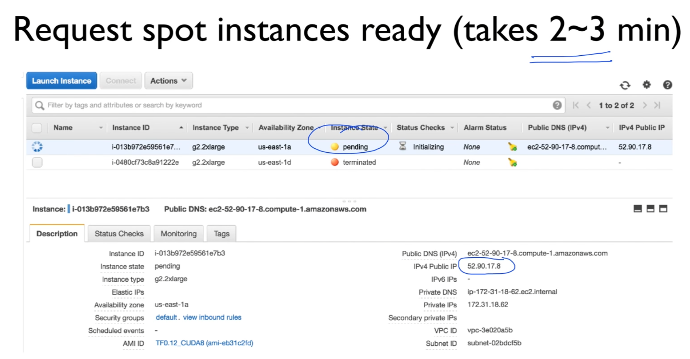

이게 그냥 On-demand를 만드는 것은 빨리 나타나지 않습니다.

누르면 한 2~3분 정도 있다가 나타나는데요,

그 이유가 여러 가지가 있겠지만, 아마도 여러분들이 이렇게 bidding 하면, 다른 사람이 사용하고 있는 그 인스턴스를 뺏어서 여러분들에게 줄 수도 있겠죠?

그래서 다른 사람꺼 termination시키고, 여러분꺼 주고, 하는 등의 이유로 시간이 하여튼 좀 걸립니다.

2~3분 있다가 나타나는지 한 번 보시고요,

그러면 여기 이제 Public IP가 주어지죠?

보통 인스턴스와 똑같이 사용하시면 됩니다.

### Work with screen

그럼 여러분들이 이제 그 IP로 ssh를 하실 꺼구요,

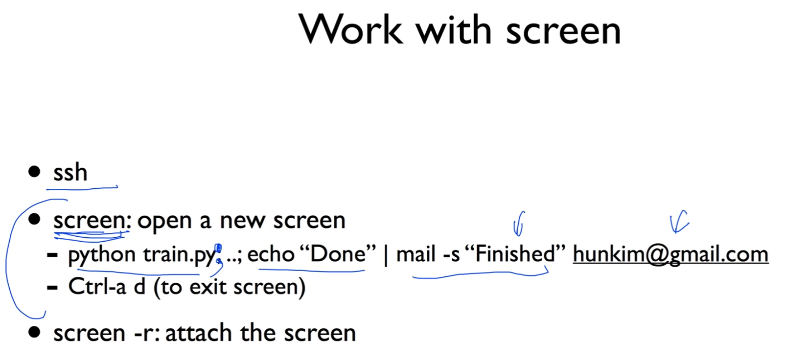

그런 다음에 작업을 하시는데,

여기 제가 팁이라면 팁, 제가 주로 사용하는 방법을 알려드리면,

저는 Screen이란 것을 많이 사용합니다.

 screen이란 것은, 여러분들이 로그인하셔서 작업을 하는 데, 중간에 커넥션이 끊어지면 그 작업도 끝나잖아요?

그러면 곤란하니까, screen이라는 어떤 가상 화면을 띄워서, 그 속에서 작업을 하면, 중간에 disconnected가 돼도 그 작업은 계속 일어납니다.

그런 다음에 내가 다시 로그인해서, 그 screen에 attach를 하면, 이전의 작업들을 한 것을 볼 수가 있다.

그래서 고런 것[screen]을 사용하시면, 중간에 laptop을 꺼도 되고, 내가 다른 컴퓨터를, 연결을 끊어도 이 작업은 계속 됩니다.

그것이 첫 번째 팁.

두 번째는, 이 spot Instance도 보통 인스턴스와 마찬가지로, 학습이 끝났는데도 여러분들이 계속 켜두면 어떨까요?

돈은 계속 나갑니다.

그래서 학습이 끝나자마자 이메일같은 걸 받아서 학습이 끝났다는 정보를 알고 싶으면, 

보통 세미콜론(;)으로 여러 가지 명령을 연결시킬 수가 있는데요,

어떤 파이썬 명령어로 학습을 시키고, `python train.py;`

끝나면 이런 명령, `ehco "Done"`이라고 해서 이걸 mail이라는 것에, 제목은 "Finished"라고 하고, 여러분들 이메일을 적으면, 학습이 끝나면 자동으로 메일이 가게 된다.

그러면 그 메일을 보고, 가서 어떤 조치를 취하시면 되겠죠?

그럼 데모를 한 번 보여드리도록 하겠습니다.

자 우선, 해당하는 IP address로 로그인을 하겠죠?

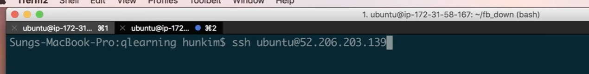

로그인을 하면, 이런 형태로 로그인이 된다.

여기서 바로 작업을 하게 되면, 작업을 실행하는 도중에 내가 컴퓨터를 끈다거나 하게 되면 작업이 중단되죠?

그래서 screen이란 것을 실행시킵니다.

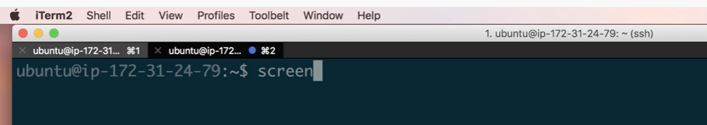

그럼 어떤 가상 스크린이 생겨나는데, 여기서 작업하는 거예요.

여기서, 제가 요새 DeepQA라는 것을 작업시키고 있기 때문에,

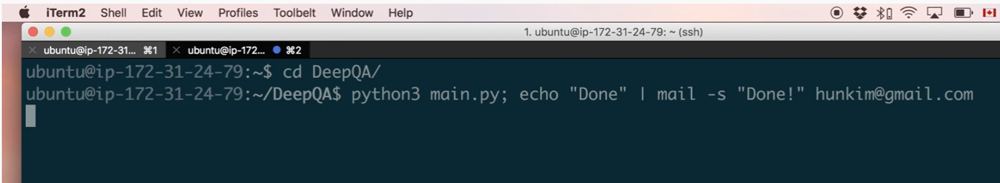

여기서 python3 main.py란 작업을 해서 학습을 시키게 되겠죠?

그 다음에, 끝나면 제게 바로 메일을 보낼 수 있도록, echo "Done"이란 것을 메일 본문으로 해서, mail -s "Done!" hunkim@gmail.com 으로 본문과 이메일 주소를 보내게 됩니다.

이렇게 하게 되면, 앞에 있는 작업이 끝나면 바로 뒤에 있는 명령을 실행시켜서 제가 메일을 받을 수가 있게 되죠?

그렇게 하면, 조금 시간이 걸리겠지만, 어떤 실행이 일어날 것입니다.

이건 끊으셔도 되고요, 바깥으로 나가시고 싶으시면

ctrl + a + d를 누르시게 되면, 터미널에서 빠져나갑니다.

그래도 작업은 계속 일어나고 있고요, 제가 다시 이전에 하던 작업으로 들어가고 싶다,

여기서 이제 접속을 끊으셔도 되고요, 

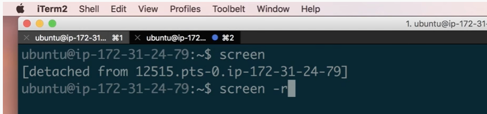`screen -r`로 다시 접속을 하게 되면,

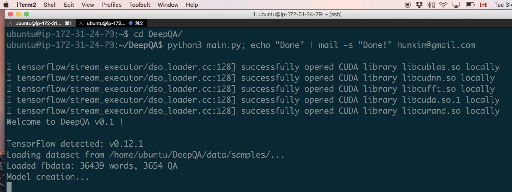

현재 진행되고 있던 것이 그대로 있죠?

여기서 다시 나갈 수가 있게 됩니다.

screen을 사용하시면 굉장히 유용하게, 여기 있던 laptop을 꺼도 되고, 연결을 아예 끊어도 됩니다.

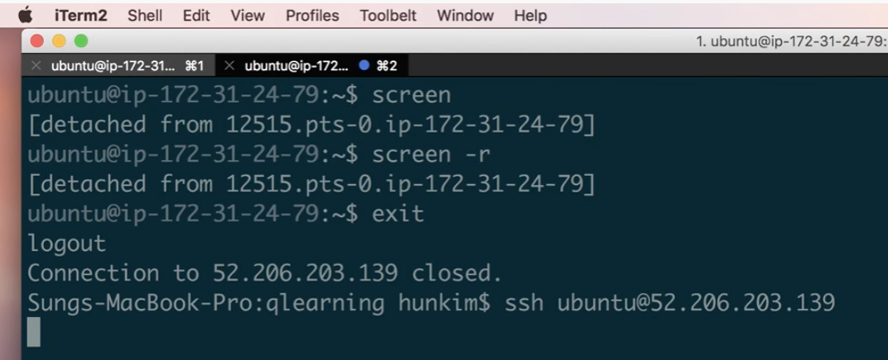

그런 다음에 다시 들어가서, 이 작업의 진행 상황을 마찬가지로 로그인을 먼저 한 다음에,

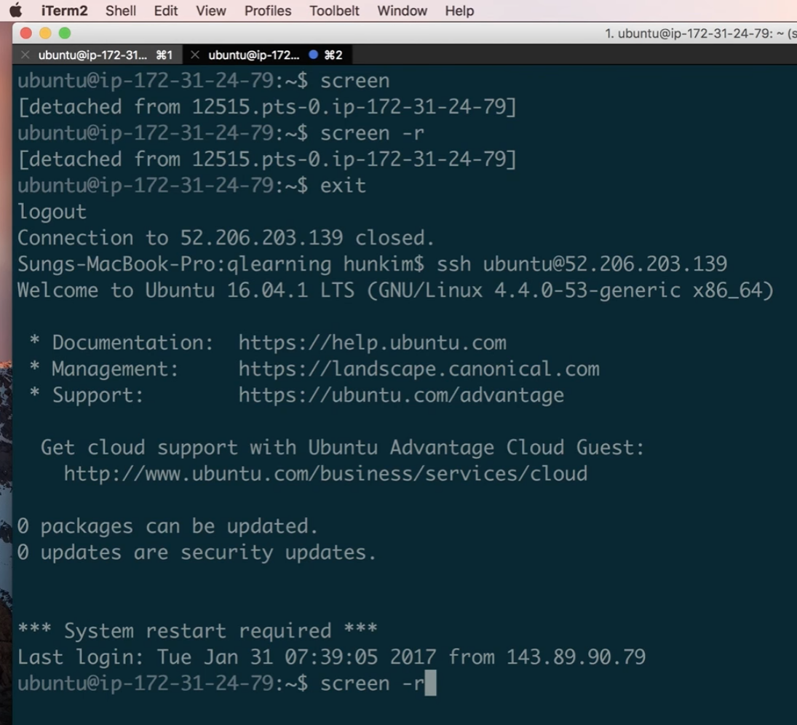

screen -r이라는 명령어를 주면, 이전의 screen으로 들어가서 어떻게 진행되고 있는지 볼 수가 있게 되죠?

이것이 screen의 사용 방법이고요,

### AWS Spot Instance

그런데 중요한 것은, 이전에도 말씀드렸듯이, Spot이라는 것은 저렴한 가격으로 우리가 빌려쓰는거다 보니, AWS가 좀 더 비싼 가격을 낼 고객이 나타나면, 무참하게, 우리 spot을 빼라고, 방을 확 빼버리죠?

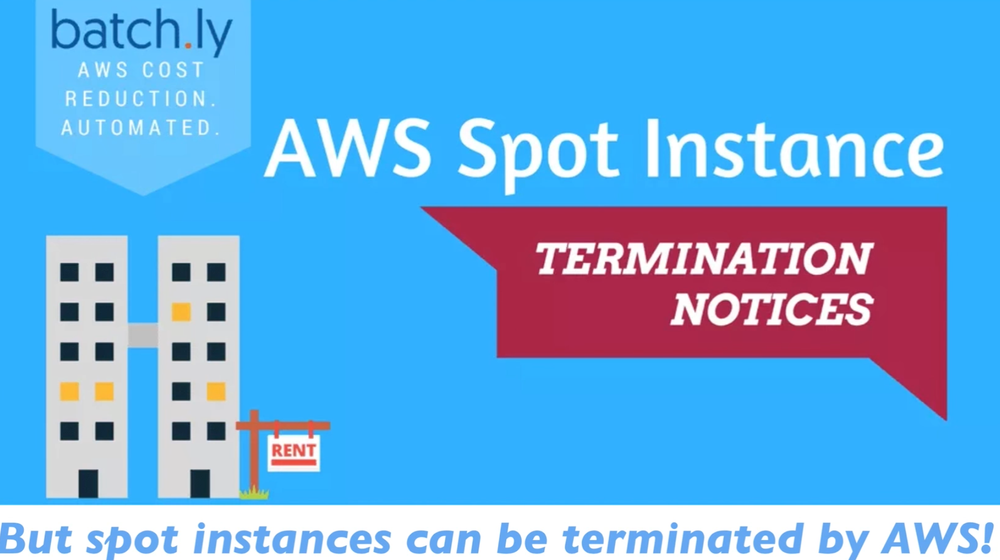

이러면 Instance가 없어져버리기 때문에 굉장히 난감한데요,

### Solution: Spot Instance + EBS Volume

이것을 극복할 수 있는 방법은, 여러분들이 Instance를 만들 때 자동적으로 하드 디스크를 하나 추가시키죠? 메인 하드 디스크가 추가될껍니다.

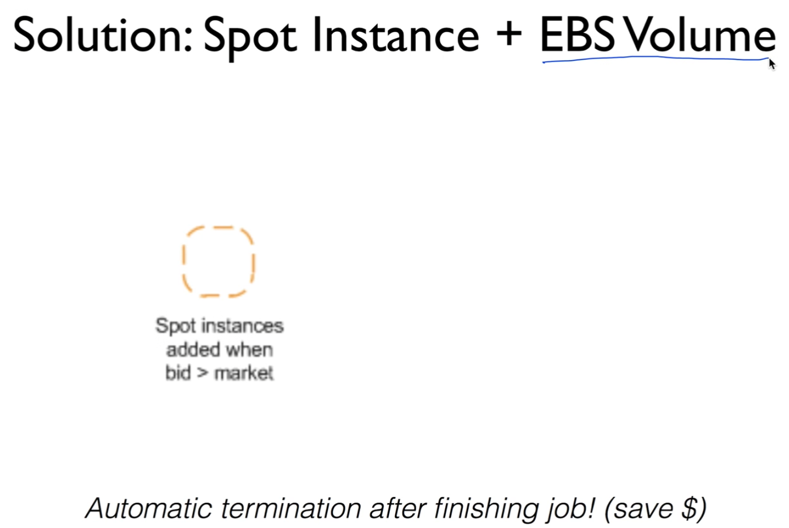

### Solution: Spot Instance + EBS Volume (do not delete on termination)

그래서 이 하드디스크를 고대로 살려두는 겁니다.

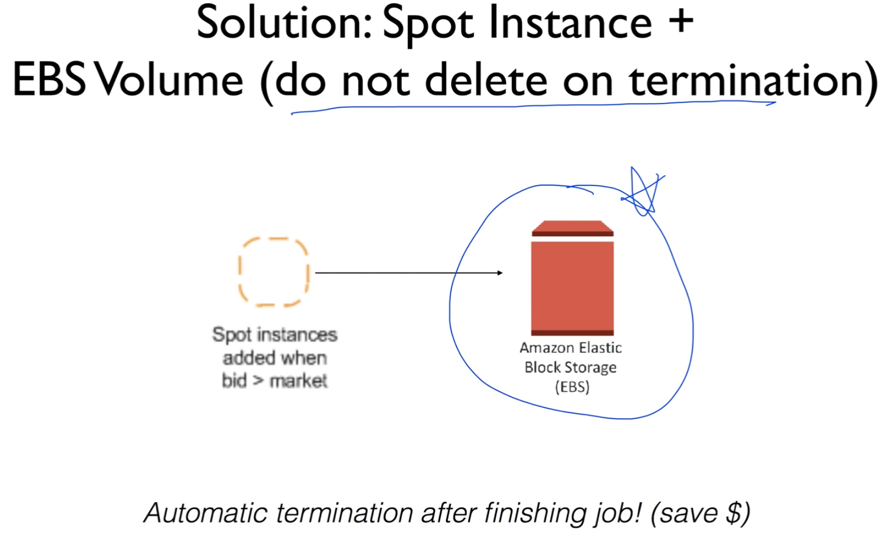

이 볼륨이 사라질 때, 즉 우리가 Spot Instance를 만들 때, 이 하드디스크를 지우지 마라고 설정을 해두는 겁니다.

굉장히 간단한 방법인데요, 이 방법을 통해서 여러분들이 중간에 Instance가 없어지더라도, 계속해서 여러분들이 가지고 있는 데이터들을 그대로 보관할 수 있다는 겁니다.

### Don't delete the volume!

이것을 만들 때, SPot Instance를 만드는 것과 똑같습니다.

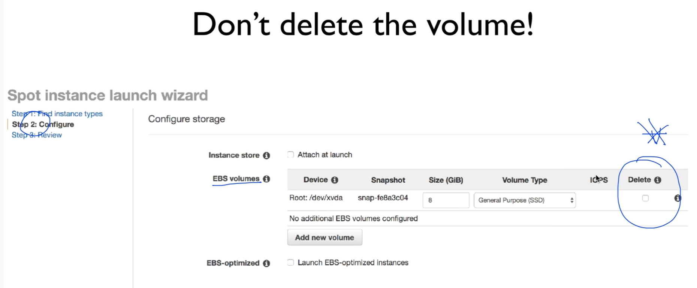

똑같은 데, 주의하실 점이, 두 번째 스텝에서, 이 부분이 있습니다.

볼륨이 아마 자동적으로 선택이 될 껀데요,

요 때 여기 delete라는 옵션이 기본적으로는 체크가 되어 있습니다.

이 체크를 없애버리시면 됩니다.

그래서, 여러분들이 Spot Instance가 termination되더라도, 이 볼륨은 나는 그대로 가지고 있겠다 라고 설정이 되는 거죠?

### Workflow

그럼 전반적인 workflow를 한 번만 더 정리해볼까요? 똑같습니다만..

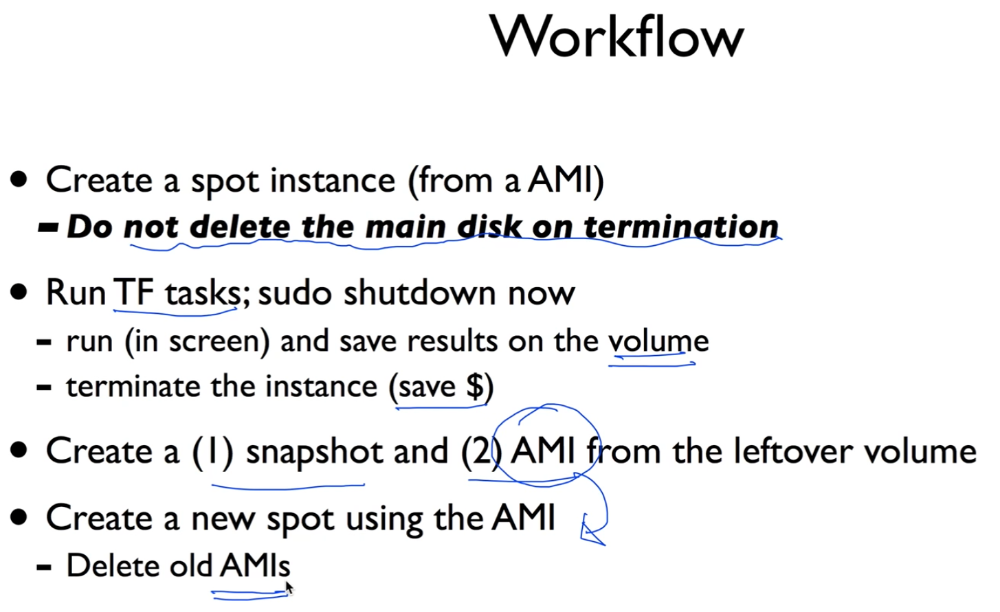

우선, 처음에 spot instance를 만든다.

이 떄 반드시 이거 delete하지 마라 체크푸셔야 합니다.

그 다음에, 여러분들이 이제 Tensorflow Task를 돌리죠?

여기서 할 수 있는 것은, 하나 더 추가할 수 있는 것은, tensorflow tasks가 끝나게 되면 이메일을 보낼 수도 있지만, 그 메일을 새벽에 받는 경우 처리할 수 없으니까, 어떤 명령을 주냐?

task 끝나면 바로 이 spot instance를 termination 시켜라, 더 이상 난 돈을 내지 않겠다, 라고 하면

돈을 save시킬 수 있죠?

그렇지만 그 결과는 바로 이 하드디스크에 그대로 남아있게 되죠?

그래서 이렇게 여러분 tensorflow task를 줄 수 있고요, 

그런 다음에 이제 들어가보면, 여러분들이 갖고 있는 인스턴스는 없어졌을 것입니다.

그렇지만 그 볼륨은 남아있기 때문에, 1) 그 볼륨은로 snapshot을 만들고요, 2) 이 snapshot에서 AMI를 만들 수가 있습니다.

지금 현재는 이 작업을 한 번에 할 수 없는데요, 두 번에 나눠서 하고요,

그런 다음에, 이 AMI가 생성되었으면, 이 AMI로 그 다음 spot instance를 만들면,

이전에 여러분들이 가지고 있는 데이터가 그대로 살아있게 됩니다.

물론 중간중간에 여러분들이 하드디스크, 이전에 있던 AMI, 이전에 있던 볼륨, 이전에 있던 snapshot을 삭제해주시면 좋겠습니다.

### 0. Create AMI - TF/Cuda

간단하게 볼까요?

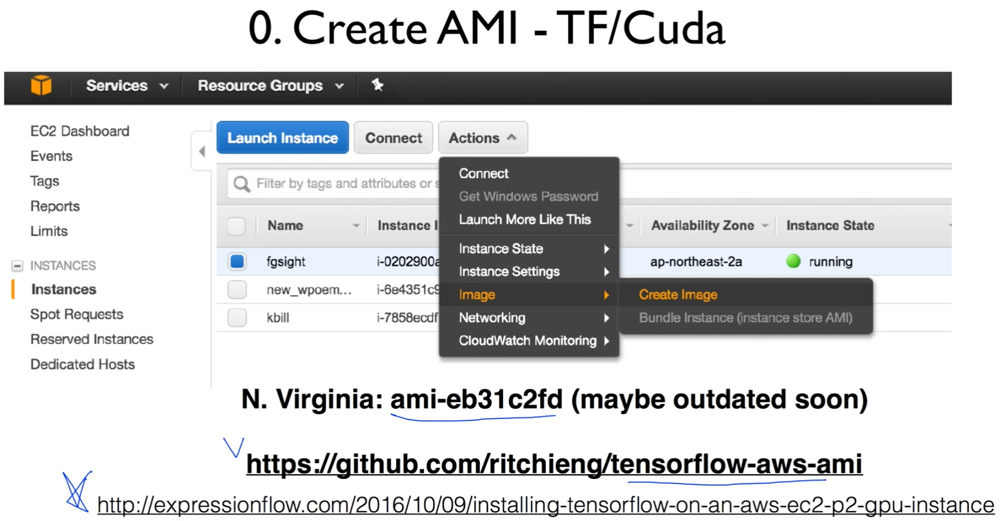

우선 가장 처음에 하셔야 될게, 여러분들이 Tensorflow가 설치되어 있는 AMI를 하나 만들어두시는 게  좋습니다.

그래야, 항상 들어갈 때마다 여러분들이 Tensorflow 설치하는 데 시간이 걸리니까요.

여러 가지 방법이 있겠지만, 제가 하나 만들어놓은 것이 있습니다.

여러분들이 쓰셔도 되고, 또는 보니까 하드디스크를 아예 TF/Cuda를 설치해놓은 AMI를 만들어서 공개한 분이 계시더라고요. [깃허브]

아니면, 실제로 여러분들이 설치할 수도 있습니다. tensorflow 설치하시고요, cuda library 필요한 거 설치하시는 방법이 설명하는거 보시고 필요한대로 만들어두시는 것이 시간을 절약하는 길이고요,

### 1. Request spot instances using AMI

그런 다음에, 이전 방법과 똑같다.

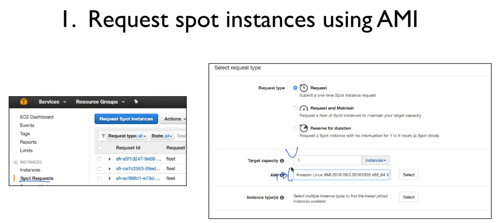

우선, Spot Request를 하시구요, 

이 때 몇 개? 그리고 AMI, 여러분들이 이전에 만들어놓은 tensorflow, cuda가 설치되어 있는 cuda를 선택하시고요,

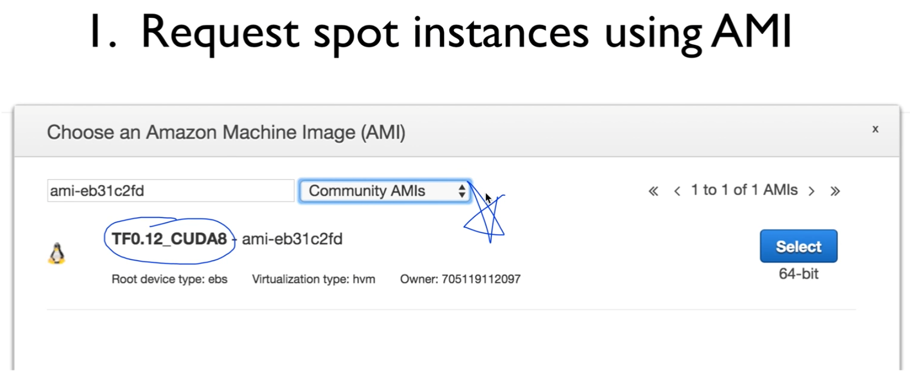

그리고 어떤 instance를 하실 것인가?

저 같은 경우 tensorflow가 설치되어 있는 이 AMI를 선택하겠죠?

그러면 instance가 실행되자마자 바로 tensorflow를 돌릴 수가 있고요,

### 1. Request spot instances: check price

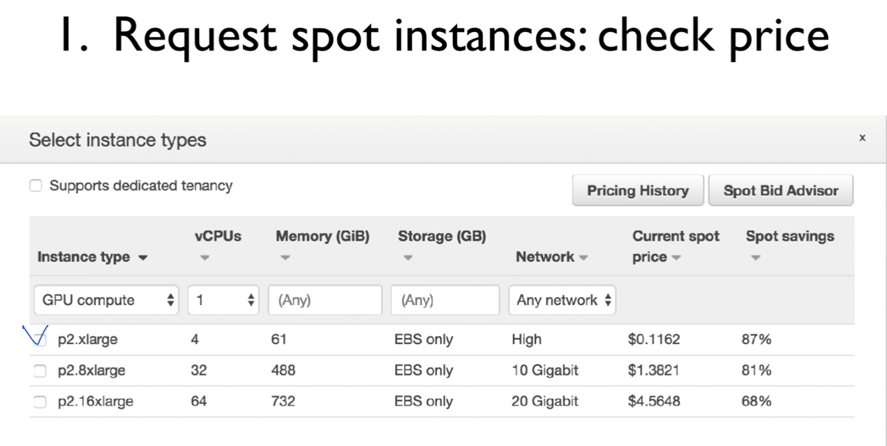

그리고 여러분들이 갖고 있는 어떤 인스턴스를 할 것인가?

저같은 경우 이 인스턴스를 많이 사용합니다.

### 1. Request spot instances: Don't delete the volume!

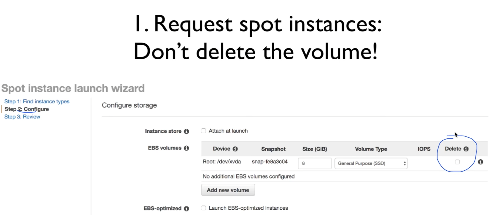

그리고 두 번째 스텝에서 가장 중요한 것인데요,

한 번 더 이 부분이 delete되지 않도록 꼭 한 번 더 체크해주셔야 됩니다.

### 1. Request spot instances: Success

이렇게 하신 다음에, 그럼 이제 success 되었다고 나오고요,

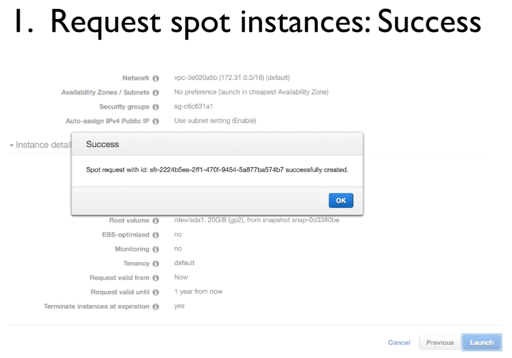

### 2. Run TF (with screen) and enjoy!

좀 기다리셔야겠죠? 2~3분 정도..

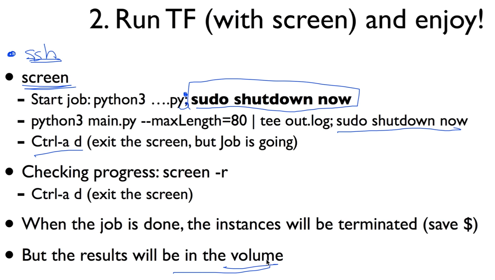

그런 다음에, 마찬가지로 우선 첫 번째 sub(?)로 ssh 하시고요, 그 다음에 작업하시면 됩니다.

역시 마찬가지로 screen이라는 툴을 사용해서 여러분들이 하시면 좋고요,

그 다음에 어떤 job을 줄 수 있게 됩니다.

예를 들면, [python3 ....py] 어떤 job을 주고요,

그리고 재밌는 것은, 이렇게 여러분들이 `sudo shutdown now`라는 명령을 주게 되면, 앞의 작업이 끝나면 바로 서버를 termination시킵니다.

장점은 뭘까요? 학습이 끝나자마자 저는 더이상 돈을 내지 않겠다라는 것이죠?

한 예로, 여러분들이 어떤 작업을 하고, 그 결과를 보는데, 마지막에 `sudo shutdown now` 이렇게 하게 되면, 앞에 있는 작업이 끝나면 shutdown되는 것이죠?

그런 다음에 여러분들이 screen을 빠져나오는 것이죠? `ctrl-a d`로 빠져나오고,

필요할 때마다 상황을 체크합니다. (screen -r)

그러나 분명한 것은, 이 작업이 끝나면 termination되어서 여러분들이 더 이상 돈을 낼 필요가 없습니다.

그러나 인스턴스는 없어졌지만, 결과는 바로 volume에 남아있기 때문에, 계속 여러분들이 학습된 데이터를 가지고 어떤 작업을 할 수 있게 됩니다.

### 3. Spot Instance termination + EBS Volume

자, 그래서 이 비록 우리가 갖고 있는 인스턴스는 termination돼서 없어졌지만, 여러분들이 사용했던 이 하드디스크는 그대로 남아있는 것이 우리의 방법이 되겠고요,

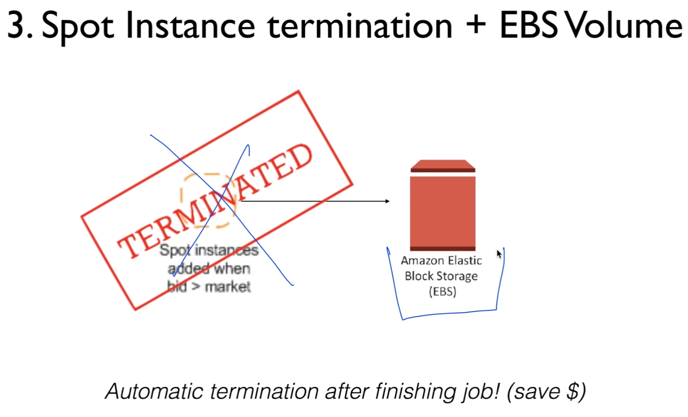

### 4. Create snapshot from the volume

그리고 이 하드디스크가 남아있으면, 그걸 가지고 우선 첫 번째는 그 볼륨에 들어가신 다음에, 필요한 볼륨을 여러분들이 선택하시고, Actions에서 Create Snapshot이란 것을 선택하시면 됩니다.

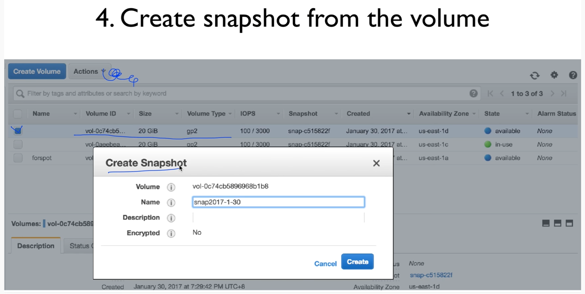

우선 snapshot을 한 번 만드시고요,

### 5. Create AMI from the snapshot

그리고 그 snapshot으로 들어가신 다음에, 그 snapshot에서 이 actions를 누르게 되면 바로 이 이미지를 만드실 수 있게 됩니다. Create Image 선택하셔서 이름을 만들면 되죠?

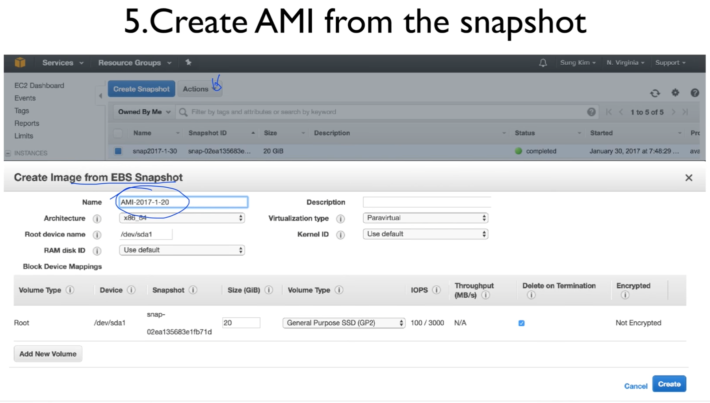

그러면, 이 이미지가 생성되었기 때문에, 이 이후로는 여러분들이 이 이미지를 통해서 새로운 스팟을 만들게 되면, 이전에 있는 데이터가 그대로 이 이미지에 남아있는 것을 보실 수가 있게 됩니다.

### 6. Create new spot instance using the AMI

그래서 이제, 새로운 spot을 다시 만들 때는, 아까 우리가 만들었던 그 이미지 이름을 잘 기억하셨다가, 이 이미지로 불러오게 되면 이전에 학습했던 데이터가 그대로 남아있어서, 사용할 수가 있게 되는 것입니다.

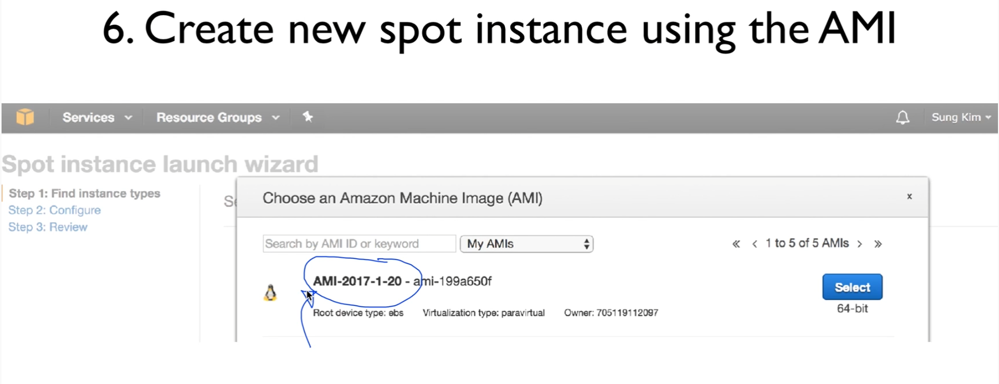

### GPU, GPU, GPU

그래서 여러분들이 이제 GPU같은 것을 저렴한 가격에 많이 사용하실 수 있게 되는 것입니다.

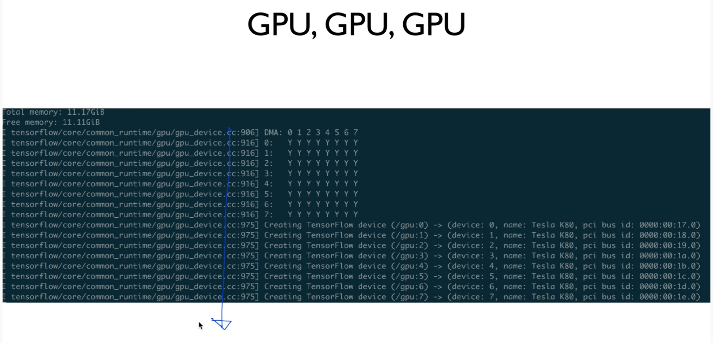

굉장히 행복하게 tensorflow를 돌려볼 수가 있게 되는 것입니다.

### Solution: Spot Instance + EBS Volume

다시 한 번 정의하면, 여러분들이 Spot Instance를 만들 때, 이 볼륨을 삭제하지 말라는 옵션을 반드시 확인하시게 되면, 이  Spot Instance는 terminate가 되더라도, 이 하드디스크는 남아 있다. 라는 것이 바로 이 비디오 강의의 핵심이 되겠습니다.

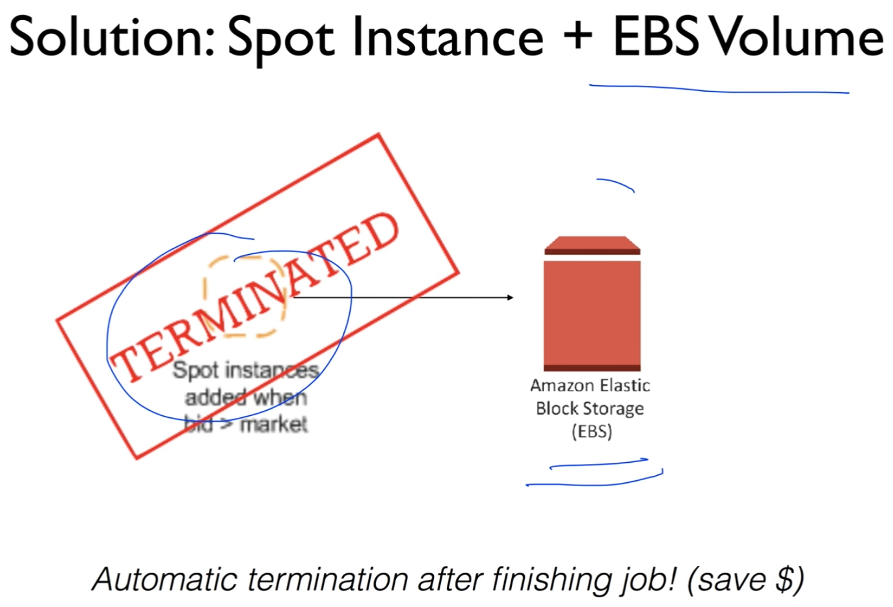

### TensorFlow-KR 회원을 위한 AWS 크레딧 제공!

끝으로, TensorFlow-KR 회원을 위해서, 또 이 비디오를 보시는 분들을 위해서 AWS에서 크레딧을 제공하는데요,

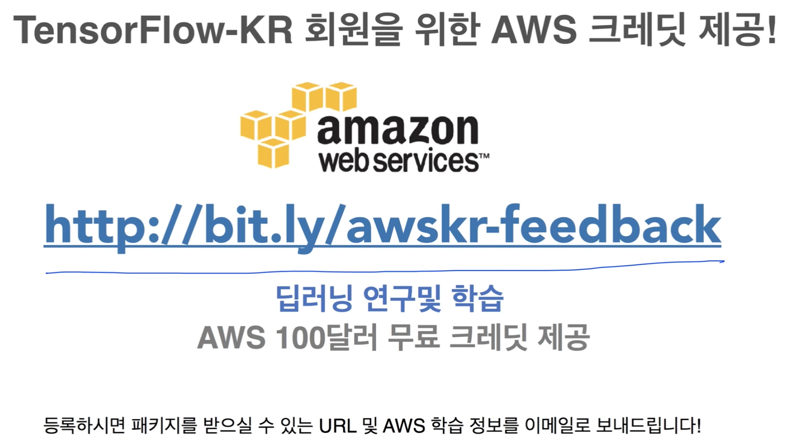

위 url 타이핑해서 필요한 정보들을 입력하시게 되면, 이메일로 어떻게 하면 배포받는지에 대한 링크를 받으실 수가 있을 것입니다.

