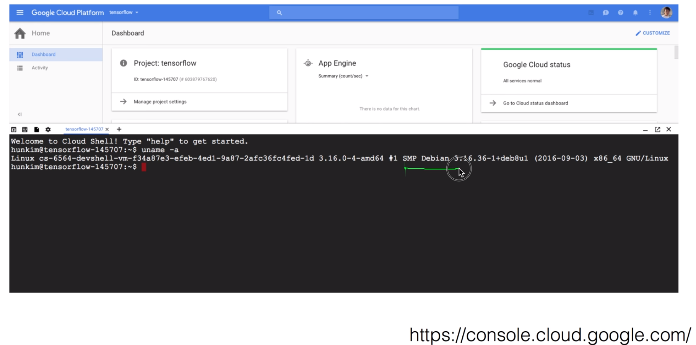
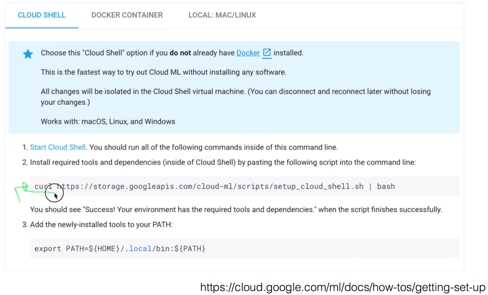
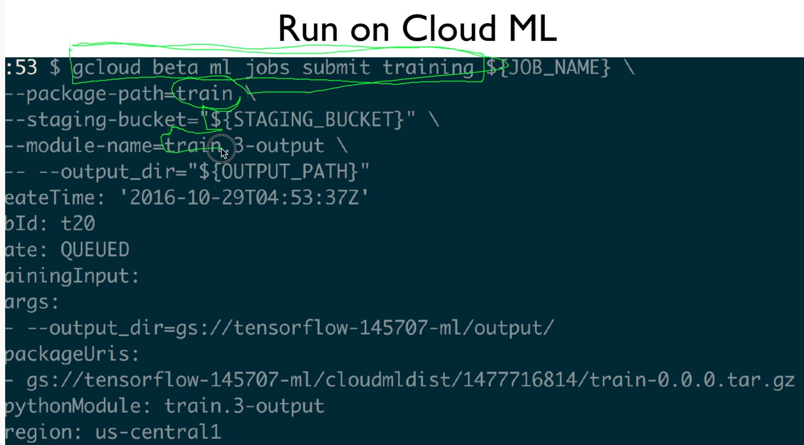

https://www.youtube.com/watch?v=8Jkz2HexDAM&list=PLlMkM4tgfjnLSOjrEJN31gZATbcj_MpUm&index=50


### Google Cloud ML Examples

Cloud ML 서비스를 사용하시면, 여러분들이 갖고 있는 tensorflow service들을 바로 cloud에 던져서 컴퓨터가 없는데도 사용할 수 있는데요,

간단한 예제들을 보면서 한 번 얘기해보도록 하겠습니다.

여기서 사용하는 모든 소스코드는 이 깃허브에 있으니까 한 번 가셔서 보시면 좋겠다.

https://github.com/hunkim/GoogleCloudMLExamples


우선 여러분들이 클라우드에 대한 기본 개념과, 구글 클라우드 계정이 있다고 가정하고 이야기를 하겠습니다.


### Local TensorFlow Tasks


TensorFlow를 실행시킨다, TensorFlow를 여러분들이 모델을 만들어서 Deep Learning을 학습시킨다는 이야기는, 기본적으로 어떤 주어진 task를 실행시키고, 그 결과를 Local Disk에 save한다 그런 얘기가 되겠죠?

그리고 대부분의 경우, training을 할 때, 어떤 data를 읽어와서 training data를 갖고 training하겠죠?

역시 이것도 Disk에서 읽어와서 사용하는 것인데요,

TensorFlow에 딥 러닝 모델을 만들어서 실행을 할 때, training을 할 때 가장 큰 문제가 training에 굉장히 많은 시간이 걸린다는 것이고, 그러다보니까 굉장히 고성능의 컴퓨터와 GPU 이런 것들이 많이 필요한 것이죠?


### Cloud ML TensorFlow Tasks


그런데, Google Cloud ML 서비스를 사용하시게 되면, 여러분들이 갖고 있는 어떤 하나의 task, 여러분들의 laptop이나 컴퓨터에서 만들어진 테스트를 클라우드로 던져서, 모든 실행이 클라우드에서 일어난다.

그런 대신에, 그 결과, 그 학습의 결과는 클라우드에 있는 Storage System으로 저장이 되는, 이런 형태로 되는 것이 바로 Google Cloud ML이 되겠습니다.


### Setup your environment

이것을 위해서는 여러분들의 로컬 컴퓨터에, 또는 사용하실 곳에 기본적인 설정을 하셔야 하는데, 한 번 살펴보도록 할까요?


기본적으로 세 가지 방법으로 할 수가 있습니다.

여러분들이 가장 선호하시고, 저도 설치한 곳이 바로 이 로컬, 저 같은 경우 MAC에다가 설치하였는데요,

이렇게 설치하실 수가 있고, 그리고 필요하시면 Cloud Shell이라는 것을 기본적으로 제공하는데, 

이 shell을 사용하면 굉장히 간단하게 설정할 수 있습니다.


### Google Cloud Console

한 번 보도록 할까요?


로그인을 한 다음에 이쪽을 보시면 요런 아이콘이 있는데, 요걸 클릭하시면 Google Cloud Shell을 실행시킬 수가 있습니다.


shell을 실행시킨다는 것은, 일종의 command line이 나오는데요, 보니까 데미안 버전인 듯..



이것의 장점은, 기본적으로 필요한 것들이 다 설치가 되어 있습니다. 이 shell 안에.

조금만 하면, setup을 완벽하게 할 수가 있는데요,




그것이 이거예요. 한 명령.

어떤 스크립트를 받아와서, 스크립트를 실행시키면 바로 필요한 모든 것이 설치되는 아주 멋진 모델입니다.

그런 다음에 이것을 PATH에 넣어주겠죠?


만약에 로컬에다가, 여러분들이 로컬에다가 설치하고 싶다 하시면 문서를 참조하시면 되는데, 

여기도 step이 조금 더 많이 있긴 하지만, 뭐 그렇게 어렵지 않게 설치하실 수 있을 것입니다.


setting이 끝나게 되면, 과연 setting이 잘 됐는지를 이 명령어로 확인할 수 있고요.[파란색 밑바탕]

Success라는 명령이 나올 것입니다.


여기까지 세팅이 끝났으면, 이제 내가 갖고 있는 컴퓨터에, 내가 클라우드 ML로 task를 던져야 되잖아요 거기서?

그 권한을 설정해주게 되는데, 그것이 바로 이 명령어로 하실 수 있습니다.

`gcloud beta ml init-project`

라는 명령어를 주시면, 몇 가지 물어볼꺼예요.

어떤 개념으로 어떤 프로젝트를 할 것인가 물어봐서 거기에 답을 하면, 설정이 완료가 됩니다.


그런 다음에, 마지막 설정이 뭐냐면, 우리가 tensorflow 돌려서 그 결과 나온거를 그 storage에다가 적는다고 했죠?

또, 학습할 때 그 데이터를 storage로부터 읽어온다고 했는데, 그것을 어디서 읽어올 것인가? 어디로 쓸 것인가? 를 결정하는 것이죠? 그것을 bucket이라고 부르는데, 이것을 만듭니다.

여기에는 변수를 설정하죠? shell에서?

PROJECT_ID를 자동으로 읽어오고,

BUCKET 이름을 프로젝트_ID의 -ml이라는 이름으로 추가해서 버켓 이름으로 만듭니다.

또는, 그냥 여러분들이 좋아하는 이름으로 주실 수도 있고요,


이름이 주어지고 난 다음에, gsutil이라는 command line을 이용해서, mb라는 것이 버켓을 만드는 거죠? make bucket. 하고, 우리가 버켓 이름을 붙이면 됩니다.

우리가 gs:// 이런 표현을 많이 쓰게 될 텐데요, 이것이 바로 google storage의 어떤 파일, 또는 공간, 버켓을 나타내는 일종의 url이라고 보시면 되고, 이것을 통해서 우리가 어디에 파일을 줄 것인지, 어디서 읽어올 것인지를 이것을 통해서 지정하도록 하겠습니다.


### Google cloud commands

요약하자면, 우리 세팅은 결국 이 두 가지 명령을 따르는 건데요,


gcloud, 즉 Google Cloud Platform을 사용할 수 있는 command line interface를 설치한거구요,

여러 가지 것들을 할 수 있어요.

컴퓨터 엔진을 만든다던지, 우리가 하려고 하는 Google Cloud ML의 job들을 만들어서 보낸다던지.. 하는 것을 할 수 있는 거구요,


또 하나 설치한 것이 gsutil, 즉 Google Cloud Storage를 우리가 또 Command line을 통해서 사용하는 명령어를 설치하게 됩니다.


이 두 가지가 설치가 잘 되었으면, 환경의 설치가 된 것이고요,


### Example

자, 그럼 예를 통해서 한 번 tensorflow task를 cloud ML을 통해서 실행시켜보도록 하겠습니다.


### Example git repository


여기 있는 소스코드들은 다 여기서 다운로드받으실 수 있습니다.

다운로드 받으시구요,


directory를 한 번 보시게 되면, 우선 가장 중요한 것이 train이란 모듈 안에, 이런 세 개의 예제들이 담겨있구요,

그리고 input output이라는 directory를 제가 input data를 위해서, 또 출력 결과를 위해서 local에 directory를 만들어 뒀습니다. 

그래서 여러분들이 가지고 한 번 실행시켜보실 수 있습니다.


### Simple Multiplication

우선 소스코드 볼까요?


아주 간단한 Simple Multiplication하는 것인데, tensorflow의 하나의 task죠? 간단한 테스크..

여기 보시면, x가 placeholder로 정의가 되었고, 

w가 tensorflow의 variable로 정의가 되었고, 값이 그냥 5로 주어졌네요?

그 다음에 y라는 어떤 하나의 operation을 정의했습니다. tensorflow에 w와 x를 곱하기 한거죠?


자 그런 다음에, tensorflow의 session을 실행시킬거구요,

우리가 여기서 tensorflow의 variable을 사용하였기 때문에, 항상 initialize variable 하시고 실행시켜야 하죠? 반드시 하셔야 되고, 

그런 다음에, 이제 y라는 것, 우리의 operation을 실행시켰는데, 실행시킬 때 우리가 x를 placeholder로 뒀기 때문에, 그 값을 여기서 이렇게 [feed_dict] 넣어준 것이죠?

이것이 tensorflow style의 operation을 실행시키면서 parameter 넘겨주는거죠?

매우 간단한 모델.

그것을 저장해서 여러분들이 실행시켜볼 수 있겠죠?


### Run locally

우선 가장 중요한 것은, 이 클라우드에 던지기 전에 local에서 한 번 테스트해서, 이게 내가 원하는대로 돌아가는구나 확인을 한 다음에 던져야 됩니다.


이것을 하는 방법은, python을 부르고, m이라는 옵션, 모듈을 사용할 겁니다. 

하고, 뒤에 directory 이름과 모듈 이름과 파일 이름. 이렇게 주면 실행이 되죠?

예상했던대로 5, 10 이렇게 출력이 될 것입니다. 잘 됐죠?


### Run on Cloud ML

이제 이것을 클라우드에 던져서 클라우드에서 자동적으로 실행되도록 해봅시다.


이것을 하기 위해서 몇 가지 설정이 필요한데요,

변수 이름을, 잡 이름을 정해줍니다. 여러분들이 원하는 이름[task8]으로 주시면 되고요,

그리고 staging bucket이란 것을 정해야 되는데, 이 staging bucket이 무엇이냐?

여러분들이 local에서 만들어놓은 bucket이 있을 것입니다. tensorflow.

그거를 cloud로 copy를 해서, 그거를 cloud 안에서 돌리는 건데요 기본적으로는,

그러면 어디로 copy할까요? 하는 것을 정해주는 것이 바로 이 staging bucket이 되겠습니다.

`STAGING_BUCKET=gs://${PROJECT_ID}-ml `

역시 마찬가지로 Google Storage의 url을 적어주면 되죠?

이것이 다입니다.


자 그러면 이제 이렇게 변수들을 정해준 다음에, 어떻게 이 task를 던지냐?

우리가 이전에 말했던 gcloud beta ml이라는 명령어를 기본적으로 사용할꺼구요,

뒤에 jobs submit training이라는 다소 긴 명령어입니다. 상당히 길죠?

이것을 사용하고, 이어서 우리가 정의했던 JOB_NAME.

그리고 [밑줄에] 패키지 이름,

그리고 중요한 staging bucket, 

그리고 우리가 돌릴 모델 이름을 이렇게 주고 실행을 시키면 됩니다.

그러면 이 밑에 보시는 것처럼 QUEUE가 되어 있죠?

이 말은, 이것이 Cloud로 올라가서 실행이 될 준비가 되었다 라는 것입니다.

이것이 다예요. 이 명령 하나만 주면, 이것이 바로 Cloud ML에 들어가서 수행이 됩니다.


### Machine Learning Console

자, 그럼 이게 잘 되고 있는지 어떻게 아느냐?

여러 가지 방법으로 알 수 있지만, 그 중에 간단한 것이 Console로 들어가서, 메뉴를 선택하면 가장 아랫부분 쪽에 Machine Learning이 있습니다.


여기를 선택하시구요,


### Jobs

그렇게 하시면 이제, ML 안에 들어오신 다음에, Jobs라는 메뉴를 선택하시면


여러분들이 만들어놓은 task들을, job들을 쭉 보실 수가 있습니다.

원하는 걸 하나 클릭을 해볼까요? task7을 클릭해보도록 하겠습니다.


### Jobs/Task

그러면 이 Task7의 자세한 정보가 있구요,


언제 시작해서 언제 끝났고, 어떤 변수들, 어떤 argument들이 사용되었는지 나오구요,

중요한 것은 이 Logs를 볼 수 있습니다.

여러분들의 tensorflow에서 printout하는 것들이 다 여기로 들어가게 되겠죠?

그러면 log를 한 번 볼까요?


### Jobs/task7/logs

여러 가지 정보들이 있고,


우리들이 예상했던 것처럼 5와 10, 결과들을 출력했죠?


그대로 나와서 우리가 만들어놓았던 그 tensorflow task가 cloud에서 잘 돌아갔구나 하는 것을 보실 수가 있고,

마지막에 보시면 Job이 잘 끝났다. 이 메시지를 그대로 보실 수가 있게 됩니다.


### Input Example

그러면 대부분의 경우에는, 학습을 할 때 엄청난 양의 학습 데이터를 읽어와야 하죠?

어떤 것을 읽어와서 그걸 통해서 학습을 하게 되는데,

그러면 어떻게, 어디서 그것을 읽어올까요? 하는 것은,


### CSV File Reading

역시 마찬가지로 Google Cloud Storage에서 읽어오는데요,


예를 들어서 input file이 csv로 있고, 이것이 1,2 3,4 두 개의 column을 가진 아주 간단한 csv가 있다고 합시다.

이것을 클라우드에 올려놓고, 이것을 클라우드에서 읽고 싶은데, 굉장히 좋은 점은 tensorflow에서 제공하는 파일을 읽어오는 API를 사용하시면, 이 tensorflow는 자동으로 gs를 지원합니다.

그래서 그 디렉토리 이름의 google storage url만 주면, 아 이게 거기구나 하는 것을 알게 되죠?

그래서 바로 읽어올 수 있기 때문에, 소스 코드를 그리 고칠[?] 필요가 없습니다.

한 예로, 우리가 이 csv 파일을 읽어 오는 tensorflow의 API를 통해서 읽어 오는 방법인데요,

자세한 것은 이미지 아래 링크를 보시면 되고요,

우선 이 path를 주고, file name을 queue로 준 다음에, 이것을 어떻게 읽어올 것인지..

key와 value로 읽고요,

그 다음에 value를 디코딩하겠죠? csv니까

그래서 column1 column2 형태로 디코딩한다.

기본적으로 tensorflow API를 이용해서 csv 파일, 일반 파일 읽어오는 방법입니다.


자 그런 다음에, 이걸 읽을 때는 역시 세션 안에서.. 앞의 부분과 거의 똑같구요,

col1, col2라는 것을 실행시키면 값을 하나씩 돌려줍니다.

그래서 이게 100줄이면 100번을 읽으시면 되겠죠?

그래서 x1, x2에 역시 변수처럼 이렇게 넣어주는 것이죠

똑같구요,


그러면 어느 디렉토리에서 읽어올 것인가 하는 것을 우리가 argument로 받도록 합니다.

'input_dir'하면서 받고, default value를 input으로..


### Run locally

이것이 다입니다.


우선 시험을 해봐야겠죠?

로컬로 한 번 돌려봅니다.

로컬에서 input이란 디렉토리 안에 input.csv라는 파일이 있다고 가정하고(실제로 있습니다), 그런 다음에 실행시킬 때 이렇게 실행시키면 되겠죠?

`python -m train.2-input`

이렇게 실행시키면, 이 파일을 자동으로 input이라는 디렉토리 안에 이것을 자동으로 읽어와서 출력을 해줍니다.

이렇게 csv 파일을 읽어서 변수로 사용을 해서 그냥 곱하기를 한 거죠?


### Cloud ML TensorFlow Tasks

이제 이것을 TensorFlow Task를 Cloud ML에 던져서 실행시켜 봅시다.


이렇게 던져서 실행을 시키면 되고,

여기 이렇게 실행을 시킬 때, csv는 여기[Cloud의 storage]서 읽어와야겠죠?

cloud gs, google storage에서 읽어오면 됩니다. 그것만 다른 것이구요,


### Setting and file copy

그러기 위해서 몇 가지 스텝 한 번 해볼께요.


첫 번째, job 이름을 주셔야 되고요,

그리고 staging bucket은 이전과 똑같이 줍니다.

그런 다음에, 우리가 input을 어디에서 읽어올 것인지를 결정을 해주는데, 

staging area, 어차피 버켓을 만들어놨기 때문에 거기의 input이라는 directory에서 읽어온다고 하죠.

이렇게 Input path를 정의해줬고요,


그런 다음에 실제로 거기에 파일이 하나 있어야되겠죠?

그래서 이렇게 copy를 합니다. 이 명령을 통해서.

`gsutil cp input/input.csv $INPUT_PATH/input.csv`

gsutil copy 하고, 우리가 갖고 있는 로컬, 그리고 $ 여기가 바로 repository, gs storage에 있는 주소를 주면 되겠죠?

이렇게 실행을 시키면, 그 파일을 copy하고요, 

그리고 어떻게 됐다고 하는 결과를, command line에서 보여줍니다.


### Google Storage

또는 여러분들이 필요하시다면, 콘솔에 직접 가셔서 


Storage를 선택한 다음에 bucket을 선택하시고,

bucket 안에 들어가서 어떤 디렉토리 폴더를 만드실 수도 있고,

또 파일을 직접 업로드하실 수도 있고, 확인하실 수가 있습니다.


### Run on Cloud ML

확인이 된 다음에, 이제 tensorflow task를 gcloud라는 명령어를 통해서 실행을 시키는 것이죠?


굉장히 긴 명령 주시고요..

`gcloud beta ml jobs submit training`

그 다음에 JOB_NAME을 줄 겁니다.

나머지는 같죠? staging,

그리고 우리 실행시킬 프로그램 줄 것이고요, 여기까진 똑같습니다.


여기서 재밌는 것이 이 부분인데요,

이 부분에서 -- 옵션을 주고요, 그리고 뒤에 옵션을 줍니다.

`-- --input_dir="${INPUT_PATH}"`

이 --라는 옵션 뒤에 주어지는 옵션은, 우리를 위한, 우리 프로그램을 위한 옵션.

그래서 이 모든 옵션은 우리 프로그램의 옵션이다 라고 생각하고, 

우리 역시 input_dir라는 옵션이 필요했던 것이니까, 여기에 값을 ${INPUT_PATH} 이렇게 주도록 합니다.


실행시키면 아까와 마찬가지로, QUEUE가 되었다 나오고, 

이것을 확인하기 위해서 콘솔로 들어가서 JOB을 보시면, 아 이게 어떻게 되었다.


잡이 끝나면 끝났다고 나오고,


로그를 보시게 되면, 우리가 예상했던 것처럼, 이전에 로컬에서 보던 것과 똑같이 값이 나왔죠?

이 이야기는, 우리가 만들었던 tensorflow task가 cloud에 올라가서 cloud에 있는 파일을 읽어서 실행이 잘 되었다라는 것입니다.


### Output Example

그럼 마지막으로, 학습을 시킨 결과를 어디에 써야 될꺼잖아요?

그것을 어떻게 할 것인가를 보도록 하겠습니다.


### TensorFlow Saver


마찬가지로, 파일을 쓸 때, Tensorflow가 사용하는 API를 사용하시면, 그냥 그대로 하시면 됩니다.

gs라는 url을 이해하기 때문에 그대로 사용하시면 된다.

예제에서는 가장 tensorflow에서 많이 사용하는 모델 전체를 save하는 tf.train.Saver()라는 것을 사용할꺼구요,

이 Saver는 역시 어디에 저장할 것인가라는 것을 하나의 변수로 받아들이게 될꺼고,

그것을 이용해서 이 session을 save하게 되면, 우리가 학습했던 모든 정보가 거기에 들어가는 것이죠?


이 때, 역시 어떤 파일 이름['checkpoint']으로 할 것인가, 우리가 어느 디렉토리에 쓸 것인가['FLAGS.output_dir']를 마찬가지로 옵션을 통해서 받아오게 되고, 디폴트는 output이라는 디렉토리가 되는 겁니다.

`flags.DEFINE_string('output_dir', 'output', 'Output Directory')`

아주 간단하죠?

```python
saver = tf.train.Saver()
checkpoint_file = os.path.join(FLAGS.output_dir, 'checkpoint')
saver.save(sess, checkpoint_file, global_step=0)
```

이 모듈은 아주 일반적으로 사용하는 모듈이기 때문에요. (보통 학습한 모델을 save하는 모듈)


### Local Run

마찬가지로 모듈에서 돌려서 돌아가는지 한 번 보겠습니다.


돌리면 결과는 화면에 출력이 될꺼구요,

실행이 끝난 다음에 이 디렉토리를 한 번 보시게 되면, 우리가 예상했던 것처럼 체크포인트 파일들이 생겨났습니다.

그래서 실행이 된 결과가 이렇게 저장이 된 것이죠?


### Configuration

자, 그러면 이것을 Cloud에 돌려봅시다.


어떻게 될까요?


마찬가지로 job 이름을 주고요, stage bucket을 세팅.

그러고 난 다음에, 추가로 OUTPUT_PATH라는 것을 설정을 하고,

역시 STAGING_BUCKET의 output이라는 폴더를 사용하겠다. 이렇게 변수를 설정하는 거죠?


그런 다음에, 실제 저 폴더를 만들어줘야 됩니다.

만들지 않으면, 저 폴더가 없다고 에러가 날 수 있기 때문에 폴더를 만들어주는데,

gsutil에는 폴더를 만드는 명령이 따로 없어요.

그래서 cp라고 주고, empty file을 하나 폴더 안으로 던집니다.

`gsutil cp /dev/null $OUTPUT_PATH`

폴더 이름은 반드시 마지막이 슬래시(/)로 끝나는 이름을 폴더로 줘서..

copy를 하면 폴더가 생겨나게 되죠?

이런 방법으로 폴더를 미리 만들어두시고,


### Create/Check the output folder

또는 역시, 필요하시면 콘솔에 가서 폴더를 만드시거나, 실행시키기 전에 폴더가 있다는 것을 한 번 확인하시구요,


### Run on Cloud ML

그런 다음에, 똑같은 방법으로



이제 아주 긴 명령.. 좀 익숙해지셨죠?

이 명령을 주고,

뒤에 job 이름,

모듈 이름,

staging bucket,

그리고 실행시킬 프로그램 이름을 주시면 됩니다.

그리고 추가로, -- 옵션을 주고 우리 프로그램이 필요한 output이라는 옵션 이렇게 주시면 되겠습니다.


그럼 역시 QUEUE가 됐고,

받았던 input이 무엇이었다는 것을 한 번 보여주겠죠?

그럼 잘 돌아갈까요?


### Job completed

실제로 job이 어떻게 되는지 Machine Learning 콘솔에 가셔서 Jobs를 한 번 보시면 되겠습니다.


### Generated checkpoint files

그러면 실제로 그 파일들이 생겨났나?

역시 콘솔의 Storage에 가셔서, 우리가 지정해두었던 output을 가시면,


예상했던대로 checkpoint 파일들이 쫙 생겨났죠?

그래서, 이 파일들 여러분들이 다운받으시거나 서비스를 할 수 있고,

또 이 파일들을 이어서 계속 학습해나갈 수 있게 될 것입니다.


### With Great Power Comes Great Responsibility

보시면, 여러분들이 Google Cloud ML을 사용하면서, 여러분들이 굉장히 좋은 GPU와 컴퓨터가 없다고 하더라도, tensorflow task를 쉽게, 빠르게 돌릴 수 있게 됩니다.


무엇보다 좋은 것은, 서버가 없는 환경입니다.

마치 AWS의 람다 서비스처럼 서버가 없기 때문에, 여러분들이 GPU같은 비싼 서버를 켜놓고, 학습이 끝났는데도 몇 시간동안, 심지어 며칠동안 끄지 않으면 역시 다 과금이 되지 않습니까?

이런 문제가 전혀 없이 여러분들이 편안하게 사용하실 수가 있는데, 보통 이렇게 굉장히 powerful한 것들은 공짜로 오지 않습니다.

그래서 여러분들이 책임감, 여기서는 비용이 나가게 되는데요,

항상 어떻게, 어떤 비용이 나가는지를 잘 주시하셔야 되구요,

기본적인 티어는 한 시간에 49센트, 큰 비용은 아닙니다만 보셔야 되겠구요,

어떻게 이 티어를 선택하는지, 각 티어마다 사양이 어느정도 되는지는 저도 아직 자세히 살펴보지 못했는데, 여러분들이 한 번 돌려보시면서 가격을 보시고 어느정도 빨리 학습되는지 실제로 한 번 보시면 좋겠습니다.


### Check your bills!

그래서 항상 로그인을 하시게 되면, 꼭 이 bill을 챙겨보셔서 


저는 항상 0인데요, 이렇게 0이거나, 여러분들이 기대한 정도의 비용이 맞는지를 확인하시는 것이 반드시 필요합니다.


### Next

- Cloud ML deploy
- Hyper-parameter tuning
- Distributed training tasks

간단하게 얘기했는데요, 이거 말고도 Cloud ML이 제공하는 것은 많이 있습니다.

Cloud ML에 여러분들이 학습한 모델을 가지고 직접 서비스를 할 수도 있고요, 

그리고 몇 가지 지정된 hyper-parameter, 몇 개의 layer로 할까? running rate은 얼마로 할까

이런 것들을 여러분들이 variation을 좀 정해놓으면, cloud ML이 알아서 여러 가지 실험을 해보고, 가장 좋은 결과를 여러분들에게 보여줄 수도 있고요,

그리고 가장 중요한 것 중 하나가, 하나의 어떤 single process를 돌리는 게 아니라, Distributed된 환경에서 학습할 수 있는 방법도 있다.

이건 조금 복잡하기 때문에, 제가 별도로 나눠서 다음 번 비디오에 소개해드리겠습니다.

